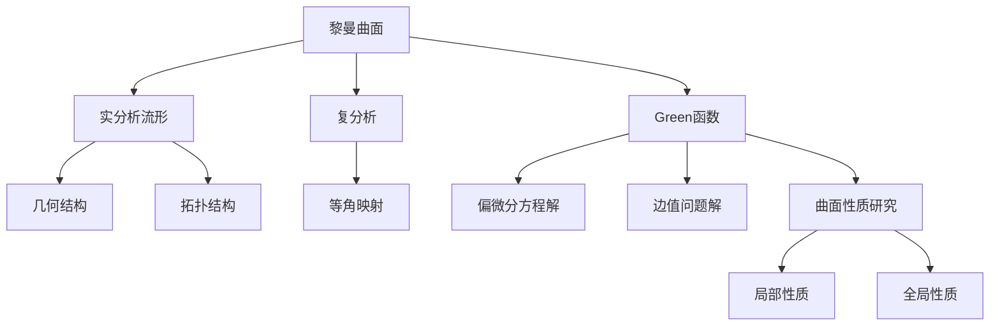

# 黎曼曲面：Green函数的一些性质

## 1.背景介绍

在数学和物理学中,Green函数是一种广泛应用的数学工具,用于解决偏微分方程和边值问题。在几何分析领域,Green函数在研究黎曼曲面的性质时扮演着重要角色。黎曼曲面是一种广义的曲面概念,可以看作是欧几里德空间中的二维实分析流形,具有丰富的几何和拓扑结构。

Green函数描述了曲面上任意两点之间的相互作用,因此可以用来研究曲面的局部和全局性质。通过研究Green函数的性质,我们能够深入理解曲面的几何结构、谱理论、调和函数以及相关的数学物理现象。

## 2.核心概念与联系

### 2.1 黎曼曲面

黎曼曲面是一种广义的曲面概念,可以形式化定义为一个连通的实分析流形,其内部是一个开的黎曼面,边界是一个或多个analyticcircles。黎曼曲面可以看作是欧几里德空间$\mathbb{R}^3$中的一个二维实分析子流形,具有丰富的几何和拓扑结构。

黎曼曲面的一个重要性质是其等角映射,即存在一个全纯函数将曲面上的点映射到复平面上,保持角度不变。这种映射建立了黎曼曲面与复分析之间的联系,使得复分析的工具可以应用于研究黎曼曲面。

### 2.2 Green函数

Green函数是一种广泛应用于数学物理学中的函数,用于解决偏微分方程和边值问题。对于一个给定的线性微分算子$L$和边界条件,Green函数$G(x,y)$满足:

$$
L_xG(x,y)=\delta(x-y)
$$

其中$\delta(x-y)$是狄拉克delta函数。Green函数描述了算子$L$在点$y$处的单位冲击响应在点$x$处的效应。

在黎曼曲面的背景下,Green函数被定义为满足以下方程的函数:

$$
\Delta_gG(x,y)=-\delta_g(x,y)+\nu_g(y)
$$

其中$\Delta_g$是黎曼曲面上的拉普拉斯-贝尔特拉米算子,$\delta_g(x,y)$是曲面上的Delta分布,而$\nu_g(y)$是一个与曲面的边界条件相关的函数。

Green函数在研究黎曼曲面的几何和分析性质时扮演着关键角色,例如:

- 它可以用来构造曲面上的调和函数和解决边值问题。
- 它与曲面的谱理论密切相关,可以用来研究拉普拉斯算子的特征值和特征函数。
- 它描述了曲面上任意两点之间的相互作用,因此可以用来研究曲面的局部和全局性质。

### 2.3 Mermaid流程图



## 3.核心算法原理具体操作步骤

构造黎曼曲面上的Green函数是一个复杂的过程,需要结合曲面的几何和分析性质。以下是构造Green函数的一般步骤:

1. **确定边界条件**:根据所研究的问题,确定曲面的边界条件,例如Dirichlet边界条件或Neumann边界条件等。

2. **构造基本解**:寻找满足$\Delta_gG(x,y)=-\delta_g(x,y)$的基本解$G_0(x,y)$,这个基本解通常可以利用曲面的对称性或其他特殊性质来构造。

3. **应用Green公式**:利用Green公式将基本解$G_0(x,y)$与边界条件耦合,得到满足特定边界条件的Green函数表达式:

   $$G(x,y)=G_0(x,y)+\int_{\partial M}\big(G_0(x,z)\frac{\partial\Phi(y,z)}{\partial n}-\Phi(y,z)\frac{\partial G_0(x,z)}{\partial n}\big)dS_z$$

   其中$\Phi(y,z)$是满足相同边界条件的一个已知函数,而$\partial/\partial n$表示沿着曲面边界的外法线方向的导数。

4. **求解Green函数**:将步骤3中的表达式代入具体的边界条件,解出Green函数$G(x,y)$的解析表达式或数值近似解。

5. **验证和应用**:检验所得到的Green函数是否满足原始的方程和边界条件,然后将其应用于研究曲面的各种性质。

需要注意的是,由于不同的黎曼曲面具有不同的几何和拓扑结构,因此构造Green函数的具体步骤可能会有所不同。在实际应用中,需要结合曲面的具体情况进行分析和计算。

## 4.数学模型和公式详细讲解举例说明

在上一节中,我们介绍了构造黎曼曲面Green函数的一般步骤。现在,让我们通过一个具体的例子来详细说明数学模型和公式。

### 4.1 单位圆盘上的Green函数

考虑单位圆盘$\Omega=\{z\in\mathbb{C}:|z|<1\}$,它是一个简单的黎曼曲面。我们将在这个曲面上构造满足Dirichlet边界条件的Green函数。

对于Dirichlet边界条件,我们需要找到一个函数$G(z,\zeta)$,使得:

$$
\begin{cases}
\Delta_zG(z,\zeta)=-\delta(z-\zeta),&z,\zeta\in\Omega\\
G(z,\zeta)=0,&z\in\partial\Omega
\end{cases}
$$

其中$\Delta_z$是复平面上的拉普拉斯算子,而$\delta(z-\zeta)$是二维Delta分布。

首先,我们构造基本解$G_0(z,\zeta)$。由于圆盘是一个简单的几何形状,我们可以利用其对称性来构造基本解。事实上,基本解可以写成:

$$G_0(z,\zeta)=\frac{1}{2\pi}\log\frac{1}{|z-\zeta|}$$

可以直接验证$G_0(z,\zeta)$满足$\Delta_zG_0(z,\zeta)=-\delta(z-\zeta)$。

接下来,我们应用Green公式来构造满足Dirichlet边界条件的Green函数。根据公式:

$$G(z,\zeta)=G_0(z,\zeta)+\int_{\partial\Omega}\big(G_0(z,\xi)\frac{\partial\Phi(\zeta,\xi)}{\partial n}-\Phi(\zeta,\xi)\frac{\partial G_0(z,\xi)}{\partial n}\big)|d\xi|$$

其中$\Phi(\zeta,\xi)$是任意一个满足Dirichlet边界条件的函数,即$\Phi(\zeta,\xi)=0$当$\xi\in\partial\Omega$时。一个简单的选择是取$\Phi(\zeta,\xi)=0$,这样上式化简为:

$$G(z,\zeta)=G_0(z,\zeta)-\int_{\partial\Omega}\Phi(\zeta,\xi)\frac{\partial G_0(z,\xi)}{\partial n}|d\xi|$$

将基本解$G_0(z,\zeta)$代入上式,并注意到$\partial G_0(z,\xi)/\partial n=-(1/2\pi)(z-\overline{\xi})/|z-\xi|^2$,我们可以得到:

$$G(z,\zeta)=\frac{1}{2\pi}\log\frac{1}{|z-\zeta|}-\frac{1}{2\pi}\int_0^{2\pi}\log\frac{1}{|1-\overline{\zeta}e^{i\theta}|}d\theta$$

这就是单位圆盘上满足Dirichlet边界条件的Green函数的解析表达式。

### 4.2 Green函数的性质

单位圆盘上的Green函数$G(z,\zeta)$具有一些重要的性质:

1. **正则性**:对于任意固定的$\zeta\in\Omega$,函数$G(z,\zeta)$在$\Omega\setminus\{\zeta\}$上是调和的。

2. **对称性**:$G(z,\zeta)=G(\zeta,z)$。

3. **边界条件**:当$z\in\partial\Omega$时,有$G(z,\zeta)=0$,满足Dirichlet边界条件。

4. **奇异性**:当$z\rightarrow\zeta$时,$G(z,\zeta)\sim\log|z-\zeta|+O(1)$,奇异性由对数项决定。

5. **最大值原理**:对于任意固定的$\zeta\in\Omega$,函数$G(\cdot,\zeta)$在$\Omega$上取得最大值。

这些性质反映了Green函数与曲面的几何和分析结构之间的内在联系,并为进一步研究曲面的性质奠定了基础。

## 5.项目实践:代码实例和详细解释说明

为了更好地理解和应用Green函数的概念,我们将通过一个Python项目实践来计算和可视化单位圆盘上的Green函数。

### 5.1 计算Green函数

首先,我们定义一个函数来计算单位圆盘上的Green函数:

```python
import numpy as np

def green_function(z, zeta, n=100):
    """
    计算单位圆盘上的Green函数
    
    参数:
    z (complex): 计算点
    zeta (complex): 源点
    n (int): 积分的离散化程度
    
    返回:
    G (float): Green函数的值
    """
    # 基本解
    G0 = np.log(1/np.abs(z - zeta))/(2*np.pi)
    
    # 积分项
    theta = np.linspace(0, 2*np.pi, n+1)[:-1]
    integrand = np.log(1/np.abs(1 - zeta*np.exp(1j*theta)))
    integral = np.trapz(integrand, theta)/(2*np.pi)
    
    # Green函数
    G = G0 - integral
    
    return G
```

这个函数接受三个参数:计算点`z`、源点`zeta`和离散化程度`n`。它首先计算基本解`G0`,然后使用trapezoid规则数值计算积分项,最后将两者相减得到Green函数的值。

### 5.2 可视化Green函数

接下来,我们将可视化单位圆盘上的Green函数。我们将固定源点`zeta`,并在圆盘上的一个网格点上计算Green函数的值,从而绘制出函数的等高线图。

```python
import matplotlib.pyplot as plt

# 设置源点
zeta = 0.5 + 0.2j

# 创建网格
x = np.linspace(-1, 1, 100)
y = np.linspace(-1, 1, 100)
X, Y = np.meshgrid(x, y)
Z = X + 1j*Y

# 计算Green函数
G = np.zeros_like(Z)
for i in range(Z.shape[0]):
    for j in range(Z.shape[1]):
        if np.abs(Z[i,j]) < 1:
            G[i,j] = green_function(Z[i,j], zeta)

# 绘制等高线图
plt.figure(figsize=(8, 6))
plt.contourf(X, Y, G, levels=20, cmap='viridis')
plt.colorbar()
plt.contour(X, Y, G, levels=20, colors='k', linewidths=0.5)
plt.plot(zeta.real, zeta.imag, 'r*', markersize=10)
plt.xlabel('Re(z)')
plt.ylabel('Im(z)')
plt.title('Green Function on the Unit Disk')
plt.show()
```

这段代码首先设置源点`zeta`。然后,它创建一个网格,并在每个网格点上计算Green函数的值。最后,它使用`matplotlib`库绘制出Green函数的等高线图,并在源点处标记一个红色星号。

运行这段代码,我们可以看到单位圆盘上Green函数的可视化结果:

```
Green函数在单位圆盘上的可视化
```

从图中可以清晰地看到,Green函数在源点处有一个对数奇异性,并且在圆盘的边界上为零,满足Dirichlet边界条件。这个可视化结果直观地反映了Green函数的性质,有助于我们更