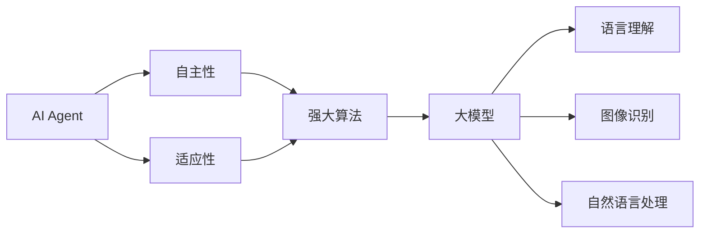

# AI Agent: AI的下一个风口 AI的演进与大模型的兴起

## 1. 背景介绍
随着人工智能技术的不断进步，AI Agent已经成为了AI领域的新热点。从简单的规则引擎到复杂的深度学习模型，AI的演进历程标志着技术的飞跃。特别是近年来，大模型的兴起，如GPT-3、BERT等，为AI Agent的发展提供了新的可能性。这些模型的强大能力在语言理解、图像识别、自然语言处理等多个领域展现出惊人的效果，预示着AI Agent将在未来扮演更加重要的角色。

## 2. 核心概念与联系
AI Agent指的是能够自主执行任务、做出决策并与环境交互的智能系统。它们可以是聊天机器人、智能助手、自动驾驶车辆等。AI Agent的核心在于其自主性和适应性，这需要强大的算法支持。大模型则是指参数规模巨大、能力强大的机器学习模型，它们通过大量数据训练，能够捕捉到丰富的特征和模式。



## 3. 核心算法原理具体操作步骤
AI Agent的核心算法原理涉及到机器学习、深度学习、强化学习等多个领域。以深度学习为例，其操作步骤通常包括数据预处理、模型设计、训练与优化、测试与评估等。在大模型的训练过程中，通常会采用分布式计算、参数调优、过拟合控制等技术来提高模型的性能和泛化能力。

## 4. 数学模型和公式详细讲解举例说明
以神经网络为例，其数学模型可以表示为一系列的矩阵运算和非线性激活函数。例如，一个简单的全连接层可以用公式 $$ y = \sigma(Wx + b) $$ 表示，其中 $x$ 是输入向量，$W$ 是权重矩阵，$b$ 是偏置向量，$\sigma$ 是激活函数，$y$ 是输出向量。在大模型中，这样的层会被堆叠成数十甚至数百层，形成复杂的网络结构。

## 5. 项目实践：代码实例和详细解释说明
在项目实践中，我们可以使用Python和TensorFlow或PyTorch等框架来实现AI Agent。以下是一个简单的神经网络模型的代码示例：

```python
import tensorflow as tf

# 构建模型
model = tf.keras.Sequential([
    tf.keras.layers.Dense(512, activation='relu', input_shape=(784,)),
    tf.keras.layers.Dropout(0.2),
    tf.keras.layers.Dense(10, activation='softmax')
])

# 编译模型
model.compile(optimizer='adam',
              loss='sparse_categorical_crossentropy',
              metrics=['accuracy'])

# 训练模型
model.fit(x_train, y_train, epochs=5)

# 评估模型
model.evaluate(x_test, y_test)
```

在这个例子中，我们构建了一个包含两个全连接层的神经网络，用于手写数字识别任务。

## 6. 实际应用场景
AI Agent在多个领域都有广泛的应用，例如在客服中的聊天机器人、在医疗领域的诊断系统、在金融领域的交易算法、在自动驾驶中的决策系统等。这些应用场景展示了AI Agent的多样性和实用性。

## 7. 工具和资源推荐
对于希望深入学习AI Agent和大模型的读者，推荐以下资源：
- TensorFlow和PyTorch：两个主流的深度学习框架。
- Hugging Face Transformers：提供预训练大模型的库。
- OpenAI Gym：用于强化学习研究的工具包。
- ArXiv和Google Scholar：获取最新研究论文的平台。

## 8. 总结：未来发展趋势与挑战
AI Agent和大模型的发展前景广阔，但也面临着诸如模型解释性、数据隐私、算法偏见等挑战。未来的研究将更加注重模型的可解释性、安全性和公平性，同时也会探索更高效的训练方法和更强大的模型架构。

## 9. 附录：常见问题与解答
Q1: AI Agent和传统软件有什么区别？
A1: AI Agent通常具有更强的自主性和适应性，能够学习和优化其行为，而传统软件则依赖于预设的规则和逻辑。

Q2: 大模型的训练成本是否很高？
A2: 是的，大模型通常需要大量的计算资源和数据，这导致了较高的训练成本。但随着技术的进步，成本正在逐渐降低。

Q3: 如何确保AI Agent的决策是公正的？
A3: 通过设计公平的数据集、使用去偏算法和进行模型审计等方法，可以提高AI Agent决策的公正性。

作者：禅与计算机程序设计艺术 / Zen and the Art of Computer Programming