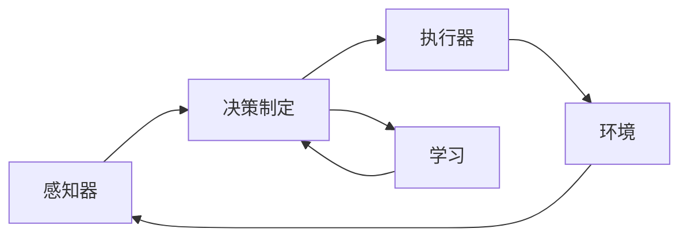

## 1.背景介绍

在人工智能领域，智能体或AI Agent已经成为了一个重要的研究方向。智能体是一个可以感知环境并根据其感知做出决策以达成其预定目标的实体。在这个定义中，智能体可以是一个人、一只机器人，甚至是一个软件程序。在本文中，我们将主要讨论软件智能体，即AI Agent。

## 2.核心概念与联系

AI Agent的设计与实现主要涉及到以下几个核心概念：

- **感知器（Perceptors）**：AI Agent通过感知器来获取环境信息。在软件智能体中，这可能是一个数据库查询、一个网络请求，或者是从硬件设备如摄像头或传感器上获取的输入。

- **执行器（Actuators）**：AI Agent通过执行器来影响环境。在软件智能体中，这可能是向数据库写入数据、向网络发送请求，或者是控制硬件设备如机器人的移动。

- **决策制定（Decision Making）**：AI Agent根据其感知的环境信息，通过某种决策制定机制，来决定其下一步的行动。

- **学习（Learning）**：AI Agent通过学习来改进其决策制定机制，以便更好地完成其预定目标。

这四个概念之间的关系可以用下面的Mermaid流程图来描述：

## 3.核心算法原理具体操作步骤

设计和实现一个AI Agent主要包括以下几个步骤：

1. **定义AI Agent的目标**：这是设计AI Agent的第一步，也是最重要的一步。AI Agent的所有行为都应该是为了达成这个目标。

2. **选择合适的感知器和执行器**：根据AI Agent需要操作的环境和目标，选择合适的感知器和执行器。

3. **设计决策制定机制**：这是AI Agent的核心部分，通常涉及到复杂的算法和数据结构。

4. **实现学习机制**：通过学习，AI Agent可以不断改进其决策制定机制，以更好地完成其目标。

## 4.数学模型和公式详细讲解举例说明

在AI Agent的设计中，决策制定机制通常可以用数学模型来描述。例如，我们可以使用马尔可夫决策过程（Markov Decision Process，MDP）来描述AI Agent的决策制定过程。

MDP是一个四元组$(S, A, P, R)$，其中：

- $S$是状态空间，包含了AI Agent可能遇到的所有状态。

- $A$是动作空间，包含了AI Agent可能采取的所有动作。

- $P$是状态转移概率，$P(s'|s, a)$表示AI Agent在状态$s$下采取动作$a$后，转移到状态$s'$的概率。

- $R$是奖励函数，$R(s, a, s')$表示AI Agent在状态$s$下采取动作$a$后，转移到状态$s'$所获得的奖励。

AI Agent的目标是找到一个策略$\pi$，使得从任何状态$s$开始，按照策略$\pi$行动所获得的累积奖励最大。这个问题可以通过强化学习算法如Q-learning或者Policy Gradient来解决。

## 5.项目实践：代码实例和详细解释说明

下面我们将通过一个简单的例子来展示如何实现一个AI Agent。我们的AI Agent的任务是在一个网格世界中找到宝藏。

首先，我们需要定义AI Agent的状态空间和动作空间。在这个例子中，状态空间是所有可能的格子位置，动作空间是上、下、左、右四个方向的移动。

然后，我们需要定义状态转移概率和奖励函数。在这个例子中，状态转移概率是确定的，即AI Agent采取一个动作后，一定会移动到相应的格子。奖励函数是在找到宝藏时获得正奖励，在撞到墙壁时获得负奖励，其他情况下没有奖励。

最后，我们可以使用Q-learning算法来训练AI Agent。Q-learning算法的核心是一个Q函数，表示在状态$s$下采取动作$a$所能获得的预期累积奖励。通过不断地试验和学习，AI Agent可以逐渐改进其Q函数，从而找到最优的策略。

## 6.实际应用场景

AI Agent可以应用在很多领域，包括但不限于以下几个：

- **游戏AI**：AI Agent可以用来实现电脑对手，如国际象棋、围棋等游戏的AI。

- **自动驾驶**：AI Agent可以用来控制汽车的驾驶，包括路径规划、避障等任务。

- **智能家居**：AI Agent可以用来控制家庭设备，如智能灯泡、智能空调等。

- **金融投资**：AI Agent可以用来做股票、期货等金融产品的自动交易。

## 7.工具和资源推荐

以下是一些有用的工具和资源，可以帮助你更好地理解和实现AI Agent：

- **OpenAI Gym**：这是一个提供了很多预定义环境的强化学习框架，可以用来训练AI Agent。

- **TensorFlow**：这是一个强大的深度学习框架，可以用来实现复杂的决策制定机制。

- **Python**：这是一种广泛用于AI和机器学习的编程语言，有很多相关的库和框架。

## 8.总结：未来发展趋势与挑战

AI Agent是人工智能的一个重要研究方向，也是AI的下一个风口。然而，AI Agent面临着很多挑战，如如何设计更好的决策制定机制，如何处理复杂和不确定的环境等。但是，随着技术的不断进步，我们有理由相信，AI Agent将在未来发挥越来越重要的作用。

## 9.附录：常见问题与解答

1. **Q：AI Agent和传统的程序有什么区别？**

   A：AI Agent和传统的程序最大的区别在于，AI Agent能够学习和改进。传统的程序一旦写好，其行为就是固定的。而AI Agent则可以通过学习，不断改进其决策制定机制，以更好地完成其目标。

2. **Q：AI Agent如何学习？**

   A：AI Agent通常通过强化学习来学习。强化学习是一种机器学习方法，通过试验和错误，AI Agent可以找到最优的策略。

3. **Q：AI Agent能做什么？**

   A：AI Agent可以做很多事情，包括玩游戏、驾驶汽车、控制家庭设备，甚至做金融投资。只要有明确的目标，AI Agent就可以通过学习来达成这个目标。

4. **Q：AI Agent需要什么样的环境？**

   A：AI Agent需要能够感知和影响的环境。这个环境可以是真实的物理环境，如驾驶汽车；也可以是虚拟的环境，如玩游戏；还可以是信息的环境，如做金融投资。

作者：禅与计算机程序设计艺术 / Zen and the Art of Computer Programming