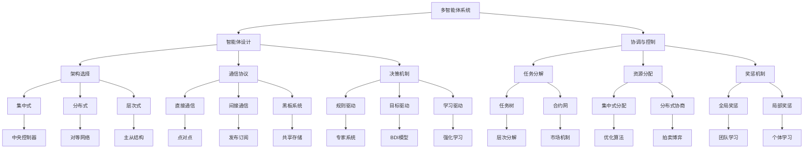

# AI Agent: AI的下一个风口 模拟真实世界的组织结构与工作流程

## 1. 背景介绍
### 1.1 人工智能的发展历程
#### 1.1.1 人工智能的起源与早期发展
#### 1.1.2 人工智能的兴衰与复兴
#### 1.1.3 人工智能的现状与挑战

### 1.2 AI Agent的概念与意义
#### 1.2.1 AI Agent的定义
#### 1.2.2 AI Agent的特点与优势
#### 1.2.3 AI Agent在现实世界中的应用前景

### 1.3 组织结构与工作流程的重要性
#### 1.3.1 组织结构的概念与类型
#### 1.3.2 工作流程的定义与特点
#### 1.3.3 组织结构与工作流程的关系与影响

## 2. 核心概念与联系
### 2.1 AI Agent的核心概念
#### 2.1.1 自主性
#### 2.1.2 交互性
#### 2.1.3 适应性
#### 2.1.4 目标导向

### 2.2 组织结构的核心概念
#### 2.2.1 分工与协作
#### 2.2.2 层级与权责
#### 2.2.3 沟通与反馈

### 2.3 工作流程的核心概念
#### 2.3.1 任务分解
#### 2.3.2 资源分配
#### 2.3.3 进度监控
#### 2.3.4 质量控制

### 2.4 AI Agent、组织结构与工作流程的关系
#### 2.4.1 AI Agent在组织结构中的角色定位
#### 2.4.2 AI Agent对工作流程的优化与重塑
#### 2.4.3 AI Agent、组织结构与工作流程的协同发展

## 3. 核心算法原理具体操作步骤
### 3.1 多智能体系统
#### 3.1.1 多智能体系统的定义与特点
#### 3.1.2 多智能体系统的架构与组成
#### 3.1.3 多智能体系统的协调与控制

### 3.2 强化学习
#### 3.2.1 强化学习的基本概念
#### 3.2.2 Q-learning算法
#### 3.2.3 深度强化学习

### 3.3 图神经网络
#### 3.3.1 图神经网络的基本概念
#### 3.3.2 图卷积网络
#### 3.3.3 图注意力网络

### 3.4 工作流建模与优化
#### 3.4.1 工作流建模的基本方法
#### 3.4.2 基于AI的工作流优化
#### 3.4.3 工作流执行与监控

## 4. 数学模型和公式详细讲解举例说明
### 4.1 马尔可夫决策过程
#### 4.1.1 马尔可夫决策过程的定义与组成
#### 4.1.2 状态转移概率与奖励函数
#### 4.1.3 最优策略与值函数

### 4.2 博弈论
#### 4.2.1 博弈论的基本概念
#### 4.2.2 纳什均衡
#### 4.2.3 多智能体博弈

### 4.3 图论
#### 4.3.1 图的基本概念与表示
#### 4.3.2 图的连通性与最短路径
#### 4.3.3 图的聚类与社区发现

### 4.4 优化理论
#### 4.4.1 优化问题的基本概念
#### 4.4.2 线性规划与整数规划
#### 4.4.3 启发式优化算法

## 5. 项目实践：代码实例和详细解释说明
### 5.1 多智能体协作的仿真环境构建
#### 5.1.1 基于OpenAI Gym的环境设计
#### 5.1.2 智能体的定义与实现
#### 5.1.3 多智能体协作任务的设置

### 5.2 基于强化学习的智能体决策
#### 5.2.1 Q-learning算法的实现
#### 5.2.2 深度Q网络的构建
#### 5.2.3 智能体训练与测试

### 5.3 工作流建模与执行
#### 5.3.1 基于BPMN的工作流建模
#### 5.3.2 工作流引擎的选择与配置
#### 5.3.3 工作流的部署与执行

### 5.4 组织结构的可视化与分析
#### 5.4.1 组织结构数据的获取与处理
#### 5.4.2 基于图数据库的组织结构存储
#### 5.4.3 组织结构的可视化与分析工具

## 6. 实际应用场景
### 6.1 智能制造
#### 6.1.1 生产线的智能调度与优化
#### 6.1.2 设备的预测性维护
#### 6.1.3 质量管理与异常检测

### 6.2 金融服务
#### 6.2.1 智能投资决策
#### 6.2.2 风险管理与欺诈检测
#### 6.2.3 客户服务与营销

### 6.3 智慧城市
#### 6.3.1 交通流量预测与调度
#### 6.3.2 能源管理与优化
#### 6.3.3 公共安全与应急响应

### 6.4 医疗健康
#### 6.4.1 智能诊断与治疗方案推荐
#### 6.4.2 药物研发与临床试验
#### 6.4.3 远程医疗与健康管理

## 7. 工具和资源推荐
### 7.1 开发工具
#### 7.1.1 编程语言：Python, Java, C++
#### 7.1.2 深度学习框架：TensorFlow, PyTorch, Keras
#### 7.1.3 强化学习库：OpenAI Gym, Stable Baselines

### 7.2 数据集与模型
#### 7.2.1 图数据集：Cora, Citeseer, PubMed
#### 7.2.2 工作流数据集：BPIC, WFMS
#### 7.2.3 预训练模型：BERT, GPT, RoBERTa

### 7.3 学习资源
#### 7.3.1 在线课程：Coursera, edX, Udacity
#### 7.3.2 书籍推荐：《多智能体系统》,《强化学习导论》,《图神经网络》
#### 7.3.3 研究论文：AAAI, IJCAI, NeurIPS

## 8. 总结：未来发展趋势与挑战
### 8.1 AI Agent的发展趋势
#### 8.1.1 多模态智能体
#### 8.1.2 跨域适应与迁移学习
#### 8.1.3 人机协作与共生

### 8.2 组织结构与工作流程的变革
#### 8.2.1 扁平化与去中心化
#### 8.2.2 敏捷化与柔性化
#### 8.2.3 数字化与智能化

### 8.3 面临的挑战与对策
#### 8.3.1 技术挑战：可解释性,鲁棒性,安全性
#### 8.3.2 伦理挑战：隐私保护,公平性,责任划分
#### 8.3.3 管理挑战：组织变革,人才培养,文化融合

## 9. 附录：常见问题与解答
### 9.1 如何选择适合的AI Agent架构？
### 9.2 多智能体协作中如何处理通信与同步问题？
### 9.3 如何平衡AI Agent的自主性与可控性？
### 9.4 组织结构调整中如何管理变革阻力？
### 9.5 工作流程优化中如何权衡效率与灵活性？

以上是一个关于如何利用AI Agent模拟真实世界组织结构与工作流程的技术博客文章的初步框架。在正文部分，我们首先介绍了人工智能的发展历程以及AI Agent的概念与意义，阐述了组织结构与工作流程的重要性。然后，我们深入探讨了AI Agent、组织结构与工作流程的核心概念以及它们之间的关系。

在技术原理部分，我们重点介绍了多智能体系统、强化学习、图神经网络以及工作流建模与优化等关键技术，并给出了相应的数学模型与公式推导。同时，我们还提供了一些代码实例来说明如何将这些技术应用到实际项目中。

接下来，我们讨论了AI Agent在智能制造、金融服务、智慧城市、医疗健康等领域的实际应用场景，展示了其广阔的应用前景。我们还推荐了一些常用的开发工具、数据集、预训练模型以及学习资源，方便读者进一步学习与实践。

最后，我们总结了AI Agent以及组织结构与工作流程的未来发展趋势，分析了可能面临的技术、伦理、管理等方面的挑战，并给出了一些应对建议。在附录部分，我们列出了一些常见问题，并给出了简要的解答。

总的来说，AI Agent 作为人工智能的一个新兴分支，通过模拟真实世界的组织结构与工作流程，可以极大地提升业务效率，优化资源配置，支持智能决策。随着技术的不断进步以及应用场景的日益丰富，AI Agent 有望成为未来人工智能的一个重要发展方向。我们相信，通过学术界与产业界的共同努力，AI Agent 必将在智能化时代扮演越来越重要的角色，为人类社会的发展贡献更大的力量。

作者：禅与计算机程序设计艺术 / Zen and the Art of Computer Programming