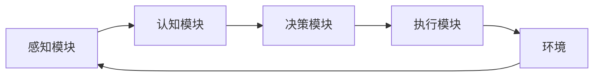
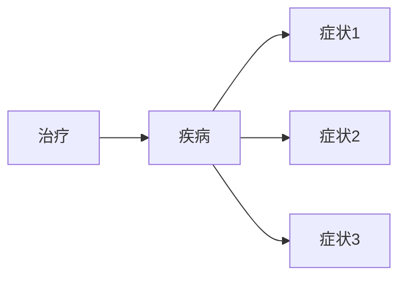

# AI Agent: AI的下一个风口 生成式智能体架构设计

## 1. 背景介绍

### 1.1 人工智能的发展历程

人工智能(Artificial Intelligence, AI)自1956年达特茅斯会议正式提出以来，经历了从早期的符号主义、专家系统，到近年来的机器学习、深度学习等多个发展阶段。随着算力的提升、大数据的积累以及算法的突破，AI正在加速渗透到各行各业，推动数字化转型。

### 1.2 当前AI面临的挑战

尽管AI取得了长足的进步，但在实际应用中仍然存在一些局限性和挑战：

- 数据孤岛：不同领域、部门间的数据割裂，缺乏统一的数据标准和交换机制，导致AI系统难以实现全局优化。
- 知识壁垒：AI系统缺乏通用的知识表示和推理能力，难以利用跨领域的知识来提升性能。
- 可解释性差：AI模型的决策过程不透明，缺乏可解释性，难以获得用户信任。
- 安全隐患：AI系统容易受到对抗性攻击，存在隐私泄露等安全风险。

### 1.3 生成式AI Agent的提出

为了应对上述挑战，业界和学界开始探索新一代AI架构——生成式AI Agent。它借鉴了认知科学、多智能体系统、因果推理等理论，旨在构建更加智能、安全、可解释的AI系统，推动AI从"感知智能"走向"认知智能"。本文将重点介绍生成式AI Agent的核心理念、关键技术以及应用前景。

## 2. 核心概念与联系

### 2.1 Agent的定义与特征

Agent是一个可以感知环境并采取行动的自主实体。它具有以下特征：

- 自主性：根据自身的感知和知识，独立地做出决策和行动。
- 社会性：与环境中的其他Agent进行交互，协作或竞争。  
- 反应性：对环境的变化做出及时响应。
- 主动性：主动地执行任务，追求自身目标。
- 连续性：持续运行，不断与环境交互。

### 2.2 生成式模型

生成式模型是一类学习数据分布，并能够生成与训练数据相似样本的机器学习模型。常见的生成式模型包括VAE、GAN、Flow模型等。与判别式模型相比，生成式模型具有以下优势：

- 可以生成新样本，扩充数据集。
- 能够刻画数据的内在结构和规律。
- 支持半监督学习、无监督学习等学习范式。
- 可解释性更强，更符合人类认知。

### 2.3 因果推理

因果推理是一种基于因果关系的推理方式，旨在揭示事物之间的因果依赖，回答"为什么"的问题。与传统的相关性分析不同，因果推理强调因果机制，能够应对数据分布变化，具有更强的泛化能力。在AI系统中引入因果推理，有助于增强模型的可解释性和鲁棒性。

### 2.4 多智能体系统

多智能体系统(Multi-Agent System, MAS)由多个交互的智能Agent组成，通过Agent间的协作与竞争，实现整体的智能涌现。MAS的优势在于：

- 分布式计算：将复杂任务分解为多个子任务，由不同的Agent并行处理，提高计算效率。
- 容错性：单个Agent的失效不会导致整个系统瘫痪。
- 灵活性：可以动态地加入或移除Agent，适应环境变化。
- 可扩展性：可以方便地扩展新的Agent和功能。

生成式AI Agent正是借鉴了MAS的思想，通过多个专门的Agent的协同，实现更加强大的智能。

## 3. 核心架构与算法

### 3.1 总体架构

生成式AI Agent的总体架构如下图所示：



- 感知模块：负责接收来自环境的信息，包括文本、图像、语音等多模态数据。
- 认知模块：对感知数据进行理解、推理，构建世界模型。该模块是生成式AI Agent的核心，采用了因果推理、知识图谱等技术。
- 决策模块：根据认知模块输出的结果，结合当前的目标和约束，生成行动策略。常用的决策算法包括强化学习、进化算法等。
- 执行模块：根据决策模块生成的策略，控制Agent在环境中的行为。
- 环境：Agent所处的外部环境，提供观测信息，接收Agent的行为。

### 3.2 因果世界模型

生成式AI Agent的核心是因果世界模型(Causal World Model, CWM)。CWM以因果图为基础，刻画了Agent感兴趣的领域知识，包括：

- 因果结构：描述了不同事物、概念之间的因果依赖关系。
- 因果机制：对应每一条因果边，定义了因变量如何依赖于自变量。
- 语义映射：将感知数据映射到因果图上的节点。

CWM的构建流程如下：

1. 领域知识获取：从结构化、非结构化数据中抽取领域概念及其关系。
2. 因果结构学习：利用因果发现算法，如PC算法、GES算法等，从数据中学习因果图。
3. 因果机制学习：对每条因果边，拟合一个生成式模型，学习条件分布。
4. 语义映射构建：学习感知数据到因果图节点的映射函数。

基于CWM，Agent可以实现因果推理、反事实推理等高级推理功能，增强了可解释性和泛化能力。

### 3.3 多Agent协同

在生成式AI Agent中，往往包含多个不同功能的Agent，它们分工协作，共同完成任务。常见的Agent类型有：

- 感知Agent：负责不同模态的感知任务，如视觉、语音、文本等。
- 认知Agent：负责高层语义理解、知识推理等认知任务。
- 任务Agent：负责子任务的规划与执行。
- 协调Agent：负责调度其他Agent，协调它们的工作。

不同类型的Agent通过消息传递、共享内存等方式进行通信，协同完成任务。多Agent协同的优势在于：

- 降低单个Agent的复杂度，每个Agent只需专注于自己的子任务。
- 增强系统的鲁棒性，单个Agent的失效不会影响整体任务的完成。
- 提高计算效率，多个Agent可以并行工作。

## 4. 数学建模与公式推导

### 4.1 因果图模型

因果图用一个有向无环图(Directed Acyclic Graph, DAG)来表示变量之间的因果关系。形式化地，一个因果图可以表示为$G=(V,E)$，其中$V$为节点集合，表示变量；$E$为有向边集合，表示因果关系。如果有向边$X\rightarrow Y\in E$，则称$X$是$Y$的直接原因，$Y$是$X$的直接结果。

因果图上的联合分布可以递归分解为：

$$
P(V)=\prod_{X\in V}P(X|Pa(X))
$$

其中$Pa(X)$表示$X$的所有父节点。这个分解式体现了因果图的局部马尔可夫性。

### 4.2 do算子与因果效应

在因果推理中，我们常常关心干预(intervention)的效果，即如果我们强行改变某个变量的取值，会对其他变量产生什么影响。Pearl引入了do算子来表示干预。$do(X=x)$表示将变量$X$固定为$x$，切断$X$的所有入边。干预后的联合分布为：

$$
P(V|do(X=x))=\left\{
\begin{aligned}
&\prod_{Y\in V\setminus\{X\}}P(Y|Pa(Y)) &, X=x \\
&0 &, otherwise
\end{aligned}
\right.
$$

因果效应(Causal Effect)指$X$对$Y$的平均因果效应(Average Causal Effect, ACE)，定义为：

$$
ACE(X\rightarrow Y)=E[Y|do(X=1)]-E[Y|do(X=0)]
$$

它度量了$X$从0变为1时，$Y$的期望变化量。

### 4.3 反事实推理

反事实(Counterfactual)描述了与事实相反的情形，回答"如果当时做了不同的选择，会发生什么"这类问题。反事实推理在因果推断中有重要应用。

令$Y_{X=x}(u)$表示在$do(X=x)$干预下，个体$u$的$Y$取值。反事实条件概率$P(Y_{X=x}=y|X=x',Y=y')$表示：对于实际上$X=x',Y=y'$的个体，如果$X$被设为$x$，$Y$为$y$的概率。它可以用以下公式计算：

$$
P(Y_{X=x}=y|X=x',Y=y')=\sum_{u}P(Y_{X=x}(u)=y|X(u)=x',Y(u)=y')P(u|X=x',Y=y')
$$

其中$u$为未观测的背景变量。

## 5. 项目实践

下面我们通过一个简单的案例，演示如何使用生成式AI Agent进行因果推理。

### 5.1 案例描述

考虑一个医疗诊断的场景。我们的目标是根据病人的症状，判断是否患有某种疾病，并给出治疗建议。

### 5.2 因果图构建

首先，我们根据医学知识，构建一个简单的因果图：



### 5.3 生成式模型训练

对于每个节点，我们训练一个条件生成式模型。以疾病节点为例，我们训练一个条件GAN：

```python
class CGAN(nn.Module):
    def __init__(self):
        super(CGAN, self).__init__()
        # 定义生成器和判别器网络结构
        self.generator = nn.Sequential(...)
        self.discriminator = nn.Sequential(...)
        
    def forward(self, z, y):
        # 生成器根据噪声z和条件y生成样本
        x_fake = self.generator(z, y)
        # 判别器判断样本是否真实
        prob_fake = self.discriminator(x_fake, y)
        prob_real = self.discriminator(x_real, y)
        
        return prob_fake, prob_real
        
# 训练CGAN
cgan = CGAN()
optimizer = optim.Adam(cgan.parameters(), lr=1e-4)
for epoch in range(num_epochs):
    for x_real, y in dataloader:
        z = sample_noise(batch_size, z_dim) # 采样随机噪声
        prob_fake, prob_real = cgan(z, y)
        loss_d = -torch.mean(log(prob_real) + log(1-prob_fake)) # 判别器损失
        loss_g = -torch.mean(log(prob_fake)) # 生成器损失
        
        # 更新判别器
        optimizer.zero_grad()
        loss_d.backward()
        optimizer.step()
        
        # 更新生成器
        optimizer.zero_grad() 
        loss_g.backward()
        optimizer.step()
```

### 5.4 因果推理

假设我们得到一个新的病人，观测到他有症状1和症状2。我们可以进行以下推理：

1. 利用症状节点的生成式模型，计算 $P(疾病|症状1,症状2)$，判断患病概率。
2. 利用do算子，计算 $P(症状3|do(疾病=1),症状1,症状2)$，预测其他可能出现的症状。
3. 利用反事实推理，计算 $P(疾病_{治疗=1}|疾病_{治疗=0}=1,症状1,症状2)$，评估治疗效果。

### 5.5 因果效应评估

我们可以进一步分析不同因素对疾病的影响。例如，计算治疗对疾病的平均因果效应：

$$
ACE(治疗\rightarrow 疾病)=E[疾病|do(治疗=1)]-E[疾病|do(治疗=0)]
$$

通过比较治疗前后的患病率，评估治疗效果。

## 6. 应用场景

生成式AI Agent可以应用于多个领域，包括：

- 智能医疗：辅助医生