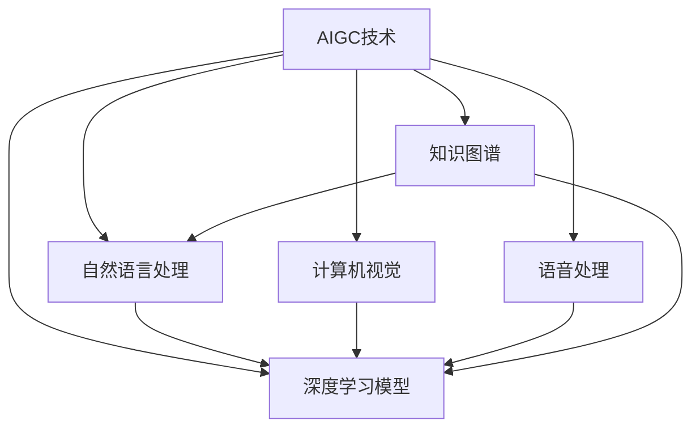
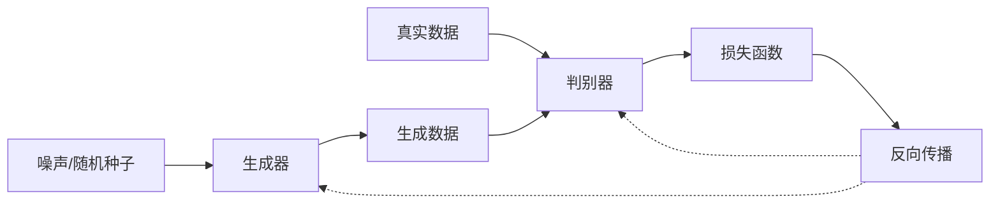
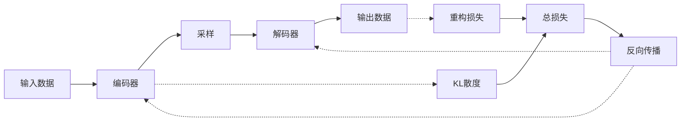

# AIGC从入门到实战：AIGC 带来职场新范式，让 AI 帮你干活，你可以做更多有价值的事

## 1.背景介绍

### 1.1 什么是AIGC?

AIGC(Artificial Intelligence Generation Content)，即人工智能生成内容，是指利用人工智能技术自动生成文本、图像、音频、视频等数字内容的过程。随着深度学习、自然语言处理等人工智能技术的不断发展和突破，AIGC已经逐渐从概念走向现实应用,在内容生产、营销、客户服务等多个领域发挥着越来越重要的作用。

### 1.2 AIGC的发展历程

AIGC的发展可以追溯到20世纪60年代,当时的智能系统主要依赖于规则和逻辑推理。21世纪初,机器学习和深度学习技术的兴起,使得AIGC进入了一个新的发展阶段。近年来,大型语言模型(如GPT-3)、生成对抗网络(GAN)等新型人工智能模型的出现,极大地推动了AIGC技术的发展,使得AIGC能够生成更加自然、多样和高质量的内容。

### 1.3 AIGC的重要意义

AIGC技术的兴起正在重塑内容生产和消费的方式,对于企业和个人来说,都带来了全新的机遇和挑战:

- 降低内容生产成本,提高效率
- 个性化定制内容,提升用户体验
- 突破人力瓶颈,实现内容的大规模生产
- 开辟新的商业模式和就业机会
- 促进人机协作,释放人类创造力

## 2.核心概念与联系

### 2.1 AIGC的核心技术

AIGC技术主要包括以下几个核心部分:

1. **自然语言处理(NLP)**: 用于理解和生成自然语言文本。
2. **计算机视觉(CV)**: 用于理解和生成图像、视频等视觉内容。
3. **语音处理**: 用于理解和生成语音内容。
4. **深度学习模型**: 如Transformer、GAN等,是AIGC的核心驱动力。
5. **知识图谱**: 为AIGC系统提供必要的知识支持。

这些技术相互关联、相互促进,共同推动了AIGC技术的发展。

### 2.2 AIGC的应用场景

AIGC技术可以广泛应用于以下几个主要场景:

1. **内容创作**: 如新闻报道、文案写作、小说创作等。
2. **营销广告**: 个性化广告创意和文案生成。
3. **客户服务**: 智能客服、对话系统等。
4. **教育培训**: 教育资源生成、在线教育等。
5. **娱乐媒体**: 影视剧本创作、游戏内容生成等。
6. **设计创作**: 平面设计、产品设计等。

## 3.核心算法原理具体操作步骤  

### 3.1 Transformer模型

Transformer是AIGC中常用的序列到序列(Seq2Seq)模型,可以用于文本生成、机器翻译等任务。它的核心思想是使用自注意力(Self-Attention)机制,捕捉输入序列中任意两个位置之间的依赖关系。

Transformer模型的工作流程如下:

1. **输入embedding**: 将输入序列(如文本)转换为embedding向量表示。
2. **位置编码**: 为每个位置添加位置信息,使模型能够捕捉序列的顺序。
3. **多头自注意力**: 并行计算多个注意力头,捕捉不同的依赖关系。
4. **前馈神经网络**: 对注意力输出进行非线性变换,提取更高层次的特征。
5. **规范化和残差连接**: 加速训练收敛,提高模型性能。
6. **输出层**: 根据任务类型(如文本生成),输出相应的结果。

### 3.2 生成对抗网络(GAN)

GAN是一种用于生成式建模的深度学习架构,常用于图像、视频等视觉内容的生成。它包含两个对抗训练的神经网络:生成器(Generator)和判别器(Discriminator)。

GAN的工作原理如下:

1. **生成器**: 从噪声或随机种子开始,生成假样本(如图像)。
2. **判别器**: 接收真实样本和生成器生成的假样本,并对它们进行二分类。
3. **对抗训练**: 生成器试图欺骗判别器,生成更逼真的假样本;判别器则努力区分真假样本。
4. **反向传播**: 根据判别器的输出,对生成器和判别器的参数进行反向传播更新。

通过这种对抗训练,生成器和判别器相互促进,最终生成器能够生成逼真的样本。

### 3.3 变分自编码器(VAE)

VAE是一种用于生成式建模和表示学习的深度学习架构,常用于生成文本、图像等数据。它结合了自编码器(AE)和变分推断(VI)的思想。

VAE的工作原理如下:

1. **编码器(Encoder)**: 将输入数据(如文本或图像)编码为潜在变量的概率分布。
2. **采样(Sampling)**: 从编码器输出的概率分布中采样,获得潜在变量的实例。
3. **解码器(Decoder)**: 将采样得到的潜在变量解码为输出数据(如生成文本或图像)。
4. **重构损失(Reconstruction Loss)**: 衡量输出数据与原始输入数据之间的差异。
5. **KL散度(KL Divergence)**: 衡量编码器输出的概率分布与标准正态分布之间的差异。
6. **反向传播**: 根据重构损失和KL散度,对编码器和解码器的参数进行反向传播更新。

通过最小化重构损失和KL散度,VAE可以学习数据的潜在表示,并生成新的样本。

## 4.数学模型和公式详细讲解举例说明

### 4.1 Transformer中的自注意力机制

自注意力机制是Transformer模型的核心,它允许模型捕捉输入序列中任意两个位置之间的依赖关系。给定一个查询向量(Query)、键向量(Key)和值向量(Value),自注意力的计算过程如下:

$$
\begin{aligned}
\text{Attention}(Q, K, V) &= \text{softmax}\left(\frac{QK^T}{\sqrt{d_k}}\right)V \\
\text{head}_i &= \text{Attention}\left(QW_i^Q, KW_i^K, VW_i^V\right) \\
\text{MultiHead}(Q, K, V) &= \text{Concat}(\text{head}_1, \ldots, \text{head}_h)W^O
\end{aligned}
$$

其中:

- $Q$、$K$、$V$分别表示查询、键和值矩阵。
- $d_k$是缩放因子,用于防止点积过大导致的梯度饱和。
- $W_i^Q$、$W_i^K$、$W_i^V$和$W^O$是可训练的权重矩阵。
- $\text{head}_i$表示第$i$个注意力头的输出。
- $\text{MultiHead}$通过拼接多个注意力头的输出,捕捉不同的依赖关系。

例如,在机器翻译任务中,自注意力机制可以捕捉源语言句子中不同单词之间的依赖关系,从而更好地生成目标语言的翻译结果。

### 4.2 GAN中的最小最大博弈

GAN中的生成器和判别器进行一个最小最大博弈,目标是找到一个Nash均衡点,使得生成器生成的数据分布与真实数据分布尽可能接近。具体来说,生成器$G$试图最小化判别器$D$对生成数据的判别能力,而判别器$D$则试图最大化对真实数据和生成数据的判别能力。这可以用以下公式表示:

$$
\begin{aligned}
\min_G \max_D V(D, G) &= \mathbb{E}_{x \sim p_\text{data}(x)}[\log D(x)] + \mathbb{E}_{z \sim p_z(z)}[\log(1 - D(G(z)))] \\
&= \mathbb{E}_{x \sim p_\text{data}(x)}[\log D(x)] + \mathbb{E}_{x \sim p_g(x)}[\log(1 - D(x))]
\end{aligned}
$$

其中:

- $p_\text{data}(x)$是真实数据的分布。
- $p_z(z)$是生成器$G$的输入噪声分布。
- $p_g(x)$是生成器$G$生成的数据分布。

通过交替优化生成器$G$和判别器$D$,最终可以达到Nash均衡,使得$p_g(x) \approx p_\text{data}(x)$,即生成器生成的数据分布与真实数据分布非常接近。

例如,在生成人脸图像的任务中,生成器试图生成逼真的人脸图像来欺骗判别器,而判别器则努力区分真实人脸图像和生成的人脸图像。通过这种对抗训练,生成器最终能够生成高质量的人脸图像。

### 4.3 VAE中的变分推断

VAE中使用变分推断(Variational Inference)来近似后验分布$p(z|x)$,其中$z$是潜在变量,$x$是观测数据。由于$p(z|x)$通常难以直接计算,VAE引入一个近似分布$q(z|x)$,并试图使$q(z|x)$尽可能接近$p(z|x)$。这可以通过最小化KL散度来实现:

$$
\begin{aligned}
\mathcal{L}(\theta, \phi; x) &= -\mathbb{E}_{q_\phi(z|x)}[\log p_\theta(x|z)] + \text{KL}(q_\phi(z|x) \| p(z)) \\
&= -\mathbb{E}_{q_\phi(z|x)}[\log p_\theta(x|z)] + \mathbb{E}_{q_\phi(z|x)}[\log \frac{q_\phi(z|x)}{p(z)}]
\end{aligned}
$$

其中:

- $\theta$和$\phi$分别是解码器$p_\theta(x|z)$和编码器$q_\phi(z|x)$的参数。
- $p(z)$是潜在变量$z$的先验分布,通常设置为标准正态分布。
- $\text{KL}(q_\phi(z|x) \| p(z))$是$q_\phi(z|x)$与$p(z)$之间的KL散度。

通过最小化上述损失函数,VAE可以同时学习数据的潜在表示$z$和生成模型$p_\theta(x|z)$。在生成新数据时,只需从先验分布$p(z)$中采样潜在变量$z$,然后通过解码器$p_\theta(x|z)$生成相应的输出数据$x$。

例如,在生成手写数字图像的任务中,VAE可以学习到手写数字