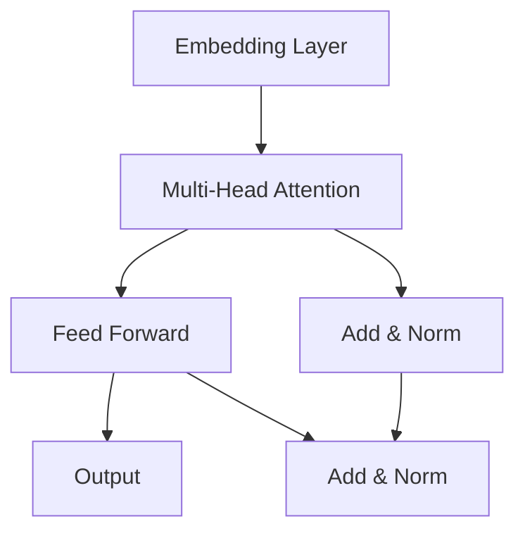

# AIGC从入门到实战：利用 ChatGPT 来生成前后端代码

## 1.背景介绍

### 1.1 人工智能时代的到来

人工智能(AI)技术在过去几年里取得了长足的进步,尤其是在自然语言处理(NLP)和生成式人工智能(Generative AI)领域。大型语言模型(LLM)的出现,使得人工智能系统能够理解和生成看似人类编写的自然语言文本,这为人工智能在各个领域的应用带来了无限可能。

### 1.2 AIGC(AI Generated Content)的兴起 

AIGC(AI Generated Content),即人工智能生成内容,是指利用人工智能技术自动生成文本、图像、音频、视频等内容。随着人工智能技术的不断发展,AIGC在内容创作、营销、客户服务等领域发挥着越来越重要的作用。其中,以 ChatGPT 为代表的大型语言模型在代码生成领域展现出了巨大的潜力。

### 1.3 ChatGPT: 革命性的人工智能助手

ChatGPT 是一个基于 GPT(Generative Pre-trained Transformer)语言模型训练的对话式人工智能助手,由 OpenAI 公司开发。它能够理解和生成人类语言,并在各种任务上表现出惊人的能力,如问答、文本生成、代码生成等。ChatGPT 的出现为软件开发带来了全新的机遇和挑战。

## 2.核心概念与联系

### 2.1 人工智能与软件开发

人工智能技术在软件开发领域的应用主要体现在以下几个方面:

1. **代码生成**: 利用人工智能模型自动生成代码,提高开发效率。
2. **代码理解和优化**: 人工智能可以分析和理解现有代码,从而优化代码质量和性能。
3. **测试和调试**: 人工智能可以自动化测试过程,加快发现和修复 bug 的速度。
4. **需求分析和设计**: 人工智能可以帮助分析需求,生成设计文档和原型。

### 2.2 AIGC 在软件开发中的作用

AIGC 技术在软件开发中的作用主要体现在以下几个方面:

1. **提高开发效率**: 通过自动生成代码,减少手工编码的工作量。
2. **降低门槛**: 降低编程的门槛,使非专业人员也能参与软件开发。
3. **加快迭代**: 利用 AIGC 快速生成原型和初始版本,加快软件迭代周期。
4. **提高质量**: AIGC 可以生成更加规范、可维护的代码,提高代码质量。

### 2.3 ChatGPT 在代码生成中的优势

作为一种新兴的 AIGC 技术,ChatGPT 在代码生成方面具有以下优势:

1. **多语言支持**: ChatGPT 可以生成多种编程语言的代码,如 Python、Java、JavaScript 等。
2. **上下文理解**: 通过对话式交互,ChatGPT 能够更好地理解代码需求和上下文。
3. **持续学习**: ChatGPT 可以不断学习新的知识,其代码生成能力也在不断提高。
4. **开放性**: 作为开源模型,ChatGPT 可以被广泛应用于各种场景。

## 3.核心算法原理具体操作步骤

### 3.1 ChatGPT 的工作原理

ChatGPT 是一种基于 Transformer 架构的大型语言模型,其核心算法原理如下:

1. **预训练**: 在海量的文本数据上进行无监督预训练,学习语言的统计规律。
2. **微调**: 在特定任务的数据集上进行有监督微调,使模型适应特定任务。
3. **生成**: 给定一个提示(prompt),模型根据学习到的语言模式生成对应的文本。
4. **上下文记忆**: 通过 Attention 机制,模型可以记住对话的上下文信息。

### 3.2 利用 ChatGPT 生成代码的步骤

利用 ChatGPT 生成代码的具体步骤如下:

1. **明确需求**: 清晰地描述你需要生成的代码功能和要求。
2. **提供示例**: 如果有现有的代码示例,可以提供给 ChatGPT 作为参考。
3. **交互式对话**: 通过不断的对话交互,细化和完善代码需求。
4. **生成代码**: 让 ChatGPT 根据需求生成初始版本的代码。
5. **审查和优化**: 审查生成的代码,根据需要进行修改和优化。
6. **测试和集成**: 对生成的代码进行测试,并集成到项目中。

## 4.数学模型和公式详细讲解举例说明

### 4.1 Transformer 架构

Transformer 是 ChatGPT 等大型语言模型的核心架构,它基于自注意力(Self-Attention)机制,能够有效捕捉序列数据中的长程依赖关系。Transformer 架构可以用下图表示:



其中,自注意力机制的计算公式如下:

$$\text{Attention}(Q, K, V) = \text{softmax}\left(\frac{QK^T}{\sqrt{d_k}}\right)V$$

其中 $Q$ 表示查询(Query)、$K$ 表示键(Key)、$V$ 表示值(Value),$d_k$ 是缩放因子。

### 4.2 语言模型预训练

ChatGPT 等大型语言模型采用了自监督的预训练方式,通过预测下一个词或者遮蔽词的方式,学习语言的统计规律。常用的预训练目标包括:

- 遮蔽语言模型(Masked Language Model, MLM):
  $$\mathcal{L}_\text{MLM} = -\mathbb{E}_{x \sim X} \left[ \sum_{t=1}^T \log P(x_t | x_{\backslash t}) \right]$$

- 下一句预测(Next Sentence Prediction, NSP):
  $$\mathcal{L}_\text{NSP} = -\mathbb{E}_{(x, y) \sim D} \left[ y \log P(y | x) + (1 - y) \log (1 - P(y | x)) \right]$$

其中 $x$ 表示输入序列, $x_t$ 表示第 $t$ 个词, $y$ 表示下一句标签。

通过预训练,语言模型可以学习到丰富的语言知识,为下游任务奠定基础。

## 5.项目实践:代码实例和详细解释说明

### 5.1 使用 ChatGPT 生成前端代码

以下是一个使用 ChatGPT 生成 React 组件的示例:

1. **提示(Prompt)**: "请生成一个 React 函数组件,实现一个简单的待办事项列表(Todo List),包括添加、删除和标记完成功能。"

2. **ChatGPT 生成的代码**:

```jsx
import React, { useState } from 'react';

const TodoList = () => {
  const [todos, setTodos] = useState([]);
  const [newTodo, setNewTodo] = useState('');

  const addTodo = () => {
    if (newTodo.trim()) {
      setTodos([...todos, { text: newTodo, completed: false }]);
      setNewTodo('');
    }
  };

  const toggleTodo = (index) => {
    const newTodos = [...todos];
    newTodos[index].completed = !newTodos[index].completed;
    setTodos(newTodos);
  };

  const deleteTodo = (index) => {
    const newTodos = todos.filter((_, i) => i !== index);
    setTodos(newTodos);
  };

  return (
    <div>
      <h1>Todo List</h1>
      <input
        type="text"
        value={newTodo}
        onChange={(e) => setNewTodo(e.target.value)}
        placeholder="Add a new todo"
      />
      <button onClick={addTodo}>Add</button>
      <ul>
        {todos.map((todo, index) => (
          <li key={index}>
            <span
              style={{ textDecoration: todo.completed ? 'line-through' : 'none' }}
              onClick={() => toggleTodo(index)}
            >
              {todo.text}
            </span>
            <button onClick={() => deleteTodo(index)}>Delete</button>
          </li>
        ))}
      </ul>
    </div>
  );
};

export default TodoList;
```

3. **代码解释**:
   - 使用 React 的 `useState` Hook 管理组件状态,包括待办事项列表 `todos` 和新待办事项输入 `newTodo`。
   - `addTodo` 函数用于添加新的待办事项,通过更新 `todos` 状态。
   - `toggleTodo` 函数用于切换待办事项的完成状态,通过修改对应项的 `completed` 属性。
   - `deleteTodo` 函数用于删除指定的待办事项,通过过滤 `todos` 数组。
   - 在渲染函数中,使用 `map` 方法遍历 `todos` 数组,渲染每个待办事项,并添加切换完成状态和删除功能。

### 5.2 使用 ChatGPT 生成后端代码

以下是一个使用 ChatGPT 生成 Node.js + Express 后端代码的示例:

1. **提示(Prompt)**: "请生成一个 Node.js + Express 后端应用,实现一个 RESTful API,提供 CRUD 操作的接口,用于管理一个简单的博客系统,包括文章的增加、删除、修改和查询功能。"

2. **ChatGPT 生成的代码**:

```javascript
const express = require('express');
const app = express();
const bodyParser = require('body-parser');

// In-memory data store
let articles = [];

// Middleware
app.use(bodyParser.json());

// Routes
app.get('/api/articles', (req, res) => {
  res.json(articles);
});

app.post('/api/articles', (req, res) => {
  const article = req.body;
  articles.push(article);
  res.status(201).json(article);
});

app.put('/api/articles/:id', (req, res) => {
  const id = parseInt(req.params.id);
  const updatedArticle = req.body;
  const article = articles.find((a) => a.id === id);

  if (!article) {
    return res.status(404).json({ message: 'Article not found' });
  }

  Object.assign(article, updatedArticle);
  res.json(article);
});

app.delete('/api/articles/:id', (req, res) => {
  const id = parseInt(req.params.id);
  const index = articles.findIndex((a) => a.id === id);

  if (index === -1) {
    return res.status(404).json({ message: 'Article not found' });
  }

  articles.splice(index, 1);
  res.status(204).send();
});

// Start the server
const PORT = process.env.PORT || 3000;
app.listen(PORT, () => {
  console.log(`Server is running on port ${PORT}`);
});
```

3. **代码解释**:
   - 导入 Express 和 `body-parser` 中间件。
   - 使用一个内存数组 `articles` 作为简单的数据存储。
   - 定义 4 个路由处理函数,分别用于获取所有文章、创建新文章、更新现有文章和删除文章。
   - `GET /api/articles` 返回所有文章。
   - `POST /api/articles` 创建一个新文章,并将其添加到 `articles` 数组中。
   - `PUT /api/articles/:id` 根据 ID 更新指定的文章。
   - `DELETE /api/articles/:id` 根据 ID 删除指定的文章。
   - 启动 Express 服务器,监听指定的端口。

## 6.实际应用场景

AIGC 技术在软件开发领域有着广泛的应用前景,以下是一些具体的应用场景:

### 6.1 低代码/无代码开发平台

利用 AIGC 技术,可以构建低代码或无代码的开发平台,通过可视化界面和自然语言交互,生成所需的代码和应用程序。这种平台可以大大降低开发门槛,提高开发效率,适合快速原型设计和小型应用开发。

### 6.2 代码助手和自动化工具

AIGC 可以作为代码助手,根据开发者的需求生成代码片段、函数或组件,提高编码效率。同时,AIGC 也可以用于自动化测试、代码审查和重构等任务,提高代码质量和开发效率。

### 6.3 教育和学习资源

AIGC 可以生成各种编程教程、示例代码和练习题目,为编程学习者提供丰富的学习资源。同时,AIGC 也可以作为智能辅导系统,根据学习者的水平和需求,提供个性化的学习路径和反馈。