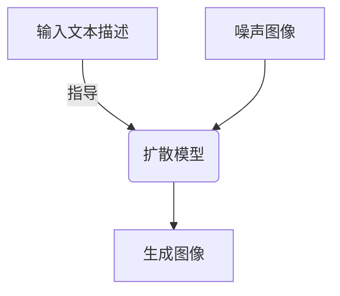
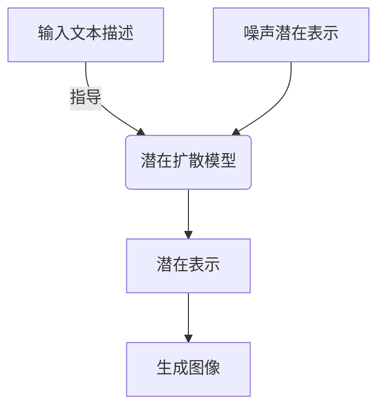
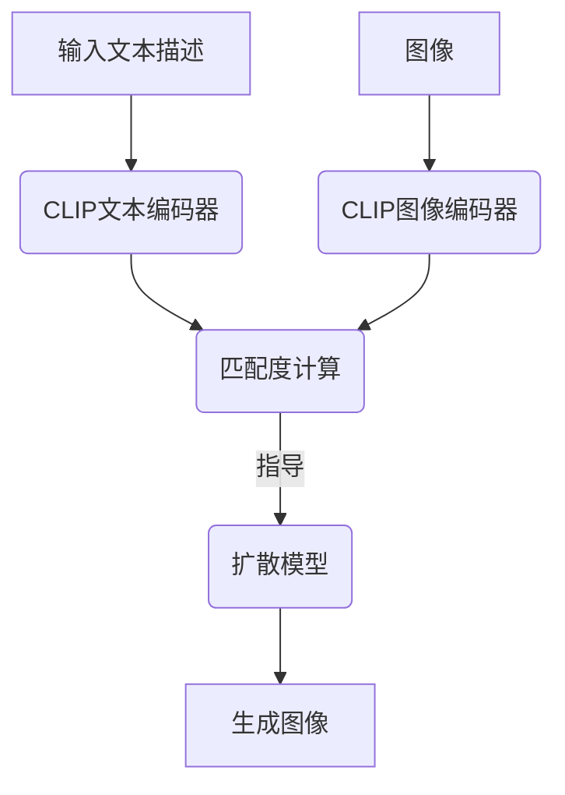

# AIGC从入门到实战：启动：AIGC 工具中的明星产品 Midjourney

## 1.背景介绍

### 1.1 人工智能生成内容(AIGC)的兴起

在过去几年中,人工智能生成内容(AIGC)技术取得了长足的进步,成为科技界备受关注的热门话题。AIGC旨在利用人工智能算法自动生成文本、图像、音频、视频等各种形式的内容,从而大幅提高内容生产的效率和质量。

随着深度学习、自然语言处理、计算机视觉等技术的不断发展,AIGC已经在多个领域展现出了巨大的潜力,例如:

- 文本生成:自动生成新闻报道、小说、广告文案等
- 图像生成:根据文本描述生成逼真的图像
- 音频生成:合成人声、音乐等
- 视频生成:自动生成视频内容,包括动画、虚拟现实等

AIGC技术的兴起正在重塑内容创作的格局,为各行业带来了前所未有的机遇和挑战。

### 1.2 Midjourney:AIGC图像生成领域的佼佼者

在众多AIGC工具中,Midjourney无疑是图像生成领域的明星产品。它是一款基于人工智能的图像生成工具,可以根据用户输入的文本描述自动生成逼真的图像。

Midjourney的核心技术是一种称为"扩散模型"(Diffusion Model)的深度学习模型。该模型通过学习大量的图像数据,掌握了图像的结构和细节特征,从而能够根据文本描述生成相应的图像。

自2022年7月公开发布以来,Midjourney因其出色的图像生成质量和简单易用的界面,迅速在全球范围内获得了广泛的关注和好评。无论是专业设计师还是普通用户,都可以借助Midjourney轻松创作出令人惊艳的图像作品。

本文将深入探讨Midjourney的核心技术原理、使用方法、实际应用场景等,为读者揭开这一AIGC图像生成工具的神秘面纱。

## 2.核心概念与联系

### 2.1 扩散模型(Diffusion Model)

扩散模型是Midjourney等AIGC图像生成工具的核心技术,它属于生成式对抗网络(GAN)的一种变体。扩散模型的基本思想是:首先将一张干净的图像添加噪声,使其变得模糊不清;然后通过一个神经网络模型,逐步去除噪声,最终生成一张清晰的图像。

该过程可以形象地比喻为"从噪音中重建图像"。神经网络需要学习如何从噪声中捕捉图像的结构和细节信息,并逐步重构出原始的图像。

扩散模型的优点在于生成质量较高,图像细节丰富、清晰度好。同时,它还能够通过文本描述来指导图像生成的过程,使生成的图像与输入的文本相匹配。

### 2.2 潜在扩散(Latent Diffusion)

潜在扩散是Midjourney使用的一种改进版扩散模型,它在原始扩散模型的基础上进行了优化。

传统的扩散模型直接在像素空间进行操作,计算量较大,效率较低。潜在扩散则是先将图像映射到一个低维的潜在空间,在这个空间中进行噪声添加和去噪操作,最后再将结果映射回像素空间,从而获得最终的图像。

这种做法可以大幅降低计算复杂度,提高生成效率。同时,潜在空间也能更好地捕捉图像的语义信息,有利于生成质量更高的图像。

### 2.3 CLIP模型

除了扩散模型之外,Midjourney还使用了一种称为CLIP(Contrastive Language-Image Pre-training)的模型,用于将文本描述与图像特征进行匹配。

CLIP是一种双编码器模型,它包含两个子模型:一个用于编码文本,另一个用于编码图像。通过对大量的文本-图像对进行训练,CLIP学会了如何将文本和图像映射到同一个潜在空间,从而能够衡量文本描述与图像的相似程度。

在Midjourney中,CLIP模型被用于指导扩散模型的生成过程,使得生成的图像能够尽可能地匹配用户输入的文本描述。

## 3.核心算法原理具体操作步骤

### 3.1 潜在扩散模型训练

Midjourney使用的潜在扩散模型需要经过大规模的训练,才能获得良好的图像生成能力。训练过程包括以下几个主要步骤:

1. **数据预处理**:从互联网上收集大量高质量图像,对图像进行预处理(如裁剪、调整大小等),构建训练数据集。

2. **特征提取**:使用预训练的卷积神经网络(如VGG、ResNet等)对训练图像进行特征提取,得到每张图像的特征向量表示。

3. **噪声注入**:将提取到的图像特征向量作为初始状态,通过一系列步骤逐步添加高斯噪声,最终得到纯噪声向量。

4. **模型训练**:使用噪声向量和对应的干净图像特征向量作为输入输出对,训练一个U-Net类型的卷积神经网络模型,目标是让模型学会从噪声中重构出原始的图像特征。

5. **模型微调**:在基础模型的训练完成后,可以使用CLIP模型对生成结果进行评分,并根据评分对模型进行进一步的微调,提高生成质量。

经过上述训练过程,潜在扩散模型就能够从任意噪声开始,通过迭代去噪的方式,最终生成出高质量的图像特征表示,再将其解码为像素级别的图像。

### 3.2 文本到图像生成

在实际使用Midjourney生成图像时,核心步骤如下:

1. **文本编码**:将用户输入的文本描述通过CLIP的文本编码器编码为一个向量表示。

2. **条件噪声采样**:从高斯分布中采样一个噪声向量,作为潜在扩散模型的初始输入。

3. **迭代去噪**:使用训练好的潜在扩散模型,对噪声向量进行多次迭代去噪操作。在每一步迭代中,模型会参考CLIP编码器输出的文本向量,调整去噪方向,使生成的图像特征越来越接近文本描述的语义。

4. **图像解码**:当迭代达到预设的步数后,将最终得到的图像特征向量解码为像素级别的图像,即为最终生成的图像结果。

需要注意的是,由于扩散模型的生成过程存在一定的随机性,因此对于同一个文本输入,每次生成的图像都会有一些差异。Midjourney会生成多个候选图像供用户选择。

## 4.数学模型和公式详细讲解举例说明

### 4.1 潜在扩散过程数学表示

潜在扩散模型的核心思想是将图像映射到一个潜在空间,在这个空间中进行噪声注入和去噪操作。具体来说,假设我们有一个图像 $x_0$,它对应的潜在表示为 $z_0$。我们定义一个马尔可夫链,其中每一步的转移过程如下:

$$
q(z_t|z_{t-1}) = \mathcal{N}(z_t;\sqrt{1-\beta_t}z_{t-1},\beta_tI)
$$

其中 $\beta_t$ 是一个预定义的方差系数,用于控制每一步添加的噪声量。经过 $T$ 步迭代,最终会得到一个纯噪声向量 $z_T$。

生成过程则是从 $z_T$ 开始,通过学习一个反向过程 $p_\theta(z_{t-1}|z_t)$ 来逐步去噪,最终重构出原始的潜在表示 $z_0$。反向过程的目标是最大化如下的似然函数:

$$
\log p_\theta(z_0) = \sum_{t=1}^T \log p_\theta(z_{t-1}|z_t)
$$

通过训练一个U-Net类型的神经网络,我们可以学习到这个反向过程的参数 $\theta$,从而实现从噪声到图像的生成。

### 4.2 CLIP模型文本-图像匹配

CLIP模型的目标是学习一个映射函数,将文本和图像映射到同一个潜在空间,从而能够衡量它们之间的相似度。具体来说,对于一个文本-图像对 $(t,i)$,CLIP包含两个编码器:

- 文本编码器 $f_\text{txt}(t)$,将文本 $t$ 编码为一个向量表示
- 图像编码器 $f_\text{img}(i)$,将图像 $i$ 编码为一个向量表示

我们希望相似的文本和图像对应的向量表示之间的余弦相似度较大,而不相似的文本-图像对应的向量表示之间的余弦相似度较小。因此,CLIP的损失函数可以定义为:

$$
\mathcal{L} = \mathbb{E}_{(t,i)\sim p_\text{pos}}[-\log\frac{e^{f_\text{txt}(t)^\top f_\text{img}(i)/\tau}}{e^{f_\text{txt}(t)^\top f_\text{img}(i)/\tau} + \sum_{(\tilde{t},\tilde{i})\sim p_\text{neg}}e^{f_\text{txt}(t)^\top f_\text{img}(\tilde{i})/\tau}}]
$$

其中 $p_\text{pos}$ 表示正样本对的分布, $p_\text{neg}$ 表示负样本对的分布, $\tau$ 是一个温度超参数。

通过在大规模数据集上训练CLIP模型,我们可以得到一个能够很好地匹配文本和图像的编码器。在Midjourney中,CLIP被用于指导扩散模型的生成过程,使得生成的图像能够尽可能地匹配用户输入的文本描述。

### 4.3 示例:CLIP指导下的图像生成

假设我们希望生成一张"一只可爱的小狗在草地上玩耍"的图像,过程如下:

1. 将文本描述"一只可爱的小狗在草地上玩耍"通过CLIP的文本编码器编码,得到一个向量表示 $f_\text{txt}(t)$。

2. 从高斯分布中采样一个噪声向量 $z_T$,作为潜在扩散模型的初始输入。

3. 使用训练好的潜在扩散模型,对 $z_T$ 进行迭代去噪,得到一系列中间状态 $z_{T-1}, z_{T-2}, \cdots, z_0$。在每一步迭代中,我们计算当前状态 $z_t$ 通过图像编码器得到的向量表示 $f_\text{img}(z_t)$,并将其与文本向量 $f_\text{txt}(t)$ 的余弦相似度作为奖赏信号,指导模型朝着更匹配文本描述的方向去噪。

4. 将最终得到的潜在表示 $z_0$ 解码为像素级别的图像,即为生成的结果图像。

通过CLIP的指导,生成的图像更有可能匹配用户的文本描述,捕捉到关键的语义信息(如"小狗"、"草地"、"玩耍"等)。

## 5.项目实践:代码实例和详细解释说明

虽然Midjourney是一款闭源的商业产品,其完整代码并未公开,但我们可以通过一些开源项目来了解潜在扩散模型和CLIP