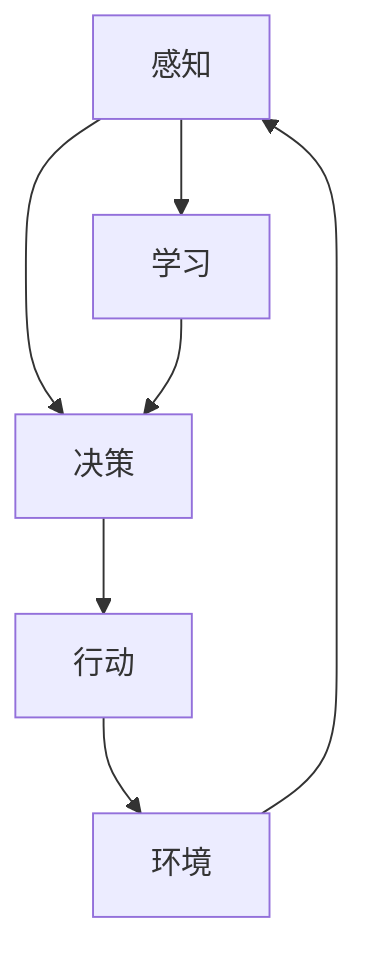

# AI人工智能 Agent：对未来工作的影响

## 1. 背景介绍
### 1.1 人工智能的发展历程
#### 1.1.1 人工智能的起源与早期发展
#### 1.1.2 人工智能的低谷期
#### 1.1.3 人工智能的复兴与快速发展

### 1.2 人工智能对社会的影响
#### 1.2.1 人工智能在各行业的应用
#### 1.2.2 人工智能带来的机遇与挑战
#### 1.2.3 人工智能对就业的影响

### 1.3 AI Agent的定义与特点
#### 1.3.1 AI Agent的定义
#### 1.3.2 AI Agent的特点
#### 1.3.3 AI Agent与传统软件的区别

## 2. 核心概念与联系
### 2.1 AI Agent的核心概念
#### 2.1.1 感知(Perception)
#### 2.1.2 决策(Decision Making)
#### 2.1.3 行动(Action)
#### 2.1.4 学习(Learning)

### 2.2 AI Agent的分类
#### 2.2.1 反应型Agent(Reactive Agents)
#### 2.2.2 模型型Agent(Model-based Agents) 
#### 2.2.3 目标型Agent(Goal-based Agents)
#### 2.2.4 效用型Agent(Utility-based Agents)

### 2.3 AI Agent与其他AI技术的关系
#### 2.3.1 AI Agent与机器学习的关系
#### 2.3.2 AI Agent与深度学习的关系
#### 2.3.3 AI Agent与强化学习的关系

## 3. 核心算法原理具体操作步骤
### 3.1 基于搜索的AI Agent算法
#### 3.1.1 宽度优先搜索(Breadth-First Search)
#### 3.1.2 深度优先搜索(Depth-First Search)
#### 3.1.3 A*搜索算法(A* Search Algorithm)

### 3.2 基于规划的AI Agent算法
#### 3.2.1 前向规划(Forward Planning)
#### 3.2.2 后向规划(Backward Planning) 
#### 3.2.3 部分顺序规划(Partial-Order Planning)

### 3.3 基于学习的AI Agent算法
#### 3.3.1 Q-Learning算法
#### 3.3.2 SARSA算法
#### 3.3.3 Deep Q-Network(DQN)算法

## 4. 数学模型和公式详细讲解举例说明
### 4.1 马尔可夫决策过程(Markov Decision Process)
#### 4.1.1 MDP的定义与组成
#### 4.1.2 MDP的贝尔曼方程(Bellman Equation)
#### 4.1.3 MDP在AI Agent中的应用

### 4.2 动态规划(Dynamic Programming)
#### 4.2.1 动态规划的基本原理
#### 4.2.2 动态规划的优化方程
#### 4.2.3 动态规划在AI Agent中的应用

### 4.3 蒙特卡洛方法(Monte Carlo Methods)
#### 4.3.1 蒙特卡洛方法的基本原理
#### 4.3.2 蒙特卡洛方法的采样过程
#### 4.3.3 蒙特卡洛方法在AI Agent中的应用

## 5. 项目实践：代码实例和详细解释说明
### 5.1 使用Python实现简单的反应型Agent
#### 5.1.1 定义Agent类
#### 5.1.2 实现感知、决策和行动方法
#### 5.1.3 创建环境和运行Agent

### 5.2 使用TensorFlow实现DQN算法
#### 5.2.1 定义Q-Network
#### 5.2.2 实现经验回放(Experience Replay)
#### 5.2.3 训练DQN模型并测试性能

### 5.3 使用OpenAI Gym构建强化学习环境
#### 5.3.1 选择合适的Gym环境
#### 5.3.2 定义Agent和训练过程
#### 5.3.3 评估Agent的性能

## 6. 实际应用场景
### 6.1 智能客服系统
#### 6.1.1 基于自然语言处理的客户问题理解
#### 6.1.2 利用知识图谱进行问题匹配和答案生成
#### 6.1.3 通过强化学习优化客服策略

### 6.2 自动驾驶系统
#### 6.2.1 感知模块：环境感知和状态估计
#### 6.2.2 决策模块：路径规划和决策控制
#### 6.2.3 执行模块：车辆控制和动作执行

### 6.3 智能推荐系统
#### 6.3.1 用户行为数据收集与处理
#### 6.3.2 基于协同过滤的推荐算法
#### 6.3.3 结合强化学习的在线推荐优化

## 7. 工具和资源推荐
### 7.1 开发工具与框架
#### 7.1.1 TensorFlow
#### 7.1.2 PyTorch
#### 7.1.3 Keras

### 7.2 学习资源
#### 7.2.1 在线课程
#### 7.2.2 书籍推荐
#### 7.2.3 研究论文与博客

### 7.3 数据集与竞赛平台
#### 7.3.1 Kaggle
#### 7.3.2 OpenAI Gym
#### 7.3.3 DeepMind Lab

## 8. 总结：未来发展趋势与挑战
### 8.1 AI Agent的发展趋势
#### 8.1.1 多Agent系统与协作
#### 8.1.2 人机混合智能
#### 8.1.3 可解释性与可信赖性

### 8.2 AI Agent面临的挑战
#### 8.2.1 数据质量与隐私保护
#### 8.2.2 算法的鲁棒性与泛化能力
#### 8.2.3 伦理与安全问题

### 8.3 AI Agent对未来工作的影响
#### 8.3.1 工作岗位的变革
#### 8.3.2 人机协作与任务分工
#### 8.3.3 教育与技能培训的调整

## 9. 附录：常见问题与解答
### 9.1 如何评估AI Agent的性能？
### 9.2 如何处理AI Agent训练过程中的不稳定性？
### 9.3 如何平衡AI Agent的探索与利用？
### 9.4 如何选择适合的AI Agent架构和算法？
### 9.5 如何确保AI Agent的决策可解释性？

人工智能(Artificial Intelligence, AI)的发展历程可以追溯到20世纪50年代，经历了起起伏伏的过程。早期的人工智能研究主要集中在符号主义和专家系统上，试图通过逻辑推理和知识表示来模拟人类智能。然而，由于当时计算能力的限制和算法的局限性，人工智能的发展一度陷入低谷。

进入21世纪以来，得益于大数据、高性能计算和深度学习等技术的突破，人工智能迎来了新的春天。深度学习算法在计算机视觉、自然语言处理等领域取得了显著进展，使得人工智能在各行各业得到广泛应用。从智能客服、自动驾驶到医疗诊断，人工智能正在深刻影响着我们的生活和工作方式。

然而，人工智能的快速发展也带来了新的挑战和问题。一方面，人工智能正在取代部分人类工作，引发了失业和职业转型的担忧；另一方面，人工智能系统的决策可解释性和伦理安全问题也备受关注。如何在发挥人工智能优势的同时，确保其公平、透明和可控，是摆在我们面前的重要课题。

AI Agent是人工智能的一个重要分支，它是一种能够感知环境、做出决策并采取行动的智能体。与传统软件不同，AI Agent具有自主学习和适应环境的能力，可以根据环境的变化动态调整自己的行为策略。AI Agent的核心概念包括感知、决策、行动和学习，它们相互关联、循环反馈，构成了一个完整的智能系统。

根据智能程度和决策依据的不同，AI Agent可以分为反应型、模型型、目标型和效用型等类型。反应型Agent根据当前的感知信息直接做出反应，而模型型Agent则在内部维护一个对环境的表示，并基于这个模型进行推理和规划。目标型Agent会追求特定的目标，选择能够最大化目标达成的行动策略。效用型Agent则会考虑行动的长期效用，权衡利弊得失，选择综合效用最高的决策。

在实现AI Agent的过程中，我们通常会借助一些经典的算法和模型。其中，马尔可夫决策过程(Markov Decision Process, MDP)提供了一个通用的数学框架，用于描述智能体与环境的交互过程。MDP由状态、行动、转移概率和奖励函数组成，智能体的目标是找到一个最优策略，使得累积奖励最大化。动态规划和蒙特卡洛方法是求解MDP的两种经典算法，前者通过递归地分解问题，利用最优子结构的性质求解，后者则通过随机采样的方式估计状态-行动值函数。

在强化学习(Reinforcement Learning)领域，Q-Learning、SARSA和DQN等算法被广泛应用于AI Agent的设计中。这些算法通过不断与环境交互，更新状态-行动值函数，逐步学习最优策略。其中，DQN算法结合了深度学习和Q-Learning，使用深度神经网络来逼近值函数，实现了端到端的学习过程。

为了让AI Agent能够在实际应用中发挥作用，我们还需要结合具体的场景和需求，选择合适的算法和模型。比如在智能客服系统中，我们可以利用自然语言处理技术理解客户问题，然后通过知识图谱匹配相应的答案。在自动驾驶系统中，我们需要融合多传感器信息，构建环境感知模块，并结合决策规划和控制算法，实现车辆的自主驾驶。在智能推荐系统中，我们可以收集用户行为数据，通过协同过滤等算法挖掘用户兴趣，再利用强化学习动态优化推荐策略。

展望未来，AI Agent技术还有许多发展的空间和可能性。多Agent系统的研究将促进智能体之间的协作与分工，人机混合智能将实现人与AI的无缝融合，赋予AI Agent更强的适应性和创造力。同时，AI Agent的可解释性和可信赖性也是亟待解决的问题，我们需要开发出更加透明和可控的算法，确保AI Agent的决策过程可以被人类理解和监管。

AI Agent技术的进步必将对未来的工作方式产生深远影响。一些重复性、危险性高的工作将逐步被AI Agent所取代，人类将从繁重的体力劳动中解放出来。与此同时，人机协作将成为常态，AI Agent将成为人类工作的得力助手，提高工作效率和质量。这也对教育和技能培训提出了新的要求，我们需要培养具备AI素养和创新能力的复合型人才，以适应未来的就业市场。

总之，AI Agent是人工智能领域的一个重要分支，它的发展将推动智能化社会的建设，为人类生活和工作带来巨大变革。我们要积极拥抱这一技术浪潮，同时也要审慎对待其带来的挑战和风险，在发展中保持理性和谨慎。只有在技术进步与社会责任之间找到平衡，AI Agent才能真正造福人类，推动社会的可持续发展。

作者：禅与计算机程序设计艺术 / Zen and the Art of Computer Programming