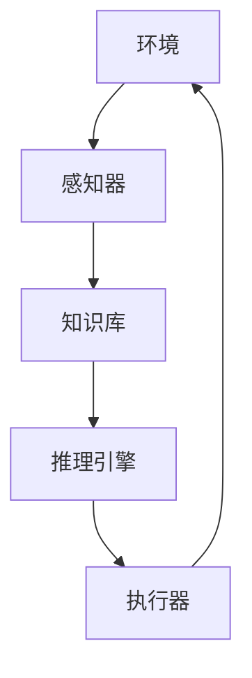
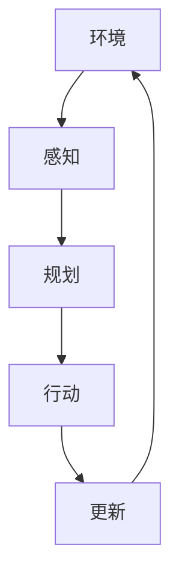

# AI人工智能 Agent：零售业中智能体的应用

## 1.背景介绍

### 1.1 零售业的挑战

在当今快节奏的商业环境中，零售业面临着前所未有的挑战。消费者期望获得个性化和无缝的购物体验,同时企业也需要提高运营效率,降低成本。传统的零售模式已经无法满足这些需求,因此零售商正在寻求新的解决方案来应对这些挑战。

### 1.2 人工智能的机遇

人工智能(AI)技术的快速发展为零售业带来了新的机遇。AI系统可以处理大量数据,发现隐藏的模式和洞察,从而优化业务流程,提高决策质量。特别是智能体(Agent)技术,它可以模拟人类的决策过程,自主地采取行动来实现特定目标。

### 1.3 智能体在零售业的应用

智能体技术在零售业有着广泛的应用前景,包括:

- 个性化推荐和营销
- 智能库存管理和需求预测
- 客户服务和支持
- 价格优化
- 反欺诈和风险管理

通过应用智能体技术,零售商可以提高运营效率,改善客户体验,并获得竞争优势。

## 2.核心概念与联系

### 2.1 智能体的定义

智能体(Agent)是一种自主的决策实体,它可以感知环境,并根据预定义的目标采取行动来影响环境。智能体可以是软件系统、机器人或其他自主系统。

### 2.2 智能体的核心组成部分

一个典型的智能体系统由以下几个核心组成部分构成:

- 感知器(Sensors):用于从环境中获取信息和数据。
- 执行器(Actuators):用于在环境中执行行动。
- 知识库(Knowledge Base):存储智能体的知识和规则。
- 推理引擎(Inference Engine):根据知识库和感知信息,推理出合适的行动。



### 2.3 智能体的类型

根据智能体与环境的交互方式,可以将智能体分为以下几种类型:

- 反应型智能体(Reactive Agents):根据当前的感知信息做出反应,没有内部状态。
- 基于模型的智能体(Model-based Agents):维护环境的内部模型,并根据模型进行推理和决策。
- 基于目标的智能体(Goal-based Agents):具有明确的目标,并采取行动来实现这些目标。
- 实用型智能体(Utility-based Agents):根据一个实用函数来评估不同行动的价值,选择最优行动。
- 学习型智能体(Learning Agents):能够从经验中学习,并不断改进其行为。

## 3.核心算法原理具体操作步骤

智能体系统通常采用一种称为"感知-规划-行动"(Perceive-Plan-Act)的循环过程来运作。具体步骤如下:

1. **感知(Perceive)**:智能体从环境中获取信息和数据,这些数据通过感知器(Sensors)传递给智能体系统。

2. **规划(Plan)**:智能体系统根据感知到的信息,结合知识库中的规则和模型,通过推理引擎(Inference Engine)制定出行动计划。这个过程可能涉及到各种算法和技术,如搜索算法、规划算法、机器学习等。

3. **行动(Act)**:智能体系统通过执行器(Actuators)在环境中执行规划出的行动。

4. **更新(Update)**:智能体系统根据行动的结果,更新其内部状态和知识库,为下一次循环做准备。

这个循环过程持续进行,直到智能体实现了预定的目标或者被终止。



## 4.数学模型和公式详细讲解举例说明

在智能体系统中,数学模型和公式扮演着重要的角色,用于描述和优化智能体的行为。以下是一些常见的数学模型和公式:

### 4.1 马尔可夫决策过程(Markov Decision Process, MDP)

马尔可夫决策过程是一种广泛应用于智能体系统的数学框架。它描述了一个智能体在不确定环境中进行决策的过程。

一个MDP可以用一个元组 $(S, A, P, R, \gamma)$ 来表示,其中:

- $S$ 是状态集合,描述了环境的所有可能状态。
- $A$ 是行动集合,描述了智能体可以采取的所有行动。
- $P(s'|s,a)$ 是状态转移概率,表示在状态 $s$ 下采取行动 $a$ 后,转移到状态 $s'$ 的概率。
- $R(s,a)$ 是即时回报函数,表示在状态 $s$ 下采取行动 $a$ 所获得的即时回报。
- $\gamma \in [0,1)$ 是折现因子,用于权衡即时回报和长期回报的重要性。

智能体的目标是找到一个策略 $\pi: S \rightarrow A$,使得在该策略下的期望总回报最大化:

$$
\max_\pi \mathbb{E}\left[\sum_{t=0}^\infty \gamma^t R(s_t, a_t) \right]
$$

其中 $s_t$ 和 $a_t$ 分别表示在时间步 $t$ 的状态和行动。

### 4.2 Q-Learning算法

Q-Learning是一种强化学习算法,用于在MDP中学习最优策略。它通过不断探索和更新一个Q函数来逼近最优行动价值函数:

$$
Q(s,a) \leftarrow Q(s,a) + \alpha \left[ r + \gamma \max_{a'} Q(s',a') - Q(s,a) \right]
$$

其中:

- $Q(s,a)$ 是状态-行动对 $(s,a)$ 的行动价值函数,表示在状态 $s$ 下采取行动 $a$ 后可获得的期望总回报。
- $\alpha$ 是学习率,控制了新信息对Q函数更新的影响程度。
- $r$ 是即时回报,即在状态 $s$ 下采取行动 $a$ 所获得的回报。
- $\gamma$ 是折现因子,与MDP中的定义相同。
- $s'$ 是下一个状态,根据状态转移概率 $P(s'|s,a)$ 得到。

通过不断更新Q函数,智能体可以逐步学习到最优策略。

### 4.3 深度Q网络(Deep Q-Network, DQN)

深度Q网络是一种结合深度学习和Q-Learning的算法,用于解决高维状态空间和连续行动空间的问题。它使用一个深度神经网络来逼近Q函数:

$$
Q(s,a;\theta) \approx \max_\pi \mathbb{E}\left[\sum_{t=0}^\infty \gamma^t R(s_t, a_t) \right]
$$

其中 $\theta$ 是神经网络的参数。

在训练过程中,DQN通过minimizing以下损失函数来更新网络参数:

$$
L(\theta) = \mathbb{E}_{(s,a,r,s')\sim D}\left[\left(r + \gamma \max_{a'} Q(s',a';\theta^-) - Q(s,a;\theta)\right)^2\right]
$$

其中:

- $D$ 是经验回放池(Experience Replay Buffer),用于存储智能体的经验样本 $(s,a,r,s')$。
- $\theta^-$ 是目标网络(Target Network)的参数,用于稳定训练过程。

通过不断优化损失函数,DQN可以学习到一个近似最优的Q函数,从而指导智能体采取最优行动。

## 5.项目实践:代码实例和详细解释说明

为了更好地理解智能体在零售业中的应用,我们将通过一个简单的示例项目来演示如何使用Q-Learning算法训练一个智能体,以优化库存管理策略。

### 5.1 问题描述

假设我们经营一家零售商店,出售一种特定商品。我们需要制定一个库存管理策略,以最大化利润。具体来说,我们需要决定每天是补充库存还是不补充。

我们定义智能体的状态为当前库存量,行动为"补充"或"不补充"。我们的目标是找到一个策略,使得在一段时间内的总利润最大化。

### 5.2 环境设置

我们首先定义环境类 `InventoryEnv`,它包含以下成员:

- `inventory`: 当前库存量
- `max_inventory`: 最大库存量
- `demand_dist`: 客户需求的概率分布
- `holding_cost`: 每单位库存的持有成本
- `stockout_cost`: 缺货成本
- `restock_cost`: 补货成本

`step` 函数用于模拟一天的运营,它接受智能体的行动作为输入,并返回下一个状态、即时回报和是否结束的标志。

```python
class InventoryEnv:
    def __init__(self, max_inventory=100, holding_cost=1, stockout_cost=10, restock_cost=5):
        self.inventory = 0
        self.max_inventory = max_inventory
        self.demand_dist = poisson(10)  # 假设客户需求服从泊松分布,平均值为10
        self.holding_cost = holding_cost
        self.stockout_cost = stockout_cost
        self.restock_cost = restock_cost

    def step(self, action):
        demand = self.demand_dist.rvs()  # 随机生成客户需求
        if action == 'restock':
            self.inventory = self.max_inventory  # 补充库存至最大值
            reward = -self.restock_cost  # 支付补货成本
        else:
            reward = 0

        # 计算持有成本和缺货成本
        reward -= self.holding_cost * self.inventory
        stockout = max(demand - self.inventory, 0)
        reward -= self.stockout_cost * stockout

        self.inventory = max(self.inventory - demand, 0)  # 更新库存量
        done = False  # 该环境无终止条件
        return self.inventory, reward, done
```

### 5.3 Q-Learning算法实现

接下来,我们实现Q-Learning算法来训练智能体。我们定义一个 `QLearningAgent` 类,它包含以下成员:

- `env`: 环境对象
- `Q`: Q函数,以字典形式存储
- `alpha`: 学习率
- `gamma`: 折现因子
- `epsilon`: 探索率,控制exploitation和exploration的权衡

`learn` 函数用于训练智能体,它执行多次episode,在每个episode中,智能体与环境交互,并根据Q-Learning算法更新Q函数。

```python
class QLearningAgent:
    def __init__(self, env, alpha=0.1, gamma=0.99, epsilon=0.1):
        self.env = env
        self.Q = {}
        self.alpha = alpha
        self.gamma = gamma
        self.epsilon = epsilon

    def get_action(self, state):
        if np.random.rand() < self.epsilon:
            return np.random.choice(['restock', 'no_restock'])  # 探索
        else:
            q_values = [self.Q.get((state, action), 0) for action in ['restock', 'no_restock']]
            return 'restock' if q_values[0] > q_values[1] else 'no_restock'  # 利用

    def learn(self, num_episodes=1000):
        for episode in range(num_episodes):
            state = self.env.inventory
            done = False
            while not done:
                action = self.get_action(state)
                next_state, reward, done = self.env.step(action)
                q_value = self.Q.get((state, action), 0)
                next_q_values = [self.Q.get((next_state, a), 0) for a in ['restock', 'no_restock']]
                max_next_q = max(next_q_values)
                self.Q[(state, action)] = q_value + self.alpha * (reward + self.gamma * max_next_q - q_value)
                state = next_state
            self.env.inventory = 0  # 重置环境

    def get_policy(self):
        policy = {}
        for state in range(self.env.max_inventory + 1):
            q_values = [self.Q.get((state, action), 0) for action in ['restock', 'no_restock']]
            policy[state] = 'restock' if q_values[0] > q_values[1] else 'no_restock'
        return policy
```

### 5.4 训练和评估

最后,我们创建环境和智能体对象,训练智能体,并评估学习到的策略的性能。

```python
env = InventoryEnv()
agent = QLearningAgent(env)
agent.learn(num_episodes=10000)  # 训练智能体