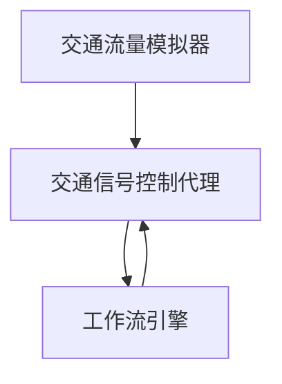

# AI人工智能代理工作流 AI Agent WorkFlow：在智能交通中的应用

## 1.背景介绍

### 1.1 智能交通系统的重要性

随着城市化进程的加快和汽车保有量的不断增长,交通拥堵、能源消耗和环境污染等问题日益严重,亟需建立一个高效、绿色、智能的交通系统来应对这些挑战。智能交通系统(Intelligent Transportation Systems,ITS)被认为是解决这些问题的有效途径之一。

### 1.2 人工智能在智能交通中的作用

人工智能(Artificial Intelligence,AI)技术在智能交通领域发挥着越来越重要的作用。通过机器学习、计算机视觉、自然语言处理等技术,可以实现交通数据的智能分析、交通流量预测、智能路径规划、自动驾驶等功能,从而提高交通系统的效率、安全性和可持续性。

### 1.3 AI代理工作流在智能交通中的应用

AI代理工作流(AI Agent Workflow)是将AI技术与工作流程管理相结合的一种范式。它将AI技术应用于工作流的各个环节,如决策制定、任务分配、过程监控等,从而实现工作流程的自动化和智能化。在智能交通领域,AI代理工作流可以用于交通信号控制、车辆调度、紧急事件响应等场景,提高交通管理的智能化水平。

## 2.核心概念与联系  

### 2.1 AI代理

AI代理(AI Agent)是指具有一定自主性和智能的软件实体,能够感知环境、做出决策并执行相应的行为。在智能交通系统中,AI代理可以扮演不同的角色,如交通信号控制代理、车辆调度代理、路径规划代理等。

### 2.2 工作流程管理

工作流程管理(Workflow Management)是指对组织内部或跨组织的工作流程进行定义、执行、监控和优化的过程。在智能交通系统中,工作流程管理可以应用于交通事件处理、应急响应等场景,确保相关任务能够按照预定的流程高效执行。

### 2.3 AI代理工作流

AI代理工作流将AI代理与工作流程管理相结合,利用AI技术实现工作流程的自动化和智能化。在智能交通系统中,AI代理工作流可以用于交通信号控制、车辆调度、路径规划等场景,提高交通管理的效率和智能化水平。

AI代理工作流的核心思想是将工作流程分解为一系列任务,由不同的AI代理来完成这些任务。AI代理之间通过协作和交互来实现整个工作流程的执行。例如,在交通信号控制场景中,可以有交通流量监测代理、信号优化代理、事件响应代理等,它们协同工作以实现智能化的交通信号控制。

## 3.核心算法原理具体操作步骤

AI代理工作流在智能交通系统中的应用涉及多个方面,包括AI代理的设计、工作流程建模、代理协作机制等。下面将分别介绍这些方面的核心算法原理和具体操作步骤。

### 3.1 AI代理设计

AI代理的设计是AI代理工作流的基础。一个好的AI代理设计应该考虑代理的感知能力、决策能力和行为能力。常用的AI代理设计方法包括基于规则的系统、基于模型的系统、基于学习的系统等。

以基于学习的AI代理为例,其设计步骤如下:

1. 确定代理的目标和任务
2. 选择合适的机器学习算法,如监督学习、强化学习等
3. 收集和预处理训练数据
4. 训练机器学习模型
5. 评估和优化模型性能
6. 将训练好的模型部署到代理系统中

### 3.2 工作流程建模

工作流程建模是将实际业务流程抽象为形式化的模型,以便于分析、优化和执行。常用的工作流程建模语言包括BPMN(Business Process Model and Notation)、YAWL(Yet Another Workflow Language)等。

以BPMN为例,工作流程建模的步骤如下:

1. 确定工作流程的范围和目标
2. 识别工作流程中的活动、事件、网关等元素
3. 使用BPMN符号绘制工作流程模型
4. 验证和优化工作流程模型
5. 将工作流程模型部署到工作流引擎中

### 3.3 代理协作机制

在AI代理工作流中,多个AI代理需要协作完成整个工作流程。因此,设计合理的代理协作机制是非常重要的。常用的代理协作机制包括基于规则的协作、基于约束的协作、基于市场的协作等。

以基于约束的协作为例,其操作步骤如下:

1. 确定代理之间的约束条件,如时间约束、资源约束等
2. 建立代理协作的优化模型,将约束条件作为优化目标或约束条件
3. 选择合适的优化算法,如整数规划、约束优化等
4. 求解优化模型,获得代理协作的最优方案
5. 根据最优方案协调代理之间的行为

## 4.数学模型和公式详细讲解举例说明

在AI代理工作流中,数学模型和公式在多个环节都发挥着重要作用,如AI代理的决策模型、工作流程优化模型、代理协作优化模型等。下面将以交通信号控制场景为例,详细讲解相关的数学模型和公式。

### 4.1 交通流量模型

交通流量模型描述了车辆在路网中的流动规律,是交通信号控制的基础。常用的交通流量模型包括宏观模型(如LWR模型)和微观模型(如细胞自动机模型)。

LWR模型是一种广为使用的宏观交通流量模型,它基于保守定律和经验关系,用偏微分方程描述交通流量的时空演化:

$$
\frac{\partial \rho(x,t)}{\partial t} + \frac{\partial q(x,t)}{\partial x} = 0
$$

$$
q(x,t) = \rho(x,t)v(\rho(x,t))
$$

其中,$\rho(x,t)$表示位置$x$时刻$t$的交通密度,$q(x,t)$表示交通流量,$v(\rho)$是经验速度-密度关系函数。

### 4.2 交通信号控制模型

交通信号控制模型旨在优化信号时间配置,以实现交通流量的高效运行。常用的模型包括基于排队理论的模型、基于压力的模型等。

以基于压力的模型为例,其目标函数为最小化路网中的总压力:

$$
\min \sum_{i \in N} P_i(t)
$$

其中,$N$是路网中的节点集合,$P_i(t)$是节点$i$在时刻$t$的压力值,定义为:

$$
P_i(t) = \sum_{j \in I_i} f_{ji}(t) - \sum_{j \in O_i} f_{ij}(t)
$$

$I_i$和$O_i$分别表示进入和离开节点$i$的路段集合,$f_{ji}(t)$和$f_{ij}(t)$分别表示相应路段上的交通流量。

该模型可以通过调整信号时间配置,使总压力最小化,从而实现交通流量的平滑运行。

### 4.3 代理协作优化模型

在AI代理工作流中,多个代理需要协作完成工作流程。代理协作优化模型旨在确定代理之间的最优协作方案,以实现整体目标。

假设有$n$个代理$A_1,A_2,...,A_n$,每个代理$A_i$有一个局部目标函数$f_i(x_i)$,其中$x_i$是代理$A_i$的决策变量。代理之间存在约束条件$g_{ij}(x_i,x_j) \leq 0$,表示代理$A_i$和$A_j$之间的约束关系。

则代理协作优化模型可以表示为:

$$
\begin{aligned}
\min & \sum_{i=1}^n f_i(x_i) \\
\text{s.t. } & g_{ij}(x_i,x_j) \leq 0, \quad \forall i,j \in \{1,2,...,n\}, i \neq j
\end{aligned}
$$

该模型可以通过分布式优化算法等方法求解,获得代理之间的最优协作方案。

以上是AI代理工作流在智能交通系统中应用所涉及的一些核心数学模型和公式。在实际应用中,还需要根据具体场景对模型进行调整和扩展。

## 5.项目实践:代码实例和详细解释说明

为了更好地理解AI代理工作流在智能交通系统中的应用,下面将给出一个基于Python的代码实例,实现一个简单的交通信号控制系统。

### 5.1 系统架构

该系统采用AI代理工作流的架构,包括以下几个主要组件:

- 交通流量模拟器: 模拟真实交通流量的变化
- 交通信号控制代理: 根据交通流量数据优化信号时间配置
- 工作流引擎: 协调代理之间的交互,执行工作流程

系统架构如下所示:



### 5.2 代码实现

下面是系统的核心代码实现,包括交通流量模拟器、交通信号控制代理和工作流引擎三个部分。

#### 5.2.1 交通流量模拟器

```python
import random

class TrafficSimulator:
    def __init__(self, num_intersections):
        self.num_intersections = num_intersections
        self.traffic_flows = [random.randint(10, 100) for _ in range(num_intersections)]

    def get_traffic_flows(self):
        return self.traffic_flows

    def update_traffic_flows(self):
        for i in range(self.num_intersections):
            self.traffic_flows[i] += random.randint(-10, 10)
            self.traffic_flows[i] = max(10, min(100, self.traffic_flows[i]))
```

该模拟器初始化时会为每个路口随机生成一个交通流量值,之后每次调用`update_traffic_flows`方法时,会根据一定的随机规则更新每个路口的交通流量值。

#### 5.2.2 交通信号控制代理

```python
class TrafficSignalAgent:
    def __init__(self, traffic_simulator):
        self.traffic_simulator = traffic_simulator
        self.signal_timings = [30] * traffic_simulator.num_intersections

    def optimize_signal_timings(self):
        traffic_flows = self.traffic_simulator.get_traffic_flows()
        for i, flow in enumerate(traffic_flows):
            if flow > 80:
                self.signal_timings[i] += 10
            elif flow < 40:
                self.signal_timings[i] -= 10
        self.signal_timings = [max(10, min(60, t)) for t in self.signal_timings]

    def get_signal_timings(self):
        return self.signal_timings
```

该代理根据交通流量模拟器提供的交通流量数据,调整每个路口的信号时间配置。具体来说,如果某个路口的交通流量过大,则增加该路口的绿灯时间;如果交通流量过小,则减少绿灯时间。

#### 5.2.3 工作流引擎

```python
from time import sleep

class WorkflowEngine:
    def __init__(self, traffic_simulator, traffic_signal_agent):
        self.traffic_simulator = traffic_simulator
        self.traffic_signal_agent = traffic_signal_agent

    def run(self):
        while True:
            self.traffic_simulator.update_traffic_flows()
            self.traffic_signal_agent.optimize_signal_timings()
            signal_timings = self.traffic_signal_agent.get_signal_timings()
            print("Current signal timings:", signal_timings)
            sleep(5)
```

工作流引擎协调交通流量模拟器和交通信号控制代理的交互,执行工作流程。在每个循环中,它首先让交通流量模拟器更新交通流量数据,然后让交通信号控制代理根据新的交通流量数据优化信号时间配置,最后打印出当前的信号时间配置。

### 5.3 系统运行

下面是系统运行的示例输出:

```
Current signal timings: [30, 30, 30, 30, 30]
Current signal timings: [40, 30, 20, 30, 30]
Current signal timings: [40, 40, 20, 30, 20]
Current signal timings: [50, 40, 20, 30, 20]
Current signal timings: [50, 50, 30, 