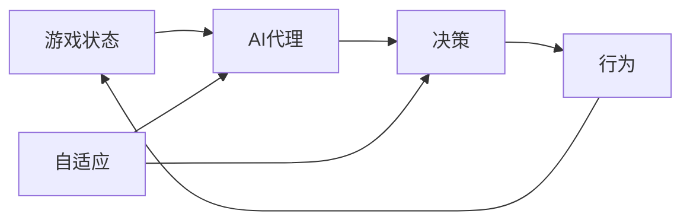

# AI人工智能代理工作流AI Agent WorkFlow：AI代理在视频游戏中的自适应机制

## 1.背景介绍

人工智能（AI）技术的快速发展为视频游戏带来了革命性的变化。AI代理作为游戏中的非玩家角色（NPC），能够根据游戏环境和玩家行为做出智能化的反应和决策，极大地提升了游戏的沉浸感和挑战性。然而，如何设计一个高效、灵活、自适应的AI代理工作流，使其能够在复杂多变的游戏场景中表现出近乎真人的智能行为，仍然是一个巨大的挑战。

本文将深入探讨AI代理在视频游戏中的自适应机制，重点关注AI Agent WorkFlow的设计与实现。我们将从AI代理的核心概念出发，分析其与游戏机制的内在联系，并详细阐述AI代理工作流的核心算法原理和具体操作步骤。同时，我们还将通过数学模型和代码实例，讲解AI代理自适应机制的实现细节。最后，本文将总结AI代理技术的发展趋势与面临的挑战，为游戏开发者和AI研究者提供有价值的参考和启发。

## 2.核心概念与联系

要理解AI代理在游戏中的自适应机制，首先需要明确以下几个核心概念：

### 2.1 AI代理（AI Agent）

AI代理是指游戏中由人工智能控制的非玩家角色（NPC），它们能够根据游戏环境和玩家行为自主地做出决策和行动。AI代理的目标是模拟真实玩家的行为，提供更具挑战性和沉浸感的游戏体验。

### 2.2 游戏状态（Game State）

游戏状态是指游戏在某一时刻的所有相关信息的集合，包括游戏地图、角色位置、生命值、装备等。AI代理需要根据当前的游戏状态来评估形势，并做出相应的决策。

### 2.3 决策（Decision Making）

决策是AI代理根据当前游戏状态选择下一步行动的过程。常见的决策方法包括基于规则的决策、基于效用的决策和基于学习的决策等。

### 2.4 行为（Behavior）

行为是AI代理根据决策结果执行的具体动作，如移动、攻击、躲避等。合理的行为设计可以使AI代理表现得更加真实和智能。

### 2.5 自适应（Adaptation）

自适应是指AI代理能够根据游戏环境的变化和玩家的行为，动态地调整自己的决策和行为策略。自适应机制可以使AI代理更好地应对复杂多变的游戏场景，提供更具挑战性的游戏体验。

下图展示了AI代理、游戏状态、决策、行为和自适应之间的关系：

从图中可以看出，AI代理根据当前的游戏状态进行决策，并执行相应的行为，而行为的结果又会影响下一时刻的游戏状态。同时，自适应机制可以对AI代理的决策和行为策略进行动态调整，使其更好地适应不断变化的游戏环境。

## 3.核心算法原理具体操作步骤

AI代理工作流的核心是决策和自适应机制。以下是几种常见的决策算法和自适应机制的原理和操作步骤：

### 3.1 基于规则的决策

基于规则的决策是一种简单但有效的决策方法。其基本原理是根据预先设定的规则来选择行动。具体步骤如下：

1. 定义规则集合：根据游戏设计需求，制定一系列if-then形式的规则，例如"如果敌人在攻击范围内，则进行攻击"。

2. 获取当前游戏状态：AI代理需要获取当前游戏的各种信息，如角色位置、生命值等。

3. 匹配规则：将当前游戏状态与规则集合进行匹配，找出所有满足条件的规则。

4. 选择行动：如果有多个规则满足条件，可以根据优先级或随机选择一个规则对应的行动。

5. 执行行动：AI代理执行选定的行动，并更新游戏状态。

基于规则的决策简单易实现，但难以应对复杂的游戏场景。

### 3.2 基于效用的决策

基于效用的决策是一种更加灵活的决策方法。其基本原理是根据每个行动的效用值来选择最优行动。具体步骤如下：

1. 定义效用函数：根据游戏设计需求，设计一个效用函数，用于评估每个行动的效用值。效用函数可以考虑多个因素，如对敌人造成的伤害、自身受到的伤害等。

2. 获取当前游戏状态：AI代理需要获取当前游戏的各种信息。

3. 生成可能的行动：根据当前游戏状态，生成AI代理可以执行的所有行动。

4. 计算每个行动的效用值：使用效用函数计算每个行动的效用值。

5. 选择效用值最高的行动：选择效用值最高的行动作为最优行动。

6. 执行行动：AI代理执行选定的行动，并更新游戏状态。

基于效用的决策更加灵活，能够适应复杂的游戏场景，但需要精心设计效用函数。

### 3.3 基于学习的决策

基于学习的决策是一种利用机器学习算法来自动优化决策策略的方法。其基本原理是通过不断与环境交互，学习最优的决策策略。以强化学习为例，具体步骤如下：

1. 定义状态空间、行动空间和奖励函数：根据游戏设计需求，定义AI代理可能处于的状态、可以执行的行动以及每个状态-行动对应的奖励值。

2. 初始化Q值表或价值函数：Q值表或价值函数用于估计每个状态-行动对应的长期回报。初始时，可以将其初始化为零或随机值。

3. 获取当前游戏状态：AI代理需要获取当前游戏的各种信息。

4. 选择行动：根据当前状态，使用一定的策略（如ε-贪婪策略）选择一个行动。

5. 执行行动并获取奖励：AI代理执行选定的行动，并从环境中获得即时奖励。

6. 更新Q值表或价值函数：根据即时奖励和下一状态的估计值，更新当前状态-行动对应的Q值或价值函数。

7. 重复步骤3-6，直到达到终止条件（如训练次数达到预设值）。

基于学习的决策可以自动优化决策策略，适应复杂的游戏环境，但需要大量的训练数据和计算资源。

### 3.4 自适应难度调整（Dynamic Difficulty Adjustment, DDA）

自适应难度调整是一种根据玩家的表现动态调整游戏难度的机制。其基本原理是通过监测玩家的游戏状态和行为，实时调整AI代理的能力或行为策略。具体步骤如下：

1. 定义难度调整指标：根据游戏设计需求，选择合适的难度调整指标，如玩家的生命值、得分、通关时间等。

2. 设定难度调整阈值：为每个难度调整指标设定对应的阈值，用于判断是否需要调整难度。

3. 监测玩家状态和行为：在游戏过程中，实时监测玩家的游戏状态和行为，如生命值变化、得分变化等。

4. 判断是否需要调整难度：根据监测到的玩家状态和行为，判断是否达到难度调整阈值。

5. 调整AI代理能力或行为策略：如果需要调整难度，则相应地调整AI代理的能力（如攻击力、移动速度等）或行为策略（如更倾向于防御或进攻）。

6. 重复步骤3-5，实现实时的难度自适应调整。

自适应难度调整可以根据玩家的实际表现，动态调整游戏难度，提供更加个性化的游戏体验。

## 4.数学模型和公式详细讲解举例说明

在AI代理的决策和自适应机制中，常常涉及到一些数学模型和公式。以下是几个典型的例子：

### 4.1 效用函数

在基于效用的决策中，效用函数用于评估每个行动的效用值。一个简单的效用函数可以表示为：

$$
U(s, a) = w_1 \times f_1(s, a) + w_2 \times f_2(s, a) + ... + w_n \times f_n(s, a)
$$

其中，$U(s, a)$表示在状态$s$下执行行动$a$的效用值，$f_i(s, a)$表示第$i$个特征对效用值的贡献，$w_i$表示第$i$个特征的权重。

例如，在一个FPS游戏中，可以设计如下的效用函数：

$$
U(s, a) = 0.5 \times damage(s, a) - 0.3 \times risk(s, a) + 0.2 \times ammo(s, a)
$$

其中，$damage(s, a)$表示在状态$s$下执行行动$a$对敌人造成的伤害，$risk(s, a)$表示AI代理自身受到的伤害风险，$ammo(s, a)$表示行动$a$消耗的弹药量。这个效用函数综合考虑了三个因素，并给予不同的权重，以评估每个行动的效用值。

### 4.2 Q-learning

Q-learning是一种常用的强化学习算法，用于学习最优的决策策略。Q-learning的核心是更新Q值表，即状态-行动对应的长期回报估计值。Q值更新公式如下：

$$
Q(s, a) \leftarrow Q(s, a) + \alpha \times [r + \gamma \times \max_{a'}Q(s', a') - Q(s, a)]
$$

其中，$Q(s, a)$表示状态$s$下执行行动$a$的Q值，$\alpha$表示学习率，$r$表示即时奖励，$\gamma$表示折扣因子，$\max_{a'}Q(s', a')$表示下一状态$s'$下所有可能行动的最大Q值。

例如，假设一个AI代理在状态$s$下执行行动$a$，获得即时奖励$r=1$，并转移到新状态$s'$。在状态$s'$下，AI代理有两个可能的行动$a_1$和$a_2$，对应的Q值分别为$Q(s', a_1)=2$和$Q(s', a_2)=3$。假设学习率$\alpha=0.1$，折扣因子$\gamma=0.9$，则根据Q值更新公式，状态$s$下行动$a$的Q值更新如下：

$$
\begin{aligned}
Q(s, a) &\leftarrow Q(s, a) + 0.1 \times [1 + 0.9 \times \max(2, 3) - Q(s, a)]\\
&= Q(s, a) + 0.1 \times [1 + 0.9 \times 3 - Q(s, a)]\\
&= 0.9 \times Q(s, a) + 0.37
\end{aligned}
$$

通过不断地更新Q值，AI代理可以逐步学习到最优的决策策略。

### 4.3 自适应难度调整

在自适应难度调整中，可以使用一些数学模型来量化玩家的表现和游戏难度。一个简单的难度调整模型可以表示为：

$$
d = d_0 + k \times (p - p_0)
$$

其中，$d$表示调整后的难度，$d_0$表示初始难度，$k$表示难度调整系数，$p$表示玩家表现指标（如通关时间、得分等），$p_0$表示期望的玩家表现指标。

例如，假设一个游戏的初始难度为$d_0=5$，期望玩家的通关时间为$p_0=60$秒。如果实际玩家的通关时间为$p=50$秒，难度调整系数为$k=0.1$，则根据难度调整模型，调整后的难度为：

$$
d = 5 + 0.1 \times (50 - 60) = 4
$$

这意味着，由于玩家的实际表现优于期望，游戏难度将适当降低，以提供更加合适的挑战。

通过合理地设计数学