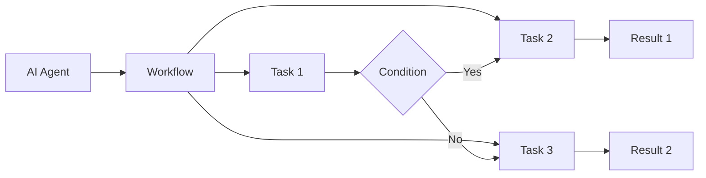
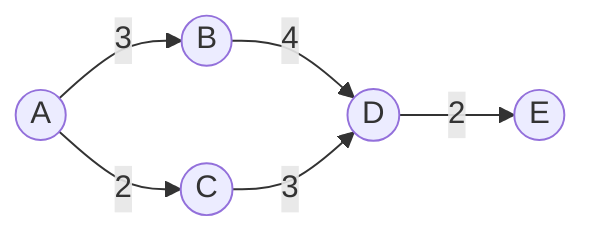

# AI人工智能代理工作流AI Agent WorkFlow：代理工作流的可视化与用户交互设计

## 1. 背景介绍
### 1.1 人工智能代理的兴起
在当今快速发展的人工智能时代,AI代理(AI Agent)正在成为一个热门话题。AI代理是一种智能软件程序,能够根据环境感知自主执行任务,代替人类完成各种工作。随着AI技术的不断进步,AI代理在各行各业中的应用日益广泛,如智能客服、个人助理、自动驾驶等。

### 1.2 AI代理工作流的重要性
AI代理要高效完成任务,离不开清晰合理的工作流程。工作流定义了一系列有序的活动和任务,指导AI代理按照预定的逻辑执行。设计优秀的AI代理工作流,可以提高效率、减少错误、增强稳定性。同时,直观形象的工作流可视化,以及友好易用的用户交互,对于用户理解、监控和优化AI代理的工作至关重要。

### 1.3 本文的目标和内容安排
本文将重点探讨AI代理工作流的可视化表示和用户交互设计。首先,我们将阐述AI代理工作流的核心概念和关键要素。接下来,详细讲解工作流建模的算法原理和数学模型。然后,通过一个实际项目案例,演示工作流可视化和用户交互的代码实现。文章还将分析AI代理工作流在实际场景中的应用,推荐相关工具和学习资源。最后总结全文,展望AI代理工作流的未来发展方向和挑战。

## 2. 核心概念与联系
### 2.1 AI代理的定义和特征
AI代理是一种基于人工智能技术的自主软件程序,通过感知、推理、决策、执行等智能行为,代替人类完成特定任务。AI代理具有以下关键特征:

- 自主性:能够根据环境和目标自主运行,无需人工干预
- 感知能力:可以通过传感器等方式获取外部环境信息
- 推理决策:利用智能算法对信息进行分析,做出合理决策
- 执行动作:根据决策结果采取相应行动,产生影响或输出
- 交互通信:与环境、用户、其他代理进行信息交换和协作

### 2.2 工作流的定义和组成
工作流(Workflow)是对工作流程和规则的抽象建模,由一系列按照预定逻辑顺序执行的活动和任务组成。通过定义任务、执行者、顺序逻辑、分支条件等,工作流描述了工作的执行过程。一个典型的工作流包含以下核心要素:

- 任务(Task):工作流中的基本执行单元,代表一个具体的工作项
- 执行者(Actor):负责执行任务的主体,可以是人或AI代理
- 顺序逻辑(Sequence):定义任务之间的先后执行顺序
- 分支条件(Condition):根据条件判断决定下一步执行的任务
- 输入输出(Input/Output):任务执行所需的数据输入和产生的结果输出

### 2.3 AI代理与工作流的关系
AI代理与工作流是密切相关的两个概念。工作流定义了AI代理完成任务的逻辑和路径,指导其有序开展工作。AI代理根据工作流规定的任务和规则,自主执行一系列活动。同时,工作流的执行过程和结果,也依赖于AI代理的感知、决策和执行能力。两者相辅相成,共同决定了AI系统的工作效率和质量。

下图使用Mermaid流程图展示了AI代理与工作流的关系:


## 3. 核心算法原理具体操作步骤
### 3.1 工作流建模算法概述
工作流建模的目标是将现实工作流程抽象为计算机可以理解和执行的形式化模型。常见的工作流建模方法包括:

- 有向无环图(DAG):使用有向无环图表示任务之间的依赖关系和执行顺序
- Petri网:使用库所、变迁、弧来描述工作流中的状态、事件、条件和动作
- 状态机:用状态节点和转移边刻画工作流在不同阶段的状态变化
- 业务流程建模符号(BPMN):提供了一套标准的图形符号来定义工作流元素

本文重点介绍基于DAG的工作流建模算法。

### 3.2 基于DAG的工作流建模步骤
使用DAG进行工作流建模的一般步骤如下:

1. 定义任务节点:将工作流中的每个任务抽象为一个节点,节点属性包括任务ID、名称、执行者、输入输出等。
2. 确定任务依赖:分析任务之间的依赖关系,如先后顺序、数据依赖等,用有向边连接相关任务节点。
3. 检查无环性:对构建的DAG进行检查,确保不存在循环依赖,形成有向无环图。
4. 添加分支条件:在任务节点之间添加分支条件节点,根据条件判断结果决定下一步执行路径。
5. 确定开始和结束:指定工作流的开始任务节点和结束任务节点,作为执行的入口和出口。
6. 优化与校验:对建模结果进行优化,如合并重复任务、简化结构等,并进行正确性校验。

### 3.3 工作流执行算法
有了DAG工作流模型,AI代理就可以根据模型进行工作流的执行。常见的工作流执行算法包括:

- 深度优先搜索(DFS):从开始节点出发,优先探索每个分支的最深层次,直到达到结束节点。
- 广度优先搜索(BFS):从开始节点出发,优先探索每个分支的所有相邻节点,逐层拓展,直到达到结束节点。
- 关键路径法(CPM):计算每个任务的最早开始时间和最晚结束时间,找出工作流的关键路径,优化执行效率。

下面是基于DFS的工作流执行算法步骤:

1. 从开始节点出发,标记为已访问。
2. 获取当前节点的所有出边(依赖)任务节点。
   - 如果存在未访问的出边节点,则递归执行该节点;
   - 如果所有出边节点都已访问,则回溯到上一层节点。
3. 重复步骤2,直到达到结束节点或所有节点都已访问。
4. 输出任务执行结果。

## 4. 数学模型和公式详细讲解举例说明
### 4.1 DAG工作流的数学定义
有向无环图DAG可以表示为$G=(V,E)$,其中:
- $V$表示顶点(Vertex)的集合,每个顶点$v_i∈V$对应一个任务节点。
- $E$表示有向边(Edge)的集合,每条边$e_{ij}=(v_i,v_j)∈E$表示任务$v_i$到$v_j$的依赖关系。

DAG需要满足以下数学性质:
1. 有向性:若$(v_i,v_j)∈E$,则$(v_j,v_i)∉E$,即依赖关系具有方向性。
2. 无环性:图中不存在环,即不存在一条边序列$\{e_{i_1i_2},e_{i_2i_3},...,e_{i_ki_1}\}$,使得$i_1=i_k$。

### 4.2 工作流关键路径算法
关键路径算法CPM用于寻找工作流中耗时最长的路径,即完成整个工作流所需的最短时间。算法基于以下定义:

- $ES(i)$:事件$i$的最早发生时间(Earliest Start)。
- $EF(i)$:事件$i$的最早完成时间(Earliest Finish)。
- $LS(i)$:事件$i$的最晚发生时间(Latest Start)。
- $LF(i)$:事件$i$的最晚完成时间(Latest Finish)。
- $D(i,j)$:活动$(i,j)$的持续时间(Duration)。

则有以下数学递推公式:

$$
ES(j) = max\{EF(i)|e_{ij}∈E\} \\
EF(i) = ES(i) + D(i,j) \\
LF(i) = min\{LS(j)|e_{ij}∈E\} \\
LS(j) = LF(j) - D(i,j)
$$

关键路径满足$ES(i)=LS(i)$,可以通过递推计算得到。

### 4.3 举例说明
考虑如下DAG工作流:


其中,A到B活动耗时3天,A到C耗时2天,B到D耗时4天,C到D耗时3天,D到E耗时2天。

应用CPM算法计算关键路径:

1. 正向计算$ES$和$EF$:
   - $ES(A)=0$
   - $EF(A)=ES(A)=0$
   - $ES(B)=EF(A)+D(A,B)=0+3=3$
   - $ES(C)=EF(A)+D(A,C)=0+2=2$
   - $EF(B)=ES(B)+D(B,D)=3+4=7$
   - $EF(C)=ES(C)+D(C,D)=2+3=5$
   - $ES(D)=max(EF(B),EF(C))=max(7,5)=7$
   - $EF(D)=ES(D)+D(D,E)=7+2=9$
   - $ES(E)=EF(D)=9$
   - $EF(E)=ES(E)=9$

2. 逆向计算$LF$和$LS$:  
   - $LF(E)=EF(E)=9$
   - $LS(E)=LF(E)=9$
   - $LF(D)=LS(E)-D(D,E)=9-2=7$
   - $LS(D)=LF(D)=7$
   - $LF(B)=LS(D)-D(B,D)=7-4=3$
   - $LS(B)=LF(B)=3$
   - $LF(C)=LS(D)-D(C,D)=7-3=4$
   - $LS(C)=LF(C)=4$
   - $LF(A)=min(LS(B),LS(C))=min(3,4)=3$
   - $LS(A)=LF(A)=0$

3. 关键路径为$A→B→D→E$,总工期为9天。

## 5. 项目实践：代码实例和详细解释说明
下面通过一个简单的Python项目,演示如何实现DAG工作流的建模、可视化和执行。

### 5.1 工作流建模
首先定义`Task`类表示任务节点,`Workflow`类表示工作流:

```python
class Task:
    def __init__(self, name, duration):
        self.name = name
        self.duration = duration
        self.prev = []
        self.next = []

    def add_prev(self, task):
        self.prev.append(task)

    def add_next(self, task):
        self.next.append(task)

class Workflow:
    def __init__(self):
        self.tasks = {}

    def add_task(self, task):
        self.tasks[task.name] = task

    def get_task(self, name):
        return self.tasks[name]

    def add_dependency(self, prev_name, next_name):
        prev_task = self.get_task(prev_name)
        next_task = self.get_task(next_name)
        prev_task.add_next(next_task)
        next_task.add_prev(prev_task)
```

`Task`类包含任务名称、持续时间、前驱任务列表`prev`和后继任务列表`next`。`Workflow`类包含一个任务字典`tasks`,以及添加任务、获取任务、添加依赖关系的方法。

### 5.2 工作流可视化
使用`graphviz`库可以方便地将DAG工作流可视化:

```python
from graphviz import Digraph

def visualize_workflow(workflow):
    dot = Digraph(comment='Workflow')
    
    for task in workflow.tasks.values():
        dot.node(task.name, f"{task.name}\n({task.duration})")
        for next_task in task.next:
            dot.edge(task.name, next_task.name)

    return dot
```

`