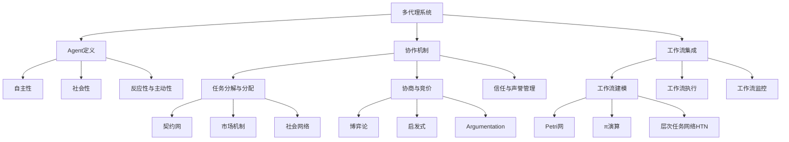

# AI人工智能代理工作流AI Agent WorkFlow：多代理系统的工作流整合方法

## 1. 背景介绍
### 1.1 人工智能的发展历程
#### 1.1.1 早期人工智能的探索
#### 1.1.2 机器学习的崛起
#### 1.1.3 深度学习的突破

### 1.2 多代理系统的兴起
#### 1.2.1 多代理系统的定义与特点  
#### 1.2.2 多代理系统的应用场景
#### 1.2.3 多代理系统面临的挑战

### 1.3 工作流技术的发展
#### 1.3.1 工作流的基本概念
#### 1.3.2 工作流管理系统的演变
#### 1.3.3 工作流技术在多代理系统中的应用

## 2. 核心概念与联系
### 2.1 AI代理的定义与特征
#### 2.1.1 AI代理的自主性
#### 2.1.2 AI代理的社会性
#### 2.1.3 AI代理的反应性与主动性

### 2.2 多代理系统的协作机制
#### 2.2.1 任务分解与分配
#### 2.2.2 协商与竞价
#### 2.2.3 信任与声誉管理

### 2.3 工作流在多代理系统中的作用
#### 2.3.1 工作流对多代理协作的支持
#### 2.3.2 工作流与多代理系统的集成方式
#### 2.3.3 基于工作流的多代理交互模型

## 3. 核心算法原理具体操作步骤
### 3.1 多代理任务分解与分配算法
#### 3.1.1 基于契约网的任务分解
#### 3.1.2 基于市场机制的任务分配
#### 3.1.3 基于社会网络的任务分配

### 3.2 多代理协商算法
#### 3.2.1 基于博弈论的协商策略 
#### 3.2.2 基于启发式的协商策略
#### 3.2.3 基于argumentation的协商策略

### 3.3 多代理工作流建模与执行算法
#### 3.3.1 基于Petri网的工作流建模
#### 3.3.2 基于π演算的工作流建模 
#### 3.3.3 分布式工作流执行算法

## 4. 数学模型和公式详细讲解举例说明
### 4.1 博弈论在多代理协商中的应用
#### 4.1.1 纳什均衡与最优响应策略
$$u_i(s_i^*,s_{-i}^*) \geq u_i(s_i,s_{-i}^*), \forall s_i \in S_i$$
#### 4.1.2 重复博弈与触发策略  
$$s_i^{t+1}=\begin{cases}
C, & \text{if } s_j^t=C \\
D, & \text{otherwise}
\end{cases}$$

### 4.2 Petri网工作流模型
#### 4.2.1 库所、变迁与流关系
$N=(P,T;F)$, 其中$P$为库所集合，$T$为变迁集合，$F \subseteq (P \times T) \cup (T \times P)$为流关系。
#### 4.2.2 状态方程与可达性分析
$M'=M+A^T \cdot \vec{u}$, 其中$M$为当前状态，$\vec{u}$为变迁发生向量，$A$为关联矩阵。

### 4.3 社会网络分析在任务分配中的应用 
#### 4.3.1 中心性指标
节点$i$的度中心性：$C_D(i)=\frac{d_i}{n-1}$, 其中$d_i$为节点$i$的度。
#### 4.3.2 结构洞理论
限制性指数：$C_i=\frac{\sum_{j}p_{ij}m_{ij}}{\sum_{j}m_{ij}}$, 其中$p_{ij}$为$i$通过$j$间接到达其他节点的概率，$m_{ij}$为$i$与$j$之间的交互强度。

## 5. 项目实践：代码实例和详细解释说明
### 5.1 基于JADE框架的多代理系统开发
#### 5.1.1 Agent类的定义与行为调度
```java
public class MyAgent extends Agent {
    protected void setup() {
        addBehaviour(new MyBehaviour());
    }
}
```
#### 5.1.2 消息传递与协议实现
```java
ACLMessage msg = new ACLMessage(ACLMessage.INFORM);
msg.addReceiver(new AID("AgentB", AID.ISLOCALNAME));
msg.setContent("Hello, AgentB!");
send(msg);
```

### 5.2 基于BPMN的工作流建模与执行
#### 5.2.1 使用Activiti进行工作流建模
```xml
<process id="myProcess" name="My Process">
  <startEvent id="start" />
  <sequenceFlow id="flow1" sourceRef="start" targetRef="task1" />
  <userTask id="task1" name="Task 1" />
  <sequenceFlow id="flow2" sourceRef="task1" targetRef="end" />
  <endEvent id="end" />
</process>
```
#### 5.2.2 工作流引擎的部署与执行
```java
Deployment deployment = repositoryService.createDeployment()
  .addClasspathResource("myProcess.bpmn20.xml")
  .deploy();

ProcessInstance processInstance = runtimeService.startProcessInstanceByKey("myProcess");
```

### 5.3 基于Repast的多代理仿真实验
#### 5.3.1 代理类的设计与实现
```java
public class MyAgent implements Steppable {
    public void step(SimState state) {
        // Agent behavior logic
    }
}
```
#### 5.3.2 仿真场景的构建与参数设置
```java
public class MyModel extends SimModelImpl {
    public void begin() {
        // Initialize the simulation environment
    }
    
    public void setup() {
        // Set up the agents and their interactions
    }
}
```

## 6. 实际应用场景
### 6.1 智能制造中的多代理协同
#### 6.1.1 生产计划与调度优化
#### 6.1.2 柔性车间的实时调度
#### 6.1.3 供应链的协同优化

### 6.2 智慧城市中的多代理服务
#### 6.2.1 交通流量的实时优化
#### 6.2.2 应急资源的动态调度
#### 6.2.3 城市能源的智能管理

### 6.3 电子商务中的多代理博弈
#### 6.3.1 动态定价与促销策略
#### 6.3.2 推荐系统的多代理优化
#### 6.3.3 供需匹配与谈判机制

## 7. 工具和资源推荐
### 7.1 多代理开发框架
#### 7.1.1 JADE (Java Agent Development Framework)
#### 7.1.2 JADEX (JADE eXtension) 
#### 7.1.3 Jason (AgentSpeak interpreter)

### 7.2 工作流管理系统
#### 7.2.1 Activiti
#### 7.2.2 jBPM
#### 7.2.3 Camunda

### 7.3 多代理仿真平台
#### 7.3.1 Repast (Recursive Porous Agent Simulation Toolkit)
#### 7.3.2 NetLogo
#### 7.3.3 MASON (Multi-Agent Simulator Of Neighborhoods)

## 8. 总结：未来发展趋势与挑战
### 8.1 多代理系统的智能化趋势
#### 8.1.1 深度强化学习在多代理决策中的应用
#### 8.1.2 基于知识图谱的多代理推理
#### 8.1.3 多代理情感计算与群体智能

### 8.2 工作流技术的柔性化发展
#### 8.2.1 自适应工作流与过程挖掘
#### 8.2.2 社会化工作流与众包机制
#### 8.2.3 区块链技术在工作流中的应用

### 8.3 多代理工作流的研究挑战
#### 8.3.1 大规模多代理系统的高效协同
#### 8.3.2 多代理工作流的形式化验证
#### 8.3.3 多代理工作流的安全与隐私保护

## 9. 附录：常见问题与解答
### 9.1 如何选择合适的多代理开发框架？
### 9.2 多代理系统的性能瓶颈有哪些？
### 9.3 工作流建模的常见误区有哪些？
### 9.4 多代理协商的收敛性如何保证？ 
### 9.5 多代理仿真实验的设计要点有哪些？



多代理系统的工作流整合涉及Agent定义、协作机制和工作流集成三个核心方面。在Agent定义中，需要考虑Agent的自主性、社会性以及反应性与主动性。协作机制包括任务分解与分配、协商与竞价以及信任与声誉管理。其中，任务分解与分配可以基于契约网、市场机制或社会网络；协商与竞价可以采用博弈论、启发式或Argumentation等方法。工作流集成主要涉及工作流建模、执行和监控，常见的建模方法有Petri网、π演算和层次任务网络HTN。

多代理工作流的研究与应用正在不断深入，未来在智能化、柔性化等方面还有很大的发展空间。同时，如何实现大规模多代理系统的高效协同、工作流的形式化验证以及安全隐私保护等也是亟待解决的挑战。

作者：禅与计算机程序设计艺术 / Zen and the Art of Computer Programming