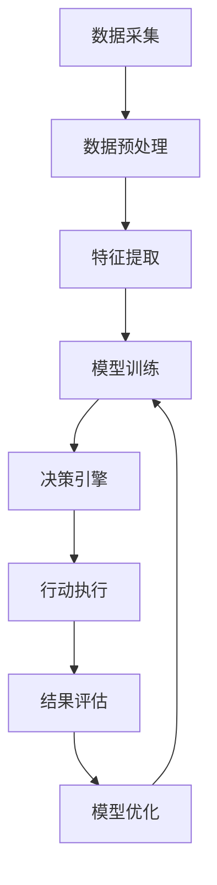

# AI人工智能代理工作流AI Agent WorkFlow：智能代理在医疗保健系统中的应用

## 1.背景介绍

### 1.1 医疗保健行业的挑战

医疗保健行业一直面临着诸多挑战,例如医疗资源分配不均、医疗成本不断上升、医疗差错率较高等问题。随着人口老龄化加剧和慢性病患病率上升,这些挑战将变得更加严峻。因此,迫切需要采用新技术来提高医疗保健系统的效率和质量。

### 1.2 人工智能在医疗保健中的应用

人工智能(AI)技术在医疗保健领域的应用备受关注,它有望为医疗保健系统带来革命性变革。AI可以通过处理大量数据、发现隐藏模式和提供个性化建议等方式,为医疗决策提供支持。其中,智能代理(Intelligent Agent)作为AI的一个重要分支,在医疗保健系统中扮演着越来越重要的角色。

### 1.3 智能代理简介

智能代理是一种自主的软件实体,能够感知环境、处理信息、做出决策并采取行动。它们可以代表人类用户执行各种任务,如数据收集、信息处理、决策支持等。在医疗保健领域,智能代理可以协助医生诊断疾病、制定治疗方案、管理患者数据等。

## 2.核心概念与联系

### 2.1 智能代理的核心概念

智能代理的核心概念包括:

1. **感知能力(Perception)**: 智能代理需要从环境中获取信息,如医疗数据、病历、检查报告等。

2. **决策能力(Decision Making)**: 基于感知到的信息,智能代理需要做出合理的决策,如诊断结果、治疗方案等。

3. **行动能力(Action)**: 根据决策结果,智能代理需要采取相应的行动,如向医生提供建议、调整治疗方案等。

4. **学习能力(Learning)**: 智能代理应该具备自主学习的能力,从历史数据和经验中不断优化自身的决策模型。

5. **交互能力(Interaction)**: 智能代理需要与人类用户(如医生、患者)进行有效交互,以获取信息并提供反馈。

### 2.2 智能代理在医疗保健系统中的作用

在医疗保健系统中,智能代理可以发挥以下作用:

1. **辅助诊断**: 通过分析患者症状、病历和检查结果,智能代理可以为医生提供诊断建议,提高诊断准确性。

2. **治疗方案优化**: 基于患者状况和最新医学知识,智能代理可以为医生推荐最佳治疗方案。

3. **患者管理**: 智能代理可以跟踪患者的治疗过程,提供个性化的用药指导、生活方式建议等。

4. **医疗资源优化**: 通过分析医疗资源利用情况,智能代理可以优化资源分配,提高效率。

5. **医疗知识更新**: 智能代理可以持续学习最新的医学研究成果,为医疗决策提供最新依据。

### 2.3 智能代理工作流程概述

智能代理在医疗保健系统中的工作流程通常包括以下步骤:

1. **数据采集**: 从各种来源(如电子病历、检查报告等)收集相关医疗数据。

2. **数据预处理**: 对收集到的原始数据进行清洗、标准化等预处理,以准备用于后续分析。

3. **特征提取**: 从预处理后的数据中提取有意义的特征,作为模型输入。

4. **模型训练**: 使用机器学习算法,基于特征数据训练决策模型。

5. **决策引擎**: 将新的输入数据输入到训练好的模型中,获得相应的决策结果。

6. **行动执行**: 根据决策结果采取相应的行动,如向医生提供建议、调整治疗方案等。

7. **结果评估**: 评估行动执行的结果,收集反馈数据。

8. **模型优化**: 基于反馈数据,持续优化决策模型,提高其准确性和效率。

该工作流程形成一个闭环,使智能代理能够不断学习和改进。

## 3.核心算法原理具体操作步骤  

智能代理在医疗保健系统中的应用通常涉及多种算法和技术,包括机器学习、自然语言处理、知识表示与推理等。下面将介绍一些核心算法原理及其具体操作步骤。

### 3.1 监督学习算法

监督学习算法是智能代理中最常用的机器学习方法之一。它利用已标注的训练数据(如已知疾病诊断结果)来训练模型,以预测新输入数据的标签(如新病例的疾病诊断)。常用的监督学习算法包括:

1. **逻辑回归(Logistic Regression)**: 用于二分类问题,如判断患者是否患有某种疾病。

2. **支持向量机(Support Vector Machine, SVM)**: 用于分类和回归问题,在医疗诊断中有广泛应用。

3. **决策树(Decision Tree)**: 通过构建决策树模型,可以直观地表示诊断逻辑。

4. **随机森林(Random Forest)**: 集成多个决策树,通常比单一决策树表现更好。

5. **神经网络(Neural Network)**: 深度学习模型,在医学影像分析等领域表现出色。

以逻辑回归为例,其具体操作步骤如下:

1. 收集标注好的训练数据,包括特征数据(如患者症状、检查结果等)和标签数据(是否患病)。

2. 将特征数据和标签数据分为训练集和测试集。

3. 使用梯度下降等优化算法,在训练集上训练逻辑回归模型的参数。

4. 在测试集上评估模型的性能,如准确率、精确率、召回率等指标。

5. 根据评估结果,调整模型超参数或特征工程,重复训练直至满足性能要求。

6. 将训练好的模型部署到智能代理的决策引擎中,用于新病例的诊断。

### 3.2 无监督学习算法

无监督学习算法则不需要标注的训练数据,它们可以从原始数据中发现隐藏的模式和结构。在医疗保健领域,无监督学习算法常用于以下任务:

1. **聚类(Clustering)**: 将相似的患者或疾病案例分组,有助于发现潜在的疾病亚型。常用算法包括K-Means、层次聚类等。

2. **异常检测(Anomaly Detection)**: 识别异常的医疗数据,如罕见疾病案例或医疗差错,有助于提高医疗质量。常用算法包括隔离森林、一类SVM等。

3. **降维(Dimensionality Reduction)**: 将高维度的医疗数据(如基因表达数据)投影到低维空间,有助于可视化和理解数据结构。常用算法包括主成分分析(PCA)、t-SNE等。

以K-Means聚类算法为例,其具体操作步骤如下:

1. 从原始数据(如患者病历数据)中提取特征,构建特征矩阵。

2. 选择聚类数量K,随机初始化K个聚类中心。

3. 计算每个数据点到各个聚类中心的距离,将其分配到最近的聚类中。

4. 重新计算每个聚类的中心点。

5. 重复步骤3和4,直至聚类结果收敛(数据点的聚类分配不再改变)。

6. 分析每个聚类的特征,尝试发现潜在的疾病亚型或模式。

### 3.3 强化学习算法

强化学习算法通过与环境的交互来学习,旨在找到可以最大化累积奖励的策略。在医疗保健领域,强化学习可用于以下任务:

1. **个性化治疗方案优化**: 根据患者的具体情况,动态调整治疗方案以获得最佳疗效。

2. **医疗资源调度优化**: 合理分配有限的医疗资源(如医生、病床等),以最大化医疗服务质量。

常用的强化学习算法包括Q-Learning、策略梯度(Policy Gradient)等。以Q-Learning为例,其具体操作步骤如下:

1. 构建环境模型,定义状态空间、动作空间和奖励函数。例如,状态可以表示患者的当前健康状况,动作可以表示不同的治疗方案,奖励可以根据疗效来设置。

2. 初始化Q函数(状态-动作值函数),用于估计在某个状态下采取某个动作所能获得的长期累积奖励。

3. 在每个时间步,观察当前状态,根据Q函数选择一个动作执行。

4. 观察执行该动作后的新状态和获得的即时奖励,更新Q函数。

5. 重复步骤3和4,直至convergence达到预期的策略。

6. 将学习到的最优策略应用于实际的治疗决策中。

### 3.4 自然语言处理算法

自然语言处理(Natural Language Processing, NLP)算法在智能代理中发挥着重要作用,用于处理医疗文本数据(如病历、医嘱等)。常用的NLP算法包括:

1. **命名实体识别(Named Entity Recognition, NER)**: 从文本中识别出疾病名称、症状、检查项目等实体。

2. **关系提取(Relation Extraction)**: 从文本中提取实体之间的关系,如"症状-疾病"、"疾病-并发症"等关系。

3. **情感分析(Sentiment Analysis)**: 分析文本中的情感倾向,如对某种治疗方案的满意度。

4. **文本摘要(Text Summarization)**: 自动生成文本的摘要,如对病历进行摘要。

以命名实体识别为例,其具体操作步骤如下:

1. 收集标注好的训练语料,包括原始文本和标注的实体类型(如疾病、症状等)。

2. 对文本进行分词、词性标注等预处理。

3. 使用序列标注算法(如条件随机场CRF、BiLSTM-CRF等)在训练语料上训练NER模型。

4. 在测试集上评估模型的性能,如F1分数等指标。

5. 根据评估结果,调整模型超参数或特征工程,重复训练直至满足性能要求。

6. 将训练好的NER模型集成到智能代理中,用于从医疗文本中提取关键实体。

### 3.5 知识表示与推理

智能代理还需要具备知识表示与推理的能力,以利用已有的医学知识进行决策。常用的知识表示方法包括:

1. **本体论(Ontology)**: 使用概念、实体和关系来形式化表示医学领域知识。

2. **规则库(Rule Base)**: 使用IF-THEN规则来表示医学知识和决策逻辑。

3. **概率图模型(Probabilistic Graphical Model)**: 使用贝叶斯网络或马尔可夫网络来表示不确定性知识。

基于表示的知识,智能代理可以使用推理算法(如本体推理、规则推理、概率推理等)进行决策。以基于规则的推理为例,其具体操作步骤如下:

1. 构建规则库,将医学知识和决策逻辑形式化为IF-THEN规则。例如,"IF 患者有发烧、咳嗽和胸痛症状,THEN 可能患有肺炎"。

2. 收集患者的症状、检查结果等数据作为事实输入。

3. 使用前向链推理(Forward Chaining)或后向链推理(Backward Chaining)等算法,在规则库中进行推理。

4. 根据推理结果,得出诊断结论或治疗建议。

5. 将推理过程和结果记录下来,供医生参考和审核。

6. 根据实际反馈,持续优化和完善规则库。

通过将机器学习、自然语言处理和知识推理等技术相结合,智能代理可以为医疗保健系统提供