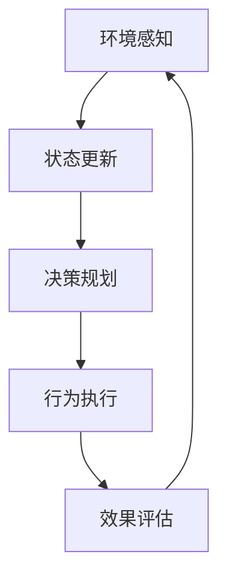
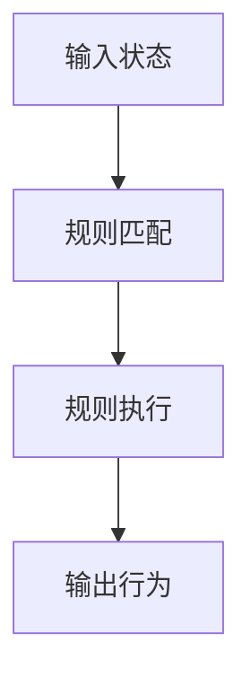
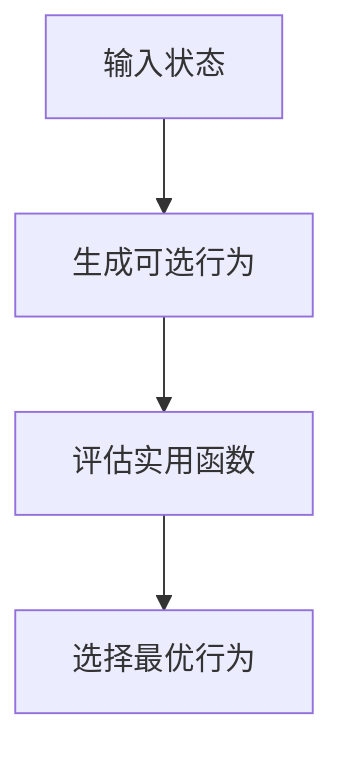
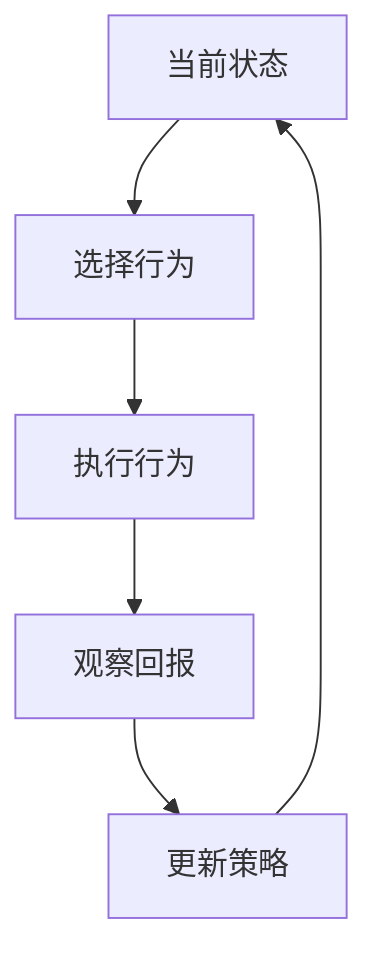
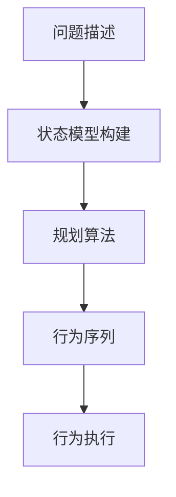

# AI人工智能代理工作流AI Agent WorkFlow：智能代理在智能家居中的实践

## 1.背景介绍

### 1.1 智能家居的兴起

随着物联网、人工智能和大数据等技术的快速发展,智能家居正在走向普及。智能家居系统通过将各种智能设备连接到家庭网络,实现对家居环境的自动化控制和智能管理,为居住者带来了极大的便利。

### 1.2 智能家居系统的挑战

然而,由于智能家居涉及众多异构设备和复杂的用户需求,给家居系统的设计和开发带来了巨大挑战:

- **设备异构性**:不同厂商的设备使用不同的通信协议和接口,导致集成困难。
- **用户需求复杂**:用户对家居自动化有多样化的需求,系统必须具备足够的灵活性。
- **实时响应性**:对于某些应用场景(如安防),系统需要实时响应并快速作出反应。

### 1.3 智能代理的作用

为解决上述挑战,智能代理(Intelligent Agent)应运而生。智能代理是一种基于人工智能技术的软件实体,能够自主感知环境、分析决策并执行相应操作,在智能家居系统中扮演着关键角色。

## 2.核心概念与联系

### 2.1 智能代理的定义

智能代理是一种能够感知环境、保持持续运行、自主决策并对环境实施操作的软件实体。它具备以下几个关键特征:

- **自主性(Autonomy)**: 能够在无需人工干预的情况下自主运行
- **社会能力(Social Ability)**: 能够与人类及其他代理进行交互
- **反应性(Reactivity)**: 能够及时感知环境变化并作出响应
- **主动性(Pro-activeness)**: 不仅被动响应,还能够主动地以目标导向的方式采取行动

### 2.2 智能代理工作流程

智能代理通常遵循以下基本工作流程:



1. **环境感知**: 通过传感器收集环境数据,获取当前状态信息
2. **状态更新**: 将感知到的数据与代理内部状态进行融合,更新代理的世界模型
3. **决策规划**: 根据目标和当前状态,运行决策算法制定行动计划
4. **行为执行**: 通过执行器对环境实施相应操作
5. **效果评估**: 监测行为执行的效果,并将反馈结果用于下一轮决策

### 2.3 智能家居中的智能代理

在智能家居系统中,智能代理可以扮演多种角色:

- **设备代理**: 代表并控制特定的家居设备,实现设备的统一抽象
- **用户代理**: 学习和理解用户的喜好和需求,为用户提供个性化的服务
- **任务代理**: 负责协调和管理复杂的家居自动化任务流程
- **安全代理**: 负责家居安全监控,及时发现和处理安全威胁

通过智能代理的引入,智能家居系统可以显著提高灵活性、可扩展性和智能化水平。

## 3.核心算法原理具体操作步骤

智能代理的核心是其决策引擎,即根据当前状态选择最优行为的算法。常见的决策算法包括:

### 3.1 基于规则的决策

规则引擎是最简单的决策方式,通过事先定义一系列规则,当满足特定条件时执行相应的动作。其工作流程如下:



1. **输入状态**: 获取代理当前的状态信息
2. **规则匹配**: 在规则库中查找与当前状态相匹配的规则
3. **规则执行**: 对匹配的规则执行其对应的动作
4. **输出行为**: 将执行结果输出为代理的行为

规则引擎简单直观,但缺乏学习能力,需要人工维护规则库。

### 3.2 基于实用函数的决策

实用函数(Utility Function)是一种评估状态或行为价值的函数,代理将选择能够最大化实用函数值的行为。其算法流程为:



1. **输入状态**: 获取代理当前的状态信息
2. **生成可选行为**: 根据状态生成所有可能的备选行为
3. **评估实用函数**: 计算每个行为对应的实用函数值
4. **选择最优行为**: 选择能够最大化实用函数值的行为作为输出

实用函数的设计是关键,需要考虑多种因素如成本、风险、偏好等。

### 3.3 基于强化学习的决策

强化学习是一种通过探索和奖惩机制自主学习的方法,代理将根据经验调整决策策略,以获得最大的长期回报。其基本原理如下:



1. **当前状态**: 获取代理当前的状态信息
2. **选择行为**: 根据当前策略从可选行为中选择一个行为
3. **执行行为**: 在环境中执行所选的行为
4. **观察回报**: 观察行为执行后环境的反馈回报
5. **更新策略**: 根据回报更新决策策略,以获得更大的长期回报

强化学习算法包括 Q-Learning、Deep Q-Network(DQN)等,可以自主学习最优决策策略。

### 3.4 基于规划的决策

对于一些需要长期规划的复杂任务,基于规划的方法更为适用。规划算法通过构建状态转移模型,搜索出能够达成目标的一系列行为序列。



1. **问题描述**: 描述当前状态、目标状态和可执行操作
2. **状态模型构建**: 根据描述构建状态转移模型
3. **规划算法**: 在状态模型上运行规划算法搜索行为序列
4. **行为序列**: 输出能够达成目标的行为序列
5. **行为执行**: 按序执行行为序列中的每个行为

常见的规划算法有 A*、STRIPS 等,适用于有明确目标的任务规划场景。

## 4.数学模型和公式详细讲解举例说明

智能代理中的数学模型主要用于表示状态、行为和决策过程,为算法提供理论基础。

### 4.1 马尔可夫决策过程 (MDP)

马尔可夫决策过程(Markov Decision Process, MDP)是形式化描述决策过程的数学模型,广泛应用于强化学习和规划算法中。

一个 MDP 可以用四元组 $\langle S, A, P, R\rangle$ 来表示:

- $S$ 是有限的状态集合
- $A$ 是有限的行为集合
- $P(s'|s,a)$ 是状态转移概率,表示在状态 $s$ 执行行为 $a$ 后转移到状态 $s'$ 的概率
- $R(s,a)$ 是回报函数,表示在状态 $s$ 执行行为 $a$ 后获得的即时回报

代理的目标是找到一个策略 $\pi: S \rightarrow A$,使得期望的累积回报最大:

$$
\max_\pi \mathbb{E}\left[ \sum_{t=0}^\infty \gamma^t R(s_t, a_t) \right]
$$

其中 $\gamma \in [0, 1)$ 是折现因子,用于权衡即时回报和长期回报。

### 4.2 Q-Learning 算法

Q-Learning 是一种无模型的强化学习算法,通过不断探索和更新 Q 值函数来学习最优策略。

Q 值函数 $Q(s,a)$ 表示在状态 $s$ 执行行为 $a$ 后的期望累积回报:

$$
Q(s,a) = \mathbb{E}\left[ \sum_{t=0}^\infty \gamma^t R(s_t, a_t) \mid s_0=s, a_0=a \right]
$$

Q-Learning 算法通过不断更新 Q 值函数,最终收敛到最优 Q 值函数 $Q^*(s,a)$。更新规则如下:

$$
Q(s_t, a_t) \leftarrow Q(s_t, a_t) + \alpha \left[ r_t + \gamma \max_{a'} Q(s_{t+1}, a') - Q(s_t, a_t) \right]
$$

其中 $\alpha$ 是学习率,控制更新的幅度。

基于最优 Q 值函数,代理可以选择在每个状态下期望回报最大的行为作为最优策略:

$$
\pi^*(s) = \arg\max_a Q^*(s, a)
$$

### 4.3 深度 Q 网络 (DQN)

传统的 Q-Learning 算法在状态空间较大时会受到维数灾难的影响。深度 Q 网络(Deep Q-Network, DQN)通过使用深度神经网络来拟合 Q 值函数,从而能够处理高维状态。

DQN 的网络结构通常由卷积层和全连接层组成,输入为状态 $s$,输出为每个行为对应的 Q 值 $Q(s, a_1), Q(s, a_2), \cdots, Q(s, a_n)$。网络的损失函数为:

$$
L = \mathbb{E}_{(s,a,r,s')\sim D}\left[ \left( r + \gamma \max_{a'} Q(s', a'; \theta^-) - Q(s, a; \theta) \right)^2 \right]
$$

其中 $D$ 是经验回放池,用于存储过往的状态转移样本 $(s,a,r,s')$;$\theta^-$ 表示目标网络的参数,用于估计 $\max_{a'} Q(s', a')$ 以提高训练稳定性。

通过最小化损失函数,DQN 可以逐步学习拟合最优的 Q 值函数。

## 5.项目实践:代码实例和详细解释说明

为了更好地理解智能代理的工作原理,我们将通过一个简单的智能家居控制示例来演示基于规则的决策引擎的实现。

假设我们的智能家居系统包含以下设备:

- 灯光控制
- 温度控制
- 门窗控制

我们将使用 Python 编写一个基于规则的智能代理,根据用户的需求和环境状态控制这些设备。

### 5.1 定义规则

首先,我们需要定义一系列规则,描述在特定条件下应该执行的操作。这些规则将构成我们的规则库。

```python
rules = [
    {
        "condition": lambda env: env.user_status == "home" and env.time_of_day == "evening",
        "action": lambda env: env.turn_on_lights()
    },
    {
        "condition": lambda env: env.user_status == "away" and env.time_of_day == "evening",
        "action": lambda env: env.turn_off_lights()
    },
    {
        "condition": lambda env: env.temperature > 25,
        "action": lambda env: env.decrease_temperature()
    },
    {
        "condition": lambda env: env.temperature < 20,
        "action": lambda env: env.increase_temperature()
    },
    {
        "condition": lambda env: env.user_status == "away" and env.time_of_day == "daytime",
        "action": lambda env: env.close_windows()
    }
]
```

每个规则由一个条件函数和一个动作函数组成。条件函数根据当前环境状态返回一个布尔值,指示该规则是否应该被触发。动作函数则描述了在该规则被触发时应该执行的操作。

### 5.2 实现规则引擎

接下来,我们将实现规则引擎,用于匹配和执行规则。

```python
class RuleEngine:
    def __init__(self, rules):
        self.rules = rules

    def run(self, env):
        for rule in self.rules:
            if rule["condition"](env):
                rule["action"](env)
```

`RuleEngine` 类初始化时接受一个规则