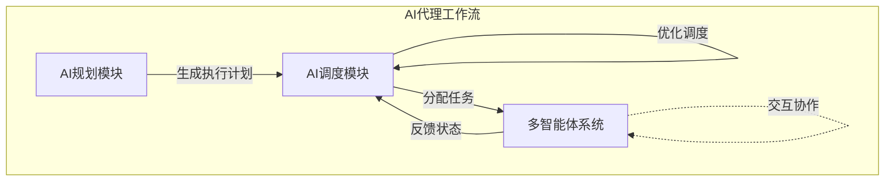

# AI人工智能代理工作流AI Agent WorkFlow：智能代理在航空领域系统中的应用

## 1.背景介绍

随着人工智能(AI)技术的不断发展和应用范围的扩大,AI代理已经逐渐渗透到各个领域,包括航空业。在航空领域,AI代理可以应用于各种场景,如航班管理、机场运营、机组调度、客户服务等,以提高效率、降低成本并优化整个系统的运行。

航空公司和机场运营商面临着复杂的运营挑战,需要协调多个部门和系统的工作流程。传统的人工操作和决策过程往往效率低下、容易出错,无法及时应对不断变化的环境。因此,引入AI代理工作流(AI Agent Workflow)可以显著提升航空系统的智能化水平,实现自动化决策和流程优化。

### 1.1 AI代理的概念

AI代理是一种基于人工智能技术构建的软件实体,能够感知环境、处理信息、做出决策并执行相应的行为。AI代理通常具备以下几个关键特征:

- 自主性(Autonomy):能够独立做出决策和行动,而无需人工干预。
- 反应性(Reactivity):能够及时感知环境变化并做出相应反应。
- 主动性(Proactiveness):不仅被动响应环境,还能主动采取行动以实现目标。
- 社会能力(Social Ability):能够与其他代理或人类进行交互和协作。

### 1.2 AI代理工作流概述

AI代理工作流(AI Agent Workflow)是指由多个AI代理协同工作、按照预定义的流程执行任务的系统。在这种工作流中,每个AI代理负责特定的功能或决策,它们相互协作、交换信息,共同完成复杂的业务流程。

AI代理工作流的优势在于:

- 自动化程度高,减少人工干预
- 决策更加智能化、个性化
- 流程更加高效、可靠
- 易于扩展和优化

因此,AI代理工作流非常适合应用于航空领域这种复杂、动态的环境中。

## 2.核心概念与联系

在构建AI代理工作流系统时,需要理解和掌握以下几个核心概念及其相互关系。

### 2.1 AI规划(AI Planning)

AI规划是人工智能领域的一个重要分支,旨在为智能体(Agent)设计一系列行动以实现特定目标。在AI代理工作流中,规划模块负责生成执行计划,指导各个代理的行为。

AI规划通常包括以下几个步骤:

1. 状态空间建模(State Space Modeling):将问题形式化为一组状态和转换规则。
2. 目标状态确定(Goal State Specification):明确期望达到的目标状态。
3. 路径搜索(Path Finding):在状态空间中搜索从初始状态到目标状态的路径。
4. 计划生成(Plan Generation):根据搜索结果生成一系列行动序列作为执行计划。

常用的AI规划算法有:

- 状态空间搜索算法(State-Space Search Algorithms),如A*、IDA*等。
- 启发式搜索规划(Heuristic Search Planning),如FF、LAMA等。
- 时序规划(Temporal Planning),如OPTIC、TPSHE等。

### 2.2 AI调度(AI Scheduling)

AI调度是指利用人工智能技术对有限资源进行合理分配和优化,以满足一定的约束条件和目标。在航空领域,AI调度可应用于机组调度、航班调度、机场资源调度等场景。

AI调度通常包括以下几个步骤:

1. 资源建模(Resource Modeling):对可用资源及其约束条件进行形式化描述。
2. 任务建模(Task Modeling):对需要执行的任务及其依赖关系进行形式化描述。 
3. 优化求解(Optimization Solving):采用算法寻找满足所有约束条件的最优调度方案。
4. 调度执行(Schedule Execution):将优化结果转化为可执行的调度计划并加以实施。

常用的AI调度算法有:

- 约束编程(Constraint Programming),如IBM ILOG等。
- 启发式搜索(Heuristic Search),如模拟退火(Simulated Annealing)、禁忌搜索(Tabu Search)等。
- 进化算法(Evolutionary Algorithms),如遗传算法(Genetic Algorithms)、蚁群算法(Ant Colony Optimization)等。

### 2.3 多智能体系统(Multi-Agent System)

多智能体系统(Multi-Agent System, MAS)是由多个智能体(Agent)组成的分布式人工智能系统。在这种系统中,智能体可以是不同的AI代理,它们通过协作来完成复杂的任务。

多智能体系统具有以下几个关键特征:

- 分布性(Distribution):系统由多个独立的智能体组成,分布在不同的节点上。
- 开放性(Openness):系统可以动态地加入或移除智能体。
- 协作性(Collaboration):智能体之间需要相互协作以完成共同目标。
- 自主性(Autonomy):每个智能体都可以独立做出决策和行动。

在AI代理工作流中,多智能体系统可以提供以下优势:

- 提高系统的鲁棒性和容错能力
- 实现任务的并行执行,提高效率
- 支持系统的动态扩展和演化
- 智能体可以专注于不同的子任务,提高决策质量

### 2.4 AI代理工作流架构

将上述核心概念结合起来,我们可以构建一种通用的AI代理工作流架构,如下图所示:

在这个架构中:

1. **AI规划模块**根据目标状态和环境约束,生成初步的执行计划。
2. **AI调度模块**接收执行计划,基于可用资源对任务进行调度和分配,将任务分配给多个AI代理。
3. **多智能体系统**由多个AI代理组成,它们执行分配的任务,并相互协作以完成整个工作流。
4. AI代理将执行状态反馈给调度模块,调度模块根据实时状态进行动态调整和优化。
5. 整个过程是一个闭环,通过反馈和优化不断改进执行效果。

该架构具有模块化和可扩展性,可以根据不同应用场景进行定制和优化。

## 3.核心算法原理具体操作步骤

在AI代理工作流系统中,核心算法主要包括AI规划算法和AI调度算法。下面将分别介绍它们的具体原理和操作步骤。

### 3.1 AI规划算法

AI规划算法的目标是为智能体(Agent)生成一系列行动,从初始状态达到期望的目标状态。常见的AI规划算法包括:

#### 3.1.1 A*算法

A*算法是一种广泛使用的启发式搜索算法,它在状态空间中寻找从初始状态到目标状态的最优路径。算法步骤如下:

1. 定义状态空间模型,包括初始状态、目标状态、可执行操作和状态转移函数。
2. 定义启发式函数 $h(n)$ ,估计从当前状态 $n$ 到目标状态的代价。
3. 初始化开放列表(Open List)和闭环列表(Closed List)为空集。将初始状态加入开放列表。
4. 从开放列表中取出代价最小的状态节点 $n$ ,将其加入闭环列表。
5. 如果 $n$ 是目标状态,则搜索结束,返回从初始状态到 $n$ 的路径作为解决方案。
6. 否则,对于每个可从 $n$ 执行的操作 $a$ ,生成新状态 $n'$,计算 $n'$ 的评估函数值 $f(n') = g(n') + h(n')$ ,其中 $g(n')$ 是从初始状态到 $n'$ 的实际代价。
7. 将所有新生成的状态 $n'$ 加入开放列表,回到步骤4继续搜索。

A*算法的关键在于合理设计启发式函数 $h(n)$ ,使其不会过度低估实际代价,从而保证算法的完备性和最优性。

#### 3.1.2 FF规划算法

FF(Fast Forward)规划算法是一种著名的启发式搜索规划算法,它采用了一种称为"放松规划图"(Relaxed Planning Graph)的数据结构来估计状态到目标的距离,从而指导搜索过程。算法步骤如下:

1. 构建初始的放松规划图,包括初始状态层和目标状态层。
2. 在每一层,交替构建操作层和状态层,直到达到目标状态层或者图无法继续扩展。
3. 从目标状态层出发,通过回溯寻找支持目标状态的操作序列。
4. 将找到的操作序列作为初始解,并进行局部搜索以优化解决方案。

FF算法的关键在于放松规划图的构建方式,它忽略了操作之间的互斥关系,从而降低了估计的复杂性,提高了算法的效率。但这也可能导致估计值过于乐观,影响算法的完备性和最优性。

#### 3.1.3 时序规划算法

对于涉及时间约束的规划问题,需要使用时序规划算法。常见的时序规划算法包括OPTIC和TPSHE等。以OPTIC算法为例,其步骤如下:

1. 构建初始的时序规划网络(Temporal Planning Network, TPN),包括初始状态节点和目标状态节点。
2. 在TPN中交替添加操作节点和状态节点,并根据时间约束更新节点之间的时间边界。
3. 使用启发式函数估计每个状态节点到目标状态的最短时间距离。
4. 基于时间距离估计值,使用最佳优先搜索策略探索TPN,寻找满足所有时间约束的最优解。
5. 如果找到解,则将操作序列作为解决方案输出;否则,报告无解。

时序规划算法的优势在于能够处理包含时间约束的复杂问题,但计算代价也相对较高。

### 3.2 AI调度算法

AI调度算法的目标是根据任务需求和资源约束,生成一个满足所有约束的最优调度方案。常见的AI调度算法包括:

#### 3.2.1 约束编程算法

约束编程(Constraint Programming, CP)是一种基于约束求解的范式,适用于各种组合优化问题。在AI调度中,CP算法的步骤如下:

1. 对可用资源及其约束条件进行建模,构建资源约束模型。
2. 对需要执行的任务及其依赖关系进行建模,构建任务约束模型。
3. 将资源约束模型和任务约束模型相结合,形成完整的约束优化问题模型。
4. 使用约束传播和搜索算法求解该优化问题,找到满足所有约束的最优解。
5. 将求解结果转化为可执行的调度计划。

CP算法的优势在于能够精确地建模和处理复杂的约束条件,但求解效率较低,适用于中小规模的调度问题。

#### 3.2.2 启发式搜索算法

对于大规模的调度问题,通常采用启发式搜索算法,如模拟退火(Simulated Annealing)、禁忌搜索(Tabu Search)等。以模拟退火算法为例,步骤如下:

1. 从一个初始的可行解出发,计算其目标函数值(如总成本、总时延等)。
2. 通过小扰动生成新的解,计算新解的目标函数值。
3. 如果新解的目标函数值更优,则接受新解;否则,以一定的概率接受新解(模拟退火过程)。
4. 重复步骤2和3,直到满足终止条件(如最大迭代次数、目标函数值等)。
5. 将最优解转化为调度计划输出。

启发式搜索算法的优势在于计算效率较高,能够处理大规模的组合优化问题,但无法保证找到全局最优解。

#### 3.2.3 进化算法

进化算法是另一类常用的组合优化算法,如遗传算法(Genetic Algorithms)