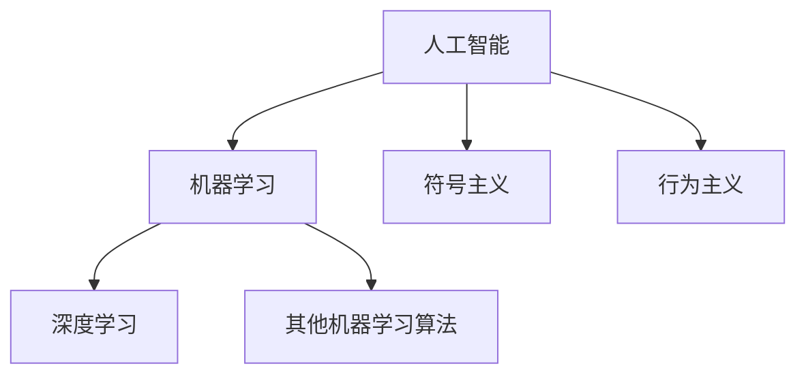

# AI人工智能核心算法原理与代码实例讲解：模型构建

## 1. 背景介绍
### 1.1 人工智能的发展历程
#### 1.1.1 人工智能的起源与早期发展
#### 1.1.2 人工智能的黄金时期
#### 1.1.3 人工智能的低谷期与复兴

### 1.2 人工智能的应用现状
#### 1.2.1 人工智能在各行各业的应用
#### 1.2.2 人工智能的商业价值
#### 1.2.3 人工智能面临的挑战与机遇

### 1.3 人工智能算法概述
#### 1.3.1 机器学习算法
#### 1.3.2 深度学习算法
#### 1.3.3 强化学习算法

人工智能(Artificial Intelligence, AI)是计算机科学的一个重要分支,其目标是让计算机具备类似人类的智能,能够自主地学习、推理、决策和解决问题。人工智能的发展可以追溯到20世纪50年代,经历了起起伏伏的过程。早期的人工智能研究主要集中在符号主义和专家系统上,取得了一定的成果,但也遇到了瓶颈。20世纪80年代到90年代被称为人工智能的"黄金时期",这一时期涌现出了大量的人工智能应用,如语音识别、计算机视觉等。然而,由于当时计算能力的限制和算法的局限性,人工智能的发展在20世纪末期陷入低谷。

进入21世纪以来,得益于计算机硬件性能的飞速提升、大数据时代的来临以及深度学习算法的突破,人工智能迎来了新的春天。如今,人工智能已经广泛应用于各行各业,如金融、医疗、教育、交通、制造等领域,为社会发展和经济增长带来了巨大的推动力。据预测,到2030年,人工智能将为全球GDP贡献15.7万亿美元,其中中国占7万亿美元。与此同时,人工智能的发展也面临着诸多挑战,如伦理道德问题、就业冲击、安全隐患等,需要各界共同努力加以应对。

人工智能的核心是算法,主要包括机器学习、深度学习和强化学习三大类。机器学习是人工智能的一个重要分支,其基本思想是通过对大量数据的学习,让计算机具备自动改进性能的能力。常见的机器学习算法有决策树、支持向量机、贝叶斯分类器等。深度学习是机器学习的一个子集,其特点是利用多层神经网络对数据进行建模,能够自动学习数据的内在特征和规律。目前主流的深度学习算法包括卷积神经网络(CNN)、循环神经网络(RNN)、生成对抗网络(GAN)等。强化学习则是一种无需人工标注数据,而是通过智能体与环境的交互来学习最优策略的算法,在智能控制、机器人等领域有广泛应用。

## 2. 核心概念与联系
### 2.1 人工智能的定义与分类
#### 2.1.1 人工智能的定义
#### 2.1.2 人工智能的分类

### 2.2 机器学习的概念与分类 
#### 2.2.1 机器学习的定义
#### 2.2.2 机器学习的分类
##### 2.2.2.1 监督学习
##### 2.2.2.2 无监督学习
##### 2.2.2.3 半监督学习
##### 2.2.2.4 强化学习

### 2.3 深度学习的概念与分类
#### 2.3.1 深度学习的定义
#### 2.3.2 深度学习的分类
##### 2.3.2.1 前馈神经网络
##### 2.3.2.2 卷积神经网络
##### 2.3.2.3 循环神经网络
##### 2.3.2.4 生成对抗网络

### 2.4 人工智能、机器学习和深度学习的关系

人工智能是一个宏大的概念,泛指研究、开发用于模拟、延伸和扩展人的智能的理论、方法、技术及应用系统的一门新的技术科学。根据实现方式的不同,人工智能可以分为符号主义、连接主义和行为主义三大流派。其中,符号主义侧重于利用符号推理来实现智能,代表算法有专家系统等;连接主义则利用神经网络等模型来模拟大脑的结构和功能;行为主义强调感知-动作映射,通过智能体与环境的交互来实现智能行为。

机器学习是实现人工智能的一种方法,其本质是通过学习算法从数据中自动分析获得规律,并利用规律对未知数据进行预测。根据训练数据是否拥有标签,机器学习可以分为监督学习、无监督学习、半监督学习和强化学习四大类。监督学习的训练数据有明确的标签,代表算法有决策树、支持向量机等;无监督学习的训练数据没有标签,代表算法有聚类、降维等;半监督学习介于二者之间,部分数据有标签,部分没有;强化学习通过智能体与环境的交互获得奖励或惩罚,从而学习最优策略。

深度学习是机器学习的一个重要分支,其特点是利用多层神经网络对数据进行建模,能够学习数据的多层次抽象特征表示。常见的深度学习模型有前馈神经网络、卷积神经网络、循环神经网络和生成对抗网络等。前馈神经网络是最基本的神经网络模型,主要用于分类和回归任务;卷积神经网络在图像识别领域取得了突破性进展,引领了深度学习的发展;循环神经网络擅长处理序列数据,在语音识别、机器翻译等领域表现出色;生成对抗网络由生成器和判别器组成,能够生成逼真的图像和视频。

综上所述,人工智能、机器学习和深度学习三者关系紧密但又各有侧重。人工智能是一个宏大的概念,机器学习和深度学习都是实现人工智能的重要方法。机器学习侧重于利用数据学习获得规律,深度学习则利用神经网络等模型挖掘数据的深层特征。三者协同发展,共同推动了人工智能领域的飞速进步。

## 3. 核心算法原理具体操作步骤
### 3.1 前馈神经网络
#### 3.1.1 感知机
#### 3.1.2 多层感知机
#### 3.1.3 反向传播算法

### 3.2 卷积神经网络
#### 3.2.1 卷积层
#### 3.2.2 池化层
#### 3.2.3 全连接层

### 3.3 循环神经网络
#### 3.3.1 基本RNN
#### 3.3.2 LSTM
#### 3.3.3 GRU

### 3.4 生成对抗网络
#### 3.4.1 生成器
#### 3.4.2 判别器
#### 3.4.3 对抗训练

前馈神经网络(Feedforward Neural Network)是最基本的神经网络模型,也称为多层感知机(Multi-Layer Perceptron, MLP)。其基本结构包括输入层、隐藏层和输出层,各层之间通过权重矩阵完全连接,信息沿一个方向从输入层向输出层传播。前馈神经网络的训练过程主要分为前向传播和反向传播两个阶段。在前向传播阶段,输入信号沿网络向前传播,逐层计算各神经元的输出,直到产生整个网络的实际输出;在反向传播阶段,将实际输出与期望输出之间的误差沿网络反向传播,并利用梯度下降法更新各层权重,使网络输出尽可能接近期望输出。反复迭代上述过程,直到网络收敛或达到预设的训练次数。

卷积神经网络(Convolutional Neural Network, CNN)是一种结构类似于人类视觉系统的深度学习模型,主要用于图像识别等领域。CNN的基本组件包括卷积层(Convolutional Layer)、池化层(Pooling Layer)和全连接层(Fully Connected Layer)。卷积层通过滑动窗口对图像进行局部特征提取,得到多个特征图;池化层对特征图进行下采样,既减少了参数数量,又提高了特征的鲁棒性;全连接层将提取到的特征展平并输入到普通的神经网络中,用于图像分类等任务。CNN通过局部连接和权重共享,大大减少了网络参数数量,使得训练更加高效。著名的CNN模型有LeNet、AlexNet、VGGNet、GoogLeNet、ResNet等。

循环神经网络(Recurrent Neural Network, RNN)是一种适合处理序列数据的神经网络模型。不同于前馈神经网络,RNN引入了时间维度,在每个时间步都有一个隐藏状态,用于存储之前时间步的信息。理论上,RNN能够处理任意长度的序列,但在实践中,由于梯度消失和梯度爆炸问题,其难以捕捉长期依赖关系。为了解决这一问题,研究者提出了长短期记忆网络(Long Short-Term Memory, LSTM)和门控循环单元(Gated Recurrent Unit, GRU)等改进模型。LSTM引入了输入门、遗忘门和输出门三种门控机制,能够选择性地记忆和遗忘信息;GRU则将输入门和遗忘门合并为更新门,结构更加简洁。RNN广泛应用于语音识别、机器翻译、情感分析等领域。

生成对抗网络(Generative Adversarial Network, GAN)由生成器(Generator)和判别器(Discriminator)组成,两者相互博弈,最终达到纳什均衡。生成器接收随机噪声作为输入,并生成与真实数据分布尽可能接近的样本;判别器则接收生成器生成的样本和真实样本,并尝试区分它们。生成器的目标是生成足以欺骗判别器的样本,判别器的目标是尽可能准确地判别样本的真伪。两者在训练过程中不断博弈,最终达到均衡状态,此时生成器生成的样本与真实样本难以区分。GAN能够生成逼真的图像、视频、文本等,在图像翻译、图像补全、风格迁移等任务中取得了瞩目成果。著名的GAN变体有CGAN、DCGAN、Pix2Pix、CycleGAN等。

## 4. 数学模型和公式详细讲解举例说明
### 4.1 前馈神经网络的数学模型
#### 4.1.1 感知机模型
#### 4.1.2 多层感知机模型
#### 4.1.3 反向传播算法的数学推导

### 4.2 卷积神经网络的数学模型
#### 4.2.1 卷积运算的数学定义
#### 4.2.2 池化运算的数学定义
#### 4.2.3 卷积神经网络前向传播过程的数学表示

### 4.3 循环神经网络的数学模型
#### 4.3.1 基本RNN的数学表示
#### 4.3.2 LSTM的数学表示
#### 4.3.3 GRU的数学表示

### 4.4 生成对抗网络的数学模型
#### 4.4.1 生成器和判别器的数学定义
#### 4.4.2 GAN的目标函数和优化过程

前馈神经网络的数学模型可以用以下公式表示:

$$
\begin{aligned}
\mathbf{z}^{(l)} &= \mathbf{W}^{(l)}\mathbf{a}^{(l-1)} + \mathbf{b}^{(l)} \\
\mathbf{a}^{(l)} &= g^{(l)}(\mathbf{z}^{(l)})
\end{aligned}
$$

其中,$\mathbf{z}^{(l)}$表示第$l$层的加权输入,$\mathbf{W}^{(l)}$和$\mathbf{b}^{(l)}$分别表示第$l$层的权重矩阵和偏置向量,$\mathbf{a}^{(l-1)}$表示第$l-1$层的激活值,$g^{(l)}$表示第$l$层的激活函数。