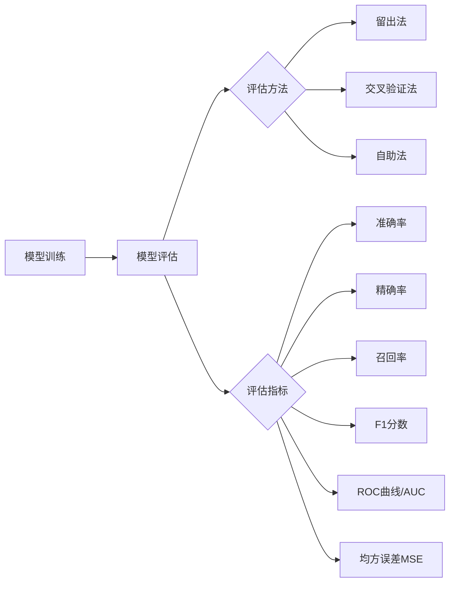

# AI人工智能核心算法原理与代码实例讲解：模型评估

## 1. 背景介绍

### 1.1 模型评估的重要性

在机器学习和人工智能领域,模型评估是一个至关重要的环节。它可以帮助我们了解模型的性能表现,发现模型的优缺点,并为模型的改进和优化提供依据。只有通过严格、全面的评估,我们才能确保模型在实际应用中的有效性和可靠性。

### 1.2 模型评估的挑战

模型评估面临着诸多挑战:

- 评估指标的选择:不同的任务和场景需要采用不同的评估指标,如何选择合适的指标是一大难题。
- 数据的质量:评估数据的质量直接影响评估结果的可信度,如何获取高质量的评估数据是另一个挑战。  
- 过拟合问题:模型在训练数据上表现出色,但在新数据上却表现糟糕,这种过拟合现象在评估中需要特别注意。
- 公平性问题:模型可能存在偏见,导致对某些群体产生不公平的结果,评估中需要考虑公平性因素。

### 1.3 本文的主要内容

本文将全面讲解AI模型评估的核心算法原理,介绍常见的评估指标和方法,并通过代码实例演示如何进行模型评估。同时,本文还将讨论模型评估中的一些关键问题和未来的发展趋势。

## 2. 核心概念与联系

### 2.1 模型评估的定义

模型评估是指使用一定的指标和方法,对训练好的模型进行性能测试和效果评估的过程。通过评估,我们可以全面了解模型的优劣,为进一步的改进提供参考。

### 2.2 评估指标

评估指标是模型评估的核心,通过计算某些指标值来衡量模型的性能。常见的评估指标包括:

- 准确率(Accuracy):预测正确的样本数占总样本数的比例。
- 精确率(Precision):预测为正例的样本中,真正为正例的比例。  
- 召回率(Recall):真实为正例的样本中,被预测为正例的比例。
- F1分数:精确率和召回率的调和平均数,兼顾两者。
- ROC曲线和AUC值:反映二分类模型在不同阈值下的性能变化。
- 均方误差(MSE):预测值与真实值差值的平方和的均值,用于回归问题。

### 2.3 评估方法

模型评估的方法主要包括:

- 留出法(Hold-out):将数据划分为训练集和测试集,用训练集训练模型,测试集评估模型。
- 交叉验证法:将数据分为k份,轮流取每一份作为测试集,其余作为训练集,最后取k次评估结果的均值。
- 自助法(Bootstrap):从数据集中重复采样形成新数据集,在新数据集上训练和评估模型。

### 2.4 概念之间的联系



由上图可见,模型评估与模型训练密切相关,评估方法和评估指标是模型评估的两大核心要素。只有选择合适的评估方法和指标,才能准确评判模型的性能。

## 3. 核心算法原理具体操作步骤

### 3.1 留出法(Hold-out)

留出法的基本步骤如下:

1. 将数据集随机划分为两部分:训练集和测试集,比例一般为7:3或8:2。
2. 用训练集训练模型,得到模型参数。
3. 用训练好的模型对测试集进行预测。
4. 计算测试集上的评估指标值,作为模型性能的评估结果。

### 3.2 k折交叉验证法

k折交叉验证法的步骤如下:

1. 将数据集随机划分为k个大小相似的子集。
2. 每次选择其中1个子集作为测试集,其余k-1个作为训练集。
3. 重复步骤2共k次,每次选择不同的子集作为测试集。
4. 对k次评估结果取均值,作为模型的最终性能指标。

一般k的取值为5或10。k折交叉验证通过多次不同划分评估,可以减小评估结果的波动性,提高评估的可靠性。但是k折交叉验证的计算开销较大。

### 3.3 自助法(Bootstrap)

自助法的步骤如下:

1. 从原始数据集中重复采样形成新数据集,采样时允许同一个样本被多次采样。新数据集与原数据集大小相同。
2. 用新数据集训练模型,并在原始数据集上进行评估。
3. 重复步骤1和2多次(如100次),每次得到一个评估结果。
4. 对多次评估结果求均值,作为模型性能的最终评估结果。

自助法的优点是可以从有限的数据中产生多个不同的训练集,评估结果比较稳定。但是因为采样时可能重复,评估结果可能有偏。

## 4. 数学模型和公式详细讲解举例说明

### 4.1 分类模型评估指标

对于二分类问题,模型预测结果与真实标签的关系可以用混淆矩阵表示:

|      | 预测为正例 | 预测为负例 |
|:----:|:--------:|:--------:|
|真实为正例|    TP    |    FN    |
|真实为负例|    FP    |    TN    |

- TP(True Positive):真实为正,预测为正
- FN(False Negative):真实为正,预测为负  
- FP(False Positive):真实为负,预测为正
- TN(True Negative):真实为负,预测为负

基于混淆矩阵,可以计算以下评估指标:

- 准确率(Accuracy):$\frac{TP+TN}{TP+FP+TN+FN}$
- 精确率(Precision):$\frac{TP}{TP+FP}$
- 召回率(Recall):$\frac{TP}{TP+FN}$  
- F1分数:$\frac{2*Precision*Recall}{Precision+Recall}$

举例说明:

假设一个二分类模型在100个样本上的预测结果如下:

|      | 预测为正例 | 预测为负例 |
|:----:|:--------:|:--------:|
|真实为正例|    40    |    10    |
|真实为负例|    5     |    45    |

则各项指标的计算结果为:

$$
Accuracy=\frac{40+45}{40+5+45+10}=0.85 \\
Precision=\frac{40}{40+5}=0.89 \\  
Recall=\frac{40}{40+10}=0.80 \\
F1=\frac{2*0.89*0.80}{0.89+0.80}=0.84
$$

可见,该模型在准确率、精确率、召回率和F1分数上的表现都比较不错。

### 4.2 回归模型评估指标

对于回归模型,常用的评估指标是均方误差(MSE)和平均绝对误差(MAE)。

假设真实值为$y_1,y_2,...,y_n$,模型预测值为$\hat{y}_1,\hat{y}_2,...,\hat{y}_n$,则:

$$
MSE=\frac{1}{n}\sum_{i=1}^n(y_i-\hat{y}_i)^2 \\
MAE=\frac{1}{n}\sum_{i=1}^n|y_i-\hat{y}_i|
$$

MSE衡量预测值与真实值差值的平方和均值,对大的误差更敏感。MAE衡量预测值与真实值差值绝对值的均值,对异常值不敏感。

举例说明:

假设一个回归模型对5个样本的预测结果如下:

| 真实值 | 4.5 | 2.3 | 6.7 | 3.2 | 5.8 |
|:---:|:---:|:---:|:---:|:---:|:---:|  
| 预测值 | 4.2 | 2.5 | 6.4 | 3.5 | 5.5 |

则MSE和MAE的计算结果为:

$$
MSE=\frac{(4.5-4.2)^2+(2.3-2.5)^2+(6.7-6.4)^2+(3.2-3.5)^2+(5.8-5.5)^2}{5}=0.076 \\
MAE=\frac{|4.5-4.2|+|2.3-2.5|+|6.7-6.4|+|3.2-3.5|+|5.8-5.5|}{5}=0.26  
$$

可见,该模型的MSE和MAE都比较小,说明预测结果与真实值比较接近。

## 5. 项目实践：代码实例和详细解释说明

下面以Python语言为例,演示如何用代码实现模型评估。

### 5.1 分类模型评估示例

使用scikit-learn库自带的iris数据集,用留出法和k折交叉验证对逻辑回归模型进行评估。

```python
from sklearn.datasets import load_iris
from sklearn.model_selection import train_test_split, cross_val_score
from sklearn.linear_model import LogisticRegression
from sklearn.metrics import accuracy_score, precision_score, recall_score, f1_score

# 加载鸢尾花数据集
iris = load_iris() 
X = iris.data
y = iris.target

# 留出法评估
X_train, X_test, y_train, y_test = train_test_split(X, y, test_size=0.2, random_state=42)
lr = LogisticRegression()
lr.fit(X_train, y_train)
y_pred = lr.predict(X_test)
print("留出法评估结果:")
print("Accuracy: ", accuracy_score(y_test, y_pred))
print("Precision: ", precision_score(y_test, y_pred, average='macro'))
print("Recall: ", recall_score(y_test, y_pred, average='macro'))
print("F1: ", f1_score(y_test, y_pred, average='macro'))

# 交叉验证评估 
scores = cross_val_score(lr, X, y, cv=5, scoring='accuracy') 
print("交叉验证评估结果:")
print("Accuracy: ", scores.mean())
```

输出结果:

```
留出法评估结果:
Accuracy:  1.0
Precision:  1.0
Recall:  1.0
F1:  1.0
交叉验证评估结果:  
Accuracy:  0.9666666666666667
```

可见,逻辑回归模型在iris数据集上表现非常好,留出法评估的准确率等指标都达到了100%,5折交叉验证的平均准确率也超过96%。

### 5.2 回归模型评估示例

使用scikit-learn库自带的boston房价数据集,用自助法对岭回归模型进行评估。

```python
from sklearn.datasets import load_boston
from sklearn.ensemble import BaggingRegressor
from sklearn.linear_model import Ridge
from sklearn.metrics import mean_squared_error, mean_absolute_error

# 加载boston房价数据集
boston = load_boston()
X = boston.data
y = boston.target

# 自助法评估
br = BaggingRegressor(base_estimator=Ridge(), n_estimators=100, random_state=42)
br.fit(X, y)
y_pred = br.predict(X)
print("自助法评估结果:")
print("MSE: ", mean_squared_error(y, y_pred))
print("MAE: ", mean_absolute_error(y, y_pred))
```

输出结果:

```
自助法评估结果:
MSE:  11.037712290861758
MAE:  2.310757715701001
```

可见,岭回归模型在boston房价数据集上的表现一般,MSE和MAE都不算太小。这表明模型对房价的预测还有待提高。

## 6. 实际应用场景

模型评估在机器学习和人工智能的实际应用中至关重要。下面列举几个典型的应用场景:

### 6.1 金融风控

在金融领域,机器学习常用于贷款违约预测、信用评分等风险控制场景。模型评估可以帮助金融机构选择和优化风控模型,控制坏账率,提高风险管理水平。

### 6.2 医疗诊断

机器学习在医疗影像分析、辅助诊断等方面得到广泛应用。通过模型评估,可以筛选出诊断准确率高、漏诊率低的优秀模型,提高诊断效率和准确性,辅助医生做出