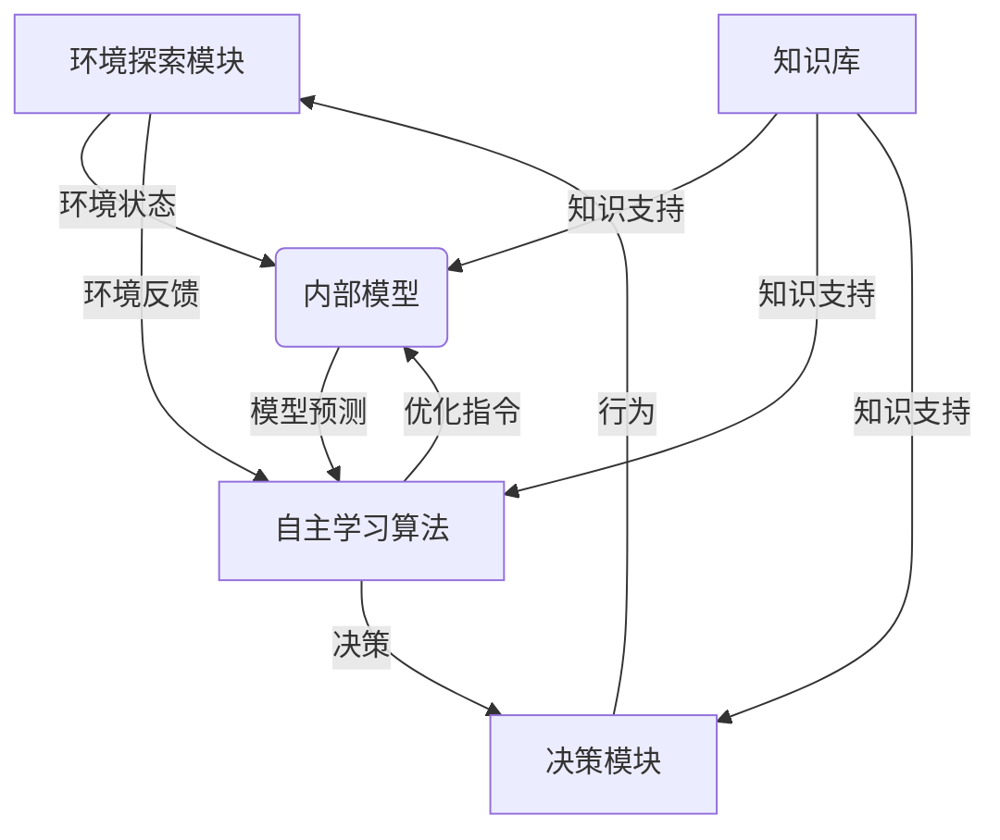

# AI人工智能核心算法原理与代码实例讲解：自主学习

## 1.背景介绍

### 1.1 人工智能的发展历程

人工智能(Artificial Intelligence, AI)是当代科技领域最具变革性的技术之一。自20世纪50年代AI概念被正式提出以来,经历了几个重要的发展阶段。

- **第一阶段(1950s-1960s)**: 专家系统和启发式搜索算法。这一阶段的代表性成果包括逻辑理论家、博弈程序和通用问题求解器等。

- **第二阶段(1970s-1980s)**: 知识库和机器学习的兴起。这一时期,专家系统和知识库被广泛应用,同时机器学习算法(如决策树、贝叶斯网络等)也开始出现。

- **第三阶段(1990s-2000s)**: 统计学习方法和神经网络的复兴。这一阶段,受益于计算能力的提升和大数据的出现,基于统计学习的算法(如支持向量机、随机森林等)和神经网络模型取得了长足进展。

- **第四阶段(2010s至今)**: 深度学习的突破和人工智能的全面应用。自2012年AlexNet在ImageNet大赛中获胜后,深度学习技术在计算机视觉、自然语言处理、语音识别等领域掀起了热潮,推动了人工智能技术在众多领域的落地应用。

### 1.2 自主学习的重要性

在人工智能的发展历程中,自主学习(Self-Learning)能力被视为AI系统通向通用人工智能(Artificial General Intelligence, AGI)的关键一步。自主学习指的是AI系统能够在少量或无人类指导的情况下,自主获取新知识、优化内部模型并持续改进自身性能的能力。

传统的机器学习算法需要大量标注数据和人工特征工程,而自主学习系统则能够通过探索环境、积累经验和自我演化,自动发现数据的内在模式,从而获取新知识并持续提升性能。这种能力不仅能够减轻人工标注数据的负担,更重要的是能够使AI系统在动态复杂环境中自我进化,从而大幅提高智能系统的鲁棒性和通用性。

因此,自主学习被认为是人工智能通往AGI的必由之路,也是未来AI系统发展的重要方向。本文将重点介绍自主学习的核心算法原理、代码实现细节以及在实际应用中的案例,为读者提供全面的理解和实践指导。

## 2.核心概念与联系

### 2.1 自主学习的定义

自主学习(Self-Learning)是指人工智能系统在少量或无人类监督的情况下,能够自主获取新知识、优化内部模型并持续改进自身性能的能力。它是机器学习(Machine Learning)和强化学习(Reinforcement Learning)的高级形式,旨在使AI系统具备持续自我进化的能力。

自主学习系统通常包含以下几个关键组成部分:

1. **环境探索模块**: 用于与外部环境进行交互,获取环境状态和反馈信号。

2. **内部模型**: 根据获取的环境数据,学习并构建环境的内部表示模型。

3. **自主学习算法**: 基于内部模型的预测和实际环境反馈,自主优化内部模型参数,实现持续学习和性能提升。

4. **知识库**: 存储已获取的知识和经验,为后续学习和决策提供支持。

5. **决策模块**: 基于当前内部模型和知识库,为智能体生成合理的行为决策。

### 2.2 自主学习与其他学习范式的关系

自主学习是机器学习和强化学习的高级形式,与它们存在密切联系,同时也有明显区别。

- **监督学习(Supervised Learning)**: 监督学习需要大量标注数据,通过学习输入与标签之间的映射关系来构建模型。而自主学习系统则无需大量标注数据,能够通过与环境的交互自主发现数据的内在模式。

- **非监督学习(Unsupervised Learning)**: 非监督学习旨在从未标注数据中发现潜在的结构和模式。自主学习系统也能够发现数据的内在模式,但更进一步,它还能够根据环境反馈自主优化内部模型,实现持续学习。

- **强化学习(Reinforcement Learning)**: 强化学习通过与环境交互获取奖赏信号,并优化策略以最大化长期累积奖赏。自主学习可视为强化学习的高级形式,不仅需要优化决策策略,还需要持续优化内部环境模型,实现自我进化。

- **迁移学习(Transfer Learning)**: 迁移学习旨在将已学习的知识迁移到新的相关任务上,加速新任务的学习过程。自主学习系统也需要迁移和积累已获取的知识,为后续学习和决策提供支持。

- **元学习(Meta-Learning)**: 元学习是"学习如何学习"的过程,旨在提高学习新任务的能力。自主学习系统需要具备优秀的元学习能力,才能在新环境中快速获取新知识并持续进化。

因此,自主学习是机器学习、强化学习、迁移学习和元学习等多种范式的高度融合,是通向通用人工智能的关键一步。

### 2.3 自主学习系统的核心架构

自主学习系统的核心架构可以概括为以下流程图:

该架构主要包括以下几个模块:

1. **环境探索模块**: 负责与外部环境进行交互,获取环境状态和反馈信号。

2. **内部模型**: 根据获取的环境数据,学习并构建环境的内部表示模型,用于预测环境的未来状态。

3. **自主学习算法**: 基于内部模型的预测和实际环境反馈,自主优化内部模型参数,实现持续学习和性能提升。

4. **决策模块**: 基于当前内部模型和知识库,为智能体生成合理的行为决策,并将决策转化为对环境的实际行为。

5. **知识库**: 存储已获取的知识和经验,为内部模型、自主学习算法和决策模块提供支持。

在这一架构中,环境探索模块与外部环境交互,获取环境数据;内部模型基于这些数据构建环境的表示模型;自主学习算法根据模型预测和环境反馈,持续优化内部模型;决策模块基于优化后的内部模型和知识库生成行为决策,并将决策转化为实际行为,影响外部环境。同时,知识库为各个模块提供知识支持。

通过这一闭环的自主学习过程,AI系统能够不断获取新知识、优化内部模型,从而实现持续自我进化,提高对复杂动态环境的适应能力。

## 3.核心算法原理具体操作步骤

### 3.1 基于模型的自主学习框架

基于模型的自主学习(Model-Based Self-Learning)框架是自主学习领域中一种广泛采用的主要范式。该框架的核心思想是:智能体通过与环境交互获取数据,基于这些数据学习并构建环境的内部模型,然后利用该内部模型进行模拟和规划,指导智能体的决策和行为。同时,智能体还会根据实际环境反馈不断优化内部模型,实现持续自我进化。

基于模型的自主学习框架通常包含以下几个关键步骤:

1. **环境交互与数据采集**
2. **内部模型学习**
3. **基于模型的规划与决策**
4. **模型优化与自主学习**

我们将详细介绍每个步骤的具体原理和算法。

#### 3.1.1 环境交互与数据采集

在自主学习的初始阶段,智能体需要通过与环境交互获取数据样本,为后续内部模型的学习提供数据基础。常见的数据采集策略包括:

- **随机探索(Random Exploration)**: 智能体在环境中执行随机的行为序列,记录对应的状态转移和奖赏信号。这是最简单直接的方法,但效率较低。

- **带噪声策略(Noisy Policy)**: 在一个初始策略的基础上,为行为决策添加噪声扰动,以增加探索的多样性。

- **入门策略(Heuristic Policy)**: 利用一些简单的人工设计的入门策略进行探索,以获取有意义的初始数据。

- **模仿学习(Imitation Learning)**: 通过观察和模仿人类专家的行为,获取高质量的示例数据。

在数据采集过程中,智能体需要记录每个时间步的状态$s_t$、执行的行为$a_t$、获得的即时奖赏$r_t$以及转移到的下一状态$s_{t+1}$,构建状态-行为-奖赏-下一状态的四元组数据 $(s_t, a_t, r_t, s_{t+1})$。这些数据将用于后续内部模型的学习。

#### 3.1.2 内部模型学习

基于采集的环境交互数据,智能体需要学习并构建环境的内部模型,用于模拟环境的动态演化过程。常见的内部模型包括:

- **转移模型(Transition Model)**: 学习状态转移概率 $P(s_{t+1}|s_t, a_t)$,预测在当前状态执行某个行为后,环境将转移到下一状态的概率分布。

- **奖赏模型(Reward Model)**: 学习奖赏函数 $R(s_t, a_t)$,预测在当前状态执行某个行为将获得的即时奖赏。

- **动态模型(Dynamics Model)**: 直接学习环境的动态演化过程 $f(s_t, a_t) \rightarrow s_{t+1}$,预测在当前状态执行某个行为后,环境将转移到的下一状态。

常见的内部模型学习算法包括:

- **高斯过程(Gaussian Processes, GP)**: 利用高斯过程回归,从数据中学习状态-行为到下一状态或奖赏的非参数映射函数。

- **贝叶斯神经网络(Bayesian Neural Networks, BNN)**: 使用具有贝叶斯权重分布的神经网络,从数据中学习内部模型的参数分布。

- **变分自编码器(Variational Autoencoders, VAE)**: 将环境状态通过VAE编码为低维潜在表示,在潜在空间学习动态模型。

- **世界模型(World Models)**: 使用VAE编码状态,并结合前馈神经网络和混合密度网络分别学习转移模型和奖赏模型。

无论采用何种具体算法,内部模型的学习目标都是基于有限的环境交互数据,获得对真实环境动态的精确内部表示,为后续的规划和决策提供支持。

#### 3.1.3 基于模型的规划与决策

获得精确的内部模型后,智能体可以利用该模型进行模拟和规划,生成优化的行为决策序列,而无需在真实环境中进行耗时且潜在代价高昂的试错探索。常见的基于模型的规划算法包括:

- **蒙特卡罗树搜索(Monte Carlo Tree Search, MCTS)**: 通过在内部模型中反复采样模拟,构建搜索树并估计每个状态-行为对的价值,从而选择最优行为序列。

- **路径积分控制(Path Integral Control)**: 在内部模型中采样大量可能的状态-行为轨迹,并根据轨迹的累积奖赏对行为序列进行重参数化,获得期望奖赏最大的行为序列。

- **交叉熵方法(Cross Entropy Method)**: 通过在内部模型中采样大量行为序列,选择获得高奖赏的序列更新行为策略的参数分布,迭代优化策略。

- **差分进化(Differential Evolution)**: 利用进化算法的思想,在内部模型中对行为序列进行变异、交叉和选择,逐步进化出高质量的行为决策序