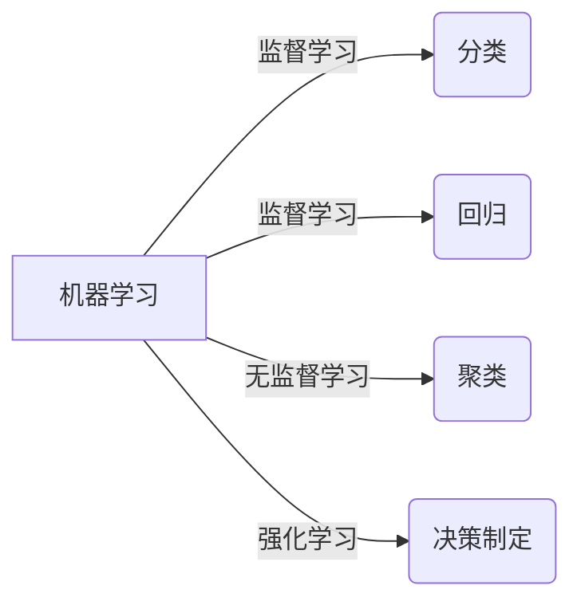
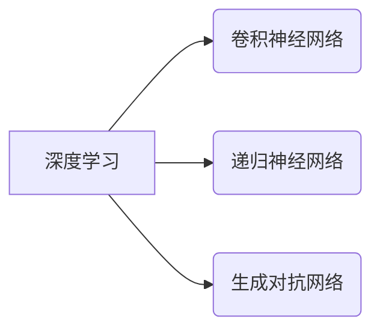
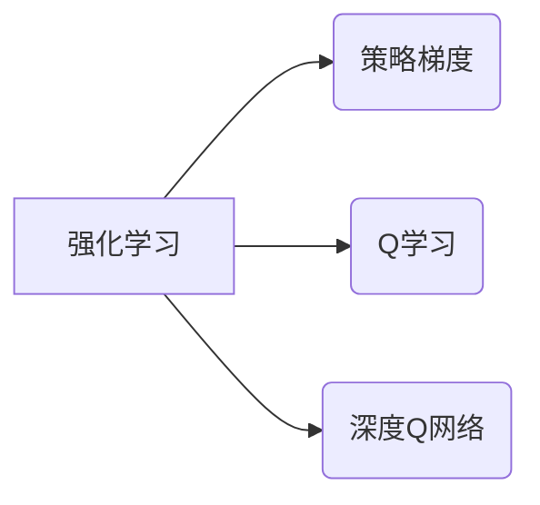

# AI人工智能核心算法原理与代码实例讲解：领域无关性

## 1.背景介绍

### 1.1 人工智能的崛起

人工智能(Artificial Intelligence, AI)已经成为当今科技发展的核心驱动力之一。从语音助手到自动驾驶汽车,从医疗诊断到金融分析,AI技术正在渗透到各个领域,极大地提高了效率并优化了决策过程。随着数据量的激增和计算能力的飞速提升,AI算法也在不断迭代和进化,展现出前所未有的能力。

### 1.2 领域无关性的重要性

尽管AI技术在特定领域取得了卓越的成就,但许多核心算法和基础概念实际上是领域无关的。这意味着,一种算法可以应用于多个领域,而不需要根据具体场景进行重大修改。领域无关性不仅提高了算法的通用性和可重用性,还有助于加速AI技术在不同行业的落地和推广。

### 1.3 本文主旨

本文将探讨AI中几种核心算法的原理、实现方式以及在不同领域的应用。我们将深入解析算法背后的数学模型,并通过实例代码帮助读者掌握算法的具体操作流程。最后,我们还将总结这些算法的发展趋势和未来挑战,为读者提供全面的视角。

## 2.核心概念与联系

在深入探讨具体算法之前,我们需要先了解一些基础概念及其相互关系。

### 2.1 机器学习

机器学习(Machine Learning)是AI的一个重要分支,旨在使计算机从数据中自动学习和建立模型,而无需显式编程。常见的机器学习任务包括分类、回归、聚类等。



### 2.2 深度学习

深度学习(Deep Learning)是机器学习的一个子集,它利用深层神经网络模型对数据进行表示学习和模式识别。深度学习在计算机视觉、自然语言处理等领域取得了突破性进展。



### 2.3 强化学习

强化学习(Reinforcement Learning)是一种基于环境交互的学习方式,智能体通过试错和累积经验,学习采取何种行为序列能获得最大回报。强化学习在决策制定、控制系统等领域有广泛应用。



以上三种学习范式相互关联、相辅相成,共同构建了AI的理论基础和技术框架。

## 3.核心算法原理具体操作步骤

接下来,我们将逐一介绍几种核心算法的原理和实现细节。

### 3.1 线性回归

线性回归是一种常用的监督学习算法,旨在找到一个最佳拟合的线性方程来描述自变量和因变量之间的关系。

#### 3.1.1 原理

给定一组数据点$(x_i, y_i)$,我们需要找到一条直线$y = \theta_0 + \theta_1x$,使得所有数据点到直线的距离之和最小。这可以通过最小化损失函数(如均方误差)来实现:

$$J(\theta_0, \theta_1) = \frac{1}{2m}\sum_{i=1}^m(h_\theta(x_i) - y_i)^2$$

其中$h_\theta(x_i) = \theta_0 + \theta_1x_i$是我们的预测函数。

#### 3.1.2 算法步骤

1. 初始化参数$\theta_0$和$\theta_1$为任意值。
2. 计算预测值$h_\theta(x_i)$和损失函数$J(\theta_0, \theta_1)$。
3. 计算损失函数对$\theta_0$和$\theta_1$的偏导数。
4. 更新$\theta_0$和$\theta_1$,使损失函数最小化。
5. 重复步骤2-4,直到收敛或达到最大迭代次数。

#### 3.1.3 代码实现

```python
import numpy as np

# 数据
X = np.array([[1, 1], [1, 2], [1, 3], [1, 4], [1, 5]])
y = np.array([2, 3, 4, 5, 6])

# 初始化参数
theta = np.random.randn(2, 1)

# 超参数
alpha = 0.01  # 学习率
iterations = 1000  # 迭代次数

# 计算损失函数
def compute_cost(X, y, theta):
    m = len(y)
    h = np.dot(X, theta)
    loss = np.sum((h - y) ** 2) / (2 * m)
    return loss

# 梯度下降
def gradient_descent(X, y, theta, alpha, iterations):
    m = len(y)
    cost_history = []

    for _ in range(iterations):
        h = np.dot(X, theta)
        theta = theta - (alpha / m) * np.dot(X.T, h - y)
        cost_history.append(compute_cost(X, y, theta))

    return theta, cost_history
```

上述代码实现了线性回归的梯度下降算法,可以找到最佳的$\theta_0$和$\theta_1$参数。

### 3.2 逻辑回归

逻辑回归是一种常用的分类算法,可以将输入数据划分为两个或多个类别。

#### 3.2.1 原理

逻辑回归的核心思想是通过sigmoid函数将线性回归的输出值映射到(0,1)区间,从而得到一个概率值,用于判断样本属于哪一类。

对于二分类问题,sigmoid函数定义为:

$$g(z) = \frac{1}{1 + e^{-z}}$$

其中$z = \theta^Tx$是线性回归的输出。我们可以将$g(z) \geq 0.5$视为正例,否则为负例。

#### 3.2.2 算法步骤

1. 初始化参数$\theta$为任意值。
2. 计算$z = \theta^Tx$和$g(z)$。
3. 计算损失函数(如交叉熵损失)及其关于$\theta$的梯度。
4. 更新$\theta$,使损失函数最小化。
5. 重复步骤2-4,直到收敛或达到最大迭代次数。

#### 3.2.3 代码实现

```python
import numpy as np

# 数据
X = np.array([[1, 0.5], [1, 1.5], [1, 3], [1, 4], [1, 5]])
y = np.array([0, 0, 0, 1, 1])

# 初始化参数
theta = np.random.randn(2, 1)

# 超参数
alpha = 0.01  # 学习率
iterations = 1000  # 迭代次数

# sigmoid函数
def sigmoid(z):
    return 1 / (1 + np.exp(-z))

# 计算损失函数
def compute_cost(X, y, theta):
    m = len(y)
    h = sigmoid(np.dot(X, theta))
    loss = -(1 / m) * np.sum(y * np.log(h) + (1 - y) * np.log(1 - h))
    return loss

# 梯度下降
def gradient_descent(X, y, theta, alpha, iterations):
    m = len(y)
    cost_history = []

    for _ in range(iterations):
        h = sigmoid(np.dot(X, theta))
        theta = theta - (alpha / m) * np.dot(X.T, h - y)
        cost_history.append(compute_cost(X, y, theta))

    return theta, cost_history
```

上述代码实现了逻辑回归的梯度下降算法,可以找到最佳的$\theta$参数。

### 3.3 K-Means聚类

K-Means是一种无监督学习算法,用于将数据集划分为K个簇,使得簇内数据点相似度高,簇间相似度低。

#### 3.3.1 原理

K-Means算法通过迭代优化来找到最佳的聚类中心,使得所有数据点到其所属簇中心的距离之和最小。

#### 3.3.2 算法步骤

1. 随机选择K个初始聚类中心。
2. 对于每个数据点,计算它与每个聚类中心的距离,并将其分配给最近的那一个簇。
3. 对于每个簇,重新计算其聚类中心,即所有簇内数据点的均值。
4. 重复步骤2-3,直到聚类中心不再发生变化或达到最大迭代次数。

#### 3.3.3 代码实现

```python
import numpy as np

# 数据
X = np.array([[1, 2], [1.5, 1.8], [5, 8], [8, 8], [1, 0.6], [9, 11]])

# 超参数
k = 2  # 簇的数量
max_iterations = 100  # 最大迭代次数

# 计算两点之间的欧几里得距离
def euclidean_distance(x1, x2):
    return np.sqrt(np.sum((x1 - x2) ** 2))

# K-Means算法
def k_means(X, k, max_iterations):
    # 随机选择初始聚类中心
    centroids = X[np.random.choice(X.shape[0], k, replace=False)]

    for _ in range(max_iterations):
        # 分配数据点到最近的簇
        clusters = [[] for _ in range(k)]
        for point in X:
            distances = [euclidean_distance(point, centroid) for centroid in centroids]
            cluster_idx = np.argmin(distances)
            clusters[cluster_idx].append(point)

        # 更新聚类中心
        prev_centroids = centroids.copy()
        centroids = [np.mean(cluster, axis=0) for cluster in clusters]

        # 检查是否收敛
        if np.all(prev_centroids == centroids):
            break

    return centroids, clusters

# 运行K-Means算法
centroids, clusters = k_means(X, k, max_iterations)
print("聚类中心:", centroids)
print("簇分配:", clusters)
```

上述代码实现了K-Means聚类算法,可以找到最佳的聚类中心和簇分配。

## 4.数学模型和公式详细讲解举例说明

在前面的算法介绍中,我们已经看到了一些数学模型和公式,接下来我们将更深入地探讨它们的细节和应用。

### 4.1 线性回归的数学模型

线性回归的数学模型可以表示为:

$$y = \theta_0 + \theta_1x_1 + \theta_2x_2 + \cdots + \theta_nx_n$$

其中$y$是因变量,$(x_1, x_2, \cdots, x_n)$是自变量,$(\\theta_0, \theta_1, \cdots, \theta_n)$是需要学习的参数。

我们的目标是找到最佳的$\theta$参数,使得预测值$\hat{y}$与真实值$y$之间的误差最小。通常采用的损失函数是均方误差(Mean Squared Error, MSE):

$$\text{MSE} = \frac{1}{m}\sum_{i=1}^m(y_i - \hat{y}_i)^2$$

其中$m$是样本数量。

为了最小化MSE,我们可以使用梯度下降法,对$\theta$参数进行迭代更新:

$$\theta_j := \theta_j - \alpha \frac{\partial}{\partial \theta_j}\text{MSE}(\theta)$$

其中$\alpha$是学习率,控制着每次更新的步长。

#### 4.1.1 举例说明

假设我们有一个数据集,包含房屋面积(x)和价格(y)的数据点。我们希望找到一个线性模型,能够根据面积预测房屋价格。

```python
import numpy as np
import matplotlib.pyplot as plt

# 数据
areas = np.array([1000, 1500, 2000, 2500, 3000])
prices = np.array([200, 300, 400, 550, 700])

# 添加偏置项
X = np.column_stack((np.ones(len(areas)), areas))

# 初始化参数
theta = np.random.randn(2, 1)

# 超参数
alpha = 0.01  # 学习率
iterations = 1000  # 迭代次数

# 梯度下降
def gradient_descent(X, y, theta, alpha, iterations):
    m = len(y)
    cost_history = []

    for _ in range(iterations):
        h = np.dot(X, theta)
        theta = theta - (alpha / m) * np.dot(X.T, h - y)
        cost_history.append(compute_cost(X, y, theta))

    return theta, cost_history

# 计算损失