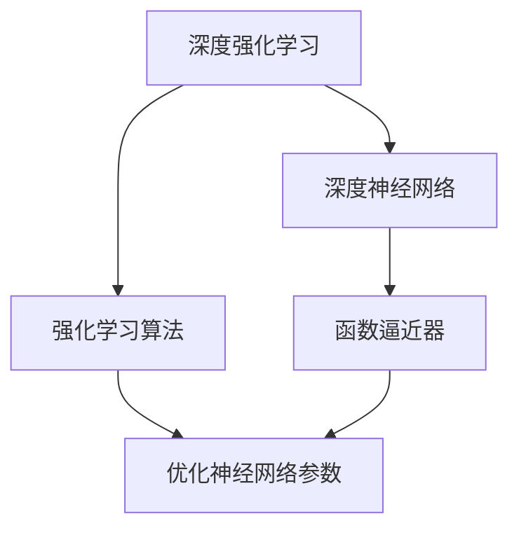

# AI人工智能深度学习算法：使用强化学习优化深度学习模型

## 1.背景介绍

在当今的人工智能领域,深度学习已经成为了一个炙手可热的话题。通过构建深层神经网络模型并利用大量数据进行训练,深度学习技术展现出了令人惊叹的性能,在计算机视觉、自然语言处理、语音识别等诸多领域取得了突破性的进展。然而,传统的深度学习模型也存在一些不足之处,例如需要大量的标注数据、训练过程缓慢、难以解释模型内部机理等。为了解决这些问题,研究人员开始探索将强化学习与深度学习相结合的方法,以期优化深度学习模型的性能并扩展其应用范围。

### 1.1 深度学习的挑战

尽管深度学习取得了令人瞩目的成就,但它也面临着一些重大挑战:

1. **数据饥渴**:深度学习模型通常需要大量的标注数据进行训练,而获取和标注高质量数据是一项昂贵且耗时的过程。
2. **黑箱模型**:深度神经网络的内部机理通常难以解释,这使得它们被视为"黑箱"模型,缺乏透明度和可解释性。
3. **过度拟合**:深度学习模型容易过度拟合训练数据,导致在新的未见数据上表现不佳。
4. **样本效率低下**:传统的深度学习算法需要大量的训练样本才能达到令人满意的性能,这在某些数据稀缺的领域造成了障碍。

### 1.2 强化学习的优势

强化学习是一种基于奖励信号的机器学习范式,它通过与环境交互来学习如何采取最优策略以maximiz累积奖励。与监督学习不同,强化学习不需要大量的标注数据,而是通过试错和奖惩机制来学习。强化学习具有以下优势:

1. **高样本效率**:强化学习算法能够从较少的经验中学习,提高了样本效率。
2. **连续决策**:强化学习擅长处理连续决策过程,可以应用于序列决策问题。
3. **探索与利用平衡**:强化学习需要在探索新的策略和利用已学习的策略之间寻求平衡,有助于避免过度拟合。
4. **可解释性**:强化学习的决策过程通常更加透明,有助于提高模型的可解释性。

## 2.核心概念与联系

将强化学习与深度学习相结合,可以利用两者的优势来优化深度学习模型的性能。这种结合通常被称为深度强化学习(Deep Reinforcement Learning, DRL)。在深度强化学习中,深度神经网络被用作强化学习智能体的函数逼近器,用于估计状态价值函数或者策略函数。同时,强化学习算法则用于优化神经网络的参数,使其能够学习到最优策略。

深度强化学习将深度学习的强大表示能力与强化学习的高样本效率和连续决策能力相结合,形成了一种新的人工智能范式。它不仅可以解决传统深度学习面临的数据饥渴和过度拟合等问题,还能够应用于连续控制和决策序列等复杂任务。

### 2.1 深度Q网络(Deep Q-Network, DQN)

深度Q网络是深度强化学习的一个典型代表,它将深度神经网络用作Q函数的逼近器,用于估计在给定状态下采取某个动作的价值。DQN使用经验回放(Experience Replay)和目标网络(Target Network)等技术来稳定训练过程,从而能够在高维观测空间和连续动作空间中实现有效的强化学习。

$$
Q(s, a) \approx Q(s, a; \theta)
$$

其中,$Q(s, a; \theta)$表示由参数$\theta$确定的深度神经网络对状态$s$和动作$a$的Q值的估计。在训练过程中,我们通过最小化下式来优化网络参数$\theta$:

$$
L(\theta) = \mathbb{E}_{(s, a, r, s')\sim D}\left[(r + \gamma \max_{a'} Q(s', a'; \theta^-) - Q(s, a; \theta))^2\right]
$$

这里,$D$是经验回放池,$(s, a, r, s')$是从中采样的转移元组,表示在状态$s$下执行动作$a$得到奖励$r$并转移到下一状态$s'$。$\theta^-$表示目标网络的参数,它是网络参数$\theta$的拷贝,用于估计下一状态的最大Q值,从而提高训练的稳定性。

### 2.2 深度策略梯度(Deep Policy Gradient)

除了基于值函数的方法(如DQN)之外,深度强化学习还可以直接优化策略函数。这种基于策略的方法被称为深度策略梯度(Deep Policy Gradient)。在这种方法中,我们使用深度神经网络来表示策略$\pi(a|s; \theta)$,即在给定状态$s$下选择动作$a$的概率分布,其中$\theta$是网络参数。

我们的目标是最大化期望回报:

$$
J(\theta) = \mathbb{E}_{\tau \sim \pi_\theta}\left[\sum_{t=0}^{T} \gamma^t r_t\right]
$$

其中,$\tau = (s_0, a_0, r_0, s_1, a_1, r_1, \ldots)$是按照策略$\pi_\theta$采样得到的trajector,即状态-动作-奖励序列。$\gamma$是折扣因子,用于权衡即时奖励和长期回报。

为了优化策略参数$\theta$,我们可以计算目标函数$J(\theta)$关于$\theta$的梯度:

$$
\nabla_\theta J(\theta) = \mathbb{E}_{\tau \sim \pi_\theta}\left[\sum_{t=0}^{T} \nabla_\theta \log \pi_\theta(a_t|s_t) A^{\pi_\theta}(s_t, a_t)\right]
$$

其中,$A^{\pi_\theta}(s_t, a_t)$是在状态$s_t$下执行动作$a_t$的优势函数(Advantage Function),它衡量了该动作相对于当前策略的优势程度。通过沿着这个梯度方向更新策略参数$\theta$,我们就可以不断改进策略,使其获得更高的期望回报。

## 3.核心算法原理具体操作步骤

### 3.1 Deep Q-Network (DQN)

Deep Q-Network (DQN)算法是将深度神经网络应用于Q-learning的一种方法,它能够在高维观测空间和连续动作空间中实现有效的强化学习。DQN算法的核心步骤如下:

1. **初始化**:初始化一个评估网络$Q(s, a; \theta)$和一个目标网络$Q(s, a; \theta^-)$,其中$\theta^-$是$\theta$的拷贝。同时初始化经验回放池$D$为空。

2. **观测环境**:从环境中获取初始状态$s_0$。

3. **选择动作**:使用$\epsilon$-贪婪策略从评估网络$Q(s_0, a; \theta)$中选择动作$a_0$。具体来说,以概率$\epsilon$随机选择一个动作,以概率$1-\epsilon$选择当前状态下的最优动作,即$a_0 = \arg\max_a Q(s_0, a; \theta)$。

4. **执行动作并存储经验**:在环境中执行选择的动作$a_0$,观测到奖励$r_0$和新的状态$s_1$。将转移元组$(s_0, a_0, r_0, s_1)$存储到经验回放池$D$中。

5. **采样并学习**:从经验回放池$D$中随机采样一个小批量的转移元组$(s, a, r, s')$。计算目标Q值:

$$
y = r + \gamma \max_{a'} Q(s', a'; \theta^-)
$$

其中,$\gamma$是折扣因子。然后,使用均方误差损失函数优化评估网络的参数$\theta$:

$$
L(\theta) = \mathbb{E}_{(s, a, r, s')\sim D}\left[(y - Q(s, a; \theta))^2\right]
$$

6. **更新目标网络**:每隔一定步数,将评估网络$\theta$的参数复制到目标网络$\theta^-$,以提高训练的稳定性。

7. **回到步骤3**:重复步骤3-6,直到达到终止条件(如最大迭代次数或收敛)。

### 3.2 Deep Policy Gradient

Deep Policy Gradient算法是一种基于策略的深度强化学习方法,它直接优化策略函数$\pi(a|s; \theta)$,即在给定状态$s$下选择动作$a$的概率分布。算法的核心步骤如下:

1. **初始化**:初始化策略网络$\pi(a|s; \theta)$,其中$\theta$是网络参数。

2. **观测环境**:从环境中获取初始状态$s_0$。

3. **采样trajector**:根据当前策略$\pi_\theta$在环境中采样一个trajector $\tau = (s_0, a_0, r_0, s_1, a_1, r_1, \ldots, s_T)$,其中$a_t \sim \pi_\theta(\cdot|s_t)$是根据策略分布选择的动作。

4. **估计优势函数**:对于trajector中的每一个状态-动作对$(s_t, a_t)$,估计其优势函数值$A^{\pi_\theta}(s_t, a_t)$。优势函数衡量了在状态$s_t$下执行动作$a_t$相对于当前策略的优势程度。

5. **计算策略梯度**:计算目标函数$J(\theta)$关于策略参数$\theta$的梯度:

$$
\nabla_\theta J(\theta) = \mathbb{E}_{\tau \sim \pi_\theta}\left[\sum_{t=0}^{T} \nabla_\theta \log \pi_\theta(a_t|s_t) A^{\pi_\theta}(s_t, a_t)\right]
$$

6. **优化策略参数**:使用策略梯度上升法,沿着梯度方向更新策略参数$\theta$:

$$
\theta \leftarrow \theta + \alpha \nabla_\theta J(\theta)
$$

其中,$\alpha$是学习率。

7. **回到步骤3**:重复步骤3-6,直到达到终止条件(如最大迭代次数或收敛)。

## 4.数学模型和公式详细讲解举例说明

在深度强化学习中,我们通常使用马尔可夫决策过程(Markov Decision Process, MDP)来建模强化学习问题。一个MDP可以用一个五元组$(S, A, P, R, \gamma)$来表示,其中:

- $S$是状态空间,表示环境可能的状态。
- $A$是动作空间,表示智能体可以执行的动作。
- $P(s'|s, a)$是状态转移概率,表示在状态$s$下执行动作$a$后,转移到状态$s'$的概率。
- $R(s, a)$是奖励函数,表示在状态$s$下执行动作$a$获得的即时奖励。
- $\gamma \in [0, 1)$是折扣因子,用于权衡即时奖励和长期回报。

在强化学习中,我们的目标是找到一个最优策略$\pi^*$,使得在该策略下的期望累积回报最大化:

$$
\pi^* = \arg\max_\pi \mathbb{E}_\pi\left[\sum_{t=0}^\infty \gamma^t R(s_t, a_t)\right]
$$

其中,$\pi$是一个映射$S \rightarrow A$的策略函数,表示在每个状态$s$下选择动作$a$的概率分布。

### 4.1 Q-learning和Deep Q-Network

Q-learning是一种基于值函数的强化学习算法,它试图学习一个Q函数$Q(s, a)$,表示在状态$s$下执行动作$a$的长期回报期望值。Q函数满足下式:

$$
Q(s, a) = \mathbb{E}_\pi\left[R(s, a) + \gamma \max_{a'} Q(s', a')\right]
$$

其中,$s'$是执行动作$a$后转移到的下一状态。通过不断更新Q函数,我们可以找到一个最优策