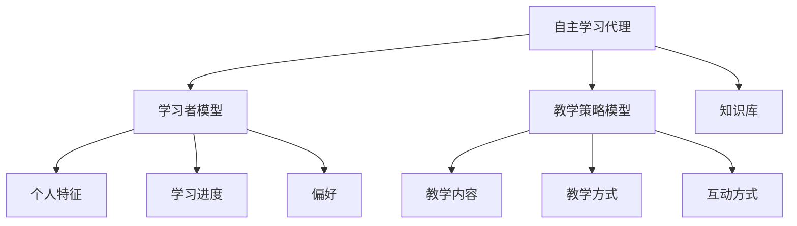

# AI人工智能深度学习算法：在教育培训中运用自主学习代理

## 1.背景介绍

### 1.1 教育培训领域的挑战

在当今快节奏的社会中,教育培训面临着许多挑战。学习者的需求日益多样化,教育资源的分配却往往无法满足每个人的个性化需求。此外,传统的教学方式往往缺乏互动性和灵活性,难以激发学习者的主动性和创造力。

### 1.2 人工智能在教育中的应用前景

人工智能技术的飞速发展为解决这些挑战提供了新的途径。通过将深度学习算法应用于教育培训领域,我们可以开发出智能化的自主学习代理,为学习者提供个性化的学习体验,提高教学效率,优化教育资源的利用。

## 2.核心概念与联系

### 2.1 自主学习代理

自主学习代理是一种基于人工智能技术的智能系统,能够根据学习者的个人特征、学习进度和偏好,动态调整教学策略和内容,为学习者提供个性化的学习体验。



### 2.2 深度学习算法

深度学习算法是自主学习代理的核心技术,它能够从大量数据中自动提取特征,并基于这些特征构建复杂的模型,用于预测和决策。常见的深度学习算法包括卷积神经网络、递归神经网络和强化学习算法等。

### 2.3 个性化学习

个性化学习是自主学习代理的核心目标。通过深度学习算法构建的学习者模型,代理可以准确把握每个学习者的知识水平、学习偏好和认知特点,从而提供符合其个性化需求的教学内容和方式。

## 3.核心算法原理具体操作步骤

### 3.1 数据收集与预处理

自主学习代理的第一步是收集和预处理相关数据,包括学习者的个人信息、学习行为数据、教学资源等。这些数据需要进行清洗、标注和特征提取,为后续的模型训练做好准备。

### 3.2 学习者模型构建

基于收集的数据,我们可以使用深度学习算法构建学习者模型,该模型能够捕捉学习者的个人特征、学习进度和偏好。常用的算法包括:

1. **递归神经网络(RNN)**:适用于处理序列数据,如学习者的学习行为序列。
2. **注意力机制(Attention Mechanism)**:帮助模型关注学习者的关键特征。

### 3.3 教学策略模型构建

教学策略模型的目标是根据学习者模型的输出,生成个性化的教学策略,包括教学内容、教学方式和互动方式等。常用的算法包括:

1. **强化学习算法**:将教学过程建模为马尔可夫决策过程,通过试错学习获得最优教学策略。
2. **序列生成模型**:基于学习者的特征,生成个性化的教学内容序列。

### 3.4 模型训练与优化

在数据和模型准备就绪后,我们需要对模型进行训练和优化,以提高其准确性和泛化能力。常用的优化算法包括随机梯度下降、Adam优化器等。同时,我们还需要设计合理的损失函数和评估指标,以指导模型的训练过程。

### 3.5 系统集成与部署

最后,我们需要将训练好的模型集成到自主学习代理系统中,并进行部署和测试。在部署过程中,我们需要注意系统的可扩展性、安全性和隐私保护等问题。

## 4.数学模型和公式详细讲解举例说明

### 4.1 递归神经网络(RNN)

递归神经网络是一种处理序列数据的深度学习模型,它能够捕捉序列数据中的时间依赖关系。在学习者模型中,我们可以使用RNN来建模学习者的学习行为序列,从而预测其未来的学习状态。

RNN的核心思想是在每个时间步,将当前输入和上一时间步的隐藏状态结合,计算出当前时间步的隐藏状态和输出。数学表达式如下:

$$
h_t = f_W(x_t, h_{t-1})\\
y_t = g_V(h_t)
$$

其中,
- $x_t$是时间步$t$的输入
- $h_t$是时间步$t$的隐藏状态
- $y_t$是时间步$t$的输出
- $f_W$和$g_V$分别表示计算隐藏状态和输出的函数,其中$W$和$V$是需要学习的参数

在实践中,我们通常使用长短期记忆网络(LSTM)或门控循环单元(GRU)等变体,以解决RNN的梯度消失/爆炸问题。

### 4.2 注意力机制(Attention Mechanism)

注意力机制是一种帮助深度学习模型关注输入的关键部分的技术。在学习者模型中,我们可以使用注意力机制来捕捉学习者的关键特征,从而提高模型的预测准确性。

注意力机制的核心思想是为每个输入元素分配一个注意力权重,表示该元素对输出的重要程度。数学表达式如下:

$$
a_t = \text{softmax}(f(h_t, s_t))\\
c_t = \sum_{i=1}^{n} a_{t,i} s_{t,i}\\
o_t = g(c_t, h_t)
$$

其中,
- $h_t$是当前时间步的隐藏状态
- $s_t$是当前时间步的输入序列
- $a_t$是注意力权重向量
- $c_t$是加权求和后的上下文向量
- $o_t$是当前时间步的输出
- $f$和$g$分别表示计算注意力权重和输出的函数

通过注意力机制,模型可以自适应地关注输入序列中的关键信息,从而提高模型的性能。

### 4.3 强化学习算法

强化学习算法是一种基于试错学习的算法,它可以用于生成最优的教学策略。在自主学习代理中,我们可以将教学过程建模为一个马尔可夫决策过程(MDP),其中:

- 状态($s$)表示学习者的当前状态,包括知识水平、学习偏好等
- 动作($a$)表示代理采取的教学策略,如选择教学内容、调整教学方式等
- 奖励($r$)表示采取某个动作后获得的反馈,如学习效果的提高或降低

我们的目标是找到一个策略($\pi$),使得在整个教学过程中获得的累积奖励最大化:

$$
\max_\pi \mathbb{E}\left[\sum_{t=0}^\infty \gamma^t r_t \right]
$$

其中$\gamma$是折现因子,用于平衡即时奖励和长期奖励的权重。

常用的强化学习算法包括Q-Learning、Deep Q-Network(DQN)、策略梯度算法等。这些算法通过不断尝试和调整策略,最终converge到最优策略。

## 5.项目实践:代码实例和详细解释说明

为了更好地理解自主学习代理的实现,我们提供了一个基于PyTorch的简单示例代码。该示例使用LSTM和注意力机制构建学习者模型,并使用强化学习算法(DQN)生成教学策略。

### 5.1 数据准备

我们使用一个简单的数据集,包含学习者的个人信息、学习行为数据和教学资源。具体代码如下:

```python
import pandas as pd

# 读取学习者个人信息
learner_info = pd.read_csv('learner_info.csv')

# 读取学习行为数据
learning_logs = pd.read_csv('learning_logs.csv')

# 读取教学资源
learning_materials = pd.read_csv('learning_materials.csv')
```

### 5.2 学习者模型

我们使用LSTM和注意力机制构建学习者模型,用于捕捉学习者的个人特征、学习进度和偏好。具体代码如下:

```python
import torch
import torch.nn as nn

class LearnerModel(nn.Module):
    def __init__(self, input_size, hidden_size, output_size):
        super(LearnerModel, self).__init__()
        self.lstm = nn.LSTM(input_size, hidden_size, batch_first=True)
        self.attention = nn.MultiheadAttention(hidden_size, num_heads=8)
        self.fc = nn.Linear(hidden_size, output_size)

    def forward(self, x, hidden=None):
        out, hidden = self.lstm(x, hidden)
        attn_out, _ = self.attention(out, out, out)
        output = self.fc(attn_out)
        return output, hidden
```

在训练过程中,我们使用学习者的个人信息和学习行为数据作为输入,预测其未来的学习状态。

### 5.3 教学策略模型

我们使用DQN算法构建教学策略模型,用于生成个性化的教学策略。具体代码如下:

```python
import torch.nn.functional as F

class TeachingStrategyModel(nn.Module):
    def __init__(self, state_size, action_size):
        super(TeachingStrategyModel, self).__init__()
        self.fc1 = nn.Linear(state_size, 64)
        self.fc2 = nn.Linear(64, action_size)

    def forward(self, state):
        x = F.relu(self.fc1(state))
        q_values = self.fc2(x)
        return q_values
```

在训练过程中,我们使用学习者模型的输出作为状态,并根据DQN算法更新教学策略模型的参数,以获得最优的教学策略。

### 5.4 模型训练与优化

我们使用PyTorch提供的优化器和损失函数进行模型训练和优化。具体代码如下:

```python
import torch.optim as optim

# 初始化模型
learner_model = LearnerModel(input_size, hidden_size, output_size)
strategy_model = TeachingStrategyModel(state_size, action_size)

# 定义损失函数和优化器
criterion = nn.MSELoss()
learner_optimizer = optim.Adam(learner_model.parameters(), lr=0.001)
strategy_optimizer = optim.RMSprop(strategy_model.parameters())

# 模型训练
for epoch in range(num_epochs):
    # 训练学习者模型
    learner_hidden = None
    for batch in learner_data:
        learner_output, learner_hidden = learner_model(batch, learner_hidden)
        learner_loss = criterion(learner_output, target)
        learner_optimizer.zero_grad()
        learner_loss.backward()
        learner_optimizer.step()

    # 训练教学策略模型
    for batch in strategy_data:
        state = learner_model.hidden
        action = strategy_model(state)
        strategy_loss = dqn_loss(action, target)
        strategy_optimizer.zero_grad()
        strategy_loss.backward()
        strategy_optimizer.step()
```

在训练过程中,我们分别优化学习者模型和教学策略模型,以提高它们的性能。

## 6.实际应用场景

自主学习代理在教育培训领域有广泛的应用前景,包括但不限于以下场景:

### 6.1 个性化在线教育平台

在线教育平台可以集成自主学习代理,为学习者提供个性化的学习体验。代理可以根据学习者的特征和学习进度,推荐合适的课程内容、调整教学方式,并提供个性化的学习路径和反馈。

### 6.2 智能教学辅助系统

自主学习代理可以作为教师的智能辅助系统,帮助教师更好地了解学生的学习情况,并提供个性化的教学建议。代理可以分析学生的学习数据,发现潜在的问题和需求,从而优化教学策略。

### 6.3 智能教育机器人

自主学习代理可以集成到智能教育机器人中,为学习者提供个性化的互动式学习体验。机器人可以根据学习者的反馈和表现,动态调整教学内容和方式,提高学习效率和趣味性。

### 6.4 职业培训和技能提升

在职业培训和技能提升领域,自主学习代理可以帮助学员更好地掌握所需的知识和技能。代理可以根据学员的背景和需求,提供个性化的培训课程和练习,加速学习进度