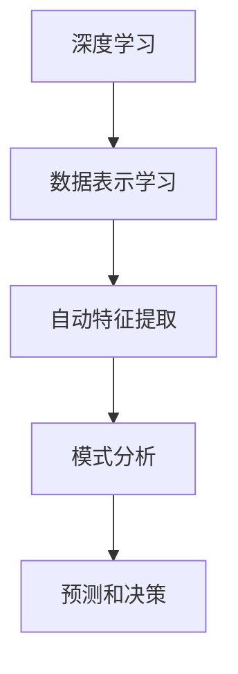
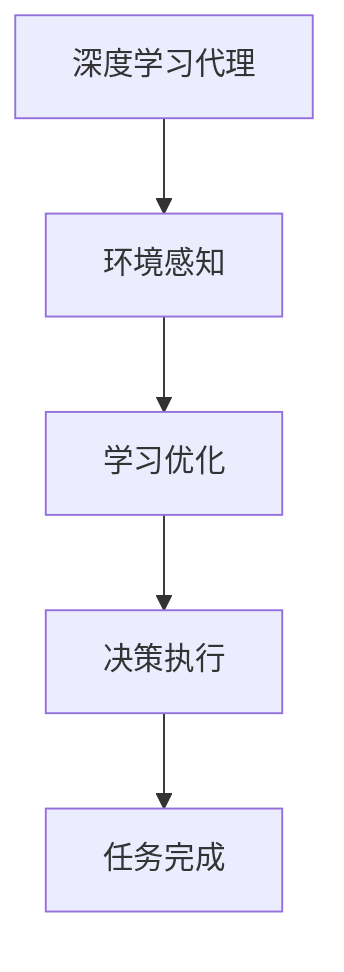
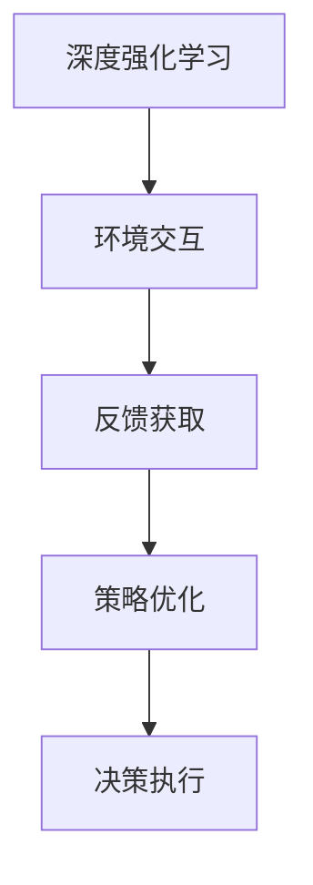
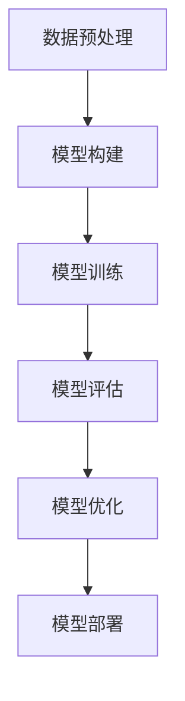
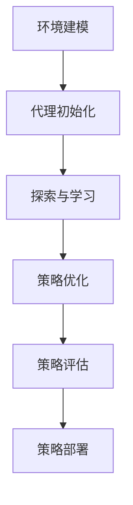

# AI人工智能深度学习算法：智能深度学习代理在健康医疗领域的应用策略

## 1.背景介绍

### 1.1 人工智能在医疗健康领域的重要性

随着人工智能(AI)和机器学习技术的不断发展,医疗健康领域正在经历一场前所未有的变革。传统的医疗模式面临着诸多挑战,如医疗资源分配不均、医疗成本不断攀升、医疗错误风险等。而人工智能技术的引入,为解决这些问题提供了新的途径。

### 1.2 医疗数据的爆炸式增长

在当今时代,医疗数据呈现出爆炸式增长的趋势。从电子病历、医学影像到基因组学数据,海量的医疗数据正在不断积累。然而,人类医疗专家难以高效处理如此庞大的数据量。因此,需要利用人工智能技术来挖掘这些数据中蕴含的宝贵信息,从而提高医疗决策的质量和效率。

### 1.3 深度学习在医疗领域的应用前景

深度学习作为人工智能的一个重要分支,在医疗健康领域展现出巨大的潜力。深度学习模型能够从复杂的医疗数据中自动学习特征,并对疾病进行精准诊断和预测。此外,深度学习还可以用于药物发现、医疗图像分析、个性化治疗方案设计等领域,为提高医疗水平和患者健康状况做出重要贡献。

## 2.核心概念与联系

### 2.1 深度学习概述

深度学习是机器学习的一个子领域,它基于人工神经网络,通过对数据进行表示学习,自动获取特征并进行模式分析。深度学习模型能够从原始数据中自动提取多层次的抽象特征,并通过端到端的训练过程优化模型参数,从而实现高精度的预测和决策。



### 2.2 深度学习代理

深度学习代理(Deep Learning Agent)是一种基于深度学习技术的智能系统,它能够从环境中获取信息,并通过学习过程不断优化自身的决策策略,从而实现高效的任务完成。在医疗健康领域,深度学习代理可以充当智能助手的角色,协助医生进行疾病诊断、治疗方案制定等工作。



### 2.3 深度强化学习

深度强化学习是深度学习和强化学习的结合,它利用深度神经网络作为价值函数或策略的近似器,通过不断与环境交互并获取反馈,来优化代理的决策策略。在医疗领域,深度强化学习可以应用于个性化治疗方案的制定,根据患者的具体情况动态调整治疗策略,从而提高治疗效果。



## 3.核心算法原理具体操作步骤

### 3.1 深度学习模型训练流程

1. **数据预处理**:对原始医疗数据进行清洗、标准化和特征工程,将其转换为适合深度学习模型输入的格式。

2. **模型构建**:根据任务需求选择合适的深度学习模型架构,如卷积神经网络(CNN)用于医学图像分析,循环神经网络(RNN)用于电子病历处理等。

3. **模型训练**:利用预处理后的数据对深度学习模型进行训练,通过反向传播算法不断调整模型参数,使模型在训练集上达到最优性能。

4. **模型评估**:在保留的测试集上评估模型的泛化能力,计算相关指标如准确率、精确率、召回率等。

5. **模型优化**:根据评估结果对模型进行优化,如调整超参数、增加训练数据、改进模型架构等。

6. **模型部署**:将优化后的模型部署到实际的医疗系统中,用于辅助医生进行诊断、预测和决策。



### 3.2 深度强化学习算法流程

1. **环境建模**:构建模拟医疗场景的环境模型,包括患者状态、可执行的治疗行为及相应的奖惩机制。

2. **代理初始化**:初始化深度强化学习代理,通常采用深度神经网络作为策略或值函数的近似器。

3. **探索与学习**:代理与环境进行交互,根据当前状态选择行为,并观察下一状态和奖惩信号,通过经验回放机制存储转换样本。

4. **策略优化**:利用存储的转换样本,通过算法(如Q-Learning、策略梯度等)优化代理的策略或值函数参数。

5. **策略评估**:在模拟环境中评估优化后的策略性能,计算累积奖赏等指标。

6. **策略部署**:将训练好的策略应用于实际的医疗场景,为医生提供个性化的治疗建议。



## 4.数学模型和公式详细讲解举例说明

### 4.1 深度神经网络模型

深度神经网络是深度学习的核心模型,它由多层神经元组成,每层通过非线性激活函数对上一层的输出进行变换。对于输入 $\boldsymbol{x}$ 和权重矩阵 $\boldsymbol{W}$,第 $l$ 层的输出可表示为:

$$\boldsymbol{h}^{(l)} = \phi\left(\boldsymbol{W}^{(l)}\boldsymbol{h}^{(l-1)} + \boldsymbol{b}^{(l)}\right)$$

其中 $\phi$ 为激活函数,如 ReLU、Sigmoid 等,$\boldsymbol{b}^{(l)}$ 为偏置向量。

通过反向传播算法,可以计算损失函数关于权重的梯度,并使用优化器(如随机梯度下降)更新权重,从而实现模型训练。

### 4.2 卷积神经网络

卷积神经网络(CNN)是处理图像数据的有效模型,它通过卷积层和池化层自动提取特征,最后通过全连接层进行分类或回归。

卷积层的计算公式为:

$$\boldsymbol{h}_{i,j}^{(l)} = \phi\left(\sum_{m}\sum_{n}\boldsymbol{W}_{m,n}^{(l)}\ast\boldsymbol{x}_{i+m,j+n}^{(l-1)} + b^{(l)}\right)$$

其中 $\ast$ 表示卷积操作,卷积核 $\boldsymbol{W}$ 在输入特征图上滑动,提取局部特征。

池化层则通过下采样操作,对特征图进行压缩和去冗余,提高模型的泛化能力。

### 4.3 循环神经网络

循环神经网络(RNN)适用于处理序列数据,如文本、语音等。它通过引入循环连接,使当前时刻的隐藏状态不仅与当前输入有关,也与上一时刻的隐藏状态相关。

对于输入序列 $\boldsymbol{x}_t$,RNN 在时刻 $t$ 的隐藏状态和输出计算公式为:

$$\begin{aligned}
\boldsymbol{h}_t &= \phi\left(\boldsymbol{W}_{hh}\boldsymbol{h}_{t-1} + \boldsymbol{W}_{xh}\boldsymbol{x}_t + \boldsymbol{b}_h\right)\\
\boldsymbol{y}_t &= \boldsymbol{W}_{hy}\boldsymbol{h}_t + \boldsymbol{b}_y
\end{aligned}$$

其中 $\boldsymbol{W}$ 为权重矩阵,通过反向传播训练模型参数。

### 4.4 强化学习算法

强化学习算法旨在找到一个最优策略 $\pi^*$,使代理在与环境交互时获得的累积奖赏最大化。

对于状态 $s$ 和行为 $a$,代理的状态价值函数 $V^\pi(s)$ 和行为价值函数 $Q^\pi(s,a)$ 定义为:

$$\begin{aligned}
V^\pi(s) &= \mathbb{E}_\pi\left[\sum_{k=0}^\infty \gamma^k r_{t+k+1} \mid s_t=s\right]\\
Q^\pi(s,a) &= \mathbb{E}_\pi\left[\sum_{k=0}^\infty \gamma^k r_{t+k+1} \mid s_t=s, a_t=a\right]
\end{aligned}$$

其中 $\gamma$ 为折现因子,用于权衡即时奖赏和长期奖赏。

基于价值函数,可以通过各种算法(如Q-Learning、策略梯度等)来优化策略 $\pi$,使其逼近最优策略 $\pi^*$。

## 5.项目实践:代码实例和详细解释说明

### 5.1 医学图像分类:使用卷积神经网络

在这个示例中,我们将使用卷积神经网络对医学影像进行疾病分类。代码基于 PyTorch 框架实现。

```python
import torch
import torch.nn as nn
import torch.optim as optim
from torchvision import datasets, transforms

# 定义卷积神经网络模型
class MedicalCNN(nn.Module):
    def __init__(self):
        super(MedicalCNN, self).__init__()
        self.conv1 = nn.Conv2d(1, 32, kernel_size=3, padding=1)
        self.pool = nn.MaxPool2d(2, 2)
        self.conv2 = nn.Conv2d(32, 64, kernel_size=3, padding=1)
        self.fc1 = nn.Linear(64 * 7 * 7, 128)
        self.fc2 = nn.Linear(128, 10)

    def forward(self, x):
        x = self.pool(nn.functional.relu(self.conv1(x)))
        x = self.pool(nn.functional.relu(self.conv2(x)))
        x = x.view(-1, 64 * 7 * 7)
        x = nn.functional.relu(self.fc1(x))
        x = self.fc2(x)
        return x

# 加载数据集
train_dataset = datasets.ImageFolder('path/to/train/data', transform=transforms.ToTensor())
test_dataset = datasets.ImageFolder('path/to/test/data', transform=transforms.ToTensor())

# 定义数据加载器
train_loader = torch.utils.data.DataLoader(train_dataset, batch_size=32, shuffle=True)
test_loader = torch.utils.data.DataLoader(test_dataset, batch_size=32, shuffle=False)

# 初始化模型
model = MedicalCNN()
criterion = nn.CrossEntropyLoss()
optimizer = optim.Adam(model.parameters(), lr=0.001)

# 训练模型
for epoch in range(10):
    running_loss = 0.0
    for inputs, labels in train_loader:
        optimizer.zero_grad()
        outputs = model(inputs)
        loss = criterion(outputs, labels)
        loss.backward()
        optimizer.step()
        running_loss += loss.item()
    print(f'Epoch {epoch+1} loss: {running_loss / len(train_loader):.3f}')

# 评估模型
correct = 0
total = 0
with torch.no_grad():
    for inputs, labels in test_loader:
        outputs = model(inputs)
        _, predicted = torch.max(outputs.data, 1)
        total += labels.size(0)
        correct += (predicted == labels).sum().item()

print(f'Accuracy on test set: {100 * correct / total:.2f}%')
```

在这个示例中,我们定义了一个包含两个卷积层和两个全连接层的卷积神经网络模型 `MedicalCNN`。我们加载了医学影像数据集,并使用交叉熵损失函数和 Adam 优化器对模型进行训练。最后,我们在测试集上评估模型的准确率。

### 5.2 电子病历分析:使用循环神经网络

在这个示例中,我们将使用循环神经网络对电