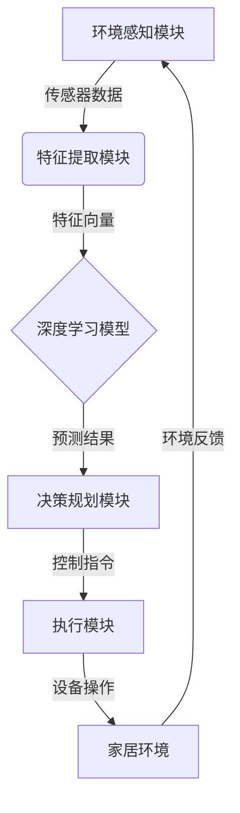

# AI人工智能深度学习算法：智能深度学习代理在智能家居场景中的应用

## 1.背景介绍

随着人工智能技术的不断发展,深度学习已经成为推动智能系统发展的核心动力。在智能家居领域,智能代理系统的应用越来越广泛,通过将深度学习算法与物联网技术相结合,可以实现对家居环境的智能感知、决策和控制,从而提高生活质量,优化能源利用效率。

智能家居是指将先进的信息技术、网络通信技术、自动控制技术等融入住宅,实现对家居环境的智能化管理和控制。智能家居系统通常由多种智能设备组成,如智能照明系统、智能安防系统、智能家电控制系统等。这些设备通过有线或无线网络相互连接,形成一个智能化的家居环境。

在传统的智能家居系统中,控制决策主要依赖于预设的规则和简单的条件判断。然而,这种方式缺乏灵活性和适应性,难以满足用户多样化的需求。深度学习技术的引入为智能家居系统带来了新的发展机遇,使其能够从大量数据中自主学习,实现更加智能化的决策控制。

## 2.核心概念与联系

### 2.1 深度学习

深度学习(Deep Learning)是机器学习的一个新的领域,其灵感来源于人脑的结构和功能。深度学习算法通过对大量数据的训练,能够自主学习数据的特征表示,并用于分类、预测等任务。

常见的深度学习模型包括卷积神经网络(CNN)、递归神经网络(RNN)、长短期记忆网络(LSTM)等。这些模型通过构建多层非线性变换单元,对输入数据进行特征提取和模式识别,展现出优秀的学习能力。

### 2.2 智能代理

智能代理(Intelligent Agent)是一种自主的软件实体,能够感知环境、学习知识、规划行动并与环境进行交互,以实现特定目标。在智能家居场景中,智能代理扮演着环境感知和决策控制的核心角色。

智能代理通常由以下几个基本模块组成:

- 感知模块:收集环境数据,如温度、光线、人体活动等。
- 学习模块:基于感知数据训练深度学习模型,学习环境模式。
- 决策模块:根据学习到的模式,规划和选择合适的行动方案。
- 执行模块:将决策方案转化为具体的控制指令,并执行相应的家居设备操作。

### 2.3 深度学习智能代理

将深度学习技术与智能代理相结合,可以构建出高度智能化的家居控制系统。深度学习算法赋予了智能代理强大的学习和决策能力,使其能够自主地从环境数据中提取有用的模式和规律,并基于学习结果做出明智的决策。

深度学习智能代理的核心优势在于:

1. 自适应性强:能够根据用户行为习惯和环境变化自主调整决策策略。
2. 决策准确性高:利用深度学习模型对复杂环境进行建模和预测。
3. 可扩展性好:通过持续学习,不断优化决策性能。

因此,深度学习智能代理被广泛应用于智能家居、智能楼宇、智慧城市等场景,实现对环境的智能化管理和控制。

## 3.核心算法原理具体操作步骤

### 3.1 深度学习智能代理系统架构

深度学习智能代理系统通常由以下几个核心模块组成:



1. **环境感知模块**: 通过各种传感器收集家居环境数据,如温度、湿度、光线强度、人体活动等。
2. **特征提取模块**: 对原始传感器数据进行预处理,提取有用的特征向量作为深度学习模型的输入。
3. **深度学习模型**: 利用训练数据训练出的深度神经网络模型,对输入的特征向量进行模式识别和预测。
4. **决策规划模块**: 根据深度学习模型的预测结果,结合预设的优化目标和约束条件,规划出合理的控制决策方案。
5. **执行模块**: 将决策方案转化为具体的控制指令,并执行相应的家居设备操作,如调节空调温度、控制灯光亮度等。
6. **家居环境**: 智能家居系统所处的实际环境,包括各种智能设备和用户。

该系统架构形成了一个闭环控制过程,持续地感知环境变化、学习环境模式、优化决策方案并执行控制操作,从而实现对家居环境的智能化管理。

### 3.2 算法流程

深度学习智能代理系统的核心算法流程如下:

1. **数据采集**:通过各种传感器采集家居环境数据,如温度、湿度、光线强度、人体活动等原始数据。

2. **数据预处理**:对原始数据进行清洗、标准化等预处理操作,提取有用的特征向量,作为深度学习模型的输入。

3. **模型训练**:利用预处理后的特征数据和标签数据(如用户偏好设置),训练深度神经网络模型,学习环境模式。常用的模型包括卷积神经网络(CNN)、循环神经网络(RNN)等。

4. **模型评估**:在验证集上评估模型的性能指标,如准确率、召回率等,根据评估结果选择最优模型。

5. **模式预测**:将新的环境数据输入到训练好的深度学习模型中,预测当前环境的模式和状态。

6. **决策优化**:根据模型预测结果,结合预设的优化目标(如节能、舒适度等)和约束条件(如设备功率限制等),利用优化算法(如遗传算法、模拟退火等)规划出最优的控制决策方案。

7. **控制执行**:将决策方案转化为具体的控制指令,并执行相应的家居设备操作,如调节空调温度、控制灯光亮度等。

8. **反馈学习**:监测执行后的环境变化,将新的环境数据输入到系统中,持续优化深度学习模型和决策策略。

该算法流程实现了对家居环境的智能感知、学习和控制,形成一个自适应的闭环系统,能够根据环境变化动态调整决策策略,提高家居系统的智能化水平。

## 4.数学模型和公式详细讲解举例说明

在深度学习智能代理系统中,数学模型和公式扮演着重要的角色,为算法提供理论基础和计算支撑。下面将详细介绍一些核心的数学模型和公式。

### 4.1 深度神经网络模型

深度神经网络是深度学习的核心模型,通过构建多层非线性变换单元,对输入数据进行特征提取和模式识别。常见的深度神经网络模型包括前馈神经网络、卷积神经网络和递归神经网络等。

以前馈神经网络为例,其数学表达式如下:

$$
y = f(W^{(L)}a^{(L-1)} + b^{(L)})
$$

其中:

- $y$表示网络的输出
- $L$表示网络的层数
- $a^{(l)}$表示第$l$层的激活值向量
- $W^{(l)}$表示第$l$层的权重矩阵
- $b^{(l)}$表示第$l$层的偏置向量
- $f$表示激活函数,如sigmoid、ReLU等

通过反向传播算法,可以计算出每一层权重矩阵和偏置向量的梯度,并使用优化算法(如梯度下降)不断调整网络参数,最小化损失函数,从而训练出具有良好预测性能的深度神经网络模型。

### 4.2 优化算法

在深度学习智能代理系统中,优化算法被广泛应用于两个方面:

1. **深度学习模型训练**:通过优化算法(如梯度下降)调整神经网络参数,最小化损失函数,提高模型的预测精度。

2. **决策规划**:根据深度学习模型的预测结果,结合优化目标和约束条件,利用优化算法(如遗传算法、模拟退火等)求解最优控制决策方案。

以遗传算法为例,其核心思想是模拟生物进化过程,通过选择、交叉和变异等操作,不断产生新的解决方案,并保留适应度较高的个体,最终收敛到全局最优解。

遗传算法的数学模型可以表示为:

$$
\begin{align}
\max\limits_{x \in X} &\ f(x) \\
\text{s.t.} &\ g_i(x) \leq 0, \quad i = 1, 2, \ldots, m \\
&\ h_j(x) = 0, \quad j = 1, 2, \ldots, p
\end{align}
$$

其中:

- $f(x)$是要优化的目标函数
- $g_i(x)$和$h_j(x)$分别表示不等式约束和等式约束
- $X$是可行解空间

通过对初始种群进行选择、交叉和变异操作,并计算每个个体的适应度值,遗传算法可以在满足约束条件的前提下,有效地求解出目标函数的最优解,为智能家居系统提供最佳的控制决策方案。

### 4.3 其他数学模型

除了深度神经网络和优化算法之外,智能家居系统中还涉及到其他一些数学模型,如:

- **时间序列分析模型**:用于预测家居环境的动态变化趋势,如温度、用电量等。
- **聚类分析模型**:根据用户行为习惯对用户进行分组,为个性化决策提供支持。
- **贝叶斯决策模型**:在存在不确定性的情况下,根据先验知识和观测数据进行最优决策。

这些数学模型为智能家居系统提供了强有力的理论支撑,使其能够更加准确地感知、学习和控制家居环境,提高系统的智能化水平。

## 5.项目实践:代码实例和详细解释说明

为了更好地理解深度学习智能代理在智能家居场景中的应用,我们将通过一个具体的项目实践来演示相关的代码实现和详细解释。

### 5.1 项目概述

本项目旨在构建一个基于深度学习的智能温控系统,能够根据环境温度、用户活动等因素,自动调节空调的工作模式和温度设置,实现舒适且节能的居住环境。

该系统的核心模块包括:

1. **环境感知模块**:采集室内温度、湿度、人体活动等数据。
2. **深度学习模型**:利用LSTM(长短期记忆网络)模型对环境数据进行建模和预测。
3. **决策优化模块**:基于深度学习模型的预测结果,结合舒适度和节能目标,利用遗传算法求解最优控制决策。
4. **执行模块**:将决策方案转化为空调控制指令,并执行相应的操作。

### 5.2 环境感知模块

环境感知模块负责从各种传感器采集原始数据,并进行预处理,提取有用的特征向量作为深度学习模型的输入。

以Python的Pandas库为例,我们可以读取传感器数据文件,并进行数据清洗和特征提取:

```python
import pandas as pd

# 读取传感器数据文件
data = pd.read_csv('sensor_data.csv')

# 数据清洗
data = data.dropna()  # 删除缺失值
data = data[~data.isin([np.nan, np.inf, -np.inf]).any(1)]  # 删除异常值

# 特征提取
features = data[['temperature', 'humidity', 'occupancy']]
labels = data['hvac_mode']
```

在上述代码中,我们从传感器数据文件中读取原始数据,并进行缺失值和异常值处理。然后,我们提取温度、湿度和人体活动作为特征向量,空调工作模式作为