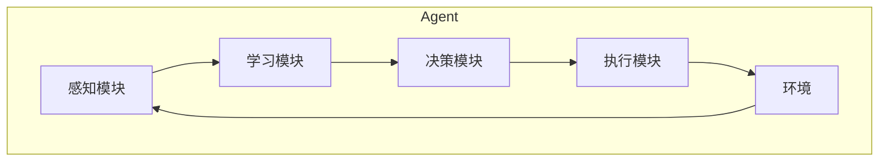

# AI人工智能深度学习算法：智能深度学习代理的代理通信与协作模型概览

## 1.背景介绍

### 1.1 人工智能的发展历程

人工智能(Artificial Intelligence, AI)是当代科学技术发展的前沿领域,它的目标是研究人工系统具有类似于人类智能的行为,如学习、推理、规划、问题求解和语言理解等。人工智能的发展经历了几个重要阶段:

- 20世纪50年代,人工智能作为一个独立的研究领域正式诞生。
- 20世纪80年代,专家系统和机器学习方法开始兴起。
- 21世纪初,受益于计算能力和数据量的飞速增长,机器学习算法取得了重大突破,尤其是深度学习技术的兴起,推动了人工智能的蓬勃发展。

### 1.2 深度学习的兴起

深度学习(Deep Learning)是机器学习研究中的一个新的领域,它模仿人脑的机制来解释数据,例如图像、声音和文本。深度学习可以从原始输入数据中自动学习特征表示,并基于这些表示进行模式分析和预测。

深度学习的核心是基于人工神经网络,通过构建具有多个隐藏层的神经网络模型,并利用大量数据对模型进行训练,从而学习数据的内在特征表示。常见的深度学习模型包括卷积神经网络(CNN)、循环神经网络(RNN)、长短期记忆网络(LSTM)等。

随着算力的不断提升和大数据时代的到来,深度学习技术在计算机视觉、自然语言处理、语音识别等领域取得了突破性进展,推动了人工智能的快速发展。

### 1.3 智能代理与多代理系统

在人工智能领域,代理(Agent)是一个广泛使用的概念。智能代理是指能够感知环境,并根据环境状态做出理性决策和行为的自主实体。单个智能代理通常难以完成复杂的任务,因此需要多个智能代理协同工作,形成多代理系统(Multi-Agent System, MAS)。

多代理系统由多个相互协作的智能代理组成,每个代理都具有自主性、社会能力和响应能力。代理之间需要进行通信和协作,以实现共同的目标。多代理系统在复杂环境下具有优势,如分布式问题求解、资源分配、协作决策等。

## 2.核心概念与联系

### 2.1 深度学习智能代理

深度学习智能代理是指采用深度学习技术构建的智能代理。深度学习赋予了智能代理强大的感知、学习和决策能力,使其能够从复杂的环境数据中自动提取特征,并基于这些特征做出合理的决策和行为。

深度学习智能代理通常包括以下几个核心组件:

1. **感知模块**: 使用深度学习模型(如CNN、RNN等)从环境数据(如图像、语音等)中提取特征。
2. **学习模块**: 基于强化学习等技术,从环境反馈中不断优化决策策略。
3. **决策模块**: 根据感知和学习得到的信息,做出理性决策。
4. **执行模块**: 将决策转化为具体的行为,作用于环境。

### 2.2 代理通信与协作

在多代理系统中,代理之间需要进行通信和协作,以实现共同的目标。代理通信是指代理之间交换信息和知识的过程,而代理协作是指代理之间协调行为以完成任务的过程。

代理通信可以采用不同的通信语言和协议,如知识查询与操作语言(KQML)、代理通信语言(ACL)等。代理协作则涉及到协作策略的设计,如协商、竞争、合作等。

代理通信与协作模型描述了代理之间如何交换信息、协调行为的机制和规则。设计高效的代理通信与协作模型,对于构建高性能的多代理系统至关重要。

### 2.3 深度学习代理的通信与协作

将深度学习技术应用于多代理系统,可以赋予代理更强的感知、学习和决策能力。但同时也带来了新的挑战,如何在保证代理自主性的同时,实现高效的代理通信与协作?如何利用深度学习技术优化代理通信与协作模型?

深度学习代理的通信与协作模型需要考虑以下几个方面:

1. **通信内容表示**: 如何利用深度学习模型高效地表示和理解通信内容?
2. **通信策略学习**: 如何让代理自主学习通信策略,实现高效通信?
3. **协作策略学习**: 如何让代理自主学习协作策略,实现高效协作?
4. **模型共享与迁移**: 如何在代理之间共享和迁移学习模型,提高系统效率?

## 3.核心算法原理具体操作步骤 

### 3.1 深度学习代理架构

深度学习代理的基本架构如下图所示:

1. **感知模块**:使用深度学习模型(如CNN、RNN等)从环境数据(如图像、语音等)中提取特征,将原始数据转换为内部表示。
2. **学习模块**:基于强化学习等技术,从环境反馈中不断优化决策策略,实现持续学习。
3. **决策模块**:根据感知和学习得到的信息,做出理性决策,决定下一步行为。
4. **执行模块**:将决策转化为具体的行为,作用于环境,改变环境状态。
5. **环境**:代理所处的外部世界,提供观测数据和反馈信号。

### 3.2 深度学习代理通信模型

在多代理系统中,代理之间需要进行通信以交换信息和知识。深度学习代理通信模型的核心思想是:利用深度学习技术自动学习高效的通信内容表示和通信策略。

通信内容表示学习的步骤如下:

1. 构建一个序列到序列(Seq2Seq)的神经网络模型,如编码器-解码器模型。
2. 将发送方代理的观测数据作为输入序列,将需要传递的信息作为目标序列。
3. 在训练数据集上训练该模型,使其学习将观测数据映射为高效的通信内容表示。
4. 在通信时,发送方代理将观测数据输入编码器,得到通信内容表示,再将表示输入解码器,生成实际的通信消息。

通信策略学习的步骤如下:

1. 将代理通信建模为马尔可夫决策过程(MDP),其中状态为代理的局部观测,行为为发送或不发送通信消息。
2. 使用深度强化学习算法(如Deep Q-Network)训练一个策略网络,输入为代理的局部观测,输出为发送或不发送消息的概率。
3. 代理根据学习到的策略网络,决定是否需要与其他代理进行通信。

### 3.3 深度学习代理协作模型

在多代理系统中,代理之间需要协调行为以完成共同的任务。深度学习代理协作模型的核心思想是:利用深度学习技术自动学习高效的协作策略。

协作策略学习的步骤如下:

1. 将多代理协作建模为多智能体马尔可夫游戏,其中每个代理为一个智能体,状态为所有代理的联合观测,行为为所有代理的联合行为。
2. 使用多智能体深度强化学习算法(如多智能体深度确定性策略梯度MADDPG)训练一个策略网络,输入为代理的局部观测,输出为代理的行为概率分布。
3. 代理根据学习到的策略网络,选择行为并与其他代理协作完成任务。

在协作过程中,代理还可以通过模型共享和迁移学习技术,提高学习效率和协作效率。

### 3.4 算法示例:深度多智能体强化学习

以下是一个基于深度多智能体强化学习的协作策略学习算法示例(MADDPG):

1. 初始化每个代理的策略网络和价值网络,网络参数为随机值。
2. 对于每个训练episode:
    - 重置环境,获取初始状态
    - 对于每个时间步:
        - 对于每个代理:
            - 根据当前策略网络选择行为
            - 执行选择的行为,获取下一状态、奖励和是否结束
            - 将(状态,行为,奖励,下一状态)存入经验回放池
        - 从经验回放池中采样一批数据
        - 对于每个代理:
            - 更新价值网络,最小化TD误差
            - 更新策略网络,使行为最大化价值网络的输出
3. 直到算法收敛或达到最大训练步数

在训练过程中,每个代理都在学习自己的策略网络和价值网络,但它们的目标是最大化所有代理的总体奖励,从而实现协作。MADDPG算法通过中央化训练和分布式执行的方式,实现了高效的多智能体协作策略学习。

## 4.数学模型和公式详细讲解举例说明

### 4.1 马尔可夫决策过程(MDP)

马尔可夫决策过程(Markov Decision Process, MDP)是强化学习中常用的数学模型,用于描述智能体(代理)与环境的交互过程。MDP由以下几个要素组成:

- 状态集合 $\mathcal{S}$
- 行为集合 $\mathcal{A}$
- 转移概率 $\mathcal{P}_{ss'}^a = \mathbb{P}(s' | s, a)$,表示在状态 $s$ 执行行为 $a$ 后,转移到状态 $s'$ 的概率
- 奖励函数 $\mathcal{R}_s^a = \mathbb{E}[r | s, a]$,表示在状态 $s$ 执行行为 $a$ 后,获得的期望奖励
- 折扣因子 $\gamma \in [0, 1]$,用于平衡即时奖励和长期奖励

智能体的目标是学习一个策略 $\pi: \mathcal{S} \rightarrow \mathcal{A}$,使得期望的累计折扣奖励最大化:

$$J(\pi) = \mathbb{E}_\pi \left[ \sum_{t=0}^\infty \gamma^t r_t \right]$$

其中 $r_t$ 是在时间步 $t$ 获得的奖励。

### 4.2 Q-Learning

Q-Learning是一种基于价值迭代的强化学习算法,用于求解MDP中的最优策略。Q-Learning定义了状态-行为值函数 $Q(s, a)$,表示在状态 $s$ 执行行为 $a$ 后,可获得的期望累计折扣奖励。

Q-Learning算法的更新规则为:

$$Q(s_t, a_t) \leftarrow Q(s_t, a_t) + \alpha \left[ r_t + \gamma \max_{a'} Q(s_{t+1}, a') - Q(s_t, a_t) \right]$$

其中 $\alpha$ 是学习率,用于控制更新步长。

在Q-Learning算法中,智能体通过不断探索和更新Q值,最终可以找到最优策略 $\pi^*(s) = \arg\max_a Q^*(s, a)$。

### 4.3 深度Q网络(DQN)

深度Q网络(Deep Q-Network, DQN)是将Q-Learning与深度神经网络相结合的算法,用于解决高维观测空间和连续行为空间的强化学习问题。

DQN算法的核心思想是使用一个深度神经网络 $Q(s, a; \theta)$ 来近似状态-行为值函数,其中 $\theta$ 是网络参数。网络的输入是状态 $s$,输出是所有可能行为的Q值。

在训练过程中,DQN算法从经验回放池中采样一批数据 $(s_t, a_t, r_t, s_{t+1})$,并最小化以下损失函数:

$$L(\theta) = \mathbb{E}_{(s_t, a_t, r_t, s_{t+1})} \left[ \left( r_t + \gamma \max_{a'} Q(s_{t+1}, a'; \theta^-) - Q(s_t, a_t; \theta) \right)^2 