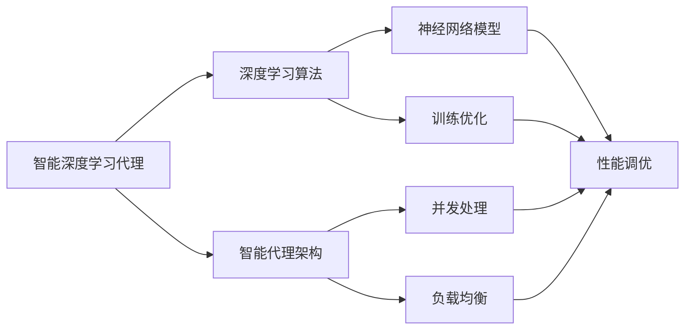

# AI人工智能深度学习算法：智能深度学习代理的高并发场景下的性能调优

## 1.背景介绍
随着人工智能技术的快速发展,深度学习算法在各个领域都得到了广泛应用。特别是在高并发、大规模的生产环境中,深度学习模型的性能优化变得尤为重要。本文将围绕智能深度学习代理在高并发场景下的性能调优展开讨论,深入探讨相关的核心概念、算法原理、数学模型以及实践经验,为相关从业者提供参考和指导。

### 1.1 人工智能与深度学习的发展现状
#### 1.1.1 人工智能技术的兴起与应用
#### 1.1.2 深度学习算法的突破与优势
#### 1.1.3 深度学习在各领域的广泛应用

### 1.2 高并发场景下的性能挑战  
#### 1.2.1 高并发环境的特点与挑战
#### 1.2.2 深度学习模型在高并发场景下的性能瓶颈
#### 1.2.3 性能优化的必要性与意义

## 2.核心概念与联系
要理解智能深度学习代理在高并发场景下的性能调优,需要先了解一些核心概念及其之间的联系。

### 2.1 智能深度学习代理
#### 2.1.1 智能代理的定义与特点 
#### 2.1.2 深度学习在智能代理中的应用
#### 2.1.3 智能深度学习代理的架构与工作原理

### 2.2 高并发与性能调优
#### 2.2.1 高并发的概念与度量指标
#### 2.2.2 性能调优的目标与原则 
#### 2.2.3 常见的性能调优方法与工具

### 2.3 核心概念之间的联系
#### 2.3.1 智能深度学习代理与高并发的关系
#### 2.3.2 性能调优在智能深度学习代理中的作用
#### 2.3.3 核心概念之间的交互与影响

## 3.核心算法原理具体操作步骤
智能深度学习代理的性能调优涉及多个方面,包括深度学习算法的优化、智能代理架构的设计以及高并发处理技术的应用等。下面将分别介绍几个核心算法的原理和具体操作步骤。

### 3.1 深度学习模型的优化
#### 3.1.1 模型压缩与加速
##### 3.1.1.1 剪枝(Pruning)
##### 3.1.1.2 量化(Quantization)
##### 3.1.1.3 知识蒸馏(Knowledge Distillation)
#### 3.1.2 模型并行与数据并行  
##### 3.1.2.1 模型并行(Model Parallelism)
##### 3.1.2.2 数据并行(Data Parallelism)
#### 3.1.3 计算图优化
##### 3.1.3.1 静态计算图
##### 3.1.3.2 动态计算图
##### 3.1.3.3 计算图编译优化

### 3.2 智能代理的并发优化 
#### 3.2.1 多线程并发
##### 3.2.1.1 线程池
##### 3.2.1.2 异步任务
##### 3.2.1.3 并发队列
#### 3.2.2 分布式并行计算
##### 3.2.2.1 参数服务器(Parameter Server)
##### 3.2.2.2 AllReduce 通信
##### 3.2.2.3 Ring AllReduce
#### 3.2.3 异构计算加速
##### 3.2.3.1 GPU 加速
##### 3.2.3.2 FPGA 加速
##### 3.2.3.3 TPU 加速

### 3.3 核心算法的操作步骤
#### 3.3.1 深度学习模型优化的步骤
#### 3.3.2 智能代理并发优化的步骤
#### 3.3.3 异构计算加速的步骤

## 4.数学模型和公式详细讲解举例说明
为了更好地理解智能深度学习代理性能调优背后的原理,需要对一些关键的数学模型和公式进行详细讲解和举例说明。

### 4.1 深度学习中的数学模型
#### 4.1.1 前向传播与反向传播
$$ a^{(l)} = \sigma(z^{(l)}) = \sigma(W^{(l)}a^{(l-1)} + b^{(l)}) $$
$$ \frac{\partial C}{\partial W^{(l)}} = \frac{\partial z^{(l)}}{\partial W^{(l)}} \cdot \frac{\partial a^{(l)}}{\partial z^{(l)}} \cdot \frac{\partial C}{\partial a^{(l)}} $$
#### 4.1.2 损失函数与优化算法
$$ J(\theta) = -\frac{1}{m} \sum_{i=1}^{m} \left[ y^{(i)} \log(h_{\theta}(x^{(i)})) + (1 - y^{(i)}) \log(1 - h_{\theta}(x^{(i)}))\right] + \frac{\lambda}{2m} \sum_{j=1}^{n} \theta_{j}^2 $$
$$ \theta := \theta - \alpha \nabla J(\theta) $$

### 4.2 高并发中的数学模型 
#### 4.2.1 排队论模型
$$ \rho = \frac{\lambda}{\mu} $$
$$ L_q = \frac{\rho^2}{1-\rho} $$
$$ W_q = \frac{L_q}{\lambda} = \frac{\rho}{\mu(1-\rho)} $$
#### 4.2.2 Amdahl定律与Gustafson定律
$$ S_{\text{Amdahl}} = \frac{1}{(1-p) + \frac{p}{n}} $$
$$ S_{\text{Gustafson}} = n - (n-1)p $$

### 4.3 举例说明
#### 4.3.1 深度学习数学模型的应用举例
#### 4.3.2 高并发数学模型的应用举例
#### 4.3.3 性能调优中的数学分析示例

## 5.项目实践：代码实例和详细解释说明
为了将理论与实践相结合,下面通过几个具体的代码实例来演示智能深度学习代理性能调优的关键技术和实现细节。

### 5.1 深度学习模型优化的代码实例
#### 5.1.1 模型压缩与加速的代码实现
#### 5.1.2 模型并行与数据并行的代码实现 
#### 5.1.3 计算图优化的代码实现

### 5.2 智能代理并发优化的代码实例
#### 5.2.1 多线程并发的代码实现
#### 5.2.2 分布式并行计算的代码实现
#### 5.2.3 异构计算加速的代码实现

### 5.3 代码详细解释说明
#### 5.3.1 关键函数和类的说明
#### 5.3.2 重要参数和配置的说明
#### 5.3.3 运行结果与性能分析

## 6.实际应用场景
智能深度学习代理的性能调优技术在许多实际应用场景中都发挥着重要作用,下面列举几个典型的应用案例。

### 6.1 大规模在线推荐系统
#### 6.1.1 应用背景与挑战
#### 6.1.2 深度学习模型的应用与优化
#### 6.1.3 高并发请求的处理与性能调优

### 6.2 智能语音交互系统
#### 6.2.1 应用背景与挑战  
#### 6.2.2 语音识别与自然语言处理模型的应用
#### 6.2.3 实时响应的并发优化方案

### 6.3 自动驾驶决策系统
#### 6.3.1 应用背景与挑战
#### 6.3.2 感知、规划、控制模型的应用  
#### 6.3.3 车载设备的计算性能优化

## 7.工具和资源推荐
为了方便读者进一步学习和实践智能深度学习代理的性能调优,这里推荐一些常用的工具和资源。

### 7.1 深度学习框架
#### 7.1.1 TensorFlow
#### 7.1.2 PyTorch
#### 7.1.3 Keras

### 7.2 性能优化工具
#### 7.2.1 TensorRT
#### 7.2.2 ONNX Runtime
#### 7.2.3 TVM

### 7.3 学习资源
#### 7.3.1 在线课程
#### 7.3.2 学术论文
#### 7.3.3 开源项目

## 8.总结：未来发展趋势与挑战
智能深度学习代理的性能调优是一个充满机遇和挑战的研究方向,未来还有许多值得探索的问题和发展趋势。

### 8.1 智能代理架构的演进
#### 8.1.1 轻量化与模块化
#### 8.1.2 自适应与自学习能力
#### 8.1.3 安全与隐私保护

### 8.2 深度学习算法的创新
#### 8.2.1 更高效的模型压缩方法 
#### 8.2.2 更灵活的计算图优化技术
#### 8.2.3 更智能的神经网络架构搜索

### 8.3 并行计算的新趋势
#### 8.3.1 异构计算集群的协同优化
#### 8.3.2 新型硬件加速器的支持
#### 8.3.3 云边端协同的分布式计算范式

## 9.附录：常见问题与解答
为了帮助读者解决学习和实践过程中可能遇到的问题,这里整理了一些常见问题及其解答。

### 9.1 如何选择适合的深度学习模型？
### 9.2 如何评估智能代理的性能瓶颈？
### 9.3 如何平衡模型精度和推理速度？
### 9.4 如何进行分布式训练的调度与通信优化？
### 9.5 如何避免过拟合和欠拟合？

作者：禅与计算机程序设计艺术 / Zen and the Art of Computer Programming