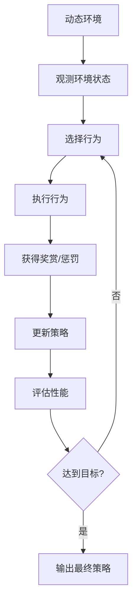

# AI代理在动态环境中的适应与学习工作流

## 1.背景介绍

在当今快节奏的数字时代,人工智能(AI)代理在各个领域扮演着越来越重要的角色。无论是智能助手、自动驾驶汽车、机器人还是游戏AI,它们都需要在高度动态和不确定的环境中运行。这些环境通常具有复杂性、非线性和随机性,给AI代理的适应性和学习能力带来了巨大挑战。

适应性和学习能力对于AI代理在动态环境中取得成功至关重要。适应性使代理能够根据环境的变化做出相应的调整,而学习能力则使其能够从经验中积累知识,不断优化决策和行为。传统的规则基础或基于模型的方法往往难以应对这种动态复杂环境,因此需要更加智能和自主的学习范例。

## 2.核心概念与联系

### 2.1 动态环境

动态环境指的是随时间不断变化的环境,其特点包括:

- 部分可观测性(Partial Observability):代理无法完全观测到环境的所有状态
- 非确定性(Non-Determinism):相同的行为在不同状态下可能产生不同的结果
- 连续性(Continuity):环境状态和代理行为都是连续的,而不是离散的
- 多智能体(Multi-Agent):环境中存在多个智能体,它们的行为会相互影响

### 2.2 适应性学习

适应性学习旨在使AI代理能够根据动态环境的变化自主调整其行为策略,以达到最优的目标。它包括以下几个关键概念:

- 策略搜索(Policy Search):在一定策略空间内搜索最优策略
- 在线学习(Online Learning):代理在与环境交互的同时持续学习和更新策略
- 元学习(Meta-Learning):学习如何更好地学习,提高学习效率
- 多任务学习(Multi-Task Learning):同时学习多个相关任务,提高泛化能力
- 迁移学习(Transfer Learning):利用已学习的知识加速新任务的学习

### 2.3 强化学习

强化学习(Reinforcement Learning)是适应性学习的一种重要范式。它通过代理与环境的交互,根据获得的奖赏信号来优化策略,使代理能够采取最佳行为序列以maximizize期望回报。强化学习算法如Q-Learning、策略梯度等在动态环境中得到了广泛应用。

### 2.4 Mermaid流程图

以下是AI代理在动态环境中适应与学习的核心工作流程:



## 3.核心算法原理具体操作步骤

适应性学习算法通常遵循以下步骤在动态环境中优化代理的策略:

1. **初始化**:设置初始策略、超参数等,构建代理与环境的交互接口
2. **观测**:代理观测当前环境状态
3. **选择行为**:根据当前策略,代理选择一个行为
4. **执行行为**:代理在环境中执行选择的行为
5. **获得反馈**:环境根据代理的行为给出奖赏/惩罚反馈
6. **更新策略**:利用反馈信号,代理更新策略参数
7. **评估性能**:评估当前策略在环境中的表现
8. **终止条件检查**:如果达到预设目标或步数上限,输出最终策略,否则回到步骤2,重复上述过程

其中步骤3、6是算法的核心部分,不同的算法在这两个步骤上有所差异。

## 4.数学模型和公式详细讲解举例说明

### 4.1 马尔可夫决策过程(MDP)

马尔可夫决策过程是形式化描述代理与环境交互的重要数学模型,定义为一个五元组 $\langle \mathcal{S}, \mathcal{A}, \mathcal{P}, \mathcal{R}, \gamma\rangle$:

- $\mathcal{S}$是环境的状态集合
- $\mathcal{A}$是代理的行为集合  
- $\mathcal{P}(s',s,a)=\Pr(s_{t+1}=s'\mid s_t=s, a_t=a)$是状态转移概率
- $\mathcal{R}(s,a)$是在状态$s$执行行为$a$后获得的奖励
- $\gamma \in [0,1)$是折现因子,用于权衡即时奖励和长期回报

代理的目标是找到一个策略$\pi: \mathcal{S} \rightarrow \mathcal{A}$,使期望回报最大:

$$
J(\pi) = \mathbb{E}_\pi\left[\sum_{t=0}^\infty \gamma^t R(s_t, a_t)\right]
$$

### 4.2 Q-Learning

Q-Learning是一种基于价值函数的强化学习算法,它试图直接估计在某个状态执行某个行为后,可获得的最大期望回报$Q(s,a)$。算法遵循贝尔曼最优方程:

$$
Q^*(s,a) = \mathbb{E}_{s'\sim \mathcal{P}(\cdot\mid s,a)}\left[R(s,a) + \gamma \max_{a'} Q^*(s',a')\right]
$$

使用下面的迭代式来更新$Q$值:

$$
Q(s_t,a_t) \leftarrow Q(s_t,a_t) + \alpha\left(R(s_t,a_t) + \gamma \max_{a'}Q(s_{t+1},a') - Q(s_t,a_t)\right)
$$

其中$\alpha$是学习率。通过不断与环境交互并更新$Q$值,最终可以得到最优策略$\pi^*(s)=\arg\max_aQ^*(s,a)$。

### 4.3 策略梯度算法

策略梯度算法直接对策略$\pi_\theta$的参数$\theta$进行优化,以最大化期望回报$J(\pi_\theta)$。根据策略梯度定理:

$$
\nabla_\theta J(\pi_\theta) = \mathbb{E}_{\pi_\theta}\left[\nabla_\theta\log\pi_\theta(a\mid s)Q^{\pi_\theta}(s,a)\right]
$$

可以使用以下迭代式进行参数更新:

$$
\theta \leftarrow \theta + \alpha \nabla_\theta\log\pi_\theta(a_t\mid s_t)(R_t + \gamma Q^{\pi_\theta}(s_{t+1},a_{t+1}))
$$

其中$\alpha$是学习率,$R_t$是即时奖励,$Q^{\pi_\theta}$可以由另一个函数估计器来近似。

## 5.项目实践:代码实例和详细解释说明

为了更好地理解适应性学习在动态环境中的应用,我们将使用Python和OpenAI Gym环境构建一个简单的示例项目。

### 5.1 环境设置

我们选择Gym中的`CartPole-v1`环境,这是一个经典的控制问题。代理需要通过左右移动小车来使杆子保持直立,直到达到设定的时间步数。

```python
import gym
env = gym.make('CartPole-v1')
```

### 5.2 Q-Learning实现

我们首先使用Q-Learning算法来解决这个问题。

```python
import numpy as np

# 初始化Q表
Q = np.zeros((env.observation_space.shape[0], env.action_space.n))

# 超参数设置
alpha = 0.1 # 学习率
gamma = 0.99 # 折现因子
epsilon = 0.1 # 探索率

# 训练
for episode in range(1000):
    state = env.reset()
    done = False
    while not done:
        # 选择行为
        if np.random.uniform() < epsilon:
            action = env.action_space.sample()
        else:
            action = np.argmax(Q[state])
        
        # 执行行为并获取反馈
        next_state, reward, done, _ = env.step(action)
        
        # 更新Q值
        Q[state, action] += alpha * (reward + gamma * np.max(Q[next_state]) - Q[state, action])
        
        state = next_state

# 测试
state = env.reset()
while True:
    env.render()
    action = np.argmax(Q[state])
    state, _, done, _ = env.step(action)
    if done:
        break
        
env.close()
```

在这个实现中,我们初始化了一个Q表,用于存储每个状态-行为对的Q值。在训练过程中,我们使用$\epsilon$-贪婪策略选择行为,执行后获得反馈,并根据Q-Learning更新规则更新Q表。经过足够的训练后,我们可以使用贪婪策略在环境中测试最终的策略。

### 5.3 策略梯度实现

接下来,我们使用策略梯度算法解决同一问题。

```python
import torch
import torch.nn as nn
import torch.optim as optim

# 定义策略网络
class PolicyNet(nn.Module):
    def __init__(self, state_dim, action_dim):
        super(PolicyNet, self).__init__()
        self.fc1 = nn.Linear(state_dim, 128)
        self.fc2 = nn.Linear(128, action_dim)

    def forward(self, x):
        x = torch.relu(self.fc1(x))
        x = self.fc2(x)
        return x

# 初始化
policy_net = PolicyNet(env.observation_space.shape[0], env.action_space.n)
optimizer = optim.Adam(policy_net.parameters(), lr=0.001)

# 训练
for episode in range(1000):
    state = env.reset()
    episode_reward = 0
    while True:
        # 选择行为
        state_tensor = torch.from_numpy(state).float().unsqueeze(0)
        action_scores = policy_net(state_tensor)
        action_probs = nn.functional.softmax(action_scores, dim=-1)
        action_dist = torch.distributions.Categorical(action_probs)
        action = action_dist.sample()
        
        # 执行行为并获取反馈
        next_state, reward, done, _ = env.step(action.item())
        episode_reward += reward
        
        # 更新策略
        optimizer.zero_grad()
        action_scores = policy_net(state_tensor)
        action_probs = nn.functional.softmax(action_scores, dim=-1)
        action_dist = torch.distributions.Categorical(action_probs)
        log_probs = action_dist.log_prob(action)
        loss = -log_probs * reward
        loss.backward()
        optimizer.step()
        
        if done:
            break
        state = next_state

# 测试
state = env.reset()
while True:
    env.render()
    state_tensor = torch.from_numpy(state).float().unsqueeze(0)
    action_scores = policy_net(state_tensor)
    action = torch.argmax(action_scores, dim=-1).item()
    state, _, done, _ = env.step(action)
    if done:
        break
        
env.close()
```

在这个实现中,我们定义了一个简单的策略网络,输入是环境状态,输出是每个行为的分数。在训练过程中,我们根据策略网络的输出选择行为,执行后获得反馈,并使用策略梯度更新网络参数。测试时,我们选择分数最高的行为作为输出。

## 6.实际应用场景

适应性学习在诸多动态环境中发挥着重要作用,包括但不限于:

### 6.1 机器人控制

机器人需要在复杂的物理环境中运动和操作,面临着不确定性、连续性和多智能体等挑战。适应性学习可以使机器人根据环境变化自主调整运动轨迹和动作序列,提高任务完成效率。

### 6.2 自动驾驶

自动驾驶汽车必须在复杂的交通环境中安全行驶,需要时刻关注道路状况、其他车辆和行人的动态变化。适应性学习算法可以帮助汽车实时调整车速、转向等决策,以避免潜在危险。

### 6.3 游戏AI

游戏环境通常是高度动态和不确定的,玩家的行为也在不断变化。适应性学习可以使游戏AI根据对手策略的变化自主调整自身策略,提升游戏体验。

### 6.4 智能调度

在制造、物流等领域,经常需要根据实时的供需变化对资源进行动态调度和优化。适应性学习可以帮助构建智能调度系统,提高资源利用效率。

### 6.5 金融交易

金融市场具有高度的动态性和不确定性,适应性学习可以应用于自动交易系统,根据市场行情实时调整交