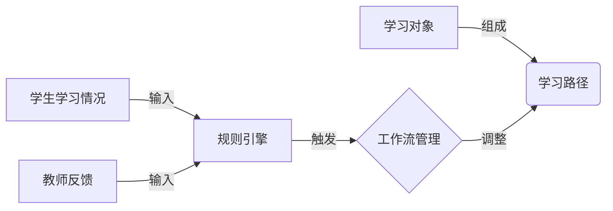

# AI代理在教育技术中的适应性工作流案例

## 1.背景介绍

随着人工智能(AI)技术的不断发展,AI代理系统已经逐渐渗透到各个领域,教育技术也不例外。AI代理可以通过自然语言处理、机器学习等技术,为学生和教师提供个性化的学习体验和智能辅助。本文将探讨如何在教育技术中应用AI代理,并介绍一种适应性工作流的设计方案。

### 1.1 AI代理在教育中的作用

AI代理在教育技术中可以发挥以下作用:

- 个性化学习辅助:根据学生的知识水平、学习风格等,提供个性化的学习资源和路径规划。
- 智能问答系统:回答学生的课程相关问题,辅助教师解答常见问题。
- 自动评分和反馈:对学生的作业、测试等进行自动批改和反馈。
- 学习数据分析:分析学生的学习行为数据,发现学习模式并提供改进建议。
- 课程内容优化:根据学生的反馈和学习效果,优化课程内容和教学方式。

### 1.2 适应性工作流概念

适应性工作流(Adaptive Workflow)是一种灵活的流程管理方法,可以根据实际情况动态调整流程。在教育技术中,适应性工作流可以根据学生的学习情况、教师的反馈等,动态调整学习路径、教学内容等,从而提供更加个性化和高效的学习体验。

## 2.核心概念与联系

适应性工作流在教育技术中的应用涉及以下几个核心概念:

### 2.1 学习对象

学习对象(Learning Object)是指可复用的数字化学习资源,如课件、视频、测验题库等。学习对象是构建个性化学习路径的基础单元。

### 2.2 学习路径

学习路径(Learning Path)是由多个学习对象按照一定顺序组成的学习流程,描述了学生完成某个知识点或课程的学习过程。

### 2.3 规则引擎

规则引擎(Rule Engine)是一种基于预定义规则对事件进行处理的系统。在适应性工作流中,规则引擎用于根据学生的学习情况、教师反馈等事件,动态调整学习路径。

### 2.4 工作流管理

工作流管理(Workflow Management)负责协调整个适应性工作流的执行,包括学习对象的组织、学习路径的动态调整、规则引擎的触发等。

### 2.5 关系图

上述核心概念之间的关系可以用下图表示:



## 3.核心算法原理具体操作步骤

适应性工作流在教育技术中的应用需要以下几个关键步骤:

### 3.1 构建学习对象库

首先需要将各种形式的学习资源(课件、视频、测验等)标准化为可复用的学习对象,并建立学习对象库。每个学习对象需要标注元数据,如知识点、难度级别等,以便后续组织成学习路径。

### 3.2 设计初始学习路径

根据课程大纲、教学目标等,设计出初始的学习路径。一个学习路径可以包含理论知识的学习对象和实践练习的学习对象。

### 3.3 定义规则集

设计一系列规则,用于根据学生的学习情况(如测验成绩、学习行为等)和教师的反馈,动态调整学习路径。常见的规则包括:

- 若学生在某个知识点的测验成绩低于阈值,则增加相关练习题的学习对象。
- 若学生在某个知识点的学习时间过长,则提供更多实例说明和视频讲解。
- 若教师反馈某部分内容需要加强,则增加相关学习对象。

### 3.4 工作流执行

1. 学生按照初始学习路径开始学习。
2. 系统记录学生的学习行为数据,如测验成绩、学习时间等。
3. 规则引擎根据学习行为数据和教师反馈,触发相应的规则。
4. 工作流管理模块根据规则引擎的指令,动态调整当前学习路径,如增加、删除或重排序学习对象。
5. 学生按照调整后的学习路径继续学习。

### 3.5 反馈与优化

在整个过程中,系统会持续收集学生的学习数据和教师的反馈,用于优化规则集、调整学习对象库和改进学习路径设计,形成一个闭环的优化过程。

该算法的伪代码描述如下:

```
初始化学习对象库和初始学习路径
while 学习路径未完成:
    学生学习当前学习对象
    记录学习行为数据
    if 规则引擎触发:
        工作流管理模块调整学习路径
    else:
        继续当前学习路径
收集反馈数据
优化学习对象库、学习路径设计和规则集
```

## 4.数学模型和公式详细讲解举例说明

在适应性工作流中,我们可以使用一些数学模型来量化学生的学习情况,并将其作为规则引擎的输入,从而更精准地调整学习路径。

### 4.1 知识状态追踪模型

知识状态追踪(Knowledge Tracing)模型旨在估计学生对每个知识概念的掌握程度。一种常用的模型是基于Bayesian知识追踪(BKT)的模型,它使用隐马尔可夫模型(HMM)来表示学生的知识状态。

在BKT模型中,学生对每个知识概念有两种可能的状态:已掌握(Mastered)或未掌握(Unmastered)。学生回答题目的正确与否,取决于其当前的知识状态和题目的难度等因素。

我们用 $q_{ij}$ 表示学生 $i$ 对知识概念 $j$ 的掌握状态,其中 $q_{ij}=1$ 表示已掌握, $q_{ij}=0$ 表示未掌握。每次学生回答题目后,模型会根据题目的正确与否,更新 $q_{ij}$ 的概率值。

状态转移概率由以下公式给出:

$$
P(q_{ij}=1|q_{i(j-1)}=0,r_{ij}=1) = P(T)\\
P(q_{ij}=0|q_{i(j-1)}=1,r_{ij}=0) = P(G)\\
P(q_{ij}=q_{i(j-1)}|r_{ij}) = 1 - P(T) \text{ 或 } 1 - P(G)
$$

其中:
- $P(T)$ 是学习概念 $j$ 的转移概率,表示从未掌握转为掌握的概率。
- $P(G)$ 是遗忘概率,表示从已掌握转为未掌握的概率。
- $r_{ij}$ 是学生 $i$ 在概念 $j$ 的题目上的回答,正确为1,错误为0。

根据 $q_{ij}$ 的值,我们可以估计学生对每个知识点的掌握程度,并将其作为规则引擎的输入,从而调整学习路径。例如,如果 $q_{ij}$ 值较低,则可以增加相关知识点的练习题。

### 4.2 学习效率模型

除了知识状态,我们还可以考虑学生的学习效率,即学生掌握新知识的速度。一种常用的学习效率模型是Additive Factors Model (AFM)。

AFM模型将学生对题目作答的正确率建模为以下形式:

$$
P(r_{ij}=1|q_{ij},s_i,d_j) = P(T)^{q_{ij}}(1-P(G))^{1-q_{ij}}(1-s_i)(1-d_j)
$$

其中:
- $r_{ij}$ 是学生 $i$ 在概念 $j$ 的题目上的回答,正确为1,错误为0。
- $q_{ij}$ 是学生 $i$ 对知识概念 $j$ 的掌握状态。
- $s_i$ 是学生 $i$ 的学习效率参数,取值范围 $[0,1]$,值越大表示学习效率越高。
- $d_j$ 是概念 $j$ 的难度参数,取值范围 $[0,1]$,值越大表示难度越高。

通过对学生的作答数据进行拟合,我们可以估计每个学生的学习效率参数 $s_i$。如果发现某些学生的学习效率较低,则可以考虑为他们提供更多实例说明和视频讲解,帮助提高学习效率。

以上两种模型均可以为规则引擎提供有价值的输入,从而更好地调整学习路径,提高学习效果。

## 5.项目实践:代码实例和详细解释说明

为了更好地理解适应性工作流在教育技术中的应用,我们提供了一个基于Python的简单实现示例。

### 5.1 定义学习对象和学习路径

首先,我们定义学习对象和学习路径的数据结构:

```python
class LearningObject:
    def __init__(self, name, topic, type, difficulty):
        self.name = name
        self.topic = topic
        self.type = type  # 'theory' or 'practice'
        self.difficulty = difficulty  # 0-1

class LearningPath:
    def __init__(self, name, objects):
        self.name = name
        self.objects = objects  # list of LearningObject
```

### 5.2 实现规则引擎

下面是一个简单的规则引擎实现,根据学生的测验成绩调整学习路径:

```python
class RuleEngine:
    def __init__(self, threshold):
        self.threshold = threshold  # 测验成绩阈值

    def apply_rules(self, student, learning_path):
        new_path = learning_path.objects.copy()
        for i, obj in enumerate(learning_path.objects):
            if obj.type == 'theory':
                score = student.scores.get(obj.name, 0)
                if score < self.threshold:  # 成绩低于阈值
                    # 增加相关练习题
                    practice_obj = LearningObject(
                        f'Practice for {obj.name}',
                        obj.topic,
                        'practice',
                        obj.difficulty
                    )
                    new_path.insert(i + 1, practice_obj)
        return LearningPath(learning_path.name, new_path)
```

### 5.3 工作流管理

工作流管理模块负责协调整个适应性工作流的执行:

```python
class WorkflowManager:
    def __init__(self, initial_path, rule_engine):
        self.learning_path = initial_path
        self.rule_engine = rule_engine

    def run(self, student):
        for obj in self.learning_path.objects:
            student.learn(obj)
            if obj.type == 'theory':
                score = student.take_test(obj)
                self.learning_path = self.rule_engine.apply_rules(
                    student, self.learning_path
                )
```

### 5.4 学生模拟

为了模拟学生的学习过程,我们定义一个简单的Student类:

```python
class Student:
    def __init__(self, name):
        self.name = name
        self.scores = {}

    def learn(self, obj):
        print(f'{self.name} is learning {obj.name}')

    def take_test(self, obj):
        score = random.randint(0, 100)  # 模拟测验成绩
        self.scores[obj.name] = score
        print(f'{self.name} scored {score} on {obj.name}')
        return score
```

### 5.5 运行示例

最后,我们可以创建一个初始学习路径,并运行适应性工作流:

```python
# 创建学习对象
obj1 = LearningObject('Introduction', 'Topic A', 'theory', 0.3)
obj2 = LearningObject('Concept 1', 'Topic A', 'theory', 0.5)
obj3 = LearningObject('Concept 2', 'Topic A', 'theory', 0.7)

# 创建初始学习路径
initial_path = LearningPath('Learning Path A', [obj1, obj2, obj3])

# 创建规则引擎
rule_engine = RuleEngine(threshold=70)

# 创建工作流管理器
workflow_manager = WorkflowManager(initial_path, rule_engine)

# 创建学生
student = Student('Alice')

# 运行适应性工作流
workflow_manager.run(student)
```

在这个示例中,如果学生在某个理论知识点的测验成绩低于70分,规则引擎会在该知识点后增加相关的练习题。通过这种方式,学