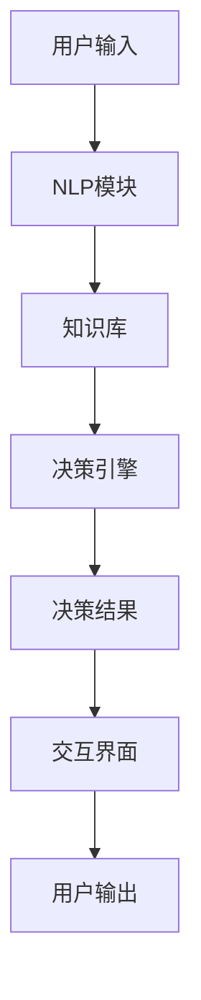
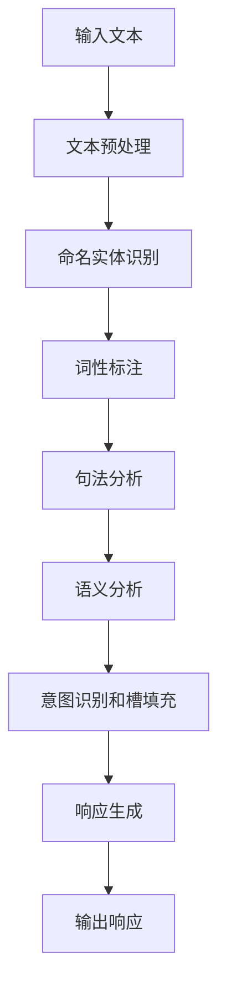
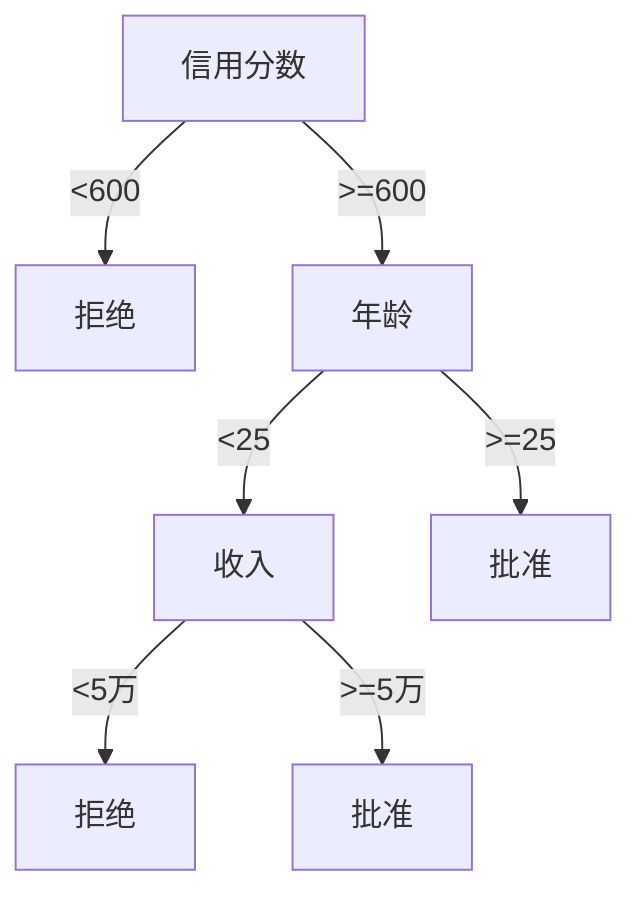

# AI代理在金融服务中的工作流程与风险评估

## 1. 背景介绍

### 1.1 金融服务行业的发展趋势

近年来,金融科技(FinTech)的快速发展正在重塑着传统金融服务行业。随着人工智能(AI)、大数据、云计算等新兴技术的不断融入,金融服务的运营模式和客户体验都发生了翻天覆地的变化。其中,AI代理(AI Agent)作为智能化服务的关键载体,正在金融服务的各个环节扮演着越来越重要的角色。

### 1.2 AI代理在金融服务中的应用价值

AI代理可以通过自然语言处理、机器学习等技术,模拟人类的智能行为,为客户提供个性化的金融咨询、投资组合管理、风险评估等服务。与传统的人工服务相比,AI代理具有7*24小时在线、响应迅速、成本低廉等优势,能够极大提升金融服务的效率和用户体验。

### 1.3 AI代理面临的挑战

尽管AI代理在金融服务中大放异彩,但其工作流程和风险评估仍然是一个值得重视的问题。由于金融服务涉及大量敏感数据和复杂业务逻辑,AI代理在处理过程中可能会出现数据泄露、决策失误等风险,因此需要建立完善的风控机制,确保AI代理的安全可靠运行。

## 2. 核心概念与联系

### 2.1 AI代理的构成

AI代理通常由以下几个核心组件构成:

- 自然语言处理(NLP)模块:用于理解用户的自然语言输入,并生成相应的自然语言响应。
- 知识库:存储领域知识和规则,为AI代理的决策提供支持。
- 决策引擎:根据知识库和用户输入,运行各种算法模型,生成最终的决策结果。
- 交互界面:与用户进行自然语言交互,接收输入并呈现输出结果。

### 2.2 AI代理的工作流程

AI代理在金融服务中的典型工作流程如下:



1. 用户通过自然语言(文本/语音)向AI代理提出金融相关的查询或需求。
2. NLP模块对用户输入进行语义分析和理解,提取关键信息。
3. NLP模块将提取的信息与知识库中的规则和数据进行匹配。
4. 决策引擎基于知识库和NLP模块的输出,运行各种算法模型(如机器学习、规则引擎等),生成最终的决策结果。
5. 决策结果通过交互界面,以自然语言的形式呈现给用户。

### 2.3 AI代理与传统金融服务的区别

相比传统的金融服务模式,AI代理具有以下几个显著的区别和优势:

- 24小时在线服务,无需人工支持
- 个性化服务,根据用户需求提供定制化决策
- 高效率,能够同时处理大量请求
- 低成本,无需雇佣大量人力
- 持续学习和优化,通过数据反馈不断提高决策质量

## 3. 核心算法原理具体操作步骤  

### 3.1 自然语言处理

自然语言处理(NLP)是AI代理的核心能力之一,它使AI代理能够理解和生成自然语言。NLP通常包括以下几个主要步骤:

1. **文本预处理**:对输入文本进行分词、去除停用词、词形还原等预处理,以准备后续的语义分析。

2. **命名实体识别(NER)**:识别出文本中的人名、地名、组织机构名、数字等实体,为语义理解打下基础。

3. **词性标注(POS Tagging)**:对每个词进行词性标注,如名词、动词、形容词等,为句法分析做准备。

4. **句法分析**:根据词性标注和语法规则,分析出句子的句法结构树。

5. **语义分析**:基于命名实体、句法结构树等信息,理解句子的语义含义。

6. **意图识别和槽填充**:确定用户的意图(如查询、转账等),并从语义中提取关键信息(如金额、账户等)填充到对应的槽位中。

7. **响应生成**:根据识别出的意图和槽位信息,从知识库中查找或生成相应的自然语言响应。

以"我想查询一下我的账户余额"为例,NLP模块的处理过程如下:



其中,意图识别结果为"查询账户余额",槽位包括"账户类型=默认账户"。基于此,NLP模块可以从知识库中查找相应的响应模板,并填充具体的账户余额数据,最终生成自然语言响应。

### 3.2 机器学习算法

AI代理的决策引擎中通常会集成多种机器学习算法,用于不同的决策场景。以下是一些常见的算法:

1. **监督学习算法**:
    - 逻辑回归:用于二分类问题,如贷款申请通过与否。
    - 决策树/随机森林:用于分类和回归问题,如信用评分。
    - 支持向量机(SVM):用于分类问题,如欺诈检测。

2. **无监督学习算法**:
    - 聚类算法(K-Means等):用于客户分群、异常检测等。
    - 关联规则挖掘:用于发现交易行为之间的关联模式。

3. **强化学习算法**:
    - Q-Learning等:用于投资组合优化、自动交易等决策序列问题。

4. **深度学习算法**:
    - 卷积神经网络(CNN):用于图像识别,如支票识别。
    - 循环神经网络(RNN):用于自然语言处理任务。
    - 生成对抗网络(GAN):用于数据增强、反欺诈等。

这些算法可以根据不同的业务需求和数据特征,单独或组合使用,为AI代理提供强大的决策能力。

### 3.3 规则引擎

除了机器学习算法,AI代理的决策引擎中还常常包含规则引擎。规则引擎是一种基于预定义的业务规则进行推理的系统,适用于一些明确的决策场景。

在金融服务中,规则引擎可以用于执行各种合规性检查、风险控制等任务。例如,针对贷款申请,规则引擎可以按照以下规则进行审核:

```
IF 申请人年龄 < 18 THEN
    拒绝贷款申请
ELSE IF 申请人信用分数 < 600 THEN
    拒绝贷款申请
ELSE IF 申请金额 > 申请人年收入的3倍 THEN
    拒绝贷款申请
ELSE
    批准贷款申请
```

规则引擎的优点是逻辑清晰、易于理解和维护,但也存在一定的局限性,难以处理复杂的非结构化数据和模糊的决策场景。因此,在AI代理的决策引擎中,通常会将规则引擎与机器学习算法相结合,发挥各自的优势,提高决策的准确性和可解释性。

## 4. 数学模型和公式详细讲解举例说明

在AI代理的算法模型中,通常会涉及一些数学公式和模型。以下是一些常见的数学模型,并给出了相应的公式和示例说明。

### 4.1 逻辑回归

逻辑回归是一种广泛应用的监督学习算法,常用于二分类问题。它的核心思想是通过对数据特征进行加权求和,得到一个概率值,再将该概率值与阈值进行比较,从而进行分类。

逻辑回归模型的数学表达式如下:

$$
P(Y=1|X) = \sigma(w_0 + w_1x_1 + w_2x_2 + \cdots + w_nx_n) = \frac{1}{1 + e^{-(w_0 + w_1x_1 + w_2x_2 + \cdots + w_nx_n)}}
$$

其中:

- $Y$是二值目标变量(0或1)
- $X$是特征向量$(x_1, x_2, \cdots, x_n)$
- $w_0$是偏置项(bias term)
- $w_1, w_2, \cdots, w_n$是特征权重
- $\sigma(x)$是Sigmoid函数,将线性组合的结果映射到(0,1)区间,作为概率值

在贷款审批场景中,可以将逻辑回归应用于预测申请人是否有违约风险。假设有以下特征数据:

- $x_1$: 申请人年龄
- $x_2$: 申请人年收入(万元)
- $x_3$: 申请人信用分数

我们可以使用已知的历史数据,通过最大似然估计或其他优化方法,求解出权重参数$w_0, w_1, w_2, w_3$。然后,对于一个新的申请人,将其特征数据代入逻辑回归模型,计算出违约风险的概率值。如果该概率值超过预先设定的阈值(如0.5),则判定该申请人存在违约风险,否则认为风险可控。

### 4.2 决策树

决策树是一种常用的监督学习算法,可以用于分类和回归问题。它的工作原理是根据特征的条件,将数据集递归地划分为更小的子集,直到子集中的实例属于同一类别或满足其他停止条件为止。

决策树的构建过程可以用以下公式表示:

$$
G(D, A) = \underbrace{\sum_{j=1}^{m}\frac{|D_j|}{|D|}I(D_j)}_\text{Remainder} - \underbrace{I(D)}_\text{Impurity}
$$

其中:

- $D$是当前数据集
- $A$是选择的特征
- $m$是$A$的取值个数
- $D_j$是根据$A$的第$j$个值划分出的子集
- $I(D)$是数据集$D$的impurity度量(如信息熵或基尼系数)
- $G(D, A)$是在特征$A$上划分数据集$D$所获得的信息增益

在构建决策树时,我们需要遍历所有特征,计算每个特征的信息增益,并选择信息增益最大的特征作为当前节点进行数据划分。这个过程将递归执行,直到满足停止条件。

以信用卡审批为例,我们可以构建一个决策树模型,根据申请人的年龄、收入、信用分数等特征,预测其申请是否会被批准。一个可能的决策树如下:



在该决策树中,首先根据信用分数进行划分。对于信用分数较低的申请人,直接拒绝。对于信用分数较高的申请人,再根据年龄进行进一步划分:如果年龄较小,则考虑收入水平;如果年龄较大,则直接批准。

通过这种层层递进的划分方式,决策树能够很好地捕捉数据中的模式,并以可解释的形式呈现出来,便于人类理解和分析。

### 4.3 K-Means聚类

K-Means是一种常用的无监督学习算法,用于将数据集划分为K个聚类。它的目标是最小化所有数据点到其所属聚类中心的距离平方和。

K-Means算法的数学模型如下:

$$
J = \sum_{i=1}^{K}\sum_{x \in C_i}\left \| x - \mu_i \right \|^2
$$

其中:

- $K$是聚类的数量
- $C_i$是第$i$个聚类
- $\mu_i$是第$i$个聚类的质心(中心点)