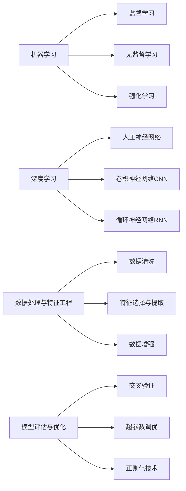

# AI工程最佳实践原理与代码实战案例讲解

## 1.背景介绍
### 1.1 人工智能的发展历程
#### 1.1.1 人工智能的起源与早期发展
#### 1.1.2 人工智能的"寒冬期"
#### 1.1.3 人工智能的复兴与快速发展
### 1.2 人工智能在各行业的应用现状
#### 1.2.1 计算机视觉领域的应用
#### 1.2.2 自然语言处理领域的应用
#### 1.2.3 智能决策领域的应用
### 1.3 AI工程面临的挑战与机遇
#### 1.3.1 技术挑战
#### 1.3.2 伦理与安全挑战
#### 1.3.3 人才短缺挑战
#### 1.3.4 AI工程的发展机遇

## 2.核心概念与联系
### 2.1 机器学习
#### 2.1.1 监督学习
#### 2.1.2 无监督学习
#### 2.1.3 强化学习
### 2.2 深度学习
#### 2.2.1 人工神经网络
#### 2.2.2 卷积神经网络（CNN）
#### 2.2.3 循环神经网络（RNN）
### 2.3 数据处理与特征工程
#### 2.3.1 数据清洗
#### 2.3.2 特征选择与提取
#### 2.3.3 数据增强
### 2.4 模型评估与优化
#### 2.4.1 交叉验证
#### 2.4.2 超参数调优
#### 2.4.3 正则化技术

## 3.核心算法原理具体操作步骤
### 3.1 梯度下降算法
#### 3.1.1 梯度下降算法原理
#### 3.1.2 批量梯度下降（BGD）
#### 3.1.3 随机梯度下降（SGD）
#### 3.1.4 小批量梯度下降（MBGD）
### 3.2 反向传播算法
#### 3.2.1 前向传播
#### 3.2.2 反向传播
#### 3.2.3 权重更新
### 3.3 卷积神经网络中的卷积与池化操作
#### 3.3.1 卷积操作
#### 3.3.2 池化操作
#### 3.3.3 卷积神经网络架构
### 3.4 循环神经网络中的门控机制
#### 3.4.1 简单循环神经网络（Simple RNN）
#### 3.4.2 长短期记忆网络（LSTM）
#### 3.4.3 门控循环单元（GRU）

## 4.数学模型和公式详细讲解举例说明
### 4.1 线性回归模型
#### 4.1.1 简单线性回归
$y = w_0 + w_1x$
#### 4.1.2 多元线性回归  
$y = w_0 + w_1x_1 + w_2x_2 + ... + w_nx_n$
#### 4.1.3 正则化线性回归
$$J(w) = \frac{1}{2m}\sum_{i=1}^m(h_w(x^{(i)}) - y^{(i)})^2 + \frac{\lambda}{2m}\sum_{j=1}^nw_j^2$$
### 4.2 逻辑回归模型
#### 4.2.1 Sigmoid函数
$\sigma(z) = \frac{1}{1+e^{-z}}$
#### 4.2.2 逻辑回归模型
$h_\theta(x) = \sigma(\theta^Tx) = \frac{1}{1+e^{-\theta^Tx}}$
#### 4.2.3 交叉熵损失函数
$$J(\theta) = -\frac{1}{m}\sum_{i=1}^m[y^{(i)}\log(h_\theta(x^{(i)})) + (1-y^{(i)})\log(1-h_\theta(x^{(i)}))]$$
### 4.3 支持向量机模型
#### 4.3.1 线性支持向量机
$\min \frac{1}{2}||w||^2 \quad s.t. \quad y_i(w^Tx_i+b) \geq 1, i=1,2,...,m$
#### 4.3.2 非线性支持向量机
$K(x,z) = \phi(x)^T\phi(z)$
#### 4.3.3 核函数
- 线性核函数：$K(x,z) = x^Tz$
- 多项式核函数：$K(x,z) = (x^Tz+c)^d$
- 高斯核函数（RBF）：$K(x,z) = \exp(-\frac{||x-z||^2}{2\sigma^2})$

## 5.项目实践：代码实例和详细解释说明
### 5.1 手写数字识别项目
#### 5.1.1 数据集介绍（MNIST）
#### 5.1.2 数据预处理
#### 5.1.3 构建卷积神经网络模型
#### 5.1.4 模型训练与评估
#### 5.1.5 模型优化与改进
### 5.2 情感分析项目
#### 5.2.1 数据集介绍（IMDB电影评论）
#### 5.2.2 文本预处理
#### 5.2.3 构建循环神经网络模型
#### 5.2.4 模型训练与评估
#### 5.2.5 模型优化与改进
### 5.3 推荐系统项目
#### 5.3.1 数据集介绍（MovieLens）
#### 5.3.2 数据预处理与特征工程
#### 5.3.3 构建协同过滤模型
#### 5.3.4 模型训练与评估
#### 5.3.5 模型优化与改进

## 6.实际应用场景
### 6.1 智能客服系统
#### 6.1.1 自然语言理解
#### 6.1.2 对话管理
#### 6.1.3 知识库构建
### 6.2 自动驾驶系统
#### 6.2.1 环境感知
#### 6.2.2 路径规划
#### 6.2.3 决策控制
### 6.3 医疗诊断辅助系统
#### 6.3.1 医学影像分析
#### 6.3.2 电子病历处理
#### 6.3.3 辅助诊断决策

## 7.工具和资源推荐
### 7.1 编程语言与框架
#### 7.1.1 Python
#### 7.1.2 TensorFlow
#### 7.1.3 PyTorch
### 7.2 数据集资源
#### 7.2.1 Kaggle
#### 7.2.2 UCI机器学习库
#### 7.2.3 OpenML
### 7.3 在线学习平台
#### 7.3.1 Coursera
#### 7.3.2 edX
#### 7.3.3 吴恩达的深度学习课程

## 8.总结：未来发展趋势与挑战
### 8.1 人工智能的发展趋势
#### 8.1.1 多模态学习
#### 8.1.2 联邦学习
#### 8.1.3 可解释性与可信赖性
### 8.2 AI工程面临的挑战
#### 8.2.1 数据隐私与安全
#### 8.2.2 模型鲁棒性与泛化能力
#### 8.2.3 AI系统的可持续发展
### 8.3 AI工程师的职业发展
#### 8.3.1 技能要求与学习路线
#### 8.3.2 行业前景与就业机会
#### 8.3.3 个人成长与职业规划

## 9.附录：常见问题与解答
### 9.1 如何选择合适的模型？
### 9.2 如何处理数据不平衡问题？
### 9.3 如何避免过拟合？
### 9.4 如何加速模型训练？
### 9.5 如何部署机器学习模型？

作者：禅与计算机程序设计艺术 / Zen and the Art of Computer Programming