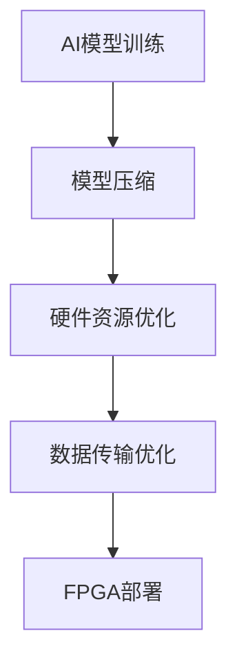

# AI模型部署到FPGA原理与代码实战案例讲解

## 1.背景介绍

随着人工智能(AI)技术的不断发展,AI模型在各个领域得到了广泛应用,例如计算机视觉、自然语言处理、推荐系统等。然而,传统的CPU和GPU在执行AI模型时,面临着能耗高、延迟大等问题。相比之下,现场可编程门阵列(FPGA)凭借其高度并行性、低功耗和可重构性,成为部署AI模型的理想选择。

将AI模型部署到FPGA上可以显著提高推理性能,降低功耗,同时保持足够的灵活性来适应不同的应用场景。但是,将AI模型从训练环境移植到FPGA硬件加速器并非一蹴而就,需要解决诸多技术挑战,例如模型压缩、硬件资源优化、数据传输等。本文将深入探讨AI模型在FPGA上的部署原理,并通过实战案例讲解相关的代码实现细节。

## 2.核心概念与联系

### 2.1 FPGA架构

FPGA是一种可编程硬件,由可编程逻辑块(CLB)、数字信号处理(DSP)块、嵌入式存储器块(BRAM)等组成。这些资源可以根据需求进行编程,实现不同的功能。FPGA的并行处理能力和可重构性使其非常适合加速AI模型的推理过程。

### 2.2 AI模型压缩

由于FPGA资源有限,需要对AI模型进行压缩,以减小模型大小和计算复杂度。常用的模型压缩技术包括剪枝(Pruning)、量化(Quantization)、知识蒸馏(Knowledge Distillation)等。这些技术可以在保持模型精度的同时,显著减小模型大小和计算量。

### 2.3 硬件资源优化

为了充分利用FPGA资源,需要对AI模型进行硬件资源优化。这包括数据流优化、计算资源映射、任务级并行等技术。通过合理分配和利用FPGA资源,可以最大化模型的并行度和吞吐量。

### 2.4 数据传输优化

在FPGA上执行AI模型时,数据传输是一个关键瓶颈。需要优化数据传输路径,减少数据移动,并充分利用FPGA的内存资源。常用的优化技术包括数据重用、流水线、批处理等。

### 2.5 框架和工具

为了简化AI模型在FPGA上的部署过程,出现了多种框架和工具,如Xilinx DNNDK、Intel OpenVINO等。这些框架提供了模型优化、硬件资源映射、代码生成等功能,大大降低了部署难度。

## 3.核心算法原理具体操作步骤

将AI模型部署到FPGA上通常包括以下几个主要步骤:



### 3.1 AI模型训练

首先,需要使用深度学习框架(如TensorFlow、PyTorch等)训练AI模型。训练过程中,需要注意模型的精度、计算复杂度和内存占用等指标,为后续的模型压缩和硬件资源优化做准备。

### 3.2 模型压缩

为了适应FPGA的资源限制,需要对训练好的AI模型进行压缩。常用的压缩技术包括:

1. **剪枝(Pruning)**: 通过移除模型中不重要的权重和神经元,减小模型大小和计算量。
2. **量化(Quantization)**: 将模型参数从32位或16位浮点数转换为8位或更低位宽的定点数,降低存储和计算开销。
3. **知识蒸馏(Knowledge Distillation)**: 使用一个大型教师模型指导训练一个小型学生模型,以获得更小的模型大小和更高的推理性能。

### 3.3 硬件资源优化

经过模型压缩后,需要对AI模型进行硬件资源优化,以充分利用FPGA的并行处理能力。常用的优化技术包括:

1. **数据流优化**: 优化数据在FPGA内部的流动路径,减少数据移动,提高数据传输效率。
2. **计算资源映射**: 将AI模型的计算任务合理分配到FPGA的逻辑资源(CLB)和数字信号处理资源(DSP)上,实现高效的并行计算。
3. **任务级并行**: 将AI模型划分为多个任务,并在FPGA上并行执行这些任务,提高整体吞吐量。

### 3.4 数据传输优化

由于FPGA与外部存储器之间的数据传输往往是性能瓶颈,需要进行数据传输优化。常用的优化技术包括:

1. **数据重用**: 尽可能重用FPGA内部缓存的数据,减少与外部存储器的数据交互。
2. **流水线**: 将计算任务划分为多个阶段,并在不同阶段之间实现流水线操作,提高吞吐量。
3. **批处理**: 将多个输入数据合并成批次进行处理,减少数据传输开销。

### 3.5 FPGA部署

经过上述优化步骤后,可以将优化后的AI模型部署到FPGA上。这通常需要使用FPGA供应商提供的工具链,如Xilinx Vitis或Intel OneAPI,将优化后的模型转换为FPGA可执行的硬件描述语言(HDL)代码,并进行综合、布局布线和比特流生成等步骤。最后,将生成的比特流下载到FPGA硬件上,即可执行AI模型的推理任务。

## 4.数学模型和公式详细讲解举例说明

在将AI模型部署到FPGA上的过程中,涉及到多种数学模型和公式。以下是一些常见的数学模型和公式,以及它们在FPGA部署中的应用。

### 4.1 卷积神经网络(CNN)

卷积神经网络是深度学习中广泛使用的一种模型,常用于计算机视觉任务。CNN的核心操作是卷积运算,其数学表达式如下:

$$
y_{ij} = \sum_{m}\sum_{n}x_{m,n}w_{ij,m,n} + b_{ij}
$$

其中,$x$表示输入特征图,$w$表示卷积核权重,$b$表示偏置项,$y$表示输出特征图。

在FPGA上实现卷积运算时,可以利用DSP资源进行高效的并行计算。通过合理分配计算任务和数据流,可以最大化FPGA的并行处理能力,加速卷积运算。

### 4.2 全连接层

全连接层是神经网络中常见的一种层类型,其数学表达式如下:

$$
y = Wx + b
$$

其中,$W$表示权重矩阵,$x$表示输入向量,$b$表示偏置向量,$y$表示输出向量。

在FPGA上实现全连接层时,可以将矩阵乘法分解为多个向量乘法运算,并利用DSP资源进行并行计算。同时,还可以采用数据重用和流水线等技术,进一步优化计算性能。

### 4.3 激活函数

激活函数是神经网络中的一种非线性变换,用于引入非线性特性。常见的激活函数包括ReLU、Sigmoid、Tanh等。以ReLU函数为例,其数学表达式如下:

$$
y = \max(0, x)
$$

在FPGA上实现激活函数时,可以利用查找表(LUT)资源进行高效计算。对于一些复杂的激活函数,也可以使用近似计算或多项式拟合等技术,以降低计算复杂度。

### 4.4 批归一化(Batch Normalization)

批归一化是一种常用的神经网络正则化技术,可以加速模型收敛,提高模型泛化能力。其数学表达式如下:

$$
y = \gamma\frac{x - \mu}{\sqrt{\sigma^2 + \epsilon}} + \beta
$$

其中,$\mu$和$\sigma^2$分别表示输入数据的均值和方差,$\gamma$和$\beta$是可学习的缩放和平移参数,$\epsilon$是一个小常数,用于避免分母为零。

在FPGA上实现批归一化时,需要注意数据依赖和并行计算的问题。可以采用流水线和任务级并行等技术,提高计算效率。

### 4.5 数据量化

为了减小模型大小和计算开销,常需要对模型参数进行量化。量化的基本思想是将原始的浮点数参数转换为定点数表示。常用的量化方法包括线性量化、对数量化等。以线性量化为例,其数学表达式如下:

$$
x_q = \text{round}(x \times S)
$$

其中,$x$表示原始浮点数参数,$S$表示量化比例因子,$x_q$表示量化后的定点数。

在FPGA上实现量化模型时,可以利用定点数运算单元(如DSP资源)进行高效计算。同时,还需要注意数据溢出和精度损失等问题,并采取相应的措施进行优化。

上述数学模型和公式只是FPGA部署AI模型中涉及的一小部分。在实际应用中,还需要结合具体的模型架构和应用场景,选择合适的数学模型和优化方法。

## 5.项目实践:代码实例和详细解释说明

为了更好地理解AI模型在FPGA上的部署过程,我们将通过一个实际案例进行代码实例和详细解释说明。在本案例中,我们将使用Xilinx DNNDK (Deep Neural Network Development Kit)框架,将一个预训练的卷积神经网络模型部署到Xilinx Alveo U200数据中心加速卡上。

### 5.1 环境准备

首先,我们需要准备好开发环境。本案例使用的是Ubuntu 18.04操作系统,并安装了以下软件:

- Xilinx Vitis 2020.2
- Xilinx DNNDK 3.1
- Python 3.7
- TensorFlow 2.3

### 5.2 模型准备

我们将使用一个预训练的ResNet-50模型,该模型用于图像分类任务。可以从TensorFlow模型库中下载该模型的权重文件。

```python
import tensorflow as tf

# 下载预训练模型权重
model = tf.keras.applications.ResNet50(weights='imagenet')
```

### 5.3 模型压缩

由于FPGA资源有限,我们需要对模型进行压缩。在本案例中,我们将使用DNNDK提供的量化工具对模型进行量化。

```python
# 导入DNNDK量化工具
import dnndk

# 创建量化配置
quantizer = dnndk.quantizer.create_quantizer('quantize_res_quant.json')

# 执行量化
quantized_model = quantizer.quantize(model)
```

量化后的模型将被保存为一个新的HDF5文件。

### 5.4 模型编译

接下来,我们需要使用DNNDK编译器将量化后的模型编译为FPGA可执行的格式。

```python
# 导入DNNDK编译器
import dnndk.dnnc

# 创建编译配置
compiler = dnndk.dnnc.create_dnnc(
    'compiler_res_u200.json',
    'quantized_resnet50.hdf5',
    'resnet50_u200.xmodel'
)

# 执行编译
compiler.compile()
```

编译过程将生成一个`.xmodel`文件,该文件包含了FPGA可执行的指令和数据。

### 5.5 FPGA部署

最后,我们需要将编译后的模型部署到FPGA硬件上。在本案例中,我们将使用Xilinx Alveo U200数据中心加速卡。

```python
# 导入DNNDK运行时库
import dnndk.dnnc

# 创建运行时对象
runner = dnndk.dnnc.create_runner(
    'resnet50_u200.xmodel',
    'runner_res_u200.json'
)

# 加载测试图像
test_image = load_test_image()

# 执行推理
output = runner.execute_async({'input': test_image})

# 获取推理结果
result = output.get('output')
```

上述代码示例展示了如何使用DNNDK框架将一个预训练的ResNet-50模型部署到Xilinx Alveo U200加速卡上。在实际应用中,您可能需要根据具体的模型架构和硬件平台进行相应的调整和优化。

## 6.实际应用场景

将AI模型部署到FPGA上可以