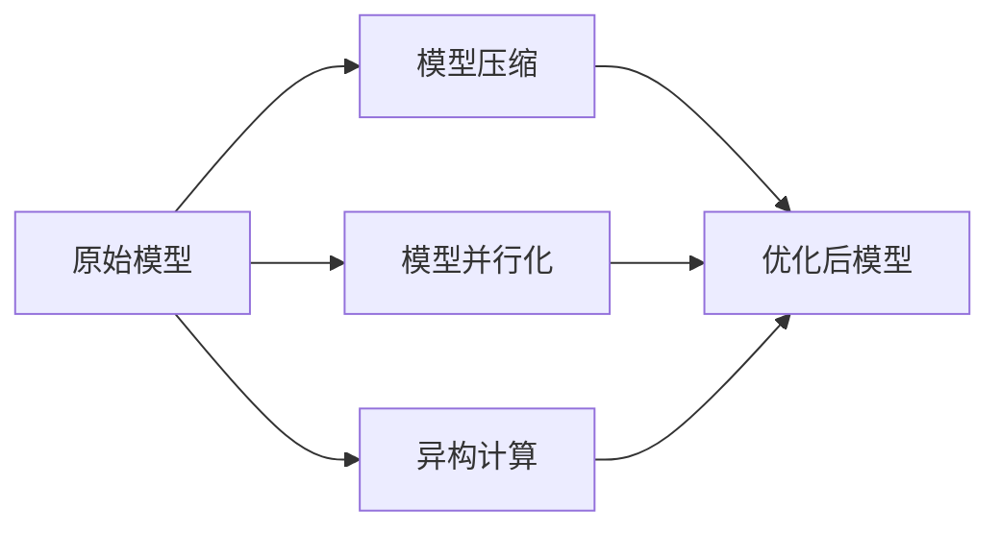

# AI模型部署原理与代码实战案例讲解

## 1.背景介绍

### 1.1 人工智能的兴起

人工智能(AI)是当代科技发展的重要驱动力,近年来受到了前所未有的关注和投资。AI技术在计算机视觉、自然语言处理、决策系统等诸多领域展现出了巨大的潜力,推动了智能化应用的快速发展。随着算力的不断增长和数据量的积累,AI模型变得越来越庞大和复杂,训练出的模型也更加强大。

### 1.2 AI模型部署的重要性

虽然训练出强大的AI模型很重要,但要真正发挥其价值,就必须将模型成功部署到生产环境中。模型部署是将训练好的AI模型集成到应用程序、系统或设备中,使其可以对实际数据进行预测和决策。高效、可靠的模型部署对于实现AI的商业价值至关重要。

### 1.3 AI模型部署的挑战

然而,AI模型部署并非一蹴而就。它面临诸多挑战,例如:

- 性能优化:确保模型在生产环境中有良好的响应时间和吞吐量
- 资源利用:在有限的计算资源下高效运行庞大模型
- 版本管理:跟踪和管理模型的不同版本
- 监控和维护:持续监控模型性能,并根据需要重新训练和部署新版本
- 安全和隐私:保护模型免受攻击,并确保遵守数据隐私法规

掌握正确的原理和最佳实践对于成功部署AI模型至关重要。

## 2.核心概念与联系

在探讨AI模型部署的细节之前,有必要先了解一些核心概念及其相互关系。

### 2.1 AI模型生命周期

AI模型的生命周期包括以下几个主要阶段:


1. **数据收集**: 收集用于训练模型的数据集
2. **数据预处理**: 清理、标准化和增强数据,为训练做好准备
3. **模型训练**: 使用算法在数据集上训练模型
4. **模型评估**: 评估模型在测试数据集上的性能
5. **模型部署**: 将训练好的模型部署到生产环境中
6. **模型监控**: 持续监控部署后模型的性能
7. **模型再训练**: 根据监控结果,使用新数据重新训练模型

模型部署是这个循环中不可或缺的一环,它使AI模型的价值得以实现。

### 2.2 模型优化

为了在生产环境中高效运行AI模型,通常需要进行多方面的优化,包括:

1. **模型压缩**: 通过剪枝、量化等技术减小模型大小,降低内存占用
2. **模型并行化**: 在多个GPU或TPU上并行运行模型,提高吞吐量
3. **异构计算**: 利用CPU、GPU、FPGA等异构硬件,充分发挥不同硬件的优势



优化后的模型在保持可接受的精度水平的同时,能够更高效地运行在目标硬件环境中。

### 2.3 模型服务

为了方便地管理和调用部署的AI模型,通常会将其封装为模型服务。模型服务负责:

1. **模型版本管理**: 跟踪和管理不同版本的模型
2. **模型加载**: 从存储中加载模型到内存,准备好服务请求
3. **请求处理**: 接收输入数据,调用模型进行预测,返回结果
4. **扩缩容**: 根据请求负载自动扩缩容模型服务的实例数量
5. **监控和日志记录**: 记录模型性能指标和错误日志,用于故障排查

通过模型服务,AI模型可以被无缝集成到应用程序或系统中,提供高可用、可扩展的预测服务。

## 3.核心算法原理具体操作步骤

成功部署AI模型需要遵循一些关键步骤和最佳实践。本节将详细介绍这些核心算法原理和具体操作步骤。

### 3.1 模型导出

第一步是将训练好的AI模型从训练环境导出为可部署的格式,通常是序列化为文件。不同的深度学习框架有不同的模型导出方式,例如:

- **TensorFlow**: 使用 `tf.saved_model.save` 保存为 SavedModel 格式
- **PyTorch**: 使用 `torch.save` 保存为 `.pt` 或 `.pth` 格式
- **Keras**: 使用 `model.save` 保存为 `.h5` 格式

导出时需要注意只保存模型权重和结构,不包含训练代码和数据。同时,也可以考虑使用量化等技术来压缩模型大小。

### 3.2 环境配置

接下来,需要配置目标部署环境,包括硬件资源和软件依赖。对于硬件,要评估模型的计算需求,选择合适的CPU、GPU或其他加速器。对于软件,需要安装相应的深度学习框架、库和驱动程序。

此外,还需要考虑容器化技术(如Docker)来简化环境配置和模型分发。通过将模型及其依赖打包到容器镜像中,可以实现一次构建、随处部署。

### 3.3 模型服务化

为了便于管理和调用部署的AI模型,通常会将其封装为模型服务。流行的模型服务框架包括:

- **TensorFlow Serving**: 一个高性能的模型服务系统,支持 TensorFlow 模型
- **TorchServe**: 一个用于部署 PyTorch 模型的模型服务器
- **KFServing**: 一个基于 Kubernetes 的模型服务框架,支持多种框架

这些框架提供了模型版本管理、请求处理、扩缩容等功能,使得模型可以作为RESTful API或gRPC服务进行调用。

### 3.4 负载测试

在正式部署AI模型之前,需要进行全面的负载测试,评估其在生产环境中的性能表现。测试项目包括:

- 延迟: 模型对单个请求的响应时间
- 吞吐量: 模型每秒可处理的请求数量
- 资源利用: 模型对CPU、内存、GPU等资源的使用情况
- 错误率: 模型预测错误的比例
- 并发性: 模型在高并发场景下的表现

根据测试结果,可以进一步优化模型、调整资源配置或修改部署策略,以满足性能需求。

### 3.5 持续集成与交付

为了实现AI模型的可靠、高效部署,需要将其纳入持续集成与交付(CI/CD)流程。CI/CD流程自动化了从代码提交到模型部署的全过程,包括:

1. **版本控制**: 使用Git等工具管理模型代码
2. **构建**: 从代码库构建模型文件和容器镜像
3. **测试**: 自动运行单元测试、集成测试和负载测试
4. **发布**: 将通过测试的模型版本发布到模型仓库或容器仓库
5. **部署**: 从仓库中拉取模型,并自动部署到目标环境
6. **监控**: 持续监控已部署模型的性能指标和错误日志

通过CI/CD流程,可以实现AI模型的快速迭代和可靠部署,缩短从开发到生产的周期。

## 4.数学模型和公式详细讲解举例说明

AI模型的核心是基于数学原理和算法。本节将介绍一些常见的数学模型和公式,并通过实例进行详细说明。

### 4.1 线性回归

线性回归是一种简单但有效的监督学习算法,用于预测连续值目标变量。其数学模型如下:

$$y = w_0 + w_1x_1 + w_2x_2 + ... + w_nx_n$$

其中:
- $y$是预测的目标值
- $x_1, x_2, ..., x_n$是输入特征
- $w_0, w_1, w_2, ..., w_n$是模型权重

训练过程是通过最小化损失函数(如均方误差)来学习最优权重值。

例如,给定一组房价数据,其中每个样本包含房屋面积、卧室数量等特征,我们可以使用线性回归来预测房价。

### 4.2 逻辑回归

逻辑回归是一种用于二分类问题的算法,其数学模型如下:

$$p = \sigma(w_0 + w_1x_1 + w_2x_2 + ... + w_nx_n)$$
$$\sigma(x) = \frac{1}{1 + e^{-x}}$$

其中:
- $p$是样本属于正类的概率
- $\sigma$是sigmoid函数,将线性组合的值映射到(0,1)范围
- $w_0, w_1, w_2, ..., w_n$是模型权重

通过设置阈值(如0.5),可以将概率转换为二元类别预测。

例如,给定一组客户数据,包含年龄、收入等特征,我们可以使用逻辑回归来预测客户是否会购买某个产品。

### 4.3 神经网络

神经网络是一种强大的机器学习模型,能够学习复杂的非线性映射关系。一个基本的全连接神经网络可以表示为:

$$
\begin{aligned}
h_1 &= \sigma(W_1^Tx + b_1) \\
h_2 &= \sigma(W_2^Th_1 + b_2) \\
\vdots \\
y &= \sigma(W_n^Th_{n-1} + b_n)
\end{aligned}
$$

其中:
- $x$是输入向量
- $h_1, h_2, ..., h_{n-1}$是隐藏层的激活值
- $y$是输出层的激活值
- $W_1, W_2, ..., W_n$是权重矩阵
- $b_1, b_2, ..., b_n$是偏置向量
- $\sigma$是非线性激活函数,如ReLU或sigmoid

通过反向传播算法,可以学习模型的最优权重和偏置值。

例如,在图像分类任务中,我们可以使用卷积神经网络(CNN)来提取图像的特征,并通过全连接层进行分类预测。

### 4.4 其他模型

上述只是一些基本的机器学习模型,实际应用中还有许多其他复杂的模型,如:

- **递归神经网络(RNN)**: 适用于序列数据,如自然语言处理
- **生成对抗网络(GAN)**: 用于生成式建模,如图像生成
- **transformer**: 一种基于自注意力机制的序列模型,在NLP任务中表现出色
- **图神经网络(GNN)**: 处理图结构数据,如社交网络分析
- **强化学习模型**: 用于决策和控制问题,如游戏AI、机器人控制

这些模型都有各自的数学原理和优化算法,在特定领域发挥着重要作用。

## 5.项目实践:代码实例和详细解释说明

为了更好地理解AI模型部署的实践,本节将提供一个使用TensorFlow和TensorFlow Serving进行模型部署的代码示例,并对关键步骤进行详细解释。

### 5.1 准备工作

首先,我们需要安装必要的Python包和TensorFlow Serving:

```bash
pip install tensorflow
pip install tensorflow-serving-api

# 安装TensorFlow Serving
docker pull tensorflow/serving
```

接下来,我们定义一个简单的线性回归模型:

```python
import tensorflow as tf

# 定义特征列
features = {
    'x': tf.io.FixedLenFeature([1], tf.float32)
}

# 创建模型
model = tf.estimator.LinearRegressor(feature_columns=[tf.feature_column.numeric_column('x')])
```

### 5.2 训练和导出模型

使用一些示例数据训练模型:

```python
x_train = [1., 2., 3., 4.]
y_train = [2., 4., 6., 8.]

input_fn = tf.estimator.inputs.numpy_input_fn({'x': x_train}, y_train, num_epochs=None, shuffle=True)
model.train(input_fn, steps=1000)
```

训练