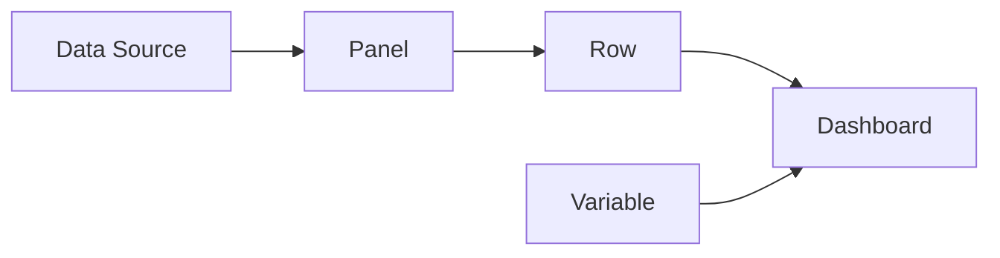

# AI系统Grafana原理与代码实战案例讲解

## 1. 背景介绍
### 1.1 AI系统监控的重要性
随着人工智能技术的快速发展,AI系统变得日益复杂和庞大。为了保证AI系统的稳定运行和高效性能,对其进行实时监控变得越来越重要。一个好的监控系统可以帮助我们及时发现问题,快速定位故障,从而最大限度地减少系统宕机时间,提高用户体验。

### 1.2 Grafana的优势
Grafana是一个开源的数据可视化和监控平台,具有灵活的插件架构和丰富的数据源支持。相比其他监控工具,Grafana的优势主要体现在以下几个方面:

1. 美观直观的可视化界面,支持多种类型的图表和面板,让数据一目了然。
2. 强大的告警功能,可以根据预设的阈值及时发出通知,防患于未然。 
3. 灵活的权限控制,可以对不同的用户和组设置不同的查看和编辑权限。
4. 丰富的插件生态,支持接入各种数据源,如Prometheus、InfluxDB、Elasticsearch等。
5. 良好的扩展性,支持自定义插件和面板,可以根据实际需求进行定制化开发。

### 1.3 Grafana在AI系统监控中的应用
Grafana凭借其强大的功能和灵活的架构,在AI系统监控领域得到了广泛应用。通过集成Prometheus等监控数据源,Grafana可以实时展示各种AI系统指标,如GPU使用率、内存占用、网络流量等,帮助用户洞察系统的运行状态。

同时,Grafana还可以展示AI模型的训练进度和效果,如损失函数曲线、准确率变化等,方便用户评估模型性能。此外,Grafana还支持展示推理服务的延迟、吞吐量、错误率等指标,全面监控线上服务的质量。

## 2. 核心概念与联系
### 2.1 数据源(Data Source) 
数据源是Grafana的核心概念之一,它代表了Grafana可以从哪里获取时序数据。Grafana支持多种类型的数据源,包括Prometheus、InfluxDB、Elasticsearch、MySQL等。每个数据源都有自己独特的查询语言和API,Grafana通过数据源插件与它们进行交互。

### 2.2 面板(Panel)
面板是Grafana的基本可视化单元,它以图表的形式展示数据。Grafana提供了丰富的内置面板,如Graph、Stat、Gauge、Table等,同时也支持安装第三方面板插件。每个面板都可以关联一个数据源,通过配置面板的查询语句,就可以实时展示数据了。

### 2.3 行(Row)
行是一组面板的集合,可以把相关的面板放在一个行里,方便查看。同一行里的面板共享一个时间范围,可以同步缩放和平移。

### 2.4 仪表盘(Dashboard)
仪表盘是最上层的组织单元,由多个行组成。一个仪表盘通常用于展示某个主题或系统的各项指标,如"AI集群监控"、"模型训练看板"等。仪表盘可以设置自动刷新间隔,也支持以只读模式分享给其他用户。

### 2.5 变量(Variable)
变量用于为仪表盘动态生成数据。例如,可以定义一个"主机"变量,然后在面板的查询语句中引用它,这样就可以动态选择要展示哪些主机的数据。Grafana支持查询变量、自定义变量、常量等多种类型的变量。

下图展示了Grafana的核心概念以及它们之间的关系:



## 3. 核心算法原理与具体操作步骤
### 3.1 时序数据库查询
Grafana的核心是时序数据库查询,即根据用户配置的查询语句,从数据源获取时序数据,再将其可视化。以Prometheus数据源为例,一个典型的查询语句如下:

```
sum(rate(http_requests_total{job="api-server"}[5m])) by (instance)
```

这个查询的含义是:
1. 查询名为`http_requests_total`的指标
2. 过滤`job`标签为`api-server`的时间序列 
3. 计算5分钟内的请求速率
4. 按`instance`标签对结果进行聚合

Grafana在后端会将该查询语句发送给Prometheus服务,然后获取结果数据,最后渲染到面板上。

### 3.2 面板可视化渲染
拿到查询结果后,Grafana会根据面板的类型和配置,将数据渲染成图表。以Graph面板为例,渲染流程如下:

1. 数据映射:将时间序列数据映射到图表的坐标系上,时间作为X轴,指标值作为Y轴 
2. 缩放和平移:根据当前的时间范围和面板大小,对坐标系进行缩放和平移,保证图表完整可见
3. 绘制线条:根据时间序列的类型(线性、阶梯式)和配置(线宽、颜色),绘制线条
4. 绘制点:对于只有一个数据点的时间序列,绘制一个点
5. 绘制填充:如果配置了面积填充,则对线条下方进行填充
6. 绘制图例:提取时间序列的标签,生成图例

### 3.3 告警计算
Grafana的告警功能是通过后台定期计算实现的。首先用户要配置告警规则,包括:
- 告警名称和描述
- 关联的面板和查询
- 触发条件(例如查询结果超过阈值)
- 通知渠道(例如邮件、Slack)

然后Grafana会定期执行以下步骤:
1. 查询数据:执行告警规则关联的查询语句,获取时序数据
2. 计算指标:根据查询结果,计算出关心的指标值,如平均值、最大值等 
3. 评估条件:将指标值与告警规则的触发条件进行比较,判断是否满足条件
4. 更新状态:如果满足条件,则将告警状态更新为`Alerting`,否则更新为`OK`
5. 发送通知:如果告警状态发生变化,且配置了通知渠道,就发送告警通知

## 4. 数学模型和公式详解
### 4.1 时间序列数据模型
在Grafana中,时间序列数据用如下的数学模型表示:

$$
\begin{aligned}
TS &= (t, v) \\
t &= (t_1, t_2, ..., t_n) \\
v &= (v_1, v_2, ..., v_n)
\end{aligned}
$$

其中,$TS$表示一个时间序列,$t$是时间戳数组,$v$是对应的值数组,满足$t_1 < t_2 < ... < t_n$。

多个时间序列可以构成一个矩阵:

$$
\begin{bmatrix}
TS_1 \\
TS_2 \\
\vdots \\
TS_m
\end{bmatrix} = 
\begin{bmatrix}
t_{11} & v_{11} & \ldots & t_{1n} & v_{1n} \\
t_{21} & v_{21} & \ldots & t_{2n} & v_{2n} \\
\vdots & \vdots & \ddots & \vdots & \vdots \\
t_{m1} & v_{m1} & \ldots & t_{mn} & v_{mn}
\end{bmatrix}
$$

### 4.2 聚合计算
Grafana支持多种聚合函数,用于对多个时间序列或多个数据点进行聚合计算,常见的有:

- 求和: $sum(v) = \sum_{i=1}^n v_i$
- 平均值: $avg(v) = \frac{\sum_{i=1}^n v_i}{n}$
- 最大值: $max(v) = \max_{i=1}^n v_i$
- 最小值: $min(v) = \min_{i=1}^n v_i$
- 中位数: $median(v) = \begin{cases} v_{\frac{n+1}{2}}, & \text{if } n \text{ is odd} \\ \frac{v_{\frac{n}{2}} + v_{\frac{n}{2}+1}}{2}, & \text{if } n \text{ is even} \end{cases}$
- 百分位数: $percentile(v, p) = v_k, \text{where } k = \lceil p \cdot n \rceil$

例如,对于查询语句`sum(http_requests_total) by (instance)`,Grafana会将所有具有相同`instance`标签的时间序列求和,生成一个新的时间序列。

### 4.3 变化率计算
除了聚合计算,Grafana还支持计算时间序列的变化率,常见的有:

- 差分: $diff(v) = (v_2 - v_1, v_3 - v_2, ..., v_n - v_{n-1})$
- 一阶导数: $derivative(v) = (\frac{v_2 - v_1}{t_2 - t_1}, \frac{v_3 - v_2}{t_3 - t_2}, ..., \frac{v_n - v_{n-1}}{t_n - t_{n-1}})$
- 二阶导数: $derivative(derivative(v))$

例如,对于查询语句`rate(http_requests_total[5m])`Grafana会先计算5分钟内的请求数变化量,然后除以时间间隔,得到请求速率。

## 5. 项目实践:代码实例和详解
下面我们通过一个具体的代码实例,演示如何使用Grafana展示Prometheus采集的数据。

### 5.1 配置Prometheus数据源
首先,我们需要在Grafana中配置Prometheus数据源。打开Grafana的数据源配置页面,选择"Prometheus"类型,填写Prometheus服务的URL,保存即可。

```yaml
apiVersion: 1
datasources:
  - name: Prometheus
    type: prometheus
    url: http://prometheus:9090
    access: proxy
    isDefault: true
```

### 5.2 创建仪表盘
接下来,我们创建一个新的仪表盘。点击Grafana左侧菜单的"+"号,选择"Dashboard",然后选择"Add new panel"。

```json
{
  "title": "AI System Monitoring",
  "tags": [],
  "style": "dark",
  "timezone": "browser",
  "editable": true,
  "panels": [],
  "time": {
    "from": "now-6h",
    "to": "now"
  }
}
```

### 5.3 配置面板查询
在面板编辑页面,我们选择刚刚配置好的Prometheus数据源,然后在查询框中输入如下的Prometheus查询语句:

```
sum(rate(http_requests_total{job="api-server"}[5m])) by (instance)
```

这个查询会返回每个API服务实例的请求速率。

### 5.4 配置面板可视化
在面板的"Visualization"选项卡,我们选择"Graph"图表类型,然后在"Display"选项中,将"Line width"设置为2,将"Fill opacity"设置为20,这样可以让图表更加美观。

```json
{
  "title": "API Server Request Rate",
  "type": "graph",
  "datasource": "Prometheus",
  "targets": [
    {
      "expr": "sum(rate(http_requests_total{job=\"api-server\"}[5m])) by (instance)",
      "format": "time_series",
      "intervalFactor": 2,
      "legendFormat": "{{instance}}"
    }
  ],
  "yaxes": [
    {
      "format": "short",
      "label": "Requests/s",
      "logBase": 1,
      "min": 0,
      "show": true
    },
    {
      "format": "short",
      "logBase": 1,
      "show": true
    }
  ],
  "xaxis": {
    "mode": "time",
    "show": true
  },
  "yaxis": {
    "align": false
  },
  "lines": true,
  "linewidth": 2,
  "fill": 2,
  "fillGradient": 20,
  "dashLength": 10,
  "spaceLength": 10,
  "points": false,
  "pointradius": 2
}
```

### 5.5 配置告警规则
最后,我们可以为这个面板配置一个告警规则。点击面板标题旁的"Alert"按钮,进入告警配置页面。我们设置当请求速率超过100时触发告警,并通过邮件通知管理员。

```yaml
alert: APIHighRequestRate
expr: sum(rate(http_requests_total{job="api-server"}[5m])) by (instance) > 100
for: 5m
labels:
  severity: warning
annotations:
  summary: "Instance {{ $labels.instance }} API request rate is high"
  description: "{{ $labels