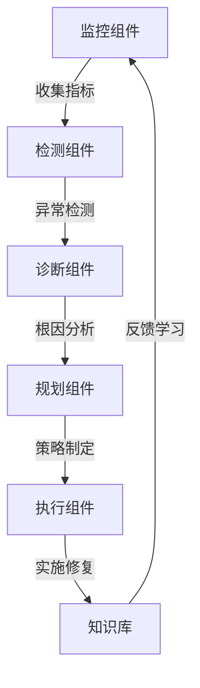

# AI系统故障自愈原理与代码实战案例讲解

## 1.背景介绍

### 1.1 人工智能系统的重要性

在当今时代,人工智能(AI)系统已经广泛应用于各个领域,包括金融、医疗、制造业、交通运输等。这些系统通过处理大量数据、识别模式并做出决策,为我们的生活带来了巨大便利。然而,由于AI系统的复杂性和不确定性,它们也容易出现各种故障和异常情况,这可能会导致严重的经济损失甚至生命安全问题。

### 1.2 AI系统故障的挑战

AI系统故障可能源于多种原因,例如:

- 硬件故障(CPU、内存、磁盘等)
- 软件缺陷(代码bug、配置错误等)
- 数据质量问题(噪声、偏差、缺失值等)
- 模型漂移(环境变化导致模型性能下降)
- 对抗性攻击(恶意输入旨在干扰系统)

传统的故障处理方式通常依赖人工监控和干预,这在AI系统的规模和复杂度不断增加的情况下变得越来越低效和昂贵。因此,开发自动化的故障检测、诊断和修复机制对于确保AI系统的可靠性和可用性至关重要。

### 1.3 自愈AI系统的优势

自愈AI系统是指具有自我修复和自我优化能力的智能系统。它们可以自动检测异常情况、诊断根本原因、并采取适当的修复措施,从而最大限度地减少系统停机时间和人工干预需求。自愈AI系统的主要优势包括:

- 提高系统可靠性和可用性
- 减少维护成本和人工干预
- 快速响应和恢复故障
- 持续优化系统性能
- 提高用户体验和信任度

## 2.核心概念与联系

### 2.1 自愈AI系统的架构

自愈AI系统通常由以下几个核心组件组成:

1. **监控组件**: 持续收集系统的运行状态数据,包括硬件、软件、数据和模型等方面的指标。

2. **检测组件**: 基于监控数据,利用机器学习算法检测系统是否存在异常情况。

3. **诊断组件**: 对检测到的异常进行根本原因分析,确定故障的具体类型和位置。

4. **规划组件**: 根据诊断结果,制定修复策略,评估不同策略的优劣并选择最优方案。

5. **执行组件**: 实施修复策略,包括重启服务、回滚版本、修复数据、微调模型等操作。

6. **知识库**: 存储历史故障案例、修复策略和最佳实践,为系统自我学习和优化提供基础。

这些组件通过有机结合和紧密协作,构成了一个闭环的自动化故障管理系统。

### 2.2 关键技术

实现自愈AI系统需要多种先进技术的支持,包括但不限于:

- **机器学习**: 用于异常检测、根因诊断和策略优化。
- **时间序列分析**: 对系统指标数据进行模式识别和趋势预测。
- **知识图谱**: 表示和推理系统组件、故障类型和修复策略之间的关系。
- **优化算法**: 在多个目标和约束条件下寻找最优修复方案。
- **自动化运维**: 通过编程方式执行系统操作和部署任务。

这些技术相互关联、互为支撑,共同构建了自愈AI系统的技术基础。

## 3.核心算法原理具体操作步骤

### 3.1 异常检测算法

异常检测是自愈AI系统的第一步,旨在及时发现系统运行中的异常情况。常用的异常检测算法包括:

1. **基于统计的方法**:
    - 假设正常数据服从某种统计分布(如高斯分布)
    - 计算观测数据与该分布的偏差作为异常分数
    - 设置异常阈值,超过阈值则判定为异常

2. **基于聚类的方法**:
    - 将数据划分为多个聚类
    - 离群点(与所有聚类中心距离较远的点)被视为异常

3. **基于nearest neighbor的方法**:
    - 计算每个数据点到其k个最近邻居的平均距离
    - 距离较大的点被视为异常

4. **基于深度学习的方法**:
    - 使用自编码器、生成对抗网络等模型学习正常数据的分布
    - 与模型预测值的偏差较大则被判定为异常

这些算法各有优缺点,在实际应用中需要根据数据特征和场景进行选择和组合使用。

### 3.2 根因诊断算法

一旦检测到异常,下一步就是诊断异常的根本原因。常见的根因诊断算法包括:

1. **基于规则的方法**:
    - 构建一系列if-then规则来描述故障模式
    - 根据观测到的症状匹配相应的规则,推断出可能的根因

2. **基于案例的推理**:
    - 构建历史故障案例库
    - 将新的异常情况与案例库进行相似性匹配,推断根因

3. **基于贝叶斯网络的诊断**:
    - 建立系统组件、故障类型和观测症状之间的因果关系模型
    - 根据观测到的症状反向推理最可能的根因

4. **基于深度学习的方法**:
    - 使用序列模型(如LSTM)学习系统指标与故障类型的映射关系
    - 输入新的异常指标序列,模型输出最可能的根因

这些算法可以单独使用,也可以组合使用,形成多层次、多策略的诊断框架,提高诊断的准确性和鲁棒性。

### 3.3 修复策略规划算法

确定故障根因后,下一步是制定修复策略。这是一个决策优化问题,需要在多个目标和约束条件下寻找最优解。常用的策略规划算法包括:

1. **基于规则的规划**:
    - 为每种故障类型预定义一组修复规则
    - 根据诊断结果匹配相应的规则,生成修复策略

2. **基于案例的规划**:
    - 构建历史成功修复案例库
    - 将当前故障情况与案例库进行相似性匹配,复用之前的修复策略

3. **基于规划算法的方法**:
    - 将系统状态、故障类型和修复操作构建为规划问题模型
    - 使用启发式搜索、线性规划等算法求解最优修复策略

4. **基于强化学习的方法**:
    - 将修复过程建模为马尔可夫决策过程
    - 使用深度强化学习算法(如DQN、A3C)学习最优的修复策略

5. **基于多目标优化的方法**:
    - 将修复代价、恢复时间、风险影响等作为多个优化目标
    - 使用多目标进化算法(如NSGA-II)求解最优解

这些算法可以根据具体场景和需求进行选择和组合,以获得高效、可靠的修复策略。

## 4.数学模型和公式详细讲解举例说明

在自愈AI系统中,数学模型和公式扮演着重要角色,为异常检测、根因诊断和策略优化等关键任务提供理论基础和计算支持。下面将详细讲解一些常用的数学模型和公式。

### 4.1 异常检测模型

#### 4.1.1 统计模型

统计模型假设正常数据服从某种概率分布,异常数据则偏离该分布。常用的统计模型包括:

1. **高斯分布模型**:

$$
P(x) = \frac{1}{\sqrt{2\pi\sigma^2}}e^{-\frac{(x-\mu)^2}{2\sigma^2}}
$$

其中$\mu$为均值,$\sigma$为标准差。给定新的观测值$x$,可以计算其与高斯分布的偏差作为异常分数:

$$
s(x) = |x - \mu|
$$

2. **核密度估计模型**:

$$
\hat{f}(x) = \frac{1}{nh}\sum_{i=1}^{n}K\left(\frac{x-x_i}{h}\right)
$$

其中$K(\cdot)$为核函数(如高斯核),h为带宽参数。$\hat{f}(x)$表示x的密度估计值,偏离该值较大则被视为异常。

这些统计模型简单高效,但对于非高斯分布或多模态分布的数据,其性能会受到影响。

#### 4.1.2 基于距离的模型

基于距离的模型利用数据点之间的相似性来判别异常,常用的模型包括:

1. **k-nearest neighbor模型**:

$$
s(x) = \frac{1}{k}\sum_{i=1}^{k}d(x,x_i)
$$

其中$d(\cdot,\cdot)$为距离度量(如欧氏距离),$x_i$为x的第i个近邻。$s(x)$表示x到其k个近邻的平均距离,距离越大,越可能是异常点。

2. **局部异常系数模型**:

$$
\text{lof}(x) = \frac{\sum_{y\in N(x)}\frac{\rho(y)}{\rho(x)}}{|N(x)|}
$$

其中$N(x)$为x的近邻集合,$\rho(x)$为x的可达密度。lof(x)较大时,x被视为异常点。

这些距离模型能够很好地发现局部异常,但对于全局异常的检测效果一般。

#### 4.1.3 基于深度学习的模型

深度学习模型通过从大量数据中自动学习特征模式,对异常检测任务有着出色的表现。常用的模型包括:

1. **自编码器模型**:

$$
\begin{aligned}
h &= f(Wx+b)\\
x' &= g(W'h+b')
\end{aligned}
$$

其中$f(\cdot)$和$g(\cdot)$为激活函数,W和W'为编码器和解码器的权重矩阵。模型被训练为重构输入$x\approx x'$,重构误差较大的$x$被视为异常。

2. **生成对抗网络模型**:

$$
\begin{aligned}
\min\limits_G\max\limits_DV(D,G) &= \mathbb{E}_{x\sim p_\text{data}(x)}[\log D(x)]\\
&+ \mathbb{E}_{z\sim p_z(z)}[\log(1-D(G(z)))]
\end{aligned}
$$

其中G为生成器,D为判别器,通过对抗训练,G学习生成与真实数据$p_\text{data}(x)$相似的样本。对于G难以生成的$x$,则被判定为异常。

深度学习模型具有强大的表达能力和泛化性,但需要大量标注数据进行训练,并且模型的可解释性较差。

### 4.2 根因诊断模型

#### 4.2.1 贝叶斯网络模型

贝叶斯网络是一种基于概率论的图模型,常用于故障诊断领域。其核心思想是利用观测到的症状反向推理最可能的故障根因。

设$X$为故障节点,$Y$为症状节点,则根据贝叶斯定理:

$$
P(X|Y) = \frac{P(Y|X)P(X)}{P(Y)}
$$

其中$P(X)$为故障的先验概率,$P(Y|X)$为症状出现的条件概率。通过学习这些概率分布,并观测到症状$Y=y$,可以计算每个故障$X=x$的后验概率$P(X=x|Y=y)$,从而确定最可能的根因。

贝叶斯网络模型的优点是能够有效地融合先验知识和观测数据,并具有良好的可解释性。但是,构建和学习高质量的网络模型是一个挑战,需要大量的专家知识和历史数据支持。

#### 4.2.2 基于深度学习的模型

近年来,基于深度学习的故障诊断模型也得到了广泛关注。常用的模型包括: