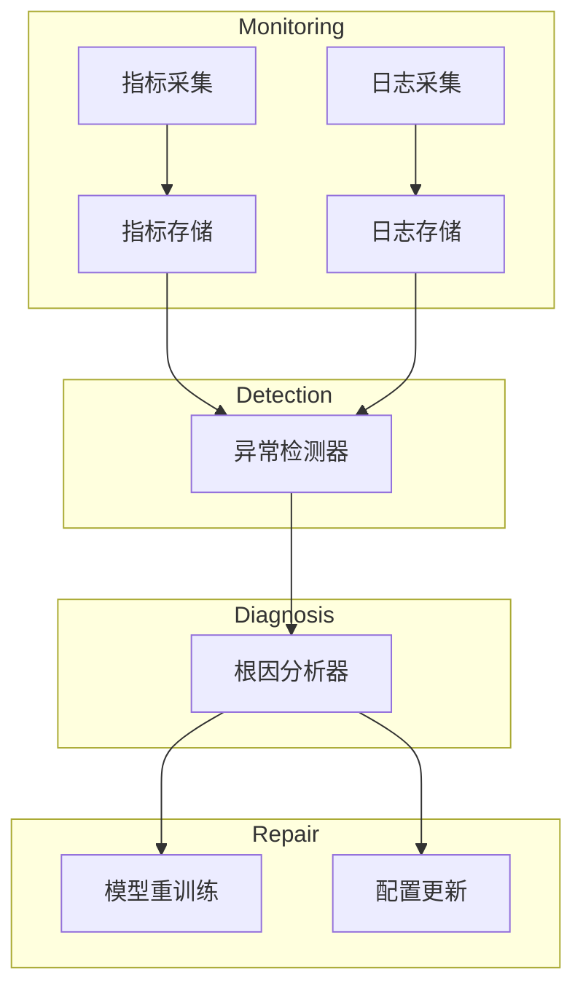

# AI系统故障诊断原理与代码实战案例讲解

## 1.背景介绍

### 1.1 人工智能系统的重要性

在当今时代,人工智能(AI)系统已经广泛应用于各个领域,包括金融、医疗、制造业、交通运输等。这些系统通过机器学习、深度学习等技术,能够从大量数据中发现隐藏的模式和规律,并基于此做出智能决策和预测。人工智能系统的出现极大地提高了生产效率,优化了决策过程,为我们的生活带来了巨大便利。

### 1.2 AI系统故障的影响

然而,AI系统并非完美无缺。系统可能会由于各种原因而出现故障,如数据质量问题、模型过拟合、软硬件故障等。AI系统的故障可能会导致严重的经济损失、安全隐患,甚至危及生命。因此,及时发现和诊断AI系统故障,确保系统的稳定可靠运行,是至关重要的。

### 1.3 故障诊断的挑战

AI系统故障诊断面临着诸多挑战:

1. **复杂性**:现代AI系统通常由多个模块和组件组成,涉及大量参数和变量,导致故障诊断过程异常复杂。
2. **不确定性**:AI算法的"黑箱"特性使得系统行为的可解释性较差,增加了故障原因的不确定性。
3. **数据质量**:训练数据的质量直接影响模型性能,数据中的噪音、偏差等问题可能导致系统异常。
4. **新兴技术**:新兴AI技术层出不穷,对应的故障诊断方法有待持续探索和完善。

### 1.4 本文内容概览

本文将深入探讨AI系统故障诊断的原理和实践。我们将介绍故障诊断的核心概念、算法原理,详细讲解相关数学模型,并结合实战案例,为读者提供实用的故障诊断方法和工具推荐。最后,我们将总结AI系统故障诊断的发展趋势和未来挑战。

## 2.核心概念与联系

### 2.1 故障诊断概念

故障诊断是指发现系统异常行为的根本原因,并采取相应措施加以修复的过程。在AI系统中,故障诊断包括以下几个关键步骤:

1. **监控**:持续监测系统各个组件的运行状态,收集相关指标和日志数据。
2. **检测**:基于监控数据,应用机器学习等技术检测系统是否存在异常行为。
3. **诊断**:对已检测到的异常进行原因分析,定位故障根源。
4. **修复**:根据诊断结果,采取适当措施修复系统故障,如重新训练模型、更新系统配置等。

### 2.2 核心算法

故障诊断过程中涉及多种算法和技术,包括:

1. **监控算法**:如统计过程控制(SPC)、累积和(CUSUM)等,用于实时监测系统指标。
2. **异常检测算法**:如隔离森林(Isolation Forest)、一类支持向量机(One-Class SVM)等,用于发现系统异常行为。
3. **因果推理算法**:如贝叶斯网络(Bayesian Network)、结构方程模型(SEM)等,用于推断故障根源。
4. **决策树算法**:如ID3、C4.5等,用于构建故障诊断决策树。
5. **深度学习算法**:如自编码器(Autoencoder)、生成对抗网络(GAN)等,用于无监督异常检测。

这些算法相互关联、相互支撑,共同构建了完整的故障诊断流程。

### 2.3 系统架构

一个典型的AI系统故障诊断架构如下所示:



1. **监控模块**负责采集系统指标和日志数据,并存储于相应的存储系统中。
2. **异常检测器**基于监控数据,运行异常检测算法,识别系统异常行为。
3. **根因分析器**对已检测到的异常进行原因分析,定位故障根源。
4. **修复模块**根据诊断结果,采取相应的修复措施,如重新训练模型或更新系统配置。

该架构实现了故障诊断的全流程,确保了AI系统的持续稳定运行。

## 3.核心算法原理具体操作步骤

在本节,我们将详细介绍几种核心故障诊断算法的原理和具体操作步骤。

### 3.1 隔离森林算法

隔离森林(Isolation Forest)是一种高效的无监督异常检测算法,基于将异常值"隔离"的思想。算法步骤如下:

1. 对于每个样本,通过随机选择特征及其分割值,递归构建二叉树,直到所有样本被隔离。
2. 计算每个样本的路径长度,即被隔离所需的分割次数。异常样本由于特征值较极端,其路径长度较短。
3. 计算样本的异常分数,即样本路径长度与所有样本路径长度的比值的平均值。
4. 设置异常分数阈值,高于阈值的样本被标记为异常。

隔离森林算法具有较高的计算效率,适用于大规模数据集,但对于高维稀疏数据的效果可能不佳。

### 3.2 贝叶斯网络

贝叶斯网络(Bayesian Network)是一种基于概率论的因果推理模型,广泛应用于故障根因分析。构建贝叶斯网络的步骤如下:

1. 确定网络中的变量,包括故障症状、系统组件状态等。
2. 基于专家知识或数据,确定变量之间的因果关系,构建有向无环图。
3. 为每个变量及其父节点确定条件概率分布。
4. 根据观测到的症状evidence,应用贝叶斯定理计算每个变量的后验概率。
5. 将具有最高后验概率的变量作为故障根源。

贝叶斯网络能够有效处理不确定性和缺失数据,但构建过程需要大量的领域知识和数据支持。

### 3.3 决策树算法

决策树是一种常用的监督学习算法,也可应用于故障诊断。构建决策树的步骤包括:

1. 收集故障案例数据,包括系统症状、组件状态等特征,以及已知的故障原因标签。
2. 基于信息增益、基尼指数等指标,选择最优特征作为决策树的根节点。
3. 递归构建决策树的子节点,直到所有样本被正确分类或达到停止条件。
4. 对新的故障案例,遍历决策树,根据特征值进行分类,得到故障原因。

决策树模型具有良好的可解释性,但可能存在过拟合风险,在处理高维数据时效果不佳。

## 4.数学模型和公式详细讲解举例说明

在故障诊断过程中,涉及多种数学模型和公式,下面我们将详细讲解其中的几个关键模型。

### 4.1 统计过程控制

统计过程控制(Statistical Process Control, SPC)是一种广泛应用的监控算法,用于检测系统指标是否超出正常范围。

设系统指标为随机变量 $X$,我们希望控制 $X$ 的均值 $\mu$ 和方差 $\sigma^2$。SPC 通过计算监控统计量,判断系统是否处于控制状态。

**1. $\bar{X}$ 控制图**

$\bar{X}$ 控制图用于监控过程均值,监控统计量为样本均值:

$$\bar{X} = \frac{1}{n}\sum_{i=1}^{n}X_i$$

其中 $n$ 为样本容量。控制限计算如下:

$$
\begin{aligned}
UCL &= \mu + 3\frac{\sigma}{\sqrt{n}}\\
LCL &= \mu - 3\frac{\sigma}{\sqrt{n}}
\end{aligned}
$$

如果 $\bar{X}$ 超出控制限,则认为过程均值发生了异常变化。

**2. $R$ 控制图**

$R$ 控制图用于监控过程变异性,监控统计量为样本范围:

$$R = X_{max} - X_{min}$$

其中 $X_{max}$ 和 $X_{min}$ 分别为样本中的最大值和最小值。控制限计算如下:

$$
\begin{aligned}
UCL &= D_4\sigma\\
LCL &= D_3\sigma
\end{aligned}
$$

其中 $D_3$ 和 $D_4$ 为与样本容量 $n$ 相关的常数。如果 $R$ 超出控制限,则认为过程变异性发生了异常变化。

SPC 算法简单高效,但需要假设数据服从正态分布,且对异常值较为敏感。

### 4.2 隔离森林异常分数

隔离森林算法的核心在于计算样本的异常分数,用于判别是否为异常值。

设 $h(x)$ 为样本 $x$ 的路径长度,即被隔离所需的分割次数。由于异常样本的特征值较为极端,因此 $h(x)$ 较小。我们定义异常分数 $s(x, n)$ 如下:

$$s(x, n) = 2^{-\frac{E(h(x))}{c(n)}}$$

其中 $E(h(x))$ 为 $h(x)$ 的期望值, $c(n)$ 为一个用于归一化的常数,仅与样本容量 $n$ 有关。

可以证明,对于正态分布的数据,异常分数 $s(x, n)$ 近似服从:

$$s(x, n) \sim \mathcal{N}(0.5, 0.05)$$

因此,我们可以设置异常分数阈值(如 0.6),高于阈值的样本被标记为异常。

隔离森林算法的优点在于计算高效,无需事先假设数据分布,但对于高维稀疏数据的效果可能不佳。

### 4.3 贝叶斯网络推理

贝叶斯网络是一种基于概率论的因果推理模型,广泛应用于故障根因分析。给定观测到的症状evidence,我们需要计算每个变量的后验概率,从而确定最可能的故障原因。

设 $X$ 为待推断的变量, $E$ 为观测到的evidence,则根据贝叶斯定理,后验概率计算如下:

$$P(X|E) = \frac{P(E|X)P(X)}{P(E)}$$

其中 $P(X)$ 为 $X$ 的先验概率, $P(E|X)$ 为条件概率,可由网络结构和条件概率分布计算得到。

对于复杂的贝叶斯网络,我们可以应用变量消元算法等高效推理算法,以降低计算复杂度。

贝叶斯网络能够很好地处理不确定性和缺失数据,但构建过程需要大量的领域知识和数据支持,且计算效率可能受到影响。

## 5.项目实践:代码实例和详细解释说明

为了更好地理解故障诊断算法的实现,我们将提供一些代码实例,并进行详细解释说明。

### 5.1 隔离森林异常检测

下面是使用Python中的scikit-learn库实现隔离森林算法的示例代码:

```python
from sklearn.ensemble import IsolationForest

# 初始化隔离森林模型
model = IsolationForest(n_estimators=100, max_samples='auto', contamination=0.1)

# 训练模型
model.fit(X_train)

# 预测异常分数
anomaly_scores = model.decision_function(X_test)

# 设置异常分数阈值
threshold = -0.5

# 标记异常样本
X_test['anomaly'] = anomaly_scores < threshold
```

代码解释:

1. 导入隔离森林模型`IsolationForest`。
2. 初始