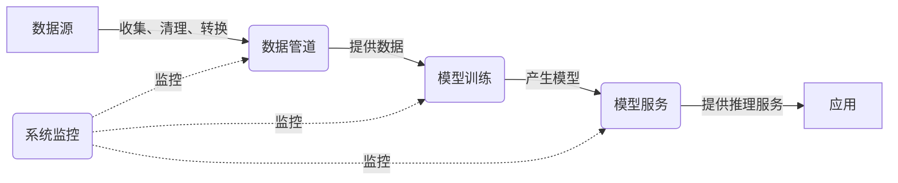

# AI系统架构原理与代码实战案例讲解

## 1.背景介绍

随着人工智能(AI)技术的快速发展,AI系统的架构设计和实现变得越来越复杂。AI系统需要处理大量的数据、执行复杂的算法,并具备高度的可扩展性和容错能力。因此,构建一个高效、可靠的AI系统架构至关重要。

本文将探讨AI系统架构的核心原理,包括数据处理、模型训练、模型部署和系统优化等方面。我们将介绍常用的架构模式,如微服务、Lambda架构和Kappa架构,并通过实际案例演示如何应用这些架构模式构建AI系统。

## 2.核心概念与联系

### 2.1 数据管道(Data Pipeline)

数据管道负责从各种数据源收集、清理和转换数据,为后续的模型训练和推理提供高质量的数据输入。常用的数据处理工具包括Apache Kafka、Apache Spark和Apache Beam等。

### 2.2 模型训练(Model Training)

模型训练是AI系统的核心环节,通过机器学习算法在大量数据上训练模型,获得具有特定功能的AI模型。常用的模型训练框架包括TensorFlow、PyTorch和MXNet等。

### 2.3 模型服务(Model Serving)

模型服务负责将训练好的AI模型部署到生产环境中,为上层应用提供推理服务。常用的模型服务框架包括TensorFlow Serving、KFServing和Triton Inference Server等。

### 2.4 系统监控(System Monitoring)

系统监控对于确保AI系统的稳定性和性能至关重要。它包括监控系统资源使用情况、检测异常行为、收集指标数据等,为系统优化和故障排查提供依据。

### 2.5 核心概念关系

这些核心概念相互关联,构成了AI系统的完整生命周期。数据管道为模型训练提供数据支持,模型训练产生AI模型,模型服务将模型部署到生产环境中为应用提供服务,系统监控则贯穿整个生命周期,确保系统的稳定运行。

## 3.核心算法原理具体操作步骤

AI系统架构中的核心算法主要包括数据处理算法、机器学习算法和模型优化算法等。下面我们将分别介绍这些算法的原理和具体操作步骤。

### 3.1 数据处理算法

数据处理算法负责从原始数据中提取有用的特征,并将其转换为机器学习模型可以处理的格式。常用的数据处理算法包括:

1. **特征提取(Feature Extraction)**
   - 原理:从原始数据中提取出对模型训练有用的特征,如文本数据中的词袋(Bag of Words)、图像数据中的边缘检测等。
   - 步骤:
     1) 确定需要提取的特征类型
     2) 选择合适的特征提取算法
     3) 对原始数据进行预处理
     4) 应用特征提取算法获取特征向量

2. **特征选择(Feature Selection)**
   - 原理:从提取的特征中选择对模型训练最有用的一部分特征,降低模型复杂度和训练时间。
   - 步骤:
     1) 计算每个特征与目标变量的相关性
     2) 根据相关性得分对特征进行排序
     3) 选择排名靠前的特征作为输入

3. **数据归一化(Data Normalization)**
   - 原理:将数据缩放到统一的数值范围,避免某些特征由于数值范围过大而主导模型训练过程。
   - 步骤:
     1) 选择合适的归一化方法(如Min-Max归一化、Z-Score归一化等)
     2) 计算每个特征的归一化参数(如最大最小值、均值和标准差等)
     3) 对每个特征进行归一化转换

### 3.2 机器学习算法

机器学习算法是AI系统的核心,通过在大量数据上训练,学习到特定任务的模型参数。常用的机器学习算法包括:

1. **监督学习算法**
   - 原理:利用带有标签的训练数据,学习映射关系,预测未知数据的标签。
   - 算法示例:线性回归、逻辑回归、支持向量机、决策树、随机森林等。
   - 步骤:
     1) 准备带标签的训练数据
     2) 选择合适的算法模型
     3) 设置模型超参数
     4) 训练模型,优化模型参数
     5) 在测试数据上评估模型性能

2. **无监督学习算法**
   - 原理:仅利用无标签的训练数据,发现数据内在的模式和结构。
   - 算法示例:K-Means聚类、高斯混合模型、主成分分析等。
   - 步骤:
     1) 准备无标签的训练数据
     2) 选择合适的算法模型
     3) 设置模型超参数
     4) 训练模型,优化模型参数
     5) 在测试数据上评估模型性能

3. **深度学习算法**
   - 原理:利用深层神经网络模型,自动从数据中学习特征表示,解决复杂的任务。
   - 算法示例:卷积神经网络、递归神经网络、生成对抗网络等。
   - 步骤:
     1) 准备训练数据
     2) 设计神经网络架构
     3) 选择损失函数和优化器
     4) 训练模型,优化网络参数
     5) 在测试数据上评估模型性能

### 3.3 模型优化算法

为了提高AI模型的性能和效率,我们需要对模型进行优化。常用的模型优化算法包括:

1. **模型压缩(Model Compression)**
   - 原理:通过剪枝、量化等技术,减小模型的大小和计算量,提高模型的推理效率。
   - 步骤:
     1) 选择合适的压缩方法(如剪枝、量化等)
     2) 对原始模型进行压缩
     3) 评估压缩后模型的性能和效率

2. **知识蒸馏(Knowledge Distillation)**
   - 原理:利用一个大型教师模型指导一个小型学生模型的训练,使学生模型获得接近教师模型的性能。
   - 步骤:
     1) 准备一个已训练好的教师模型
     2) 设计学生模型架构
     3) 定义蒸馏损失函数
     4) 使用教师模型的输出指导学生模型训练
     5) 评估学生模型的性能

3. **模型集成(Model Ensemble)**
   - 原理:将多个独立训练的模型组合在一起,提高预测的准确性和鲁棒性。
   - 步骤:
     1) 训练多个独立的基础模型
     2) 选择合适的集成方法(如平均、投票、stacking等)
     3) 将基础模型按照集成方法组合
     4) 评估集成模型的性能

通过应用这些算法,我们可以构建出高效、准确的AI模型,为AI系统的部署和运行提供支持。

## 4.数学模型和公式详细讲解举例说明

在AI系统架构中,数学模型和公式扮演着重要的角色,为算法提供理论基础和计算框架。下面我们将详细讲解一些常用的数学模型和公式。

### 4.1 线性回归

线性回归是一种常用的监督学习算法,用于预测连续型目标变量。它假设目标变量和特征之间存在线性关系,通过最小化误差平方和来学习模型参数。

线性回归的数学模型如下:

$$y = \theta_0 + \theta_1x_1 + \theta_2x_2 + ... + \theta_nx_n$$

其中:
- $y$是目标变量
- $x_i$是第$i$个特征
- $\theta_i$是第$i$个模型参数

我们的目标是找到一组最优参数$\theta$,使得预测值$\hat{y}$与真实值$y$之间的误差平方和最小化:

$$\min_\theta \sum_{i=1}^{m}(y^{(i)} - \hat{y}^{(i)})^2$$

这个优化问题可以通过梯度下降法等优化算法来求解。

**示例**:假设我们要预测一个城市的房价,特征包括房屋面积、卧室数量和距离市中心的距离。我们可以构建如下线性回归模型:

$$\text{房价} = \theta_0 + \theta_1 \times \text{面积} + \theta_2 \times \text{卧室数} + \theta_3 \times \text{距离}$$

通过在训练数据上训练,我们可以获得最优的模型参数$\theta$,从而对新的房屋数据进行价格预测。

### 4.2 逻辑回归

逻辑回归是一种常用的分类算法,用于预测离散型目标变量(如二元分类或多类分类)。它通过sigmoid函数将线性模型的输出映射到0到1之间的概率值,从而实现分类预测。

逻辑回归的数学模型如下:

$$\begin{aligned}
z &= \theta_0 + \theta_1x_1 + \theta_2x_2 + ... + \theta_nx_n \\
\hat{y} &= \sigma(z) = \frac{1}{1 + e^{-z}}
\end{aligned}$$

其中:
- $z$是线性模型的输出
- $\sigma(z)$是sigmoid函数,将$z$映射到0到1之间的概率值
- $\hat{y}$是预测的概率值

我们的目标是找到一组最优参数$\theta$,使得训练数据的对数似然函数最大化:

$$\max_\theta \sum_{i=1}^{m} \big[y^{(i)}\log(\hat{y}^{(i)}) + (1 - y^{(i)})\log(1 - \hat{y}^{(i)})\big]$$

这个优化问题也可以通过梯度下降法等优化算法来求解。

**示例**:假设我们要构建一个垃圾邮件分类器,特征包括邮件主题中是否包含某些关键词、发件人是否在黑名单等。我们可以构建如下逻辑回归模型:

$$\begin{aligned}
z &= \theta_0 + \theta_1 \times \text{关键词} + \theta_2 \times \text{黑名单} + ... \\
P(\text{垃圾邮件}) &= \sigma(z)
\end{aligned}$$

通过在训练数据上训练,我们可以获得最优的模型参数$\theta$,从而对新的邮件数据进行垃圾邮件预测。

### 4.3 支持向量机

支持向量机(SVM)是一种常用的分类算法,它通过找到一个最优超平面,将不同类别的数据点分开。SVM的目标是最大化超平面与最近数据点之间的距离(称为函数间隔),从而获得更好的泛化能力。

对于线性可分的二元分类问题,SVM的数学模型如下:

$$\begin{aligned}
&\max_{\vec{w},b} \frac{1}{\|\vec{w}\|} \\
&\text{s.t. } y^{(i)}(\vec{w}^T\vec{x}^{(i)} + b) \geq 1, \quad i=1,2,...,m
\end{aligned}$$

其中:
- $\vec{w}$是超平面的法向量
- $b$是超平面的偏移量
- $y^{(i)}$是第$i$个数据点的标签(+1或-1)
- $\vec{x}^{(i)}$是第$i$个数据点的特征向量

对于线性不可分的情况,我们可以引入松弛变量和惩罚参数$C$,将问题转化为软间隔最大化:

$$\begin{aligned}
&\min_{\vec{w},b,\xi} \frac{1}{2}\|\vec{w}\|^2 + C\sum_{i=1}^{m}\xi_i \\
&\text{s.t. } y^{(i)}(\vec{w}^T\vec{x}^{(i)} + b) \geq 1 - \xi_i, \quad i=1,2,...,m \\
&\xi_i \geq 0, \quad i=1,2,...,m
\end{aligned}$$

其中$\xi