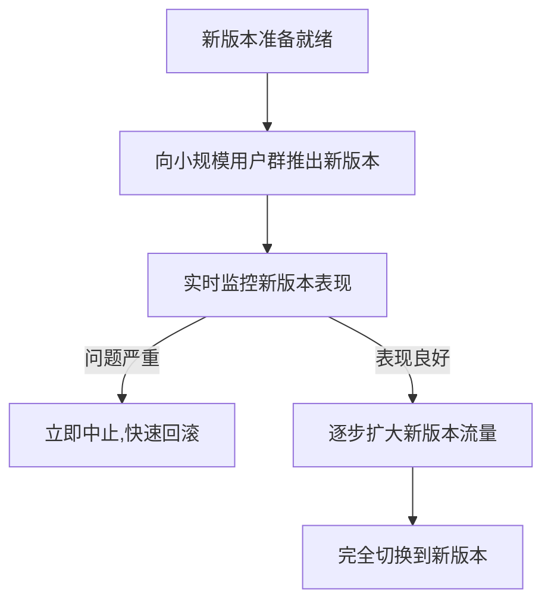

# AI系统金丝雀发布原理与代码实战案例讲解

## 1.背景介绍

### 1.1 什么是金丝雀发布

在现代软件交付实践中,金丝雀发布(Canary Release)是一种可靠的技术手段,用于安全地推出新功能或系统更新,并有效管理相关风险。这种方法借鉴了矿工使用金丝雀探测有毒气体的做法,因此得名。

金丝雀发布的基本思路是,先向一个有限的用户群体(通常是内部测试团队或勇敢用户)推出新版本,密切监控其表现。一旦确认无重大问题,就可以逐步扩大受众范围,直至完全置换旧版本。如果出现严重故障,则可以快速回滚,将影响控制在可控范围内。

### 1.2 金丝雀发布的重要性

当前,企业面临日益激烈的市场竞争,需要快速响应用户需求并持续创新。而传统的几个月或几年一次的大版本发布模式,已无法适应这种变化步伐。因此,越来越多的公司采用敏捷开发和持续交付的方式,以更高的频率、更低的风险推出新功能。金丝雀发布作为一种安全可靠的发布策略,可确保新版本的平稳过渡,降低故障风险,从而支持快速创新。

此外,对于一些对可用性和安全性要求很高的关键系统(如银行、医疗等),金丝雀发布可最大限度地降低变更带来的影响,保证系统的连续可靠运行。

## 2.核心概念与联系

### 2.1 金丝雀发布的核心概念

- **服务版本控制**:能够同时运行新旧版本的服务实例,并对其进行版本管理和调度。
- **渐进式流量转移**:能够平滑地将流量从旧版本服务逐步转移到新版本服务上。
- **实时监控和反馈**:持续监控新版本的运行状态和性能指标,并提供快速回滚机制。

### 2.2 金丝雀发布与其他概念的关系

- **蓝绿部署**:蓝绿部署是一种无停机发布技术,通过运行新旧两个环境,实现平滑的版本切换。金丝雀发布可看作是蓝绿部署的一种特殊形式。
- **A/B测试**:A/B测试是向不同用户群体推出不同版本的做法,以评估新功能的效果。金丝雀发布可视为一种A/B测试的延伸,但更侧重于风险控制。
- **灰度发布**:灰度发布是通过流量控制,将部分流量导向新版本的做法。金丝雀发布实际上是一种特殊的灰度发布策略。

### 2.3 金丝雀发布的关键流程

金丝雀发布通常包括以下几个关键步骤:



## 3.核心算法原理具体操作步骤

金丝雀发布的核心算法原理主要包括两个方面:流量控制算法和版本路由算法。

### 3.1 流量控制算法

流量控制算法决定了如何将流量分配给不同版本的服务实例。常用的算法有:

1. **线性渐进式**:一开始只向新版本分配很小的流量(如5%),之后逐步增加,直至100%。这种方式较为温和,适合对风险有较高要求的场景。

2. **高斯增量**:一开始分配较少流量,之后按高斯分布曲线快速增加,到达一个拐点后再逐渐趋于100%。这种方式发布速度较快,适合对新版本较有信心的场景。

3. **步进式**:将总流量等分为若干批次,每个批次100%切换到新版本。这种方式发布速度很快,但控制粒度较低。

4. **金环规则**:将用户按环数哈希到不同的环上,再根据环的权重分配流量。这种方式可以很好地解决会话亲和性等问题。

无论采用何种算法,都需要设置一些调节参数,如批次大小、增量步长等,以控制发布的速度和节奏。

### 3.2 版本路由算法

版本路由算法决定了将特定请求路由到哪个版本的服务实例上。常见的算法有:

1. **基于请求头**:根据HTTP请求头(如特定的Cookie)中的信息,将请求路由到对应版本。

2. **基于IP地理位置**:根据用户的IP地理位置,将位于同一区域的请求路由到相同版本。

3. **基于设备指纹**:根据用户设备的特征(如操作系统、浏览器等)计算指纹,将相同指纹的请求路由到相同版本。

4. **基于语义版本**:为每个版本指定一个语义版本号,根据版本号进行路由。

5. **基于用户ID**:根据用户ID的哈希值,将同一用户的请求路由到相同版本。

这些算法可根据实际需求组合使用,以满足会话亲和性、区域性能等不同需求。

## 4.数学模型和公式详细讲解举例说明

在金丝雀发布中,流量控制算法和版本路由算法都可以使用数学模型进行描述和优化。

### 4.1 线性渐进式流量控制模型

假设总流量为1,新版本的流量份额为x,旧版本的流量份额为1-x。我们希望x从很小的值开始,缓慢增加,再快速增加,最后趋于1。可使用如下公式描述:

$$
x(t) = \frac{1}{1+e^{-k(t-t_0)}}
$$

其中t为时间,t0为x=0.5时的时间点,k控制增长速率。当t<<t0时,x接近0;当t>>t0时,x接近1;t0处,增长速率达到最大值k/4。

### 4.2 高斯增量流量控制模型

高斯增量模型可用如下公式描述:

$$
x(t) = \frac{1}{\sqrt{2\pi}\sigma}e^{-\frac{(t-\mu)^2}{2\sigma^2}}
$$

其中μ为高斯分布的均值,σ为标准差,控制增长的快慢。当t<<μ时,x接近0;当t>>μ时,x接近1;t=μ处,增长速率达到最大值。

### 4.3 会话亲和性的数学模型

对于需要保持会话亲和性的应用,我们希望同一用户的请求始终路由到同一版本。可使用一致性哈希的方法,将用户ID哈希到若干个环上,每个环对应一个版本。具体方法如下:

1. 计算用户ID的哈希值: $h = hash(userID)$
2. 将哈希值映射到环的某个位置: $p = h \mod N$,其中N为环的大小。
3. 从p点开始顺时针查找,第一个遇到的版本号即为目标版本。

通过调整环的大小N和版本在环上的位置,可以控制每个版本分配到的流量比例。

### 4.4 最小化风险的优化模型

在金丝雀发布过程中,我们希望尽量降低新版本带来的风险。可以建立如下优化模型:

$$
\begin{aligned}
\min\quad & R(x,t) \\
\text{s.t.}\quad & 0 \le x \le 1 \\
       & x(0)=0, x(T)=1
\end{aligned}
$$

其中R(x,t)表示给定流量分配x和时间t时的风险值,需要最小化;x为新版本的流量分配比例;约束条件要求x在[0,1]区间,并分别在t=0和t=T时取0和1.

通过数学建模和优化,可以找到最优的流量控制曲线,在控制风险的同时尽量缩短发布时间。

## 5.项目实践:代码实例和详细解释说明

为了演示金丝雀发布的实现,我们基于Istio服务网格构建了一个示例项目。Istio提供了丰富的流量管理功能,可以方便地实现版本控制、金丝雀发布等策略。

### 5.1 部署示例应用

我们首先部署一个简单的在线书店应用,包括三个服务:产品目录(product-catalog)、购物车(cart)和前端网关(frontend)。每个服务有多个版本,通过Kubernetes部署。

```yaml
# product-catalog服务
apiVersion: apps/v1
kind: Deployment
metadata:
  name: product-catalog-v1
spec:
  replicas: 1
  selector:
    matchLabels:
      app: product-catalog
      version: v1
  template:
    metadata:
      labels:
        app: product-catalog
        version: v1
    spec:
      containers:
      - name: catalog
        image: example/product-catalog:v1
        
---        
        
# cart服务        
apiVersion: apps/v1
kind: Deployment
metadata:
  name: cart-v1
spec:
  replicas: 1
  selector:
    matchLabels:
      app: cart
      version: v1
  template:
    metadata:
      labels:
        app: cart
        version: v1
    spec:
      containers:
      - name: cart
        image: example/cart:v1
        
---
        
# frontend服务
apiVersion: apps/v1
kind: Deployment  
metadata:
  name: frontend-v1
spec:
  replicas: 1
  selector:
    matchLabels:
      app: frontend
      version: v1
  template:
    metadata:
      labels:
        app: frontend
        version: v1
    spec:
      containers:
      - name: frontend
        image: example/frontend:v1
```

### 5.2 配置金丝雀发布策略

接下来,我们使用Istio的VirtualService资源,为frontend服务配置金丝雀发布策略。

```yaml
apiVersion: networking.istio.io/v1alpha3
kind: VirtualService
metadata:
  name: frontend 
spec:
  hosts:
  - frontend.example.com
  http:
  - route:
    - destination:
        host: frontend
        subset: v1
      weight: 90
    - destination:  
        host: frontend
        subset: v2
      weight: 10
```

上面的配置将90%的流量路由到frontend v1版本,10%流量路由到v2版本。通过调整weight参数,可以控制流量的分配比例。

我们还可以使用HTTP头部等条件进行版本路由,实现更精细的控制:

```yaml
apiVersion: networking.istio.io/v1alpha3
kind: VirtualService  
metadata:
  name: frontend
spec:
  hosts:
  - frontend.example.com
  http:
  - match:
    - headers:
        user-agent:
          regex: '.*Chrome.*'
    route:
    - destination:
        host: frontend
        subset: v2
  - route:
    - destination:
        host: frontend  
        subset: v1
```

这个配置将使用Chrome浏览器的用户路由到v2版本,其他用户路由到v1版本。

### 5.3 监控和分析

在金丝雀发布期间,我们需要实时监控新版本的运行状态。Istio提供了丰富的遥测功能,可以收集各种指标数据。我们部署Prometheus和Grafana,配合Istio的遥测数据,构建一个可视化的监控系统。

```yaml
# Prometheus配置
scrape_configs:
  - job_name: 'istio-mesh'
    metrics_path: /metrics
    kubernetes_sd_configs:
    - role: endpoints
      namespaces:
        names:
        - istio-system

# Grafana Dashboard配置  
- uid: istio-mesh      
  title: Istio Service Mesh
  tags: [ istio ]
  type: dash-folder
  items:
    - uid: istio-service-dashboard  
      title: Service Dashboard
      tags: [ istio ]
      type: dashboard
      items:
        - chart:
            title: Request Volume
            metrics:
              - istio_requests_total
        - chart:  
            title: Success Rate
            metrics:
              - istio_request_duration_milliseconds
```

通过Grafana面板,我们可以实时查看新版本的请求量、成功率、延迟等关键指标,并设置异常报警规则。一旦发现异常,可以立即终止金丝雀发布,回滚到旧版本。

## 6.实际应用场景

金丝雀发布策略已被众多公司和项目广泛采用,下面列举一些典型的应用场景:

- **电商平台**: 像亚马逊、阿里巴巴这样的电商巨头,每天都有