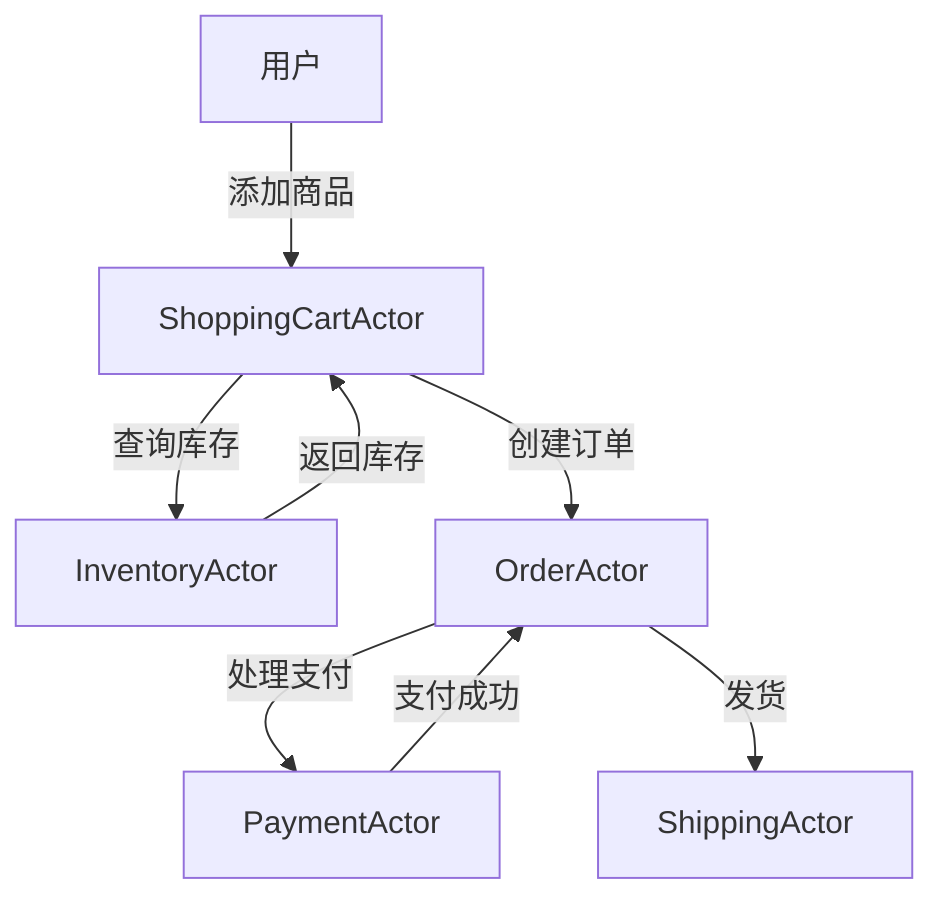

# Akka原理与代码实例讲解

## 1.背景介绍

在现代分布式系统中,并发和高可用性是两个关键的需求。传统的线程和锁模型在处理大规模并发时往往会遇到复杂的同步问题,容易导致死锁、活锁等并发bug。而Actor模型则提供了一种更优雅、更易于推理的并发编程范式。

Akka是一个用Scala语言编写的开源工具包,它实现了Actor模型,为构建高度并发、分布式和容错的应用程序提供了一种更好的抽象。Akka广泛应用于各种领域,如实时系统、物联网、大数据处理等。

### Akka核心概念

Akka的核心概念是Actor,一个Actor就是一个并发原语,它拥有以下特点:

- 单线程执行,无共享状态
- 通过异步消息传递进行通信
- Actor之间是完全隔离的
- Actor是轻量级的,创建成本低廉

### Actor系统层次结构

Akka中的Actor是层次化组织的,形成一个树状结构:

- 根Actor是用户定义的监管Actor
- 每个Actor都有一个父Actor
- Actor可以动态创建子Actor
- Actor之间通过父子关系建立监督树

### Actor生命周期

每个Actor都有自己的生命周期,包括以下几个阶段:

1. 启动(Start)
2. 运行(Running)
3. 暂停(Paused) 
4. 重启(Restarted)
5. 终止(Terminated)

## 2.核心概念与联系

### Actor引用

Actor引用是Actor之间进行通信的门户。每个Actor在创建时都会分配一个稳定的引用,其他Actor可以通过该引用向它发送消息。Actor引用是轻量级的,可以在不同的进程或机器之间传递。

### Actor系统

Actor系统是一个分层的Actor集合,由一个特殊的用户守护Actor作为根节点。Actor系统管理着Actor的生命周期,并提供了位置透明性、远程通信等功能。

### 监督策略

监督是Actor模型中处理故障的核心机制。每个Actor都是一个监督者,负责管理其子Actor。当子Actor发生故障时,监督者可以根据预定义的监督策略(Resume、Restart、Stop等)作出适当的处理。

### 消息传递

Actor之间通过异步消息传递进行通信,而不是通过共享内存。消息可以是任意类型,包括内置类型或自定义类型。Akka提供了高效的消息传递机制,确保消息以先入先出(FIFO)的顺序处理。

### 路由

Akka提供了多种路由策略,用于将消息分发给一组Actor。常用的路由策略包括:

- 循环路由(Round-Robin)
- 随机路由(Random)
- 最小消息队列优先(SmallestMailboxPool)
- 广播路由(Broadcast)

## 3.核心算法原理具体操作步骤

Akka的核心算法是基于Actor模型的,主要包括以下几个方面:

### 1. Actor创建

Actor的创建过程如下:

1. 定义Actor类,继承自`Actor`特质
2. 重写`receive`方法,定义消息处理行为
3. 使用`ActorSystem.actorOf`方法创建Actor实例

```scala
import akka.actor.Actor
import akka.actor.ActorSystem
import akka.actor.Props

class MyActor extends Actor {
  def receive = {
    case "hello" => println("Hello!")
    case _       => println("Unknown message")
  }
}

object Main extends App {
  val system = ActorSystem("mySystem")
  val myActor = system.actorOf(Props[MyActor], "myActor")
  myActor ! "hello" // 向Actor发送消息
}
```

### 2. 消息处理

Actor通过`receive`方法处理收到的消息,该方法使用模式匹配来定义不同消息的处理行为。消息处理过程如下:

1. 将消息添加到Actor的邮箱队列中
2. Actor从邮箱中按顺序取出消息
3. 使用`receive`方法中定义的模式匹配处理消息
4. 如果没有匹配的模式,则消息被丢弃

### 3. Actor监督

Akka使用监督树来管理Actor的生命周期和错误处理。监督过程如下:

1. 每个Actor都有一个监督策略,定义如何处理子Actor的故障
2. 当子Actor发生故障时,监督者会收到`Terminated`消息
3. 监督者根据监督策略决定是重启、恢复还是终止子Actor

```scala
import akka.actor.OneForOneStrategy
import akka.actor.SupervisorStrategy._

override val supervisorStrategy =
  OneForOneStrategy(maxNrOfRetries = 10, withinTimeRange = 1 minute) {
    case _: ArithmeticException      => Resume
    case _: NullPointerException     => Restart
    case _: IllegalArgumentException => Stop
    case _: Exception                => Escalate
  }
```

### 4. 路由

Akka提供了多种路由策略,用于将消息分发给一组Actor。路由过程如下:

1. 创建路由器`Router`
2. 将消息发送给路由器
3. 路由器根据路由策略将消息分发给routees(Actor或Actor路径)

```scala
import akka.routing.RoundRobinPool

val workerRouter = context.actorOf(
  RoundRobinPool(5).props(Props[Worker]), "workerRouter")

// 将消息发送给路由器
workerRouter ! Work(42)
```

### 5. 远程通信

Akka支持跨进程甚至跨机器的远程通信。远程通信过程如下:

1. 在远程节点上创建`ActorSystem`
2. 获取远程Actor的`ActorPath`
3. 使用`ActorSelection`向远程Actor发送消息

```scala
val remoteActorPath = AddressFromURIString("akka://remote-sys@host:5678/user/worker")
val selection = context.actorSelection(remoteActorPath)
selection ! "hello"
```

## 4.数学模型和公式详细讲解举例说明

在Akka中,有一些数学模型和公式用于描述和优化Actor系统的行为,例如:

### 1. 小世界网络模型

小世界网络模型描述了Actor系统中Actor之间的连接关系。在这种模型中,每个Actor只与少数其他Actor直接连接,但是任意两个Actor之间的平均路径长度却很短。这种结构有利于提高系统的容错性和可扩展性。

小世界网络模型可以用以下公式表示:

$$
L = \frac{1}{N(N-1)}\sum_{i\neq j}d(i,j)
$$

其中:

- $L$是平均路径长度
- $N$是网络中节点(Actor)的数量
- $d(i,j)$是节点$i$和节点$j$之间的最短路径长度

### 2. 消息队列模型

Akka中,每个Actor都有一个消息队列,用于存储待处理的消息。消息队列可以看作是一个先入先出(FIFO)的队列,可以用以下公式描述:

$$
Q(t) = \sum_{i=0}^{t}\lambda_i - \sum_{j=0}^{t}\mu_j
$$

其中:

- $Q(t)$是时刻$t$时队列中的消息数量
- $\lambda_i$是时刻$i$进入队列的消息数量
- $\mu_j$是时刻$j$离开队列的消息数量

基于这个模型,我们可以分析和优化Actor的消息处理能力,避免消息积压或丢失。

### 3. 容错模型

Akka的监督机制使用了一种叫做"让它崩溃"(Let it crash)的容错模型。这种模型认为,当发生错误时,最好让Actor崩溃,然后由监督者决定如何处理,而不是在Actor内部进行复杂的错误处理。

这种模型可以用以下公式表示:

$$
P(failure) = 1 - \prod_{i=1}^{n}(1 - p_i)
$$

其中:

- $P(failure)$是整个系统发生故障的概率
- $n$是系统中Actor的数量
- $p_i$是第$i$个Actor发生故障的概率

通过这个公式,我们可以估计系统的可靠性,并采取适当的监督策略来提高容错能力。

## 5.项目实践:代码实例和详细解释说明

为了更好地理解Akka的原理和使用方式,我们来看一个实际的项目示例:一个简单的在线商城系统。

### 系统架构

我们将使用Akka构建一个分布式的在线商城系统,包括以下几个主要组件:

1. `ShoppingCartActor`: 管理用户的购物车
2. `InventoryActor`: 管理商品库存
3. `OrderActor`: 处理订单
4. `PaymentActor`: 处理支付
5. `ShippingActor`: 处理发货

这些Actor通过消息传递进行协作,构成了整个在线商城系统。



### 代码实现

下面是一些关键组件的代码实现:

#### ShoppingCartActor

```scala
class ShoppingCartActor extends Actor {
  var cart = Map.empty[String, Int]

  def receive = {
    case AddItem(item, quantity) =>
      val newQuantity = cart.getOrElse(item, 0) + quantity
      cart += (item -> newQuantity)
      sender() ! Ack

    case RemoveItem(item, quantity) =>
      val newQuantity = cart.get(item).map(_ - quantity).filter(_ > 0)
      cart = newQuantity.map(q => (item, q)).toMap
      sender() ! Ack

    case Checkout =>
      val inventoryActor = context.actorSelection("/user/inventory")
      inventoryActor ! CheckInventory(cart)
      context.become(waitingForInventory(sender()))
  }

  def waitingForInventory(customer: ActorRef): Receive = {
    case InventoryStatus(available) =>
      if (available) {
        val orderActor = context.actorOf(Props[OrderActor])
        orderActor ! PlaceOrder(cart, customer)
        context.unbecome()
      } else {
        customer ! OutOfStock
        context.unbecome()
      }
  }
}
```

`ShoppingCartActor`维护了一个`cart`映射,用于存储用户添加的商品及数量。它可以响应`AddItem`、`RemoveItem`和`Checkout`消息。在结账时,它会向`InventoryActor`查询库存,并根据库存情况决定是否创建订单。

#### InventoryActor

```scala
class InventoryActor extends Actor {
  var inventory = Map("Apple" -> 10, "Orange" -> 5)

  def receive = {
    case CheckInventory(cart) =>
      val available = cart.forall {
        case (item, quantity) =>
          inventory.get(item).exists(_ >= quantity)
      }
      sender() ! InventoryStatus(available)

    case UpdateInventory(items) =>
      items.foreach {
        case (item, quantity) =>
          inventory += (item -> (inventory.getOrElse(item, 0) - quantity))
      }
  }
}
```

`InventoryActor`维护了一个`inventory`映射,用于存储商品及其库存量。它可以响应`CheckInventory`消息,检查购物车中的商品是否有足够库存。如果库存足够,它会向发送者发送`InventoryStatus(available = true)`消息。

#### OrderActor

```scala
class OrderActor extends Actor {
  def receive = {
    case PlaceOrder(cart, customer) =>
      val paymentActor = context.actorOf(Props[PaymentActor])
      paymentActor ! ProcessPayment(cart, customer, sender())

    case PaymentConfirmed =>
      val inventoryActor = context.actorSelection("/user/inventory")
      inventoryActor ! UpdateInventory(cart)
      val shippingActor = context.actorOf(Props[ShippingActor])
      shippingActor ! ShipOrder(cart, sender())

    case PaymentFailed =>
      customer ! OrderFailed
      context.stop(self)
  }
}
```

`OrderActor`负责处理订单。当收到`PlaceOrder`消息时,它会创建一个`PaymentActor`进行支付。如果支付成功,它会更新库存并创建一个`ShippingActor`进行发货。如果支付失败,它会通知用户并终止自身。

#### PaymentActor

```scala
class PaymentActor extends Actor {
  def receive = {
    case ProcessPayment(cart, customer, orderActor) =>
      // 模拟支付过程
      if (Random.nextBoolean()) {
        orderActor ! PaymentConfirmed
        customer ! PaymentSuccess
      } else {
        orderActor ! PaymentFailed
        customer ! PaymentFailed
      }
  }
}
```

`PaymentActor`模拟了支付过程。它会随机返回支付成功或失败的结果,并通知`OrderActor`和用户。

#### ShippingActor

```scala
class ShippingActor extends Actor