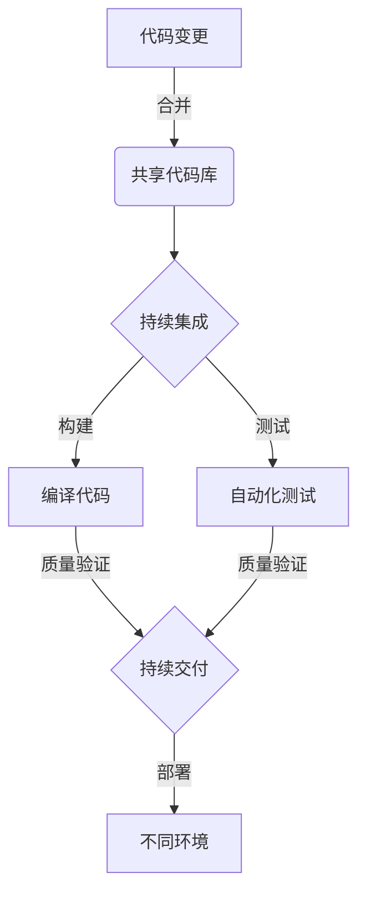
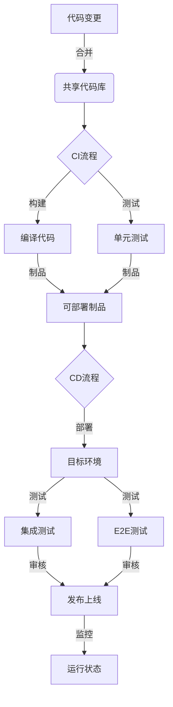

# CI/CD与自动化测试原理与代码实战案例讲解

## 1.背景介绍

### 1.1 软件开发的挑战

在当今快节奏的软件开发环境中,团队面临着许多挑战:

- **快速交付**:用户期望持续的新功能和改进,开发团队需要加快交付周期
- **质量保证**:随着代码复杂度不断增加,确保高质量输出变得更加困难
- **协作效率**:团队成员之间需要高效协作,避免代码冲突和集成问题

### 1.2 CI/CD与自动化测试的重要性

为了应对这些挑战,CI/CD(持续集成/持续交付)和自动化测试实践应运而生。它们可以:

- **加速交付周期**:自动化构建、测试和部署流程,缩短反馈循环
- **提高质量**:通过自动化测试发现并修复缺陷,确保高质量输出
- **促进协作**:集成共享代码库,统一工作流程,提高团队效率

## 2.核心概念与联系

### 2.1 持续集成(CI)

持续集成指的是**频繁地将代码变更合并到共享代码库**,并通过**自动化构建和测试**来验证这些变更的正确性。

CI的核心理念是**小步快跑**,通过频繁集成,可以尽早发现问题,降低修复成本。

### 2.2 持续交付(CD)

持续交付在持续集成的基础上,增加了**自动化发布**的步骤。通过自动化流程,可以**将通过测试的代码快速部署到不同环境**(开发、测试、生产等)。

CD的目标是**缩短从代码提交到部署上线的时间**,加快软件交付节奏。

### 2.3 自动化测试

自动化测试是CI/CD流程中不可或缺的一环。它包括:

- **单元测试**:针对最小代码单元(函数或方法)进行验证
- **集成测试**:验证不同模块之间的集成和交互
- **端到端(E2E)测试**:模拟真实用户场景,测试整个系统的工作流程

自动化测试可以持续监控代码质量,确保新增功能和改动不会破坏现有功能。

### 2.4 CI/CD与自动化测试的关系

CI/CD和自动化测试是相辅相成的实践:

- **CI/CD提供自动化流程**,确保代码变更可以高效地构建、测试和部署
- **自动化测试为CI/CD提供质量保障**,通过持续验证确保交付高质量软件

两者的结合,构建了高效、高质量的软件交付流水线。



## 3.核心算法原理具体操作步骤

### 3.1 CI流程

1. **代码合并**:开发人员将代码变更合并到共享代码库(如Git仓库)
2. **构建触发**:代码合并会自动触发CI流程,开始代码构建
3. **依赖下载**:下载项目所需的依赖库和工具
4. **代码编译**:编译源代码,生成可执行文件或库文件
5. **单元测试**:运行自动化单元测试,验证最小代码单元的正确性
6. **代码分析**:进行代码静态分析,检查代码质量和安全性
7. **构建制品**:将编译后的文件和相关资源打包成可部署的制品(artifacts)
8. **部署制品**:将制品部署到特定环境(如测试环境)进行进一步测试

### 3.2 CD流程

1. **触发部署**:在CI流程完成后,可以手动或自动触发CD流程
2. **环境准备**:根据部署目标环境,准备所需的基础设施资源
3. **部署制品**:将制品部署到目标环境(如测试、预发布或生产环境)
4. **集成测试**:运行集成测试,验证不同模块之间的集成和交互
5. **端到端测试**:执行端到端测试,模拟真实用户场景测试整个系统
6. **审核和批准**:对部署结果进行人工审核和批准(可选)
7. **发布上线**:如果通过所有测试和审核,则将应用发布到生产环境
8. **监控反馈**:持续监控应用运行状态,收集用户反馈



## 4.数学模型和公式详细讲解举例说明

在CI/CD和自动化测试中,有一些重要的数学模型和公式需要了解:

### 4.1 代码覆盖率

代码覆盖率(Code Coverage)是衡量自动化测试质量的一个重要指标。它表示测试用例执行时,实际覆盖到的代码行数占总代码行数的百分比。

$$
代码覆盖率 = \frac{被测试用例执行的代码行数}{总代码行数} \times 100\%
$$

例如,如果一个程序有100行代码,测试用例执行时覆盖了80行,那么代码覆盖率就是80%。

通常,我们希望代码覆盖率尽可能高,以确保代码被充分测试。但是,100%的覆盖率并不意味着没有bug,因为测试用例的质量也很重要。

### 4.2 测试用例优先级

在有限的测试时间和资源下,我们需要优先执行那些更重要、更可能出错的测试用例。一种常见的方法是根据测试用例的**失败代价**和**发生概率**来计算优先级。

$$
测试用例优先级 = 失败代价 \times 发生概率
$$

其中:

- **失败代价**:如果该测试用例失败,可能导致的损失或影响程度
- **发生概率**:该测试用例失败的可能性有多大

通过计算每个测试用例的优先级,我们可以先执行那些优先级更高的测试用例,从而更有效地发现和修复关键缺陷。

### 4.3 A/B测试

在持续交付过程中,我们可能需要对不同版本的应用进行A/B测试,评估新特性或改进的效果。A/B测试的基本思路是:

1. 将用户随机分成两组(A组和B组)
2. A组使用原有版本,B组使用新版本
3. 收集并比较两组的关键指标(如点击率、转化率等)
4. 根据指标差异,决定是否全面推广新版本

我们可以使用**统计学方法**来判断两组数据之间的差异是否具有统计学意义。常用的方法包括t检验、卡方检验等。

$$
t = \frac{\overline{x}_1 - \overline{x}_2}{\sqrt{\frac{s_1^2}{n_1} + \frac{s_2^2}{n_2}}}
$$

上式是用于比较两组数据均值差异的t检验公式,其中$\overline{x}_1$和$\overline{x}_2$分别表示两组数据的均值,$s_1^2$和$s_2^2$表示方差,$n_1$和$n_2$表示样本量。如果计算出的t值超过了临界值,则可以认为两组数据存在显著差异。

## 5.项目实践:代码实例和详细解释说明

为了更好地理解CI/CD和自动化测试的实践,我们来看一个基于Python和GitHub Actions的实例项目。

### 5.1 项目概述

这是一个简单的Python Web应用,提供了一个将字符串转换为大写的API接口。项目结构如下:

```
uppercaser/
├── app.py
├── requirements.txt
├── tests/
│   ├── __init__.py
│   └── test_app.py
├── .github/
│   └── workflows/
│       └── ci.yml
└── README.md
```

- `app.py`是主应用代码
- `tests/test_app.py`包含单元测试用例
- `.github/workflows/ci.yml`定义了GitHub Actions的CI/CD流程

### 5.2 应用代码

`app.py`文件定义了一个Flask Web应用,提供了`/uppercase`接口:

```python
from flask import Flask, request

app = Flask(__name__)

@app.route('/uppercase', methods=['POST'])
def uppercase():
    text = request.json.get('text', '')
    return {'uppercase': text.upper()}

if __name__ == '__main__':
    app.run()
```

### 5.3 单元测试

`tests/test_app.py`包含了对`uppercase`接口的单元测试:

```python
import unittest
from app import app

class TestApp(unittest.TestCase):

    def setUp(self):
        self.client = app.test_client()

    def test_uppercase(self):
        data = {'text': 'hello'}
        response = self.client.post('/uppercase', json=data)
        self.assertEqual(response.json, {'uppercase': 'HELLO'})

    def test_empty_string(self):
        data = {'text': ''}
        response = self.client.post('/uppercase', json=data)
        self.assertEqual(response.json, {'uppercase': ''})

if __name__ == '__main__':
    unittest.main()
```

这里定义了两个测试用例:

1. `test_uppercase`测试将普通字符串转换为大写
2. `test_empty_string`测试传入空字符串时的行为

### 5.4 GitHub Actions CI/CD流程

`.github/workflows/ci.yml`文件定义了GitHub Actions的CI/CD流程:

```yaml
name: CI/CD

on:
  push:
    branches: [ main ]
  pull_request:
    branches: [ main ]

jobs:

  test:
    runs-on: ubuntu-latest
    
    steps:
    - uses: actions/checkout@v2
    - name: Set up Python
      uses: actions/setup-python@v2
      with:
        python-version: 3.8
    - name: Install dependencies
      run: |
        python -m pip install --upgrade pip
        pip install -r requirements.txt
    - name: Run tests
      run: |
        python -m unittest discover tests
        
  deploy:
    needs: test
    runs-on: ubuntu-latest
    
    steps:
    - uses: actions/checkout@v2
    - name: Set up Python
      uses: actions/setup-python@v2
      with:
        python-version: 3.8
    - name: Install dependencies
      run: |
        python -m pip install --upgrade pip
        pip install -r requirements.txt
    - name: Deploy to production
      run: |
        # Deploy code to production server
        echo "Deploying to production..."
```

这个流程包含两个作业(jobs):

1. `test`作业:在每次代码推送或Pull Request时触发,安装依赖并运行单元测试
2. `deploy`作业:只有在`test`作业成功后才会触发,用于将代码部署到生产环境(这里只是示例,实际操作被注释掉了)

通过这个示例,我们可以看到如何将CI/CD和自动化测试实践应用到实际项目中。

## 6.实际应用场景

CI/CD和自动化测试在各种软件开发场景中都有广泛应用,包括但不限于:

### 6.1 Web应用开发

对于现代Web应用来说,CI/CD和自动化测试是不可或缺的实践。它们可以确保在每次代码变更时,应用都能被正确构建、测试和部署,从而提高交付效率和质量。

### 6.2 移动应用开发

在移动应用开发中,CI/CD和自动化测试可以帮助开发团队更快地交付新版本,并确保应用在不同设备和操作系统上的兼容性。

### 6.3 微服务架构

对于基于微服务的分布式系统,CI/CD和自动化测试可以帮助管理复杂的依赖关系,确保每个微服务都能被正确构建、测试和部署,从而保证整个系统的稳定性和可靠性。

### 6.4 机器学习和数据科学

在机器学习和数据科学领域,CI/CD和自动化测试可以用于管理模型训练和部署流程,确保新模型的性能和质量符合预期。

### 6.5 基础设施即代码(IaC)

基础设施即代码(Infrastructure as Code)是一种通过代码来管理和供应云资源的方法。在这种场景下,CI/