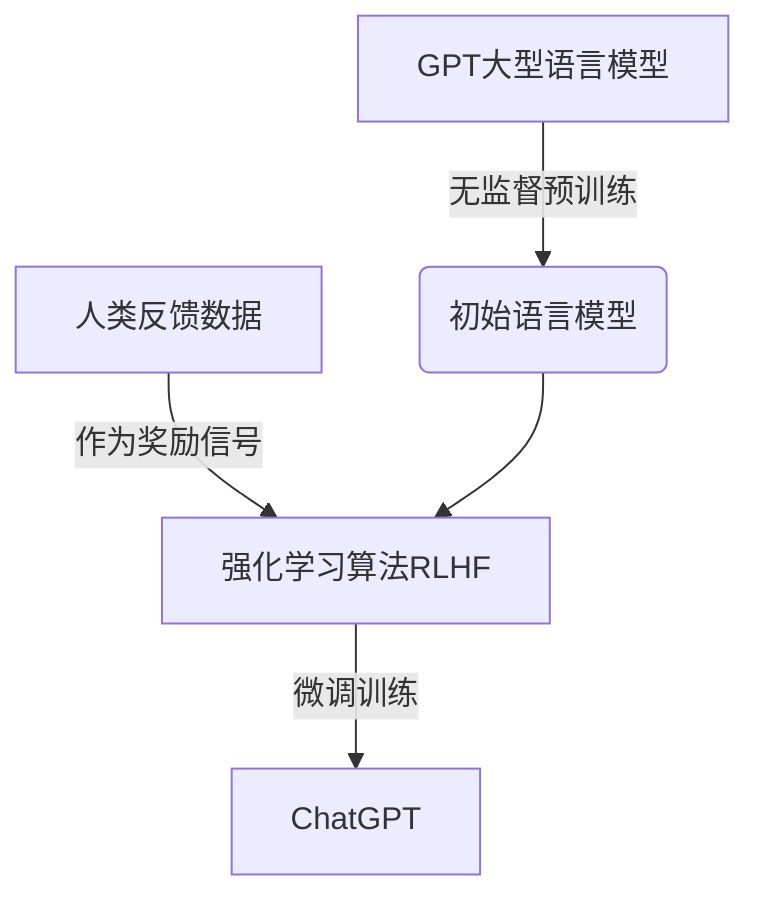
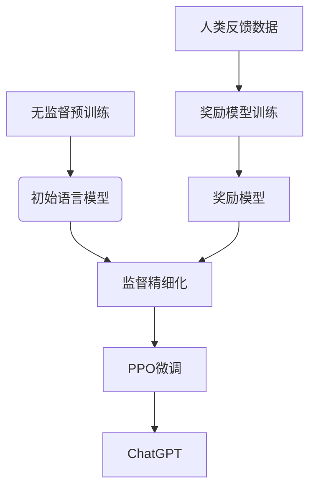

# ChatGPT的RLHF实战

## 1.背景介绍

在过去几年中,人工智能领域取得了长足的进步,尤其是在自然语言处理(NLP)方面。大型语言模型(LLM)的出现,使得人工智能系统能够生成看似人类编写的自然语言内容,这在很大程度上推动了人工智能的发展。然而,这些模型在训练过程中存在着一些固有的缺陷和局限性,比如它们可能会生成有偏见、不当或不安全的输出。为了解决这一问题,OpenAI提出了一种新的训练范式,即通过人类反馈来微调语言模型,这种方法被称为Reinforcement Learning from Human Feedback (RLHF)。

ChatGPT就是使用RLHF训练而成的一款突破性产品,它展示了RLHF在提高语言模型安全性和有益性方面的巨大潜力。本文将深入探讨RLHF在ChatGPT中的实际应用,包括其核心概念、算法原理、数学模型、代码实现、应用场景等,并对其未来发展趋势和挑战进行展望。

## 2.核心概念与联系

### 2.1 RLHF概述

Reinforcement Learning from Human Feedback(RLHF)是一种通过人类反馈来微调大型语言模型的方法。它将人类反馈视为奖励信号,并使用强化学习算法来优化语言模型,使其生成的输出更加符合人类的期望和偏好。

RLHF的核心思想是:首先使用大量无标注数据对语言模型进行预训练,获得一个初始模型;然后收集人类对模型输出的评分反馈数据,将这些反馈数据作为奖励信号,使用强化学习算法对预训练模型进行微调,从而使模型生成的输出更加符合人类的期望。

### 2.2 RLHF与监督学习的区别

传统的监督学习方法是通过大量带标注的数据对模型进行训练,使其学习映射输入到期望输出的规律。而RLHF则是在无监督预训练的基础上,使用人类反馈作为奖励信号,通过强化学习算法对模型进行微调。

相比监督学习,RLHF的优势在于:

1. 不需要大量带标注的数据,只需要少量人类反馈即可进行训练。
2. 更加灵活,可以根据不同的任务和偏好对模型进行定制化微调。
3. 能够更好地捕捉人类的语义偏好,生成更加自然和人性化的输出。

### 2.3 RLHF与GPT的关系

GPT(Generative Pre-trained Transformer)是一种基于Transformer架构的大型语言模型,通过无监督预训练在大量文本数据上学习语言知识。GPT模型可以生成看似人类编写的自然语言内容,但存在一些固有的局限性,比如可能会生成有偏见、不当或不安全的输出。

RLHF可以被视为在GPT模型的基础上进行的一种"人性化"微调,通过人类反馈来指导模型生成更加符合人类期望的输出。ChatGPT就是在GPT-3.5的基础上,使用RLHF进行微调训练而成的产品。

RLHF与GPT的结合,不仅保留了GPT强大的语言生成能力,同时也赋予了模型更好的安全性、有益性和人性化特征。



## 3.核心算法原理具体操作步骤

RLHF在ChatGPT中的实现主要包括以下几个关键步骤:

### 3.1 无监督预训练

首先使用大量无标注的文本数据(如网页、书籍等)对GPT模型进行无监督预训练,获得一个初始的语言模型。这一步通常采用自监督学习的方式,例如掩码语言模型(Masked Language Modeling)和下一句预测(Next Sentence Prediction)等任务。

预训练过程中,模型会学习到丰富的语言知识,包括词汇、语法、语义等,从而获得强大的语言生成能力。

### 3.2 收集人类反馈数据

接下来,需要收集人类对模型输出的评分反馈数据。具体操作是:

1. 设计一系列提示(Prompts),覆盖不同的场景和任务。
2. 让模型根据这些提示生成回复。
3. 邀请人类评审员对模型的回复进行评分,评分范围通常为1-5分(或二元分类:好/坏)。

评分时,人类评审员需要综合考虑回复的质量、安全性、有益性等多个方面,给出全面的评价。收集的人类反馈数据将作为RLHF训练的关键输入。

### 3.3 RLHF微调训练

有了人类反馈数据后,就可以使用强化学习算法对初始模型进行微调训练了。RLHF的训练过程可以概括为以下几个步骤:

1. **奖励模型训练**:使用人类反馈数据训练一个奖励模型(Reward Model),该模型可以对任意输出给出一个分数,模拟人类的评分行为。
2. **监督精细化**:使用奖励模型对大量生成的输出进行评分,将高分输出作为正例,低分输出作为反例,对初始模型进行有监督的精细化训练。
3. **PPO微调**:使用PPO(Proximal Policy Optimization)等强化学习算法,将奖励模型的分数作为奖励信号,对模型进行进一步的微调训练。

经过以上步骤的训练,模型将学会生成更加符合人类期望的高质量输出。



## 4.数学模型和公式详细讲解举例说明

在RLHF的训练过程中,涉及到一些重要的数学模型和公式,下面将对其进行详细讲解。

### 4.1 奖励模型(Reward Model)

奖励模型的作用是对模型生成的输出进行评分,模拟人类评审员的行为。它本质上是一个二分类或多分类模型,可以用logistic回归或神经网络来实现。

假设奖励模型使用logistic回归,其数学表达式为:

$$r(x, y) = \sigma(w^T\phi(x, y) + b)$$

其中:
- $r(x, y)$是奖励模型对输入$x$和输出$y$的评分
- $\sigma$是sigmoid函数,将线性值映射到(0, 1)区间
- $w$和$b$是模型参数,通过最小化损失函数进行训练

对于二分类问题,损失函数可以使用交叉熵损失:

$$L(w, b) = -\frac{1}{N}\sum_{i=1}^N\left[y_i\log r(x_i, y_i) + (1 - y_i)\log(1 - r(x_i, y_i))\right] + \lambda\|w\|^2$$

其中$y_i$是人类给出的标签(0或1),$\lambda$是L2正则化系数。

通过优化损失函数,可以得到拟合人类评分的奖励模型参数$w$和$b$。

### 4.2 PPO算法(Proximal Policy Optimization)

PPO是一种常用的策略梯度强化学习算法,在RLHF中用于对语言模型进行微调训练。它的目标是最大化期望奖励,即生成高分输出的概率。

PPO算法的关键思想是在每一步更新时,限制新策略与旧策略之间的差异,以保证训练的稳定性和单调性。具体来说,PPO的目标函数为:

$$L^{CLIP}(\theta) = \hat{\mathbb{E}}_t\left[\min\left(r_t(\theta)\hat{A}_t, \text{clip}(r_t(\theta), 1 - \epsilon, 1 + \epsilon)\hat{A}_t\right)\right]$$

其中:
- $r_t(\theta) = \frac{\pi_\theta(a_t|s_t)}{\pi_{\theta_\text{old}}(a_t|s_t)}$是新旧策略之比
- $\hat{A}_t$是优势估计(Advantage Estimation)
- $\epsilon$是一个超参数,用于控制新旧策略之间的差异

通过优化上述目标函数,PPO可以有效地提高模型生成高分输出的能力,同时保证训练的稳定性。

在实际应用中,PPO算法通常与其他技术(如重要性采样、熵正则化等)相结合,以进一步提高训练效果。

## 5.项目实践:代码实例和详细解释说明

为了更好地理解RLHF在ChatGPT中的实现,我们将通过一个简化的代码示例来演示其核心流程。

### 5.1 环境准备

首先,我们需要导入一些必要的Python库:

```python
import torch
import torch.nn as nn
import torch.optim as optim
from transformers import GPT2LMHeadModel, GPT2Tokenizer
```

其中,`transformers`库提供了预训练的GPT-2模型,我们将使用它作为初始语言模型。

### 5.2 数据准备

接下来,我们需要准备一些示例数据,包括提示(Prompts)和对应的人类反馈评分。为了简化,我们使用一些虚构的数据:

```python
prompts = [
    "写一段关于人工智能的介绍",
    "解释一下什么是强化学习",
    # ...
]

human_scores = [
    4, # 好
    2, # 一般
    # ...
]
```

### 5.3 奖励模型训练

我们使用一个简单的双层神经网络作为奖励模型,对模型输出进行二分类评分(好/坏):

```python
class RewardModel(nn.Module):
    def __init__(self, input_dim):
        super(RewardModel, self).__init__()
        self.fc1 = nn.Linear(input_dim, 128)
        self.fc2 = nn.Linear(128, 1)
        
    def forward(self, x):
        x = torch.relu(self.fc1(x))
        x = torch.sigmoid(self.fc2(x))
        return x

reward_model = RewardModel(input_dim=768) # GPT-2的隐层维度为768
criterion = nn.BCELoss()
optimizer = optim.Adam(reward_model.parameters(), lr=0.001)

# 训练奖励模型
for epoch in range(10):
    for prompt, score in zip(prompts, human_scores):
        input_ids = tokenizer.encode(prompt, return_tensors='pt')
        output = gpt2_model(input_ids)[0]
        reward = reward_model(output)
        
        target = torch.tensor([score / 5], dtype=torch.float32) # 将分数归一化到[0, 1]
        loss = criterion(reward, target)
        
        optimizer.zero_grad()
        loss.backward()
        optimizer.step()
```

在这个示例中,我们使用Binary Cross Entropy Loss作为损失函数,通过梯度下降优化奖励模型的参数,使其能够较好地拟合人类的评分。

### 5.4 PPO微调训练

有了奖励模型后,我们就可以使用PPO算法对GPT-2模型进行微调训练了:

```python
from transformers import PPOConfig, PPOTrainer

config = PPOConfig(
    learning_rate=1e-5,
    entropy_coef=0.01,
    value_loss_coef=0.5,
    max_grad_norm=0.5,
    # ...
)

trainer = PPOTrainer(
    config=config,
    model=gpt2_model,
    tokenizer=tokenizer,
    reward_model=reward_model,
    prompts=prompts,
    # ...
)

trainer.train()
```

在这个示例中,我们使用`transformers`库提供的PPO Trainer进行训练。PPO Trainer封装了PPO算法的实现细节,我们只需要提供一些配置参数、初始模型、奖励模型和训练数据即可。

训练过程中,PPO Trainer会根据奖励模型的评分,计算每个输出的优势估计(Advantage Estimation),并优化PPO目标函数,从而使模型生成更高分的输出。

经过一定的训练迭代后,我们就可以获得一个经过RLHF微调的ChatGPT模型了。

### 5.5 模型评估