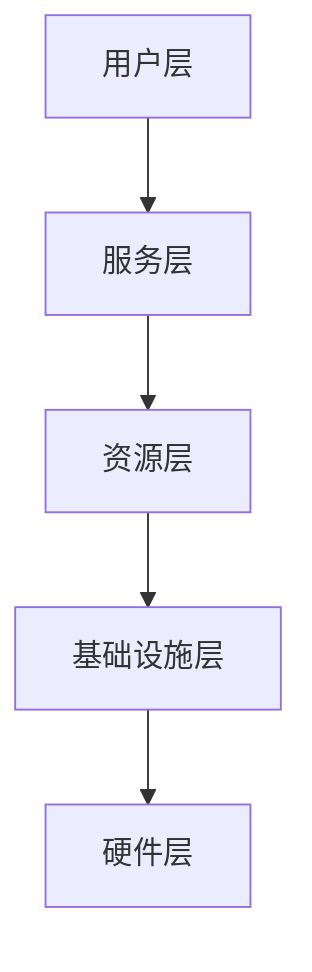

# Cloud Computing 原理与代码实战案例讲解

## 1.背景介绍

### 1.1 云计算的兴起

随着互联网技术的不断发展,云计算(Cloud Computing)作为一种全新的计算模式逐渐崭露头角。云计算的核心理念是将计算资源虚拟化,并通过网络以服务的方式提供给用户使用。用户无需购买昂贵的硬件设备,只需根据实际需求按需租用所需的计算资源,从而实现资源的按需分配、快速部署和弹性扩展。

### 1.2 云计算的优势

相较于传统的计算模式,云计算具有诸多优势:

1. 降低成本:用户无需购买和维护昂贵的硬件设备,只需按需付费租用所需资源,大大降低了IT基础设施的投资成本。

2. 高度灵活性:云计算资源可根据实际需求动态调整,实现快速部署和弹性扩展,满足不同业务场景的需求。

3. 无缝扩展性:云服务商提供海量的计算资源池,用户可根据需求无缝扩展所需资源。

4. 高可用性:云服务商通过冗余设计和负载均衡等技术确保系统的高可用性。

5. 按需付费:用户只需为实际使用的资源付费,避免了资源闲置浪费。

### 1.3 云计算服务模式

云计算通常分为三种主要的服务模式:

1. 基础设施即服务(Infrastructure as a Service, IaaS):提供基础的计算资源,如虚拟机、存储和网络等。用户可自行部署操作系统、中间件和应用程序。

2. 平台即服务(Platform as a Service, PaaS):提供已配置好的开发和运行环境,用户可在此基础上开发、部署和运行应用程序。

3. 软件即服务(Software as a Service, SaaS):提供基于网络的应用程序服务,用户无需安装和维护软件,直接通过网络访问使用。

## 2.核心概念与联系

### 2.1 虚拟化技术

虚拟化是云计算的核心技术之一,它通过将物理资源抽象为逻辑资源,实现资源的共享和隔离。常见的虚拟化技术包括:

1. 硬件虚拟化:如VMware、Xen、KVM等,可在单个物理机器上运行多个虚拟机。

2. 操作系统虚拟化:如Docker、LXC等,通过操作系统层面的虚拟化实现轻量级的应用隔离。

3. 网络虚拟化:如VPN、VLAN等,将物理网络划分为多个虚拟网络。

4. 存储虚拟化:如SAN、NAS等,将物理存储资源虚拟化为逻辑存储池。

### 2.2 资源调度与管理

云计算需要对大量的计算资源进行高效的调度和管理,以实现资源的按需分配和弹性伸缩。常见的资源调度与管理技术包括:

1. 虚拟机调度:如OpenStack Nova等,负责虚拟机的创建、迁移和销毁等操作。

2. 容器编排:如Kubernetes、Docker Swarm等,实现容器的自动化部署、扩展和管理。

3. 自动化配置管理:如Ansible、Puppet等,用于自动化地配置和管理大量节点。

4. 监控与告警:如Prometheus、Zabbix等,实时监控系统状态并发出告警。

### 2.3 云存储

云存储是云计算的重要组成部分,它提供了可靠、高性能、可扩展的数据存储服务。常见的云存储技术包括:

1. 对象存储:如Amazon S3、阿里云OSS等,以对象的形式存储海量非结构化数据。

2. 块存储:如Amazon EBS、阿里云云盘等,提供持久性数据块存储,常用于虚拟机数据盘。

3. 文件存储:如Amazon EFS、阿里云NAS等,提供网络文件系统服务。

4. 数据库服务:如Amazon RDS、阿里云RDS等,提供关系型和非关系型数据库服务。

### 2.4 云安全

由于云计算环境的开放性和共享性,安全性是一个重要的考虑因素。常见的云安全技术包括:

1. 身份与访问管理:如IAM、RBAC等,实现对用户身份的认证和授权。

2. 数据加密:如透明数据加密、SSL/TLS等,保护数据的机密性和完整性。

3. 虚拟私有云:如VPC、VPN等,构建逻辑隔离的私有网络环境。

4. Web应用防火墙:如AWS WAF、阿里云WAF等,防御Web应用程序的攻击。

5. 安全监控与审计:如AWS CloudTrail、操作审计等,记录和审计关键操作日志。

### 2.5 云计算架构

典型的云计算架构通常包括以下几个核心层次:

1. 用户层:提供用户界面和API,供用户访问和管理云资源。

2. 服务层:包括各种云服务,如IaaS、PaaS、SaaS等。

3. 资源层:负责资源的调度、管理和监控。

4. 基础设施层:提供底层的虚拟化技术支持。

5. 硬件层:包括物理服务器、网络和存储设备等硬件资源。

## 3.核心算法原理具体操作步骤

### 3.1 虚拟机调度算法

虚拟机调度算法是云计算资源管理的核心部分,它决定了如何将虚拟机实例分配到物理主机上。常见的虚拟机调度算法包括:

1. **首次适配(First Fit)算法**:从物理主机列表的开头开始,将虚拟机分配到第一个满足资源需求的主机上。

2. **最佳适配(Best Fit)算法**:将虚拟机分配到最小的、满足资源需求的物理主机上,以最大化利用主机资源。

3. **最差适配(Worst Fit)算法**:将虚拟机分配到剩余资源最多的物理主机上,以避免资源碎片化。

4. **随机适配(Random Fit)算法**:从满足资源需求的物理主机中随机选择一台进行分配。

5. **动态适配算法**:根据实时的资源利用情况动态调整虚拟机的分配策略。

### 3.2 容器调度算法

容器调度算法用于在集群中选择合适的节点部署容器。常见的容器调度算法包括:

1. **节点亲和性调度**:根据节点标签和容器亲和性规则,将容器调度到满足条件的节点上。

2. **资源需求调度**:根据容器的CPU、内存等资源需求,选择有足够资源的节点进行调度。

3. **节点选择器调度**:根据用户定义的节点选择器,将容器调度到匹配的节点上。

4. **污点(Taint)和容忍(Toleration)调度**:通过设置节点污点和容器容忍,实现节点的专用或共享调度。

5. **优先级调度**:根据优先级对节点进行排序,将容器调度到优先级最高的节点上。

### 3.3 负载均衡算法

负载均衡是实现高可用和高性能的关键技术,常见的负载均衡算法包括:

1. **轮询(Round Robin)算法**:按顺序将请求依次分配到各个服务器。

2. **加权轮询(Weighted Round Robin)算法**:根据服务器权重,按比例分配请求。

3. **最少连接(Least Connections)算法**:将请求分配给当前连接数最少的服务器。

4. **源IP哈希(Source IP Hash)算法**:根据客户端IP进行哈希计算,将同一IP的请求分配到同一服务器。

5. **最短响应时间(Shortest Response Time)算法**:将请求分配给平均响应时间最短的服务器。

### 3.4 缓存算法

缓存技术可以显著提高系统性能,常见的缓存算法包括:

1. **LRU(Least Recently Used)算法**:淘汰最近最少使用的数据,保留最近使用的数据。

2. **LFU(Least Frequently Used)算法**:淘汰使用频率最低的数据,保留使用频率高的数据。

3. **FIFO(First In First Out)算法**:按照数据进入缓存的顺序淘汰,先进先出。

4. **二级缓存算法**:将热点数据存储在内存缓存中,冷数据存储在磁盘缓存中。

5. **缓存预热算法**:在系统启动时,预先将热点数据加载到缓存中。

### 3.5 数据分片算法

对于大规模的数据存储,通常需要进行数据分片,将数据分布式存储在多个节点上。常见的数据分片算法包括:

1. **哈希分片算法**:根据数据的哈希值,将数据分布到不同的节点上。

2. **范围分片算法**:根据数据的范围,将数据划分到不同的节点上。

3. **一致性哈希算法**:通过哈希环,实现数据和节点之间的映射关系,具有良好的扩展性。

4. **地理位置分片算法**:根据数据的地理位置信息,将数据分布到靠近用户的节点上。

5. **热点数据分片算法**:将热点数据单独存储,避免热点数据对整个系统的影响。

## 4.数学模型和公式详细讲解举例说明

### 4.1 虚拟机资源分配模型

在云计算环境中,如何高效地分配有限的物理资源给虚拟机实例是一个重要的优化问题。我们可以使用线性规划模型来描述和求解这个问题。

假设有 $m$ 台物理主机和 $n$ 个虚拟机实例需要部署,每台物理主机有 $R_i$ 个CPU核心和 $M_i$ 内存大小,第 $j$ 个虚拟机实例需要 $r_j$ 个CPU核心和 $m_j$ 内存大小。我们定义决策变量 $x_{ij}$ 表示第 $j$ 个虚拟机实例是否分配到第 $i$ 台物理主机上,如果分配则 $x_{ij}=1$,否则 $x_{ij}=0$。

目标函数是最小化所需的物理主机数量:

$$
\min \sum_{i=1}^{m} y_i
$$

其中 $y_i$ 是辅助变量,表示第 $i$ 台物理主机是否被使用,如果被使用则 $y_i=1$,否则 $y_i=0$。

约束条件包括:

1. 每个虚拟机实例只能分配到一台物理主机上:

$$
\sum_{i=1}^{m} x_{ij} = 1, \quad \forall j \in \{1, 2, \ldots, n\}
$$

2. 每台物理主机的CPU和内存资源不能被超分:

$$
\sum_{j=1}^{n} r_j x_{ij} \leq R_i, \quad \forall i \in \{1, 2, \ldots, m\}
$$
$$
\sum_{j=1}^{n} m_j x_{ij} \leq M_i, \quad \forall i \in \{1, 2, \ldots, m\}
$$

3. 辅助变量 $y_i$ 的约束:

$$
\sum_{j=1}^{n} x_{ij} \leq n y_i, \quad \forall i \in \{1, 2, \ldots, m\}
$$

通过求解这个线性规划模型,我们可以得到最优的虚拟机分配方案,从而实现物理资源的高效利用。

### 4.2 负载均衡模型

负载均衡是实现高可用和高性能的关键技术,我们可以使用数学模型来描述和优化负载均衡问题。假设有 $n$ 个服务器节点,第 $i$ 个节点的处理能力为 $w_i$,当前有 $m$ 个请求需要分配,第 $j$ 个请求的工作量为 $l_j$。我们定义决策变量 $x_{ij}$ 表示第 $j$ 个请求是否分配到第 $i$ 个节点上,如果分配则 $x_{ij}=1$,否则 $x_{ij}=0$。

目标函数是最