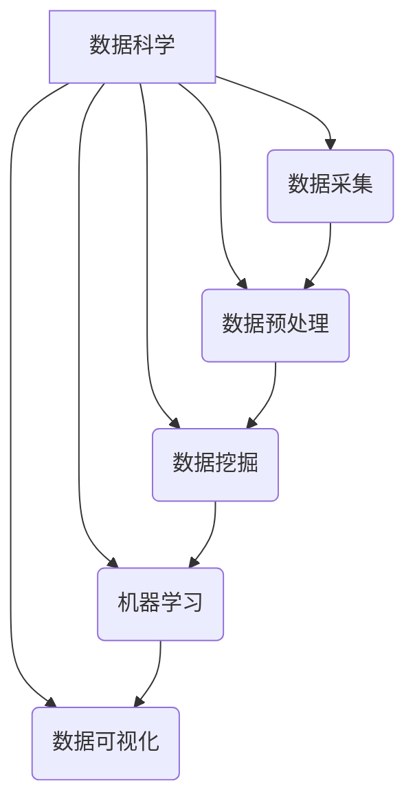

# Data Science 原理与代码实战案例讲解

## 1.背景介绍

### 1.1 数据科学的兴起

在当今时代,数据已经成为推动科技进步和商业发展的重要燃料。随着互联网、物联网、人工智能等技术的快速发展,海量的数据被不断产生和积累。然而,如何从这些原始的、混杂的数据中提取有价值的信息和知识,成为了一个亟待解决的问题。这就催生了数据科学(Data Science)这一新兴的跨学科领域。

数据科学融合了数学、统计学、计算机科学、领域知识等多个学科,旨在从数据中发现隐藏的模式和洞见,为企业和组织的决策提供数据驱动的支持。它涉及数据采集、处理、分析、可视化等多个环节,需要综合运用多种理论和技术方法。

### 1.2 数据科学的重要性

数据科学在当今社会中扮演着越来越重要的角色。以下是数据科学的一些关键应用领域:

- **商业智能**:通过分析客户数据、市场趋势等,为企业制定营销策略、优化产品和服务提供支持。
- **金融风险管理**:利用数据模型评估信贷风险、检测欺诈行为,保障金融机构的稳健运营。
- **医疗健康**:分析患者数据、基因组数据等,用于疾病预测、个性化治疗等应用。
- **智能系统**:为机器学习、自然语言处理等人工智能技术提供数据支持。
- **科学研究**:在物理、生物、天文等领域中,数据科学为科学家提供数据分析工具。

总的来说,数据科学正在成为各行各业不可或缺的核心能力,对于提高决策效率、优化资源配置、推动创新具有重要意义。

## 2.核心概念与联系

数据科学是一个庞大的领域,涉及多个核心概念和技术。这些概念相互关联、互为支撑,构成了数据科学的理论和实践基础。

### 2.1 数据采集

数据采集是数据科学的第一步,旨在从各种来源获取原始数据。常见的数据来源包括:

- 网络数据(网页、社交媒体等)
- 物联网设备(传感器、智能手机等)
- 企业数据库和数据仓库
- 公开数据集(政府机构、研究机构等)

数据采集需要考虑数据格式、数据质量、隐私和安全等因素,并选择合适的采集方法和工具。

### 2.2 数据预处理

原始数据通常存在噪声、缺失值、不一致性等问题,需要进行预处理才能为后续分析做好准备。常见的数据预处理技术包括:

- 数据清洗:处理缺失值、异常值等
- 数据集成:将来自不同源的数据合并
- 数据转换:对数据进行归一化、编码等转换
- 数据减dimensionality:降低数据维度,提高分析效率

数据预处理对于确保数据质量、提高分析准确性至关重要。

### 2.3 数据挖掘

数据挖掘旨在从大量数据中发现隐藏的模式、规律和关系。它包括以下主要任务:

- 关联规则挖掘:发现事物之间的关联性
- 聚类分析:根据相似性对数据进行分组
- 异常检测:识别偏离正常模式的数据点
- 序列模式挖掘:发现时序数据中的频繁模式

数据挖掘广泛应用于推荐系统、欺诈检测、客户细分等场景。

### 2.4 机器学习

机器学习是数据科学的核心技术之一,它赋予计算机从数据中自动学习和建模的能力。主要分为以下几种类型:

- 监督学习:从标记数据中学习映射函数(分类、回归等)
- 无监督学习:从未标记数据中发现隐藏结构(聚类、降维等)
- 强化学习:通过与环境交互,学习如何获取最大回报

常见的机器学习算法包括决策树、支持向量机、神经网络等。机器学习广泛应用于图像识别、自然语言处理、推荐系统等领域。

### 2.5 数据可视化

数据可视化是将数据以图形或图像的形式展现出来,有助于人类更直观地理解数据信息。常用的可视化技术包括:

- 统计图表:柱状图、折线图、散点图等
- 信息图:树状图、网络图等
- 地理信息可视化:地图可视化
- 高维数据可视化:平行坐标图、雷达图等

数据可视化不仅是数据科学过程的重要组成部分,也是将分析结果传达给最终用户的有效方式。

## 3.核心算法原理具体操作步骤

数据科学中的核心算法原理和具体操作步骤涉及多个领域,包括数据预处理、数据挖掘、机器学习等。以下是一些典型算法的原理和步骤介绍。

### 3.1 数据预处理算法

#### 3.1.1 数据清洗

数据清洗的目标是识别和处理数据集中的错误、不完整或不一致的记录。常见的数据清洗步骤包括:

1. **缺失值处理**:填充缺失值、删除缺失值记录或使用其他策略(如均值插补)
2. **异常值处理**:基于统计方法(如箱线图法则)或领域知识识别并处理异常值
3. **重复数据删除**:通过比较记录的关键字段,删除重复记录
4. **数据标准化**:将数据转换为统一格式或单位,以提高一致性

#### 3.1.2 数据集成

数据集成是将来自不同源的数据合并到统一的数据存储中。主要步骤包括:

1. **模式匹配**:分析不同源数据的模式(schema),识别相同的实体和属性
2. **实体识别**:通过关键字段(如ID)或其他规则,确定不同源中指代同一实体的记录
3. **数据合并**:将已匹配的实体记录合并为一条记录
4. **冲突解决**:处理不同源中相同实体的冲突数据

#### 3.1.3 数据转换

数据转换的目的是将数据转换为适合分析的格式。常见的数据转换方法包括:

1. **归一化**:将数据映射到特定范围(如0到1),以消除量纲影响
2. **编码**:将分类数据(如颜色名称)转换为数值型,以适应某些算法
3. **数据规范化**:将数据按特定规范(如高斯分布)进行转换
4. **维数约简**:通过特征选择或特征提取,降低数据维度

### 3.2 数据挖掘算法

#### 3.2.1 关联规则挖掘

关联规则挖掘旨在发现数据集中事物之间的关联关系。其基本思路是:

1. **找出频繁项集**:通过设定最小支持度阈值,找出满足最小支持度的项集
2. **生成关联规则**:对于每个频繁项集,根据最小置信度阈值生成关联规则
3. **规则评估**:计算每条规则的支持度、置信度等指标,评估规则的质量

常用的关联规则挖掘算法有Apriori算法、FP-Growth算法等。

#### 3.2.2 聚类分析

聚类分析的目标是将数据集中的对象划分为若干个"簇",使得簇内对象相似度高,簇间对象相似度低。常见的聚类算法包括:

1. **K-Means算法**:
    - 随机选取K个质心作为初始聚类中心
    - 将每个数据点分配到最近的聚类中心
    - 重新计算每个聚类的质心
    - 重复上述过程,直至收敛
2. **层次聚类算法**:
    - 自底向上的聚合策略(AGNES算法)
    - 自顶向下的分裂策略(DIANA算法)
3. **密度聚类算法**(如DBSCAN):
    - 基于数据点密集程度进行聚类
    - 能发现任意形状的聚类,并识别异常值

### 3.3 机器学习算法

机器学习算法可分为监督学习、无监督学习和强化学习三大类。这里重点介绍几种常用的监督学习算法。

#### 3.3.1 决策树算法

决策树算法通过递归地构建决策树模型,将输入数据映射到目标值。典型的构建步骤如下:

1. **选择最优特征**:基于信息增益或其他指标,选择对数据集拆分效果最好的特征
2. **生成决策节点**:根据所选特征,生成内部决策节点,并将数据集拆分
3. **生成子树**:对拆分后的子数据集递归地构建子决策树
4. **生成叶节点**:直到满足终止条件,生成叶节点(输出目标值)

常用的决策树算法包括ID3、C4.5和CART等。

#### 3.3.2 支持向量机算法

支持向量机(SVM)是一种有监督的机器学习算法,常用于分类和回归问题。其基本思路是:

1. **构建超平面**:在特征空间中寻找一个超平面,将不同类别的数据分开
2. **最大化间隔**:使正负实例到超平面的距离(即间隔)最大化
3. **核技巧**:通过核函数将数据映射到高维空间,使得在高维空间线性可分

SVM的优点是泛化能力强,可用于高维数据,但对大规模数据的计算效率较低。

#### 3.3.3 神经网络算法

神经网络是模仿生物神经网络而设计的机器学习模型,常用于分类、回归等任务。典型的神经网络包括前馋神经网络和卷积神经网络等。以前馋神经网络为例,其工作原理如下:

1. **输入层**:接收输入数据
2. **隐藏层**:对输入数据进行加权求和并应用激活函数,得到隐藏层输出
3. **输出层**:对隐藏层输出进行加权求和,得到最终输出
4. **反向传播**:利用输出与标记数据的差异,通过反向传播调整网络权重
5. **迭代训练**:重复上述过程,直至模型收敛

神经网络具有自动提取特征的能力,在图像、语音等领域表现优异,但需要大量的训练数据。

## 4.数学模型和公式详细讲解举例说明

数据科学中广泛使用了各种数学模型和公式,用于描述数据特征、度量数据相似性、评估模型性能等。以下将详细讲解一些常用的数学模型和公式。

### 4.1 相似性度量

相似性度量是衡量两个数据对象相似程度的一种方法,在聚类分析、推荐系统等领域有广泛应用。常见的相似性度量包括:

#### 4.1.1 欧几里得距离

欧几里得距离是最常用的距离度量,用于计算两个数值向量之间的距离。对于 $n$ 维向量 $\vec{x}=(x_1, x_2, \dots, x_n)$ 和 $\vec{y}=(y_1, y_2, \dots, y_n)$,它们的欧几里得距离定义为:

$$d(\vec{x}, \vec{y}) = \sqrt{\sum_{i=1}^{n}(x_i - y_i)^2}$$

#### 4.1.2 余弦相似度

余弦相似度常用于计算文本向量之间的相似度。对于两个向量 $\vec{x}$ 和 $\vec{y}$,它们的余弦相似度定义为:

$$\text{sim}(\vec{x}, \vec{y}) = \cos(\theta) = \frac{\vec{x} \cdot \vec{y}}{\|\vec{x}\| \|\vec{y}\|} = \frac{\sum_{i=1}^{n}x_iy_i}{\sqrt{\sum_{i=1}^{n}x_i^2}\