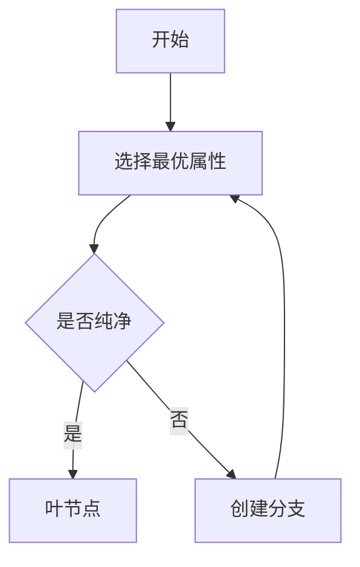

# Decision Trees 原理与代码实战案例讲解

## 1. 背景介绍

决策树（Decision Trees）是一种基础且广泛应用的机器学习算法。它模拟人类决策过程，通过一系列规则对数据进行分类或回归。决策树的优势在于模型的可解释性强，易于理解和实现，同时在处理分类问题时表现出色。本文将深入探讨决策树的原理，并通过代码实战案例进行讲解。

## 2. 核心概念与联系

决策树由节点和分支构成，其中节点分为内部节点和叶节点。内部节点代表一个属性上的测试，叶节点代表决策结果。构建决策树的过程就是选择最优属性进行分支的过程。

### 2.1 决策树结构



### 2.2 属性选择标准

- 信息增益（Information Gain）
- 增益率（Gain Ratio）
- Gini指数（Gini Index）

## 3. 核心算法原理具体操作步骤

构建决策树的核心算法包括ID3, C4.5和CART。这些算法在选择分支属性时有所不同，但基本步骤相似：

1. 从根节点开始，选择最优属性作为分支依据。
2. 根据属性值划分数据集，为每个子集创建新的节点。
3. 对每个子集重复步骤1和2，直到满足停止条件。
4. 剪枝处理，避免过拟合。

## 4. 数学模型和公式详细讲解举例说明

### 4.1 信息增益

信息增益表示在知道某属性的信息之后使得类别信息的不确定性减少的程度。计算公式为：

$$
IG(D, A) = H(D) - \sum_{v \in Values(A)} \frac{|D_v|}{|D|} H(D_v)
$$

其中，$H(D)$ 是数据集$D$的熵，$Values(A)$ 是属性$A$的所有可能值，$D_v$ 是$D$中属性$A$的值为$v$的子集。

### 4.2 Gini指数

Gini指数是CART算法中用于选择属性的标准，表示数据集的不纯度。计算公式为：

$$
Gini(D) = 1 - \sum_{i=1}^{m} p_i^2
$$

其中，$p_i$ 是数据集$D$中第$i$个类别的相对频率。

## 5. 项目实践：代码实例和详细解释说明

以Python语言为例，使用scikit-learn库中的DecisionTreeClassifier实现决策树分类。

```python
from sklearn.datasets import load_iris
from sklearn.tree import DecisionTreeClassifier

# 加载数据集
iris = load_iris()
X, y = iris.data, iris.target

# 创建决策树分类器
clf = DecisionTreeClassifier(criterion='gini')
clf.fit(X, y)

# 预测新样本
print(clf.predict([[5.1, 3.5, 1.4, 0.2]]))
```

## 6. 实际应用场景

决策树在多个领域都有广泛应用，包括但不限于：

- 金融风控：信用评分、欺诈检测
- 医疗诊断：疾病预测、病因分析
- 推荐系统：个性化推荐、用户行为分析

## 7. 工具和资源推荐

- scikit-learn：提供多种决策树算法实现
- Weka：数据挖掘软件，包含决策树可视化工具
- XGBoost：高性能的决策树集成框架

## 8. 总结：未来发展趋势与挑战

决策树的研究正朝着集成学习、深度学习和大数据处理方向发展。未来的挑战包括提高模型的泛化能力、处理高维数据以及实时学习。

## 9. 附录：常见问题与解答

Q1: 决策树如何处理连续属性？
A1: 通过设定阈值将连续属性离散化。

Q2: 决策树如何避免过拟合？
A2: 通过剪枝技术和调整参数减少模型复杂度。

Q3: 决策树和随机森林有何区别？
A3: 随机森林是决策树的集成方法，通过构建多棵树提高性能。

作者：禅与计算机程序设计艺术 / Zen and the Art of Computer Programming