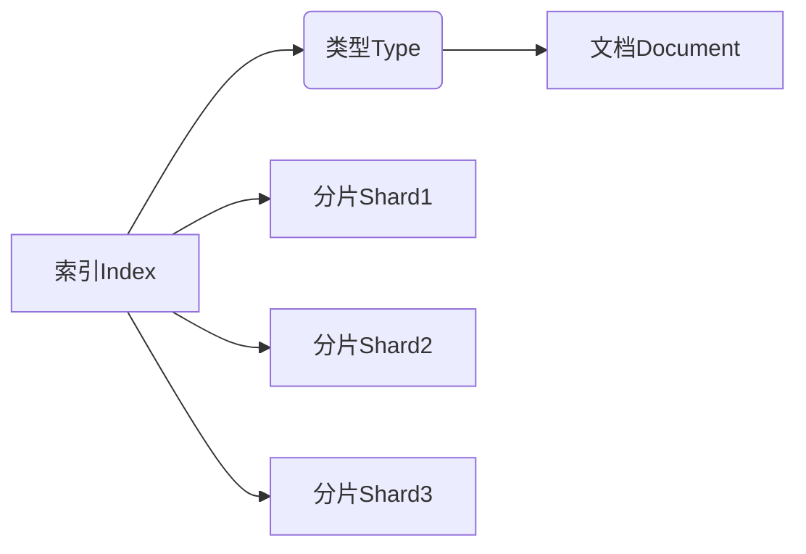
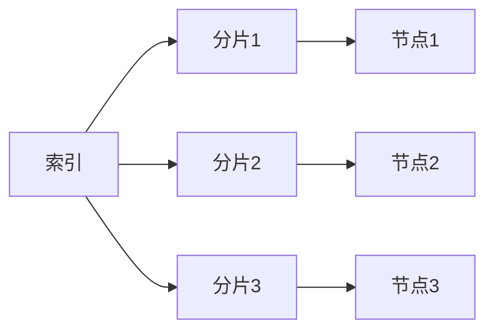
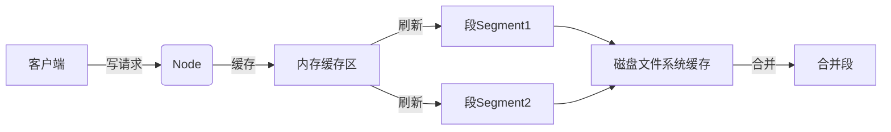
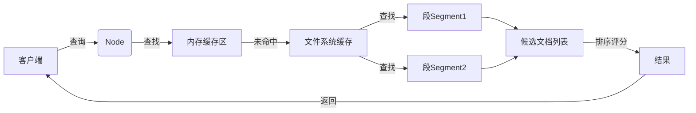

# ES索引原理与代码实例讲解

## 1.背景介绍

随着数据量的快速增长,传统的关系型数据库在处理大规模数据时遇到了性能瓶颈。这促使了新一代分布式搜索引擎的出现,其中以Elasticsearch(简称ES)最为突出。ES基于Apache Lucene库,是一个分布式、RESTful风格的搜索和数据分析引擎,适用于海量数据的快速存储、搜索和分析。

ES的核心理念是通过索引将数据按照相似性存储,从而实现毫秒级的搜索响应。ES采用了诸多优化手段,如倒排索引、分布式架构、内存缓存等,大大提高了查询效率。此外,ES还提供了强大的数据分析能力,支持聚合、评分、地理位置查询等高级功能。

## 2.核心概念与联系

ES的核心概念包括索引(Index)、类型(Type)、文档(Document)和分片(Shards)等。

- 索引(Index)相当于关系型数据库中的数据库,是一个存储关系数据的地方。
- 类型(Type)相当于数据库中的表,是索引的逻辑分类/分区,用于区分同索引下不同类型的数据。(ES 6.x版本后,Type的概念被删除,直接将数据存于索引中)
- 文档(Document)相当于关系型数据库中的一行数据记录,是ES中可被索引的基本数据单元。
- 分片(Shards)是ES实现分布式和并行的关键,通过将索引细分为多个分片,可以分散存储于不同节点上,从而实现水平扩展。



## 3.核心算法原理具体操作步骤

### 3.1 倒排索引

倒排索引是ES的核心索引数据结构,可以高效地从文档中找出包含特定单词的文档。其原理是:

1. 对文档进行分词(Tokenize),将其拆分为多个单词项(Term)。
2. 为每个单词项建立一个倒排索引列表,记录含有该单词项的所有文档。
3. 搜索时,只需要查找相应的倒排索引列表,即可快速定位到匹配的文档。


### 3.2 分布式架构

为实现水平扩展,ES采用了分布式架构。索引被划分为多个分片,每个分片可以被分配到不同的节点上。当有新的文档需要索引时,ES会根据文档的哈希值,将其存储到对应的分片中。查询时,ES会并行地查询各个分片,并合并结果。



### 3.3 写入流程

1. 客户端向Node发送新增/修改文档的请求。
2. Node为文档分配一个DocID,并缓存在内存中。
3. 周期性地将内存缓存区的数据刷新到磁盘文件系统缓存,生成一个新的不可变的段(Segment)。
4. 在后台进行合并、删除等操作,将多个段合并为更大的段,释放磁盘空间。



### 3.4 查询流程

1. 客户端向Node发送查询请求。
2. Node在内存缓存区查找,未命中则查询文件系统缓存。
3. 从各个段中查找匹配的文档,生成候选文档列表。
4. 对候选文档列表进行排序、计算相关度评分。
5. 返回最终结果给客户端。



## 4.数学模型和公式详细讲解举例说明

### 4.1 TF-IDF

TF-IDF(Term Frequency-Inverse Document Frequency)是ES用于计算单词项重要性的经典算法,公式如下:

$$\mathrm{tfidf}(t, d, D) = \mathrm{tf}(t, d) \times \mathrm{idf}(t, D)$$

其中:

- $\mathrm{tf}(t, d)$ 表示单词项 $t$ 在文档 $d$ 中出现的频率
- $\mathrm{idf}(t, D)$ 表示单词项 $t$ 在文档集 $D$ 中的逆向文档频率

$\mathrm{tf}$ 可以使用原始计数、对数平滑等方式计算。$\mathrm{idf}$ 公式如下:

$$\mathrm{idf}(t, D) = \log \frac{|D|}{|\{d \in D: t \in d\}|}$$

TF-IDF的思想是:如果某个单词项在当前文档中出现很多,而在其他文档中很少出现,则认为该单词项对当前文档很重要,应当赋予更高的权重。

### 4.2 BM25

BM25是ES默认使用的相似度评分函数,是TF-IDF的改进版本,可以更好地估计文档与查询的相关性。公式如下:

$$\mathrm{score}(D, Q) = \sum_{i=1}^{n} \mathrm{IDF}(q_i) \cdot \frac{f(q_i, D) \cdot (k_1 + 1)}{f(q_i, D) + k_1 \cdot \left[ (1 - b) + b \cdot \frac{|D|}{\mathrm{avgdl}}\right]}$$

其中:

- $q_i$ 是查询语句 $Q$ 中的第 $i$ 个单词项
- $f(q_i, D)$ 是单词项 $q_i$ 在文档 $D$ 中出现的次数
- $|D|$ 是文档 $D$ 的长度
- $\mathrm{avgdl}$ 是文档集的平均长度
- $k_1$ 和 $b$ 是调节因子,用于控制项频率和文档长度对评分的影响

BM25相比TF-IDF,引入了文档长度的归一化因子,可以更好地处理文档长度的差异。同时,它也考虑了查询项在文档中出现的次数,而不是简单的出现与否。

## 5.项目实践：代码实例和详细解释说明

下面通过一个基于Java的示例项目,演示如何使用ES进行数据索引和查询。

### 5.1 创建索引

```java
// 创建ES客户端
RestHighLevelClient client = new RestHighLevelClient(
    RestClient.builder(new HttpHost("localhost", 9200, "http")));

// 创建索引请求
CreateIndexRequest request = new CreateIndexRequest("blog");
request.settings(Settings.builder()
    .put("index.number_of_shards", 3)
    .put("index.number_of_replicas", 2)
);

// 发送请求
CreateIndexResponse response = client.indices().create(request, RequestOptions.DEFAULT);
```

上述代码创建了一个名为`blog`的索引,设置了3个主分片和2个副本分片。

### 5.2 新增文档

```java
// 创建文档对象
XContentBuilder builder = XContentFactory.jsonBuilder();
builder.startObject();
{
    builder.field("title", "ES 入门教程");
    builder.field("content", "本教程介绍了ES的核心概念和用法...");
    builder.field("tags", Arrays.asList("elasticsearch", "教程", "入门"));
}
builder.endObject();

// 创建索引请求
IndexRequest request = new IndexRequest("blog")
    .id("1")
    .source(builder);

// 发送请求
IndexResponse response = client.index(request, RequestOptions.DEFAULT);
```

上述代码新增了一个ID为`1`的文档,包含标题、内容和标签三个字段。

### 5.3 查询文档

```java
// 创建查询请求
SearchRequest request = new SearchRequest("blog");
SearchSourceBuilder builder = new SearchSourceBuilder();
builder.query(QueryBuilders.matchQuery("content", "elasticsearch"));
request.source(builder);

// 发送请求
SearchResponse response = client.search(request, RequestOptions.DEFAULT);

// 处理查询结果
SearchHits hits = response.getHits();
for (SearchHit hit : hits) {
    String id = hit.getId();
    Map<String, Object> sourceMap = hit.getSourceAsMap();
    // 处理文档...
}
```

上述代码执行了一个匹配查询,查找`content`字段包含`elasticsearch`的文档。查询结果会返回一个命中列表,包含了匹配的文档ID和源数据。

## 6.实际应用场景

ES广泛应用于各种需要全文搜索和数据分析的场景,包括但不限于:

- 网站/应用搜索:为网站或应用提供搜索功能,如电商网站的商品搜索、论坛的帖子搜索等。
- 日志分析:对系统日志进行集中存储和分析,用于故障诊断、安全审计等。
- 商业智能:对业务数据进行多维分析,提供报表、仪表板等商业智能功能。
- 地理位置服务:根据地理位置信息提供周边查询、路线规划等服务。
- 安全监控:对入侵检测、垃圾邮件过滤等安全数据进行分析。

## 7.工具和资源推荐

- Kibana:ES的官方数据可视化和管理平台,提供了强大的数据探索、可视化和操作界面。
- Elasticsearch Head:一款优秀的ES前端管理工具,提供了直观的集群监控和数据探索功能。
- Logstash:ES家族的数据收集和处理管道,可以从各种来源采集数据,并对数据进行过滤、转换和输出。
- Beats:ES家族的轻量级数据采集代理,用于从服务器上采集各种操作数据,并将其传输到ES或Logstash。
- Elastic Cloud:ES官方提供的云服务,可以快速部署和管理ES集群,无需关注底层基础设施。

## 8.总结:未来发展趋势与挑战

ES作为当前最流行的搜索和分析引擎之一,正在不断发展和完善。未来,ES可能会在以下几个方向持续演进:

1. **机器学习与AI**:ES已经开始融入机器学习功能,未来可能会进一步加强AI能力,提供更智能的搜索、推荐和预测服务。

2. **云原生**:随着云计算的普及,ES需要更好地适配云原生环境,提供更简单的云部署和管理方式。

3. **安全性与合规性**:随着数据安全和隐私保护要求的不断提高,ES需要加强安全性和合规性,提供更严格的访问控制和审计机制。

4. **性能优化**:ES需要持续优化索引和查询性能,以满足日益增长的数据量和实时性要求。

5. **生态系统扩展**:ES生态系统需要进一步扩展,整合更多的数据源、分析工具和可视化组件,为用户提供一站式的数据处理解决方案。

同时,ES在发展过程中也面临一些挑战,如数据安全和隐私保护、高可用性和容错性、大规模集群管理等,需要不断加以解决和完善。

## 9.附录:常见问题与解答

1. **ES与传统数据库有何区别?**

   ES是一种分布式搜索和分析引擎,侧重于全文搜索和实时数据分析,而传统数据库则更适合结构化数据的存储和事务处理。ES并不是要取代传统数据库,而是作为一种补充,用于解决传统数据库难以高效处理的全文搜索和数据分析场景。

2. **ES的分布式架构是如何实现的?**

   ES通过将索引划分为多个分片,并将分片分散存储在不同节点上,从而实现了分布式架构。每个分片可以