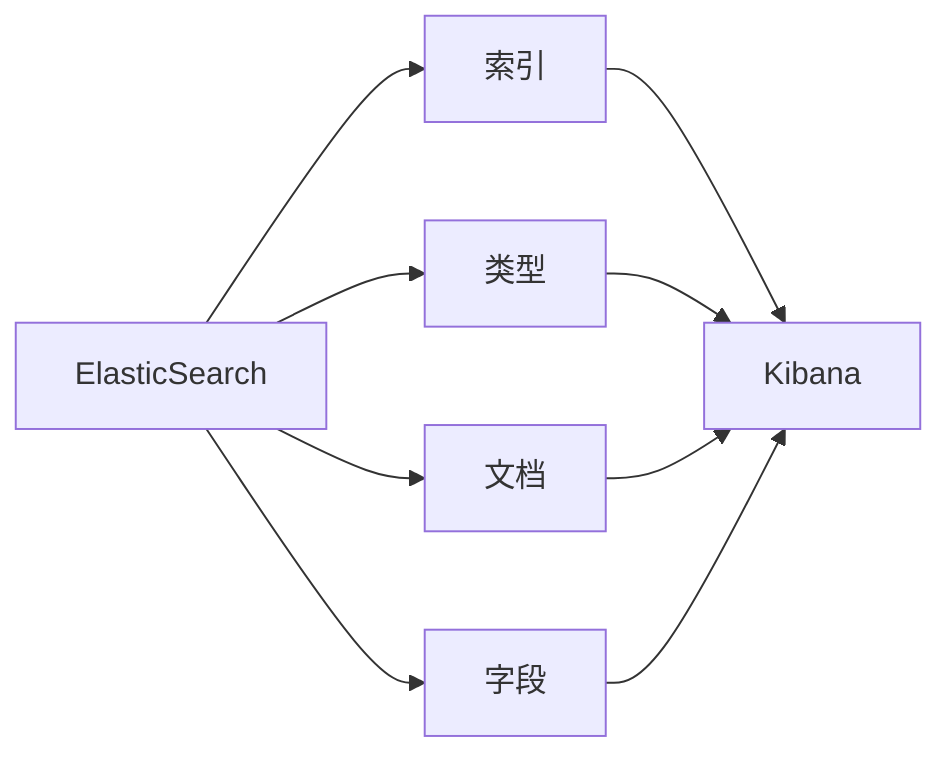

# ElasticSearch Kibana原理与代码实例讲解

## 1. 背景介绍
在当今数据驱动的时代，信息检索和数据可视化成为了企业和开发者不可或缺的工具。ElasticSearch是一个高度可扩展的开源全文搜索和分析引擎，它允许你快速、近实时地存储、搜索和分析大量数据。而Kibana则是ElasticSearch的数据可视化伴侣，它提供了友好的Web界面，让用户能够直观地展现ElasticSearch查询的结果。本文将深入探讨ElasticSearch和Kibana的原理，并通过代码实例进行讲解。

## 2. 核心概念与联系
ElasticSearch基于Apache Lucene构建，它的核心概念包括索引(index)、类型(type)、文档(document)和字段(field)。索引是数据存储的地方，类型是索引中的一个逻辑分类，文档则是可搜索的信息最小单位，字段是文档的属性。Kibana作为ElasticSearch的前端展示层，通过查询DSL（Domain Specific Language）与ElasticSearch进行交互，获取数据并展示。



## 3. 核心算法原理具体操作步骤
ElasticSearch的核心算法包括倒排索引(Inverted Index)、分布式架构和相关性评分算法。倒排索引是ElasticSearch快速检索的关键，它将文档中的数据转化为索引项，然后映射回文档。分布式架构确保了ElasticSearch的高可用性和可扩展性。相关性评分算法则用于评估搜索结果的相关性。

操作步骤如下：
1. 数据预处理：包括分词、过滤等。
2. 建立倒排索引：将预处理后的数据转化为索引项。
3. 分布式存储：将索引分散存储在不同的节点上。
4. 查询处理：解析查询请求，执行搜索操作。
5. 相关性评分：计算文档与查询的相关性。

## 4. 数学模型和公式详细讲解举例说明
ElasticSearch的相关性评分算法基于TF-IDF（Term Frequency-Inverse Document Frequency）模型。TF表示词频，即词在文档中出现的频率；IDF表示逆文档频率，用来衡量词的常见程度。

$$
\text{TF-IDF} = \text{TF} \times \text{IDF}
$$

其中，

$$
\text{TF} = \frac{\text{词在文档中的出现次数}}{\text{文档中的词总数}}
$$

$$
\text{IDF} = \log \left( \frac{\text{文档总数}}{\text{包含该词的文档数}+1} \right)
$$

通过TF-IDF模型，我们可以计算出每个词对于文档的重要性，进而用于评分和排序。

## 5. 项目实践：代码实例和详细解释说明
以下是一个简单的ElasticSearch和Kibana的使用示例：

```python
from elasticsearch import Elasticsearch

# 连接ElasticSearch
es = Elasticsearch()

# 创建索引
es.indices.create(index='my_index', ignore=400)

# 索引文档
doc = {
    'author': 'zen',
    'text': 'ElasticSearch: cool. bonsai cool.',
    'timestamp': '2023-04-23T10:00:00'
}
es.index(index='my_index', id=1, document=doc)

# 搜索文档
res = es.search(index='my_index', query={"match_all": {}})
print(res)
```

在Kibana中，你可以通过以下方式可视化搜索结果：

1. 打开Kibana的Web界面。
2. 创建一个索引模式以匹配ElasticSearch中的索引。
3. 使用Kibana的Discover功能查看索引中的文档。
4. 使用Visualize功能创建图表和仪表板。

## 6. 实际应用场景
ElasticSearch和Kibana广泛应用于日志分析、全文搜索、安全情报、业务分析等场景。例如，它们可以用于分析网站访问日志，以了解用户行为和优化用户体验。

## 7. 工具和资源推荐
- 官方文档：ElasticSearch和Kibana的官方文档是学习的宝库。
- 社区论坛：Elastic社区论坛是解决问题的好地方。
- 插件和工具：如ElasticSearch-head、ElasticHD等。

## 8. 总结：未来发展趋势与挑战
随着数据量的不断增长，ElasticSearch和Kibana需要不断优化性能和扩展功能。未来的发展趋势可能包括更加智能的数据分析、更紧密的云集成以及更强的机器学习能力。

## 9. 附录：常见问题与解答
Q1: ElasticSearch如何保证数据的实时性？
A1: ElasticSearch通过近实时(NRT)索引和搜索来保证数据的实时性。

Q2: Kibana能否进行复杂的数据分析？
A2: Kibana本身提供了基本的数据分析功能，但对于复杂的数据分析，通常需要结合ElasticSearch的聚合功能。

作者：禅与计算机程序设计艺术 / Zen and the Art of Computer Programming