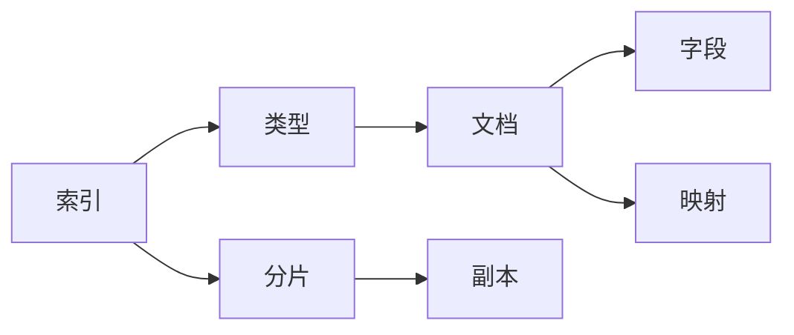

# ElasticSearch 原理与代码实例讲解

## 1. 背景介绍
在当今信息爆炸的时代，数据检索已成为我们日常生活和工作中不可或缺的一部分。ElasticSearch作为一个高性能、可伸缩、分布式的搜索和分析引擎，广泛应用于各种场景，从日志分析到实时数据监控，再到复杂的搜索需求。它基于Apache Lucene构建，提供了一个分布式多用户能力的全文搜索引擎，具有HTTP web接口和无模式JSON文档的特点。

## 2. 核心概念与联系
ElasticSearch的核心概念包括索引（Index）、类型（Type）、文档（Document）、字段（Field）、映射（Mapping）、分片（Shard）和副本（Replica）。索引是数据存储的地方，类型是索引中的一个逻辑分类，文档是可搜索信息的最小单位，字段是文档的属性，映射定义了文档及其包含的字段如何存储和索引。分片和副本则是ElasticSearch实现数据分布式存储和高可用的机制。



## 3. 核心算法原理具体操作步骤
ElasticSearch的核心算法原理包括倒排索引、相关性评分和分布式架构。倒排索引是ElasticSearch快速检索的基础，它将文档中的数据转换为索引项集合，然后映射回包含这些索引项的文档。相关性评分算法（如TF/IDF或BM25）用于评估搜索结果的相关性。分布式架构则确保了ElasticSearch在节点故障时的数据安全和高可用性。

## 4. 数学模型和公式详细讲解举例说明
ElasticSearch使用BM25算法来计算文档的相关性得分。BM25是一种基于概率检索框架的排名函数，其公式如下：

$$
\text{Score}(D,Q) = \sum_{i=1}^{n} IDF(q_i) \cdot \frac{f(q_i, D) \cdot (k_1 + 1)}{f(q_i, D) + k_1 \cdot (1 - b + b \cdot \frac{|D|}{\text{avgdl}})}
$$

其中，$D$ 是文档，$Q$ 是查询，$q_i$ 是查询中的第 $i$ 个词，$f(q_i, D)$ 是词 $q_i$ 在文档 $D$ 中的频率，$|D|$ 是文档 $D$ 的长度，$\text{avgdl}$ 是文档平均长度，$k_1$ 和 $b$ 是可调参数，$IDF(q_i)$ 是逆文档频率。

## 5. 项目实践：代码实例和详细解释说明
以下是一个简单的ElasticSearch使用示例，展示了如何创建索引、添加文档和执行搜索。

```python
from elasticsearch import Elasticsearch

# 连接ElasticSearch集群
es = Elasticsearch(["http://localhost:9200"])

# 创建索引
es.indices.create(index="my_index", ignore=400)

# 添加文档
doc = {
    "title": "ElasticSearch Tutorial",
    "author": "Zen and the Art of Computer Programming",
    "content": "ElasticSearch is a powerful search engine...",
    "timestamp": "2023-04-01T12:00:00"
}
es.index(index="my_index", id=1, body=doc)

# 搜索文档
query = {
    "query": {
        "match": {
            "content": "search"
        }
    }
}
response = es.search(index="my_index", body=query)
print(response)
```

## 6. 实际应用场景
ElasticSearch在多个领域都有广泛的应用，包括但不限于网站搜索、日志和事件数据分析、实时监控系统、商品推荐和个性化搜索、地理位置分析和企业级搜索。

## 7. 工具和资源推荐
- 官方文档：https://www.elastic.co/guide/index.html
- ElasticSearch客户端库：如Python的elasticsearch-py、Java的Elasticsearch Java API等。
- 监控和管理工具：如ElasticSearch-head、Kibana等。

## 8. 总结：未来发展趋势与挑战
ElasticSearch将继续在性能优化、数据安全、易用性和智能化方面进行创新。随着数据量的不断增长，如何保持高效的检索速度和准确性，以及如何处理更复杂的数据类型和搜索场景，将是ElasticSearch面临的主要挑战。

## 9. 附录：常见问题与解答
Q1: ElasticSearch如何保证数据的实时性？
A1: ElasticSearch通过近实时(NRT)索引机制来保证数据的实时性，通常在文档提交后的一秒内就可以被搜索到。

Q2: 如何提高ElasticSearch的查询性能？
A2: 可以通过优化查询语句、使用合理的索引和映射、调整集群配置和硬件资源等方式来提高查询性能。

Q3: ElasticSearch如何处理分布式事务？
A3: ElasticSearch使用版本控制和乐观并发控制机制来处理分布式事务，确保数据的一致性。

作者：禅与计算机程序设计艺术 / Zen and the Art of Computer Programming