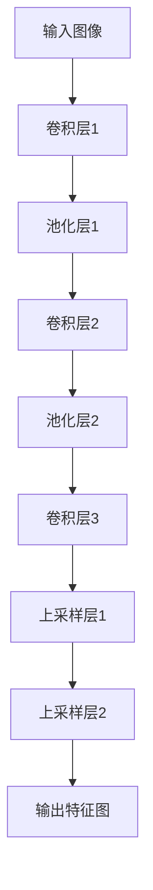

# FCN原理与代码实例讲解

## 1.背景介绍

全卷积网络（Fully Convolutional Network，简称FCN）是深度学习领域中一种重要的神经网络架构，主要用于图像分割任务。传统的卷积神经网络（CNN）在处理图像分类问题时表现出色，但在图像分割任务中，CNN的全连接层会丢失空间信息。FCN通过将全连接层替换为卷积层，保留了空间信息，从而实现了像素级的分类。

## 2.核心概念与联系

### 2.1 卷积神经网络（CNN）

卷积神经网络是深度学习中处理图像数据的基础网络结构。其主要组成部分包括卷积层、池化层和全连接层。卷积层通过卷积操作提取图像的局部特征，池化层用于降维和减少计算量，全连接层则用于最终的分类任务。

### 2.2 全卷积网络（FCN）

全卷积网络是对传统CNN的改进，主要区别在于将全连接层替换为卷积层，从而保留了输入图像的空间信息。FCN的输出是一个与输入图像大小相同的特征图，每个像素点对应一个类别标签。

### 2.3 上采样与反卷积

在FCN中，为了恢复卷积操作中丢失的空间分辨率，通常使用上采样（Upsampling）或反卷积（Deconvolution）操作。上采样通过插值方法增加特征图的分辨率，而反卷积则通过学习参数恢复原始图像的空间信息。

## 3.核心算法原理具体操作步骤

### 3.1 数据预处理

在进行图像分割任务之前，需要对输入图像进行预处理。常见的预处理步骤包括图像归一化、数据增强和标签编码。

### 3.2 构建FCN模型

构建FCN模型的关键在于设计合适的网络结构。通常，FCN模型由多个卷积层、池化层和上采样层组成。以下是一个简单的FCN模型结构示意图：



### 3.3 训练模型

训练FCN模型的过程与传统CNN类似，主要包括前向传播、损失计算和反向传播。常用的损失函数包括交叉熵损失和Dice系数损失。

### 3.4 模型评估

在训练完成后，需要对模型进行评估。常用的评估指标包括像素准确率（Pixel Accuracy）、平均交并比（Mean Intersection over Union, mIoU）和Dice系数。

## 4.数学模型和公式详细讲解举例说明

### 4.1 卷积操作

卷积操作是FCN的核心，其数学表达式为：

$$
y_{i,j} = \sum_{m=0}^{M-1} \sum_{n=0}^{N-1} x_{i+m,j+n} \cdot w_{m,n}
$$

其中，$x$ 是输入特征图，$w$ 是卷积核，$y$ 是输出特征图。

### 4.2 交叉熵损失

交叉熵损失用于衡量预测结果与真实标签之间的差异，其数学表达式为：

$$
L = -\sum_{i=1}^{N} \sum_{c=1}^{C} y_{i,c} \log(p_{i,c})
$$

其中，$N$ 是样本数量，$C$ 是类别数量，$y_{i,c}$ 是第 $i$ 个样本的真实标签，$p_{i,c}$ 是第 $i$ 个样本的预测概率。

### 4.3 Dice系数

Dice系数用于衡量预测结果与真实标签的重叠程度，其数学表达式为：

$$
Dice = \frac{2 \cdot |A \cap B|}{|A| + |B|}
$$

其中，$A$ 是预测结果，$B$ 是真实标签。

## 5.项目实践：代码实例和详细解释说明

### 5.1 数据预处理

```python
import numpy as np
import cv2

def preprocess_image(image_path):
    image = cv2.imread(image_path)
    image = cv2.resize(image, (256, 256))
    image = image / 255.0
    return image

def preprocess_label(label_path):
    label = cv2.imread(label_path, cv2.IMREAD_GRAYSCALE)
    label = cv2.resize(label, (256, 256))
    label = label / 255.0
    return label
```

### 5.2 构建FCN模型

```python
import tensorflow as tf
from tensorflow.keras.layers import Conv2D, MaxPooling2D, UpSampling2D

def build_fcn_model(input_shape):
    inputs = tf.keras.Input(shape=input_shape)
    
    # 编码器
    x = Conv2D(64, (3, 3), activation='relu', padding='same')(inputs)
    x = MaxPooling2D((2, 2))(x)
    x = Conv2D(128, (3, 3), activation='relu', padding='same')(x)
    x = MaxPooling2D((2, 2))(x)
    
    # 解码器
    x = Conv2D(128, (3, 3), activation='relu', padding='same')(x)
    x = UpSampling2D((2, 2))(x)
    x = Conv2D(64, (3, 3), activation='relu', padding='same')(x)
    x = UpSampling2D((2, 2))(x)
    
    outputs = Conv2D(1, (1, 1), activation='sigmoid', padding='same')(x)
    
    model = tf.keras.Model(inputs, outputs)
    return model
```

### 5.3 训练模型

```python
def train_model(model, train_images, train_labels, val_images, val_labels, epochs, batch_size):
    model.compile(optimizer='adam', loss='binary_crossentropy', metrics=['accuracy'])
    model.fit(train_images, train_labels, validation_data=(val_images, val_labels), epochs=epochs, batch_size=batch_size)
```

### 5.4 模型评估

```python
def evaluate_model(model, test_images, test_labels):
    results = model.evaluate(test_images, test_labels)
    print(f"Test Loss: {results[0]}, Test Accuracy: {results[1]}")
```

## 6.实际应用场景

### 6.1 医学图像分割

FCN在医学图像分割中有广泛应用，如肿瘤检测、器官分割等。通过FCN，可以实现对医学图像中不同组织或病变区域的精确分割，从而辅助医生进行诊断和治疗。

### 6.2 自动驾驶

在自动驾驶领域，FCN用于道路场景理解，如车道线检测、障碍物识别等。通过FCN，可以实现对道路场景中不同物体的精确分割，从而提高自动驾驶系统的安全性和可靠性。

### 6.3 遥感图像处理

在遥感图像处理领域，FCN用于土地覆盖分类、目标检测等。通过FCN，可以实现对遥感图像中不同地物的精确分割，从而提高遥感数据的分析和应用能力。

## 7.工具和资源推荐

### 7.1 深度学习框架

- TensorFlow：谷歌开发的开源深度学习框架，支持构建和训练FCN模型。
- PyTorch：Facebook开发的开源深度学习框架，具有灵活的动态计算图机制，适合研究和开发。

### 7.2 数据集

- PASCAL VOC：常用于图像分割任务的公开数据集，包含多种类别的标注图像。
- Cityscapes：用于自动驾驶场景理解的公开数据集，包含高分辨率的城市街景图像及其像素级标注。

### 7.3 在线资源

- GitHub：上面有许多开源的FCN实现代码和项目，可以参考和学习。
- arXiv：上面有许多关于FCN的研究论文，可以了解最新的研究进展和技术细节。

## 8.总结：未来发展趋势与挑战

### 8.1 未来发展趋势

随着深度学习技术的不断发展，FCN在图像分割任务中的应用前景广阔。未来，FCN可能会在以下几个方面取得突破：

- 更高效的网络结构：通过设计更高效的网络结构，提高FCN的分割精度和计算效率。
- 多任务学习：通过多任务学习方法，实现图像分割与其他任务的联合训练，提高模型的泛化能力。
- 自监督学习：通过自监督学习方法，利用未标注数据进行训练，提高FCN的鲁棒性和适应性。

### 8.2 挑战

尽管FCN在图像分割任务中表现出色，但仍面临一些挑战：

- 数据依赖：FCN的性能高度依赖于大量标注数据的质量和数量，获取高质量的标注数据成本较高。
- 计算资源：训练和推理FCN模型需要大量的计算资源，尤其是在处理高分辨率图像时。
- 模型泛化：FCN在不同应用场景中的泛化能力仍需进一步提高，以应对复杂多变的实际环境。

## 9.附录：常见问题与解答

### 9.1 FCN与U-Net的区别是什么？

FCN和U-Net都是用于图像分割的神经网络架构。主要区别在于U-Net引入了跳跃连接（Skip Connections），将编码器和解码器对应层的特征图进行拼接，从而保留更多的细节信息，提高分割精度。

### 9.2 如何选择合适的损失函数？

选择损失函数时，需要根据具体任务和数据特点进行选择。对于二分类任务，常用的损失函数包括交叉熵损失和Dice系数损失。对于多分类任务，可以使用交叉熵损失或IoU损失。

### 9.3 如何处理类别不平衡问题？

在处理类别不平衡问题时，可以采用以下几种方法：

- 数据增强：通过数据增强技术增加少数类别的样本数量。
- 损失加权：在损失函数中对少数类别赋予更高的权重。
- 过采样和欠采样：通过过采样增加少数类别样本，或通过欠采样减少多数类别样本。

### 9.4 如何提高模型的泛化能力？

提高模型泛化能力的方法包括：

- 数据增强：通过数据增强技术增加训练数据的多样性。
- 正则化：通过L2正则化、Dropout等技术防止模型过拟合。
- 交叉验证：通过交叉验证方法选择最佳模型参数。

### 9.5 如何加速模型训练？

加速模型训练的方法包括：

- 使用GPU：通过使用GPU进行加速计算。
- 数据并行：通过数据并行技术将数据分批次处理。
- 模型压缩：通过模型剪枝、量化等技术减少模型参数量。

---

作者：禅与计算机程序设计艺术 / Zen and the Art of Computer Programming