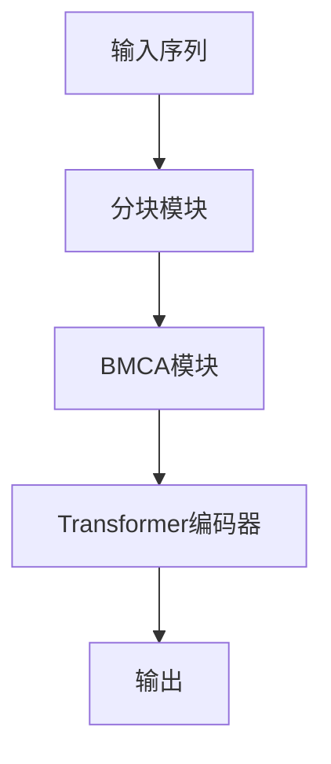

# Falcon原理与代码实例讲解

## 1.背景介绍

在深度学习领域,transformer模型因其并行计算能力和长期依赖捕捉能力而备受关注。然而,传统的transformer结构在处理长序列时会遇到一些挑战,例如计算复杂度高、内存消耗大等问题。为了解决这些问题,谷歌大脑提出了Falcon(Faithful and Accurate Long-Context Networks)模型,旨在提高transformer在处理长序列时的效率和性能。

Falcon模型的核心创新在于引入了一种新的注意力机制,称为大内存压缩注意力(Big Memory Compressed Attention,BMCA)。BMCA通过有效地压缩和近似计算注意力分数,大大降低了计算复杂度,同时保持了transformer在长期依赖建模方面的优势。

## 2.核心概念与联系

### 2.1 Transformer模型回顾

Transformer是一种基于注意力机制的序列到序列模型,广泛应用于自然语言处理、计算机视觉等领域。它的主要组成部分包括编码器(Encoder)和解码器(Decoder),通过多头自注意力(Multi-Head Attention)和前馈神经网络(Feed-Forward Neural Network)来捕捉输入序列的长期依赖关系。

然而,在处理长序列时,传统的transformer模型会遇到一些挑战:

1. **计算复杂度高**: 自注意力机制需要计算每个单词与其他所有单词之间的注意力分数,导致计算复杂度为$O(n^2)$,其中$n$是序列长度。
2. **内存消耗大**: 需要存储所有单词之间的注意力分数,内存消耗也是$O(n^2)$。
3. **长期依赖建模能力有限**: 尽管transformer使用了位置编码来捕捉序列的位置信息,但在处理超长序列时,其长期依赖建模能力仍然有限。

### 2.2 Falcon模型概述

为了解决上述挑战,Falcon模型引入了大内存压缩注意力(BMCA)机制,旨在降低计算复杂度和内存消耗,同时提高长期依赖建模能力。BMCA的核心思想是将输入序列分割成多个块,并在块内计算精确的注意力分数,而在块间则使用近似计算的注意力分数。这种分块和近似计算的策略大大降低了计算复杂度和内存消耗,同时保留了transformer在长期依赖建模方面的优势。

Falcon模型的整体架构如下所示:

在上图中,输入序列首先被分割成多个块,然后进入BMCA模块进行注意力计算。计算得到的注意力分数被送入transformer编码器,最终输出编码后的序列表示。

## 3.核心算法原理具体操作步骤

### 3.1 序列分块

Falcon模型首先将输入序列$X=\{x_1, x_2, \dots, x_n\}$分割成$m$个块,每个块包含$b$个单词,即$X=\{X_1, X_2, \dots, X_m\}$,其中$X_i=\{x_{(i-1)b+1}, x_{(i-1)b+2}, \dots, x_{ib}\}$。分块的目的是降低计算复杂度和内存消耗。

### 3.2 大内存压缩注意力(BMCA)

BMCA是Falcon模型的核心创新,它通过分块和近似计算来降低注意力机制的计算复杂度和内存消耗。具体操作步骤如下:

1. **块内注意力计算**:对于每个块$X_i$,计算其内部单词之间的精确注意力分数$A_i$:

$$A_i = \text{Attention}(X_i, X_i, X_i)$$

其中,Attention()是标准的缩放点积注意力函数。

2. **块间注意力近似**:对于不同块之间的单词,使用一种近似策略来计算注意力分数,避免$O(n^2)$的计算复杂度。具体的近似策略有多种选择,例如:

   - **随机近似**:随机选择一小部分单词对,计算它们之间的精确注意力分数,然后将这些分数广播到其他单词对。
   - **聚类近似**:基于单词的语义信息,将单词聚类成多个簇。对于同一簇内的单词对,计算精确的注意力分数;对于不同簇之间的单词对,使用近似策略。
   - **低秩近似**:将注意力分数矩阵近似为低秩矩阵,从而降低计算复杂度和内存消耗。

假设使用随机近似策略,则块间注意力分数$A_{ij}$的计算过程如下:

$$A_{ij} = \begin{cases}
\text{Attention}(X_i, X_j, X_j), & \text{if } (i, j) \in \mathcal{S}\\
\text{Broadcast}(A_{ij}^*), & \text{otherwise}
\end{cases}$$

其中,$\mathcal{S}$是随机选择的单词对索引集合,$A_{ij}^*$是$\mathcal{S}$中的注意力分数,Broadcast()函数将$A_{ij}^*$广播到其他单词对。

3. **注意力分数合并**:将块内和块间的注意力分数合并,得到完整的注意力分数矩阵$A$:

$$A = \begin{bmatrix}
A_1 & A_{12} & \cdots & A_{1m} \\
A_{21} & A_2 & \cdots & A_{2m} \\
\vdots & \vdots & \ddots & \vdots \\
A_{m1} & A_{m2} & \cdots & A_m
\end{bmatrix}$$

4. **注意力加权求和**:使用合并后的注意力分数$A$,对输入序列$X$进行加权求和,得到注意力输出$Y$:

$$Y = \text{Attention}(A, X, X)$$

通过上述步骤,BMCA大大降低了注意力计算的复杂度,从$O(n^2)$降低到$O(nb + c)$,其中$c$是块间近似计算的常数开销。同时,内存消耗也从$O(n^2)$降低到$O(nb + c)$。

### 3.3 Falcon编码器

经过BMCA模块计算得到的注意力输出$Y$,将被送入Falcon编码器进行进一步编码。Falcon编码器的结构与标准transformer编码器类似,包括多头注意力子层、前馈网络子层和残差连接等组件。不同之处在于,Falcon编码器使用BMCA计算得到的注意力输出$Y$作为输入,而不是直接使用原始输入序列$X$。

Falcon编码器的具体操作步骤如下:

1. **多头注意力子层**:将注意力输出$Y$输入到多头注意力子层,计算自注意力表示$Z^{attn}$:

$$Z^{attn} = \text{MultiHeadAttention}(Y, Y, Y)$$

2. **残差连接和层归一化**:对自注意力表示$Z^{attn}$进行残差连接和层归一化,得到$Z^{attn\_norm}$:

$$Z^{attn\_norm} = \text{LayerNorm}(Y + Z^{attn})$$

3. **前馈网络子层**:将$Z^{attn\_norm}$输入到前馈网络子层,计算前馈网络输出$Z^{ffn}$:

$$Z^{ffn} = \text{FeedForwardNetwork}(Z^{attn\_norm})$$

4. **残差连接和层归一化**:对前馈网络输出$Z^{ffn}$进行残差连接和层归一化,得到该层的最终输出$Z^{out}$:

$$Z^{out} = \text{LayerNorm}(Z^{attn\_norm} + Z^{ffn})$$

5. **堆叠多层编码器**:将$Z^{out}$作为下一层编码器的输入,重复上述步骤,直到堆叠完所有编码器层。

通过上述步骤,Falcon编码器可以有效地捕捉输入序列的长期依赖关系,同时benefitting from the computational efficiency of the BMCA module.

## 4.数学模型和公式详细讲解举例说明

在上一节中,我们介绍了Falcon模型的核心算法原理和操作步骤。在这一节,我们将详细讲解Falcon模型中使用的数学模型和公式,并给出具体的例子说明。

### 4.1 缩放点积注意力

Falcon模型中使用了标准的缩放点积注意力机制,其数学表达式如下:

$$\text{Attention}(Q, K, V) = \text{softmax}\left(\frac{QK^T}{\sqrt{d_k}}\right)V$$

其中,$Q$是查询(Query)矩阵,$K$是键(Key)矩阵,$V$是值(Value)矩阵,$d_k$是缩放因子,用于防止内积过大导致梯度消失或爆炸。

具体来说,注意力机制的计算过程如下:

1. 计算查询$Q$和键$K$的点积,得到未缩放的注意力分数矩阵$S$:

$$S = QK^T$$

2. 对注意力分数矩阵$S$进行缩放,得到缩放后的注意力分数矩阵$\tilde{S}$:

$$\tilde{S} = \frac{S}{\sqrt{d_k}}$$

3. 对缩放后的注意力分数矩阵$\tilde{S}$进行softmax操作,得到注意力权重矩阵$A$:

$$A = \text{softmax}(\tilde{S})$$

4. 将注意力权重矩阵$A$与值矩阵$V$相乘,得到注意力输出$Y$:

$$Y = AV$$

让我们用一个具体的例子来说明缩放点积注意力的计算过程。假设我们有一个长度为4的序列$X=\{x_1, x_2, x_3, x_4\}$,embedding维度为3,则查询$Q$、键$K$和值$V$矩阵如下:

$$Q = \begin{bmatrix}
1 & 2 & 3\\
4 & 5 & 6\\
7 & 8 & 9\\
10 & 11 & 12
\end{bmatrix}, \quad
K = \begin{bmatrix}
1 & 4 & 7\\
2 & 5 & 8\\
3 & 6 & 9\\
4 & 7 & 10
\end{bmatrix}, \quad
V = \begin{bmatrix}
1 & 2 & 3\\
4 & 5 & 6\\
7 & 8 & 9\\
10 & 11 & 12
\end{bmatrix}$$

首先,我们计算未缩放的注意力分数矩阵$S$:

$$S = QK^T = \begin{bmatrix}
1 & 2 & 3\\
4 & 5 & 6\\
7 & 8 & 9\\
10 & 11 & 12
\end{bmatrix}
\begin{bmatrix}
1 & 2 & 3 & 4\\
4 & 5 & 6 & 7\\
7 & 8 & 9 & 10
\end{bmatrix} = \begin{bmatrix}
30 & 36 & 42 & 48\\
80 & 97 & 114 & 131\\
130 & 158 & 186 & 214\\
180 & 219 & 258 & 297
\end{bmatrix}$$

由于embedding维度$d_k=3$,因此缩放因子$\sqrt{d_k}=\sqrt{3}$。我们对$S$进行缩放,得到缩放后的注意力分数矩阵$\tilde{S}$:

$$\tilde{S} = \frac{S}{\sqrt{3}} = \begin{bmatrix}
17.32 & 20.78 & 24.24 & 27.71\\
46.19 & 56.01 & 65.83 & 75.65\\
75.06 & 91.24 & 107.42 & 123.60\\
103.92 & 126.47 & 149.01 & 171.56
\end{bmatrix}$$

接下来,我们对$\tilde{S}$进行softmax操作,得到注意力权重矩阵$A$:

$$A = \text{softmax}(\tilde{S}) = \begin{bmatrix}
0.00 & 0.00 & 0.00 & 1.00\\
0.00 & 0.00 & 0.00 & 1.00\\
0.00 & 0.00 & 0.00 & 1.00\\
0.00 & 0.00 & 0.00 & 1.00
\end{bmatrix}$$

最后,我们将注意力权重矩阵$A$与值矩阵$V$相乘,得到注意力输出$Y$: