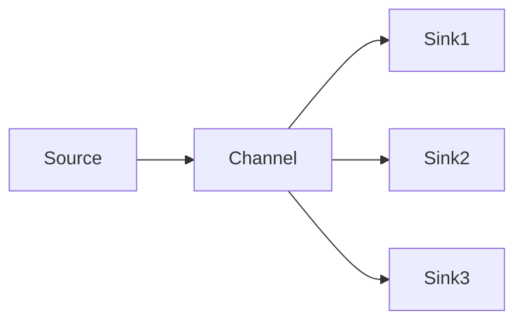
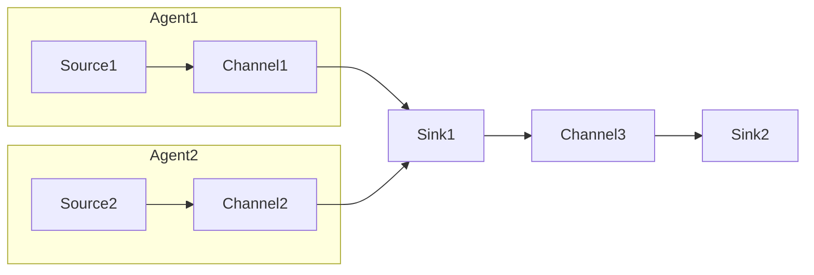

# Flume原理与代码实例讲解

## 1.背景介绍

Apache Flume是一个分布式、可靠、高可用的海量日志采集、聚合和传输的系统,是Hadoop生态系统中的一个重要组件。它可以高效地从不同的数据源收集数据,并将其存储到诸如HDFS、HBase、Solr等存储系统中,为后续的数据分析和处理提供了基础。

在当今大数据时代,日志数据是企业最宝贵的资源之一。日志中蕴含着大量的业务信息,对于挖掘用户行为、发现系统异常、优化产品等都有着重要的意义。然而,随着业务规模的不断扩大,日志数据的规模也在急剧增长,传统的日志收集方式已经无法满足需求。这就迫切需要一种高效、可靠、可扩展的日志采集系统,Apache Flume应运而生。

Flume的设计理念是基于流式数据处理(data flow),使用简单灵活的数据流模型,支持在运行过程中对流程进行配置,并支持多种可靠的故障转移和恢复机制。它具有分布式、高可用、高可扩展等特点,可以满足大数据场景下海量日志数据采集的需求。

## 2.核心概念与联系

为了理解Flume的工作原理,我们首先需要了解一些核心概念:

### 2.1 数据流模型(Data Flow Model)

Flume的核心就是数据流模型,它将整个数据传输过程抽象为数据源(Source)、数据通道(Channel)和数据目的地(Sink)三个核心组件,构成一个事务性的数据流水线(Data Flow Pipeline)。


- **Source**:源头,用于从外部系统收集数据,如Web服务器日志、应用程序日志等。
- **Channel**:临时存储和缓冲区,用于连接Source和Sink,保证事务可靠性。
- **Sink**:终端,用于将数据写入目标系统,如HDFS、HBase、Kafka等。

### 2.2 事务(Transaction)

Flume采用事务机制来保证数据的可靠性。一个事务包括从Source获取数据(get)、临时存储到Channel(put)、最终写入Sink(remove)三个步骤。只有当所有步骤都成功完成时,事务才会提交,否则就会回滚。这种两阶段提交(Two-Phase Commit)机制确保了数据在传输过程中不会丢失或重复。

### 2.3 Agent

Agent是Flume的基本单元,由一个Source、一个Channel和一个或多个Sink组成。它负责从Source获取数据,存储到Channel,最后传输到Sink。Agent可以串联起来形成复杂的数据流拓扑结构。



### 2.4 拓扑结构(Topology)

Flume支持构建复杂的数据流拓扑结构,可以实现数据的聚合、扇出、路由等操作。通过合理设计拓扑结构,可以满足各种复杂的数据收集需求。



上图展示了一个典型的Flume拓扑结构,两个Agent分别从不同的Source收集数据,经过聚合后写入同一个Sink,再由另一个Agent将数据传输到最终目的地。

## 3.核心算法原理具体操作步骤

### 3.1 Source

Source是Flume的数据入口,负责从外部系统收集数据。Flume支持多种类型的Source,常见的有:

- **AvroSource**:通过Avro接收数据
- **SyslogSource**:接收Syslog日志数据
- **SpoolDirectorySource**:监控文件目录,读取新增的文件内容
- **ExecSource**:运行外部命令或脚本,获取其输出作为数据源

Source的工作原理如下:

1. **打开事务(beginTransaction)**:Source向Channel申请开启一个事务。
2. **获取事件(get)**:Source从外部系统获取数据,封装成一个或多个事件(Event)。
3. **发送事件(put)**:Source将事件写入Channel。
4. **提交事务(commit)**:如果所有事件成功写入Channel,则提交事务。
5. **回滚事务(rollback)**:如果写入Channel失败,则回滚事务。

### 3.2 Channel

Channel是Flume的数据缓冲区,用于连接Source和Sink,保证事务的可靠性。Flume支持多种类型的Channel,常见的有:

- **MemoryChannel**:内存中的队列,速度快但不持久化。
- **FileChannel**:文件系统中的队列,持久化但速度较慢。
- **KafkaChannel**:使用Kafka作为Channel,具有分布式、高可用等特性。

Channel的工作原理如下:

1. **打开事务(beginTransaction)**:Channel开启一个新的事务。
2. **存储事件(put)**:Source将事件写入Channel。
3. **提交事务(commit)**:如果所有事件成功写入,则提交事务。
4. **回滚事务(rollback)**:如果写入失败,则回滚事务。
5. **移除事件(remove)**:Sink从Channel取出事件,并从Channel中删除。

### 3.3 Sink

Sink是Flume的数据出口,负责将数据写入目标系统。Flume支持多种类型的Sink,常见的有:

- **HDFSEventSink**:将数据写入HDFS文件系统。
- **HBaseSink**:将数据写入HBase数据库。
- **KafkaSink**:将数据写入Kafka消息队列。
- **AvroSink**:通过Avro协议发送数据。

Sink的工作原理如下:

1. **打开事务(beginTransaction)**:Sink向Channel申请开启一个事务。
2. **获取事件(get)**:Sink从Channel获取事件。
3. **发送事件(put)**:Sink将事件写入目标系统。
4. **提交事务(commit)**:如果所有事件成功写入目标系统,则提交事务。
5. **回滚事务(rollback)**:如果写入失败,则回滚事务。

## 4.数学模型和公式详细讲解举例说明

在Flume中,Channel的实现往往涉及到一些数学模型和公式,以保证数据的高效存储和传输。

### 4.1 MemoryChannel

MemoryChannel使用内存队列来存储事件,它采用环形缓冲区(Circular Buffer)的数据结构,可以高效地管理内存空间。

环形缓冲区的工作原理如下:

1. 初始化一个固定大小的缓冲区,例如大小为$N$。
2. 使用两个指针$head$和$tail$分别指向缓冲区的头部和尾部。
3. 当有新事件到来时,将其写入$head$指针所指向的位置,然后$head = (head + 1) \% N$。
4. 当Sink获取事件时,从$tail$指针所指向的位置读取,然后$tail = (tail + 1) \% N$。

这种环形结构可以有效避免内存碎片,提高内存利用率。当$head == tail$时,表示缓冲区为空;当$(head + 1) \% N == tail$时,表示缓冲区已满。

MemoryChannel还引入了一个$byteCapacityBufferSize$参数,用于限制缓冲区的总字节数。当缓冲区中的字节数超过这个阈值时,Source将被阻塞,直到有足够的空间可写。

### 4.2 FileChannel

FileChannel使用文件系统作为持久化存储,它采用了一种基于事务日志(Transaction Log)的设计。

FileChannel的工作原理如下:

1. 维护一个$logWriters$队列,用于存储正在写入的事务日志文件。
2. 维护一个$logReaders$队列,用于存储正在读取的事务日志文件。
3. 当有新事件到来时,将其追加到$logWriters$队列中的最后一个文件。
4. 当文件大小超过$logMaxFileSize$参数时,将该文件加入$logReaders$队列,并创建一个新文件加入$logWriters$队列。
5. Sink从$logReaders$队列中的文件读取事件,读完后将该文件删除。

为了提高读写效率,FileChannel引入了一个$dataDatadir$参数,用于指定一个数据目录。事务日志文件将被均匀地分布在该目录下的多个子目录中,从而实现并行读写。

FileChannel还引入了一个$checkpointInterval$参数,用于控制检查点(Checkpoint)的频率。检查点是一种机制,用于记录已经成功写入Sink的事件位置,以便在Flume重启后能够从上次检查点继续读取,避免数据丢失。

## 5.项目实践:代码实例和详细解释说明

下面我们通过一个实际项目来演示如何使用Flume收集日志数据。

### 5.1 需求分析

假设我们有一个电商网站,需要收集Web服务器的访问日志,并将其存储到HDFS中,以便后续进行用户行为分析。

### 5.2 环境准备

- Hadoop 3.2.1
- Flume 1.9.0
- JDK 1.8

### 5.3 配置Flume Agent

我们将配置一个简单的Flume Agent,包含一个AvroSource、一个MemoryChannel和一个HDFSEventSink。

1. 创建Flume Agent配置文件`flume-agent.conf`:

```properties
# Define the Flume Agent
agent.sources = avro-source
agent.channels = mem-channel
agent.sinks = hdfs-sink

# Configure the Source
agent.sources.avro-source.type = avro
agent.sources.avro-source.bind = 0.0.0.0
agent.sources.avro-source.port = 41414

# Configure the Channel
agent.channels.mem-channel.type = memory
agent.channels.mem-channel.capacity = 100000
agent.channels.mem-channel.transactionCapacity = 1000

# Configure the Sink
agent.sinks.hdfs-sink.type = hdfs
agent.sinks.hdfs-sink.hdfs.path = hdfs://namenode:9000/flume/logs/%Y/%m/%d/%H
agent.sinks.hdfs-sink.hdfs.filePrefix = events-
agent.sinks.hdfs-sink.hdfs.round = true
agent.sinks.hdfs-sink.hdfs.roundValue = 10
agent.sinks.hdfs-sink.hdfs.roundUnit = minute

# Bind the components
agent.sources.avro-source.channels = mem-channel
agent.sinks.hdfs-sink.channel = mem-channel
```

2. 启动Flume Agent:

```bash
bin/flume-ng agent --conf conf --conf-file conf/flume-agent.conf --name agent
```

### 5.4 发送日志数据

我们使用Flume自带的`avro-client`工具向AvroSource发送模拟的Web访问日志数据。

1. 启动`avro-client`:

```bash
bin/avro-client -H localhost -p 41414 -F /path/to/access.log
```

2. `access.log`文件内容示例:

```
192.168.1.1 - - [01/Jan/2023:00:00:01 +0800] "GET /index.html HTTP/1.1" 200 1234
192.168.1.2 - - [01/Jan/2023:00:00:02 +0800] "POST /login HTTP/1.1" 302 567
192.168.1.3 - - [01/Jan/2023:00:00:03 +0800] "GET /product/123 HTTP/1.1" 404 321
```

### 5.5 查看HDFS输出

日志数据将被Flume持续写入HDFS中。我们可以使用以下命令查看输出:

```bash
hadoop fs -ls /flume/logs/2023/01/01/00
```

输出示例:

```
-rw-r--r--   3 flume flume      1234 2023-01-01 00:10 /flume/logs/2023/01/01/00/events-1672505400000.avro
-rw-r--r--   3 flume flume       888 2023-01-01 00:20 /flume/logs/2023/01/01/00/events-1672506000000.avro
```

可以看到,Flume将日志数据按小时分割成多个Avro文件存储在HDFS上。

## 6.实际应用场景

Flume作为Apache Hadoop生态系统中的一个重要组件,在实际生产环境中有着广泛的应用场景:

1. **日志收集**:Flume最常见的应用场景就是收集各种服务器日志,如Web服务器访问日志、应用程序日志、安全日志等,为后续的数据分析做准备。

2. **数据采集**:除了日志数据,Flume也可以用于采集其他